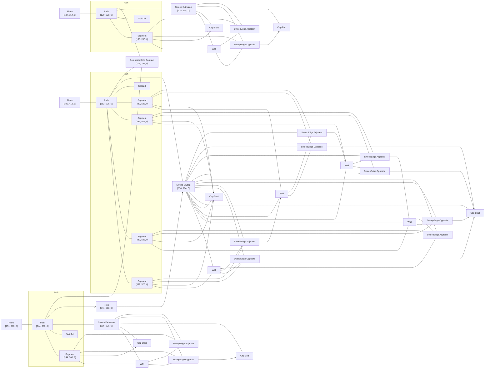

```mermaid
flowchart LR
  subgraph path2 [Path]
    2["Path<br>[130, 208, 0]"]
      %% [ProgramBodyItem { index: 1 }, VariableDeclarationDeclaration, VariableDeclarationInit, PipeBodyItem { index: 0 }]
    3["Segment<br>[130, 208, 0]"]
      %% [ProgramBodyItem { index: 1 }, VariableDeclarationDeclaration, VariableDeclarationInit, PipeBodyItem { index: 0 }]
    4[Solid2d]
  end
  subgraph path12 [Path]
    12["Path<br>[244, 300, 0]"]
      %% [ProgramBodyItem { index: 2 }, VariableDeclarationDeclaration, VariableDeclarationInit, PipeBodyItem { index: 0 }]
    13["Segment<br>[244, 300, 0]"]
      %% [ProgramBodyItem { index: 2 }, VariableDeclarationDeclaration, VariableDeclarationInit, PipeBodyItem { index: 0 }]
    14[Solid2d]
  end
  subgraph path22 [Path]
    22["Path<br>[382, 526, 0]"]
      %% [ProgramBodyItem { index: 5 }, VariableDeclarationDeclaration, VariableDeclarationInit]
    23["Segment<br>[382, 526, 0]"]
      %% [ProgramBodyItem { index: 5 }, VariableDeclarationDeclaration, VariableDeclarationInit]
    24["Segment<br>[382, 526, 0]"]
      %% [ProgramBodyItem { index: 5 }, VariableDeclarationDeclaration, VariableDeclarationInit]
    25["Segment<br>[382, 526, 0]"]
      %% [ProgramBodyItem { index: 5 }, VariableDeclarationDeclaration, VariableDeclarationInit]
    26["Segment<br>[382, 526, 0]"]
      %% [ProgramBodyItem { index: 5 }, VariableDeclarationDeclaration, VariableDeclarationInit]
    27[Solid2d]
  end
  1["Plane<br>[137, 154, 0]"]
    %% [ProgramBodyItem { index: 1 }, VariableDeclarationDeclaration, VariableDeclarationInit, PipeBodyItem { index: 0 }, CallKwUnlabeledArg]
  5["Sweep Extrusion<br>[214, 234, 0]"]
    %% [ProgramBodyItem { index: 1 }, VariableDeclarationDeclaration, VariableDeclarationInit, PipeBodyItem { index: 1 }]
  6[Wall]
    %% face_code_ref=Missing NodePath
  7["Cap Start"]
    %% face_code_ref=Missing NodePath
  8["Cap End"]
    %% face_code_ref=Missing NodePath
  9["SweepEdge Opposite"]
  10["SweepEdge Adjacent"]
  11["Plane<br>[251, 268, 0]"]
    %% [ProgramBodyItem { index: 2 }, VariableDeclarationDeclaration, VariableDeclarationInit, PipeBodyItem { index: 0 }, CallKwUnlabeledArg]
  15["Sweep Extrusion<br>[306, 326, 0]"]
    %% [ProgramBodyItem { index: 2 }, VariableDeclarationDeclaration, VariableDeclarationInit, PipeBodyItem { index: 1 }]
  16[Wall]
    %% face_code_ref=Missing NodePath
  17["Cap Start"]
    %% face_code_ref=Missing NodePath
  18["Cap End"]
    %% face_code_ref=Missing NodePath
  19["SweepEdge Opposite"]
  20["SweepEdge Adjacent"]
  21["Plane<br>[395, 412, 0]"]
    %% [ProgramBodyItem { index: 5 }, VariableDeclarationDeclaration, VariableDeclarationInit, CallKwUnlabeledArg]
  28["Helix<br>[541, 663, 0]"]
    %% [ProgramBodyItem { index: 6 }, VariableDeclarationDeclaration, VariableDeclarationInit]
  29["Sweep Sweep<br>[674, 714, 0]"]
    %% [ProgramBodyItem { index: 7 }, VariableDeclarationDeclaration, VariableDeclarationInit]
  30[Wall]
    %% face_code_ref=Missing NodePath
  31[Wall]
    %% face_code_ref=Missing NodePath
  32[Wall]
    %% face_code_ref=Missing NodePath
  33[Wall]
    %% face_code_ref=Missing NodePath
  34["Cap Start"]
    %% face_code_ref=Missing NodePath
  35["Cap Start"]
    %% face_code_ref=Missing NodePath
  36["SweepEdge Opposite"]
  37["SweepEdge Adjacent"]
  38["SweepEdge Opposite"]
  39["SweepEdge Adjacent"]
  40["SweepEdge Opposite"]
  41["SweepEdge Adjacent"]
  42["SweepEdge Opposite"]
  43["SweepEdge Adjacent"]
  44["CompositeSolid Subtract<br>[716, 766, 0]"]
    %% [ProgramBodyItem { index: 8 }, ExpressionStatementExpr]
  1 --- 2
  2 --- 3
  2 --- 4
  2 ---- 5
  2 --- 44
  3 --- 6
  3 x--> 7
  3 --- 9
  3 --- 10
  5 --- 6
  5 --- 7
  5 --- 8
  5 --- 9
  5 --- 10
  6 --- 9
  6 --- 10
  9 <--x 8
  11 --- 12
  12 --- 13
  12 --- 14
  12 ---- 15
  12 <--x 28
  12 --- 44
  13 --- 16
  13 x--> 17
  13 --- 19
  13 --- 20
  15 --- 16
  15 --- 17
  15 --- 18
  15 --- 19
  15 --- 20
  16 --- 19
  16 --- 20
  19 <--x 18
  21 --- 22
  22 --- 23
  22 --- 24
  22 --- 25
  22 --- 26
  22 --- 27
  22 ---- 29
  22 --- 44
  23 --- 30
  23 x--> 34
  23 --- 36
  23 --- 37
  24 --- 31
  24 x--> 34
  24 --- 38
  24 --- 39
  25 --- 32
  25 x--> 34
  25 --- 40
  25 --- 41
  26 --- 33
  26 x--> 34
  26 --- 42
  26 --- 43
  28 x--> 29
  29 --- 30
  29 --- 31
  29 --- 32
  29 --- 33
  29 --- 34
  29 --- 35
  29 --- 36
  29 --- 37
  29 --- 38
  29 --- 39
  29 --- 40
  29 --- 41
  29 --- 42
  29 --- 43
  30 --- 36
  30 --- 37
  39 <--x 30
  31 --- 38
  31 --- 39
  41 <--x 31
  32 --- 40
  32 --- 41
  43 <--x 32
  37 <--x 33
  33 --- 42
  33 --- 43
  36 <--x 35
  38 <--x 35
  40 <--x 35
  42 <--x 35
```
