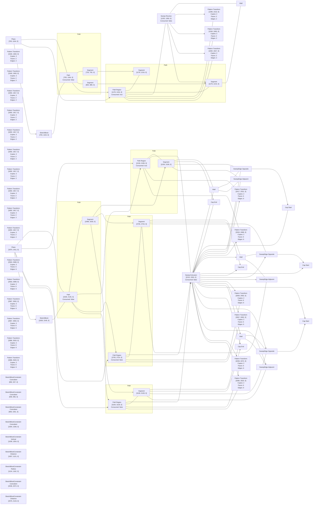

```mermaid
flowchart LR
  subgraph path2 [Path]
    2["Path<br>[705, 1164, 0]<br>Consumed: false"]
      %% [ProgramBodyItem { index: 9 }, VariableDeclarationDeclaration, VariableDeclarationInit]
    3["Segment<br>[733, 792, 0]"]
      %% [ProgramBodyItem { index: 9 }, VariableDeclarationDeclaration, VariableDeclarationInit, SketchBlockBody, SketchBlockBodyItem { index: 0 }, VariableDeclarationDeclaration, VariableDeclarationInit]
    4["Segment<br>[802, 889, 0]"]
      %% [ProgramBodyItem { index: 9 }, VariableDeclarationDeclaration, VariableDeclarationInit, SketchBlockBody, SketchBlockBodyItem { index: 1 }, VariableDeclarationDeclaration, VariableDeclarationInit]
  end
  subgraph path5 [Path]
    5["Path Region<br>[1178, 1216, 0]<br>Consumed: true"]
      %% [ProgramBodyItem { index: 10 }, VariableDeclarationDeclaration, VariableDeclarationInit]
    6["Segment<br>[1178, 1216, 0]"]
      %% [ProgramBodyItem { index: 10 }, VariableDeclarationDeclaration, VariableDeclarationInit]
    7["Segment<br>[1178, 1216, 0]"]
      %% [ProgramBodyItem { index: 10 }, VariableDeclarationDeclaration, VariableDeclarationInit]
  end
  subgraph path24 [Path]
    24["Path<br>[1926, 2145, 0]<br>Consumed: false"]
      %% [ProgramBodyItem { index: 19 }, VariableDeclarationDeclaration, VariableDeclarationInit]
    25["Segment<br>[1968, 2033, 0]"]
      %% [ProgramBodyItem { index: 19 }, VariableDeclarationDeclaration, VariableDeclarationInit, SketchBlockBody, SketchBlockBodyItem { index: 0 }, VariableDeclarationDeclaration, VariableDeclarationInit]
  end
  subgraph path26 [Path]
    26["Path Region<br>[2159, 2199, 0]<br>Consumed: true"]
      %% [ProgramBodyItem { index: 20 }, VariableDeclarationDeclaration, VariableDeclarationInit]
    27["Segment<br>[2159, 2199, 0]"]
      %% [ProgramBodyItem { index: 20 }, VariableDeclarationDeclaration, VariableDeclarationInit]
  end
  subgraph path38 [Path]
    38["Path Region<br>[2705, 2724, 0]<br>Consumed: false"]
      %% [ProgramBodyItem { index: 26 }, VariableDeclarationDeclaration, VariableDeclarationInit, PipeBodyItem { index: 0 }]
    39["Segment<br>[2705, 2724, 0]"]
      %% [ProgramBodyItem { index: 26 }, VariableDeclarationDeclaration, VariableDeclarationInit, PipeBodyItem { index: 0 }]
  end
  subgraph path49 [Path]
    49["Path Region<br>[3109, 3128, 0]<br>Consumed: false"]
      %% [ProgramBodyItem { index: 29 }, VariableDeclarationDeclaration, VariableDeclarationInit, PipeBodyItem { index: 0 }]
    50["Segment<br>[3109, 3128, 0]"]
      %% [ProgramBodyItem { index: 29 }, VariableDeclarationDeclaration, VariableDeclarationInit, PipeBodyItem { index: 0 }]
  end
  1["Plane<br>[705, 1164, 0]"]
    %% [ProgramBodyItem { index: 9 }, VariableDeclarationDeclaration, VariableDeclarationInit]
  8["Sweep Revolve<br>[1235, 1280, 0]<br>Consumed: false"]
    %% [ProgramBodyItem { index: 11 }, VariableDeclarationDeclaration, VariableDeclarationInit]
  9[Wall]
    %% face_code_ref=Missing NodePath
  10["Pattern Transform<br>[1396, 1513, 0]<br>Copies: 2<br>Faces: 2<br>Edges: 2"]
    %% [ProgramBodyItem { index: 14 }, VariableDeclarationDeclaration, VariableDeclarationInit]
  11["Pattern Transform<br>[1540, 1660, 0]<br>Copies: 2<br>Faces: 2<br>Edges: 2"]
    %% [ProgramBodyItem { index: 15 }, VariableDeclarationDeclaration, VariableDeclarationInit]
  12["Pattern Transform<br>[1540, 1660, 0]<br>Copies: 2<br>Faces: 2<br>Edges: 2"]
    %% [ProgramBodyItem { index: 15 }, VariableDeclarationDeclaration, VariableDeclarationInit]
  13["Pattern Transform<br>[1540, 1660, 0]<br>Copies: 2<br>Faces: 2<br>Edges: 2"]
    %% [ProgramBodyItem { index: 15 }, VariableDeclarationDeclaration, VariableDeclarationInit]
  14["Pattern Transform<br>[1692, 1817, 0]<br>Copies: 2<br>Faces: 2<br>Edges: 2"]
    %% [ProgramBodyItem { index: 16 }, VariableDeclarationDeclaration, VariableDeclarationInit]
  15["Pattern Transform<br>[1692, 1817, 0]<br>Copies: 2<br>Faces: 2<br>Edges: 2"]
    %% [ProgramBodyItem { index: 16 }, VariableDeclarationDeclaration, VariableDeclarationInit]
  16["Pattern Transform<br>[1692, 1817, 0]<br>Copies: 2<br>Faces: 2<br>Edges: 2"]
    %% [ProgramBodyItem { index: 16 }, VariableDeclarationDeclaration, VariableDeclarationInit]
  17["Pattern Transform<br>[1692, 1817, 0]<br>Copies: 2<br>Faces: 2<br>Edges: 2"]
    %% [ProgramBodyItem { index: 16 }, VariableDeclarationDeclaration, VariableDeclarationInit]
  18["Pattern Transform<br>[1692, 1817, 0]<br>Copies: 2<br>Faces: 2<br>Edges: 2"]
    %% [ProgramBodyItem { index: 16 }, VariableDeclarationDeclaration, VariableDeclarationInit]
  19["Pattern Transform<br>[1692, 1817, 0]<br>Copies: 2<br>Faces: 2<br>Edges: 2"]
    %% [ProgramBodyItem { index: 16 }, VariableDeclarationDeclaration, VariableDeclarationInit]
  20["Pattern Transform<br>[1692, 1817, 0]<br>Copies: 2<br>Faces: 2<br>Edges: 2"]
    %% [ProgramBodyItem { index: 16 }, VariableDeclarationDeclaration, VariableDeclarationInit]
  21["Pattern Transform<br>[1692, 1817, 0]<br>Copies: 2<br>Faces: 2<br>Edges: 2"]
    %% [ProgramBodyItem { index: 16 }, VariableDeclarationDeclaration, VariableDeclarationInit]
  22["Pattern Transform<br>[1692, 1817, 0]<br>Copies: 2<br>Faces: 2<br>Edges: 2"]
    %% [ProgramBodyItem { index: 16 }, VariableDeclarationDeclaration, VariableDeclarationInit]
  23["Plane<br>[1870, 1911, 0]"]
    %% [ProgramBodyItem { index: 18 }, VariableDeclarationDeclaration, VariableDeclarationInit]
  28["Sweep Extrusion<br>[2215, 2263, 0]<br>Consumed: false"]
    %% [ProgramBodyItem { index: 21 }, VariableDeclarationDeclaration, VariableDeclarationInit, PipeBodyItem { index: 0 }]
  29[Wall]
    %% face_code_ref=Missing NodePath
  30["Cap Start"]
    %% face_code_ref=Missing NodePath
  31["Cap End"]
    %% face_code_ref=Missing NodePath
  32["SweepEdge Opposite"]
  33["SweepEdge Adjacent"]
  34["Pattern Transform<br>[2417, 2531, 0]<br>Copies: 2<br>Faces: 6<br>Edges: 6"]
    %% [ProgramBodyItem { index: 24 }, VariableDeclarationDeclaration, VariableDeclarationInit]
  35["Pattern Transform<br>[2563, 2688, 0]<br>Copies: 2<br>Faces: 6<br>Edges: 6"]
    %% [ProgramBodyItem { index: 25 }, VariableDeclarationDeclaration, VariableDeclarationInit]
  36["Pattern Transform<br>[2563, 2688, 0]<br>Copies: 2<br>Faces: 6<br>Edges: 6"]
    %% [ProgramBodyItem { index: 25 }, VariableDeclarationDeclaration, VariableDeclarationInit]
  37["Pattern Transform<br>[2563, 2688, 0]<br>Copies: 2<br>Faces: 6<br>Edges: 6"]
    %% [ProgramBodyItem { index: 25 }, VariableDeclarationDeclaration, VariableDeclarationInit]
  40[Wall]
    %% face_code_ref=Missing NodePath
  41["Cap Start"]
    %% face_code_ref=Missing NodePath
  42["Cap End"]
    %% face_code_ref=Missing NodePath
  43["SweepEdge Opposite"]
  44["SweepEdge Adjacent"]
  45["Pattern Transform<br>[2839, 2953, 0]<br>Copies: 2<br>Faces: 6<br>Edges: 6"]
    %% [ProgramBodyItem { index: 27 }, VariableDeclarationDeclaration, VariableDeclarationInit]
  46["Pattern Transform<br>[2967, 3092, 0]<br>Copies: 2<br>Faces: 6<br>Edges: 6"]
    %% [ProgramBodyItem { index: 28 }, VariableDeclarationDeclaration, VariableDeclarationInit]
  47["Pattern Transform<br>[2967, 3092, 0]<br>Copies: 2<br>Faces: 6<br>Edges: 6"]
    %% [ProgramBodyItem { index: 28 }, VariableDeclarationDeclaration, VariableDeclarationInit]
  48["Pattern Transform<br>[2967, 3092, 0]<br>Copies: 2<br>Faces: 6<br>Edges: 6"]
    %% [ProgramBodyItem { index: 28 }, VariableDeclarationDeclaration, VariableDeclarationInit]
  51[Wall]
    %% face_code_ref=Missing NodePath
  52["Cap Start"]
    %% face_code_ref=Missing NodePath
  53["Cap End"]
    %% face_code_ref=Missing NodePath
  54["SweepEdge Opposite"]
  55["SweepEdge Adjacent"]
  56["Pattern Transform<br>[3258, 3372, 0]<br>Copies: 2<br>Faces: 6<br>Edges: 6"]
    %% [ProgramBodyItem { index: 30 }, VariableDeclarationDeclaration, VariableDeclarationInit]
  57["Pattern Transform<br>[3386, 3520, 0]<br>Copies: 2<br>Faces: 6<br>Edges: 6"]
    %% [ProgramBodyItem { index: 31 }, VariableDeclarationDeclaration, VariableDeclarationInit]
  58["Pattern Transform<br>[3386, 3520, 0]<br>Copies: 2<br>Faces: 6<br>Edges: 6"]
    %% [ProgramBodyItem { index: 31 }, VariableDeclarationDeclaration, VariableDeclarationInit]
  59["Pattern Transform<br>[3386, 3520, 0]<br>Copies: 2<br>Faces: 6<br>Edges: 6"]
    %% [ProgramBodyItem { index: 31 }, VariableDeclarationDeclaration, VariableDeclarationInit]
  60["SketchBlock<br>[705, 1164, 0]"]
    %% [ProgramBodyItem { index: 9 }, VariableDeclarationDeclaration, VariableDeclarationInit]
  61["SketchBlockConstraint Coincident<br>[892, 927, 0]"]
    %% [ProgramBodyItem { index: 9 }, VariableDeclarationDeclaration, VariableDeclarationInit, SketchBlockBody, SketchBlockBodyItem { index: 2 }, ExpressionStatementExpr]
  62["SketchBlockConstraint Coincident<br>[930, 965, 0]"]
    %% [ProgramBodyItem { index: 9 }, VariableDeclarationDeclaration, VariableDeclarationInit, SketchBlockBody, SketchBlockBodyItem { index: 3 }, ExpressionStatementExpr]
  63["SketchBlockConstraint Coincident<br>[968, 1001, 0]"]
    %% [ProgramBodyItem { index: 9 }, VariableDeclarationDeclaration, VariableDeclarationInit, SketchBlockBody, SketchBlockBodyItem { index: 4 }, ExpressionStatementExpr]
  64["SketchBlockConstraint Coincident<br>[1004, 1036, 0]"]
    %% [ProgramBodyItem { index: 9 }, VariableDeclarationDeclaration, VariableDeclarationInit, SketchBlockBody, SketchBlockBodyItem { index: 5 }, ExpressionStatementExpr]
  65["SketchBlockConstraint Vertical<br>[1039, 1054, 0]"]
    %% [ProgramBodyItem { index: 9 }, VariableDeclarationDeclaration, VariableDeclarationInit, SketchBlockBody, SketchBlockBodyItem { index: 6 }, ExpressionStatementExpr]
  66["SketchBlockConstraint Distance<br>[1057, 1121, 0]"]
    %% [ProgramBodyItem { index: 9 }, VariableDeclarationDeclaration, VariableDeclarationInit, SketchBlockBody, SketchBlockBodyItem { index: 7 }, ExpressionStatementExpr]
  67["SketchBlockConstraint Radius<br>[1124, 1162, 0]"]
    %% [ProgramBodyItem { index: 9 }, VariableDeclarationDeclaration, VariableDeclarationInit, SketchBlockBody, SketchBlockBodyItem { index: 8 }, ExpressionStatementExpr]
  68["SketchBlock<br>[1926, 2145, 0]"]
    %% [ProgramBodyItem { index: 19 }, VariableDeclarationDeclaration, VariableDeclarationInit]
  69["SketchBlockConstraint Coincident<br>[2036, 2072, 0]"]
    %% [ProgramBodyItem { index: 19 }, VariableDeclarationDeclaration, VariableDeclarationInit, SketchBlockBody, SketchBlockBodyItem { index: 1 }, ExpressionStatementExpr]
  70["SketchBlockConstraint Distance<br>[2075, 2143, 0]"]
    %% [ProgramBodyItem { index: 19 }, VariableDeclarationDeclaration, VariableDeclarationInit, SketchBlockBody, SketchBlockBodyItem { index: 2 }, ExpressionStatementExpr]
  1 --- 2
  1 <--x 5
  1 <--x 60
  2 --- 3
  2 --- 4
  2 <--x 5
  60 --- 2
  3 <--x 6
  4 <--x 7
  5 --- 6
  5 --- 7
  5 ---- 8
  5 --- 10
  5 --- 11
  5 --- 14
  8 <--x 7
  7 --- 9
  8 --- 9
  8 x--> 10
  8 x--> 11
  8 x--> 14
  23 --- 24
  23 <--x 26
  23 <--x 38
  23 <--x 49
  23 <--x 68
  24 --- 25
  24 <--x 26
  24 <--x 38
  24 <--x 49
  68 --- 24
  25 <--x 27
  25 <--x 39
  25 <--x 50
  26 --- 27
  26 ---- 28
  26 --- 34
  26 --- 35
  27 --- 29
  27 x--> 31
  27 --- 32
  27 --- 33
  28 --- 29
  28 --- 30
  28 --- 31
  28 --- 32
  28 --- 33
  28 x--> 34
  28 x--> 35
  38 <---x 28
  28 <--x 40
  28 <--x 41
  28 <--x 42
  28 <--x 43
  28 <--x 44
  28 x--> 45
  28 x--> 46
  49 <---x 28
  28 <--x 51
  28 <--x 52
  28 <--x 53
  28 <--x 54
  28 <--x 55
  28 x--> 56
  28 x--> 57
  29 --- 32
  29 --- 33
  32 <--x 30
  38 --- 39
  38 --- 45
  38 --- 46
  39 --- 40
  39 x--> 42
  39 --- 43
  39 --- 44
  40 --- 43
  40 --- 44
  43 <--x 41
  49 --- 50
  49 --- 56
  49 --- 57
  50 --- 51
  50 x--> 53
  50 --- 54
  50 --- 55
  51 --- 54
  51 --- 55
  54 <--x 52
```
