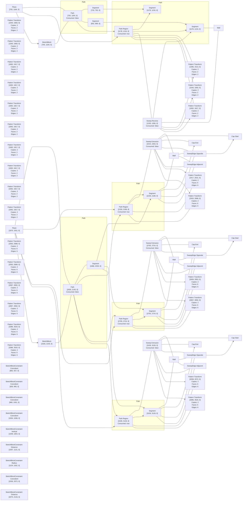

```mermaid
flowchart LR
  subgraph path2 [Path]
    2["Path<br>[705, 1164, 0]<br>Consumed: false"]
      %% [ProgramBodyItem { index: 9 }, VariableDeclarationDeclaration, VariableDeclarationInit]
    3["Segment<br>[733, 792, 0]"]
      %% [ProgramBodyItem { index: 9 }, VariableDeclarationDeclaration, VariableDeclarationInit, SketchBlockBody, SketchBlockBodyItem { index: 0 }, VariableDeclarationDeclaration, VariableDeclarationInit]
    4["Segment<br>[802, 889, 0]"]
      %% [ProgramBodyItem { index: 9 }, VariableDeclarationDeclaration, VariableDeclarationInit, SketchBlockBody, SketchBlockBodyItem { index: 1 }, VariableDeclarationDeclaration, VariableDeclarationInit]
  end
  subgraph path5 [Path]
    5["Path Region<br>[1178, 1216, 0]<br>Consumed: true"]
      %% [ProgramBodyItem { index: 10 }, VariableDeclarationDeclaration, VariableDeclarationInit]
    6["Segment<br>[1178, 1216, 0]"]
      %% [ProgramBodyItem { index: 10 }, VariableDeclarationDeclaration, VariableDeclarationInit]
    7["Segment<br>[1178, 1216, 0]"]
      %% [ProgramBodyItem { index: 10 }, VariableDeclarationDeclaration, VariableDeclarationInit]
  end
  subgraph path24 [Path]
    24["Path<br>[1926, 2145, 0]<br>Consumed: false"]
      %% [ProgramBodyItem { index: 19 }, VariableDeclarationDeclaration, VariableDeclarationInit]
    25["Segment<br>[1968, 2033, 0]"]
      %% [ProgramBodyItem { index: 19 }, VariableDeclarationDeclaration, VariableDeclarationInit, SketchBlockBody, SketchBlockBodyItem { index: 0 }, VariableDeclarationDeclaration, VariableDeclarationInit]
  end
  subgraph path26 [Path]
    26["Path Region<br>[2159, 2199, 0]<br>Consumed: true"]
      %% [ProgramBodyItem { index: 20 }, VariableDeclarationDeclaration, VariableDeclarationInit]
    27["Segment<br>[2159, 2199, 0]"]
      %% [ProgramBodyItem { index: 20 }, VariableDeclarationDeclaration, VariableDeclarationInit]
  end
  subgraph path39 [Path]
    39["Path Region<br>[2705, 2724, 0]<br>Consumed: true"]
      %% [ProgramBodyItem { index: 26 }, VariableDeclarationDeclaration, VariableDeclarationInit, PipeBodyItem { index: 0 }]
    40["Segment<br>[2705, 2724, 0]"]
      %% [ProgramBodyItem { index: 26 }, VariableDeclarationDeclaration, VariableDeclarationInit, PipeBodyItem { index: 0 }]
  end
  subgraph path51 [Path]
    51["Path Region<br>[3109, 3128, 0]<br>Consumed: true"]
      %% [ProgramBodyItem { index: 29 }, VariableDeclarationDeclaration, VariableDeclarationInit, PipeBodyItem { index: 0 }]
    52["Segment<br>[3109, 3128, 0]"]
      %% [ProgramBodyItem { index: 29 }, VariableDeclarationDeclaration, VariableDeclarationInit, PipeBodyItem { index: 0 }]
  end
  1["Plane<br>[705, 1164, 0]"]
    %% [ProgramBodyItem { index: 9 }, VariableDeclarationDeclaration, VariableDeclarationInit]
  8["Sweep Revolve<br>[1235, 1280, 0]<br>Consumed: false"]
    %% [ProgramBodyItem { index: 11 }, VariableDeclarationDeclaration, VariableDeclarationInit]
  9[Wall]
    %% face_code_ref=Missing NodePath
  10["Pattern Transform<br>[1396, 1513, 0]<br>Copies: 2<br>Faces: 2<br>Edges: 2"]
    %% [ProgramBodyItem { index: 14 }, VariableDeclarationDeclaration, VariableDeclarationInit]
  11["Pattern Transform<br>[1540, 1660, 0]<br>Copies: 2<br>Faces: 2<br>Edges: 2"]
    %% [ProgramBodyItem { index: 15 }, VariableDeclarationDeclaration, VariableDeclarationInit]
  12["Pattern Transform<br>[1540, 1660, 0]<br>Copies: 2<br>Faces: 2<br>Edges: 2"]
    %% [ProgramBodyItem { index: 15 }, VariableDeclarationDeclaration, VariableDeclarationInit]
  13["Pattern Transform<br>[1540, 1660, 0]<br>Copies: 2<br>Faces: 2<br>Edges: 2"]
    %% [ProgramBodyItem { index: 15 }, VariableDeclarationDeclaration, VariableDeclarationInit]
  14["Pattern Transform<br>[1692, 1817, 0]<br>Copies: 2<br>Faces: 2<br>Edges: 2"]
    %% [ProgramBodyItem { index: 16 }, VariableDeclarationDeclaration, VariableDeclarationInit]
  15["Pattern Transform<br>[1692, 1817, 0]<br>Copies: 2<br>Faces: 2<br>Edges: 2"]
    %% [ProgramBodyItem { index: 16 }, VariableDeclarationDeclaration, VariableDeclarationInit]
  16["Pattern Transform<br>[1692, 1817, 0]<br>Copies: 2<br>Faces: 2<br>Edges: 2"]
    %% [ProgramBodyItem { index: 16 }, VariableDeclarationDeclaration, VariableDeclarationInit]
  17["Pattern Transform<br>[1692, 1817, 0]<br>Copies: 2<br>Faces: 2<br>Edges: 2"]
    %% [ProgramBodyItem { index: 16 }, VariableDeclarationDeclaration, VariableDeclarationInit]
  18["Pattern Transform<br>[1692, 1817, 0]<br>Copies: 2<br>Faces: 2<br>Edges: 2"]
    %% [ProgramBodyItem { index: 16 }, VariableDeclarationDeclaration, VariableDeclarationInit]
  19["Pattern Transform<br>[1692, 1817, 0]<br>Copies: 2<br>Faces: 2<br>Edges: 2"]
    %% [ProgramBodyItem { index: 16 }, VariableDeclarationDeclaration, VariableDeclarationInit]
  20["Pattern Transform<br>[1692, 1817, 0]<br>Copies: 2<br>Faces: 2<br>Edges: 2"]
    %% [ProgramBodyItem { index: 16 }, VariableDeclarationDeclaration, VariableDeclarationInit]
  21["Pattern Transform<br>[1692, 1817, 0]<br>Copies: 2<br>Faces: 2<br>Edges: 2"]
    %% [ProgramBodyItem { index: 16 }, VariableDeclarationDeclaration, VariableDeclarationInit]
  22["Pattern Transform<br>[1692, 1817, 0]<br>Copies: 2<br>Faces: 2<br>Edges: 2"]
    %% [ProgramBodyItem { index: 16 }, VariableDeclarationDeclaration, VariableDeclarationInit]
  23["Plane<br>[1870, 1911, 0]"]
    %% [ProgramBodyItem { index: 18 }, VariableDeclarationDeclaration, VariableDeclarationInit]
  28["Sweep Extrusion<br>[2215, 2263, 0]<br>Consumed: false"]
    %% [ProgramBodyItem { index: 21 }, VariableDeclarationDeclaration, VariableDeclarationInit, PipeBodyItem { index: 0 }]
  29[Wall]
    %% face_code_ref=Missing NodePath
  30["Cap Start"]
    %% face_code_ref=Missing NodePath
  31["Cap End"]
    %% face_code_ref=Missing NodePath
  32["SweepEdge Opposite"]
  33["SweepEdge Adjacent"]
  34["Pattern Transform<br>[2417, 2531, 0]<br>Copies: 2<br>Faces: 6<br>Edges: 6"]
    %% [ProgramBodyItem { index: 24 }, VariableDeclarationDeclaration, VariableDeclarationInit]
  35["Pattern Transform<br>[2563, 2688, 0]<br>Copies: 2<br>Faces: 6<br>Edges: 6"]
    %% [ProgramBodyItem { index: 25 }, VariableDeclarationDeclaration, VariableDeclarationInit]
  36["Pattern Transform<br>[2563, 2688, 0]<br>Copies: 2<br>Faces: 6<br>Edges: 6"]
    %% [ProgramBodyItem { index: 25 }, VariableDeclarationDeclaration, VariableDeclarationInit]
  37["Pattern Transform<br>[2563, 2688, 0]<br>Copies: 2<br>Faces: 6<br>Edges: 6"]
    %% [ProgramBodyItem { index: 25 }, VariableDeclarationDeclaration, VariableDeclarationInit]
  38["Sweep Extrusion<br>[2705, 2724, 0]<br>Consumed: false"]
    %% [ProgramBodyItem { index: 26 }, VariableDeclarationDeclaration, VariableDeclarationInit, PipeBodyItem { index: 0 }]
  41[Wall]
    %% face_code_ref=Missing NodePath
  42["Cap Start"]
    %% face_code_ref=Missing NodePath
  43["Cap End"]
    %% face_code_ref=Missing NodePath
  44["SweepEdge Opposite"]
  45["SweepEdge Adjacent"]
  46["Pattern Transform<br>[2839, 2953, 0]<br>Copies: 2<br>Faces: 6<br>Edges: 6"]
    %% [ProgramBodyItem { index: 27 }, VariableDeclarationDeclaration, VariableDeclarationInit]
  47["Pattern Transform<br>[2967, 3092, 0]<br>Copies: 2<br>Faces: 6<br>Edges: 6"]
    %% [ProgramBodyItem { index: 28 }, VariableDeclarationDeclaration, VariableDeclarationInit]
  48["Pattern Transform<br>[2967, 3092, 0]<br>Copies: 2<br>Faces: 6<br>Edges: 6"]
    %% [ProgramBodyItem { index: 28 }, VariableDeclarationDeclaration, VariableDeclarationInit]
  49["Pattern Transform<br>[2967, 3092, 0]<br>Copies: 2<br>Faces: 6<br>Edges: 6"]
    %% [ProgramBodyItem { index: 28 }, VariableDeclarationDeclaration, VariableDeclarationInit]
  50["Sweep Extrusion<br>[3109, 3128, 0]<br>Consumed: false"]
    %% [ProgramBodyItem { index: 29 }, VariableDeclarationDeclaration, VariableDeclarationInit, PipeBodyItem { index: 0 }]
  53[Wall]
    %% face_code_ref=Missing NodePath
  54["Cap Start"]
    %% face_code_ref=Missing NodePath
  55["Cap End"]
    %% face_code_ref=Missing NodePath
  56["SweepEdge Opposite"]
  57["SweepEdge Adjacent"]
  58["Pattern Transform<br>[3258, 3372, 0]<br>Copies: 2<br>Faces: 6<br>Edges: 6"]
    %% [ProgramBodyItem { index: 30 }, VariableDeclarationDeclaration, VariableDeclarationInit]
  59["Pattern Transform<br>[3386, 3520, 0]<br>Copies: 2<br>Faces: 6<br>Edges: 6"]
    %% [ProgramBodyItem { index: 31 }, VariableDeclarationDeclaration, VariableDeclarationInit]
  60["Pattern Transform<br>[3386, 3520, 0]<br>Copies: 2<br>Faces: 6<br>Edges: 6"]
    %% [ProgramBodyItem { index: 31 }, VariableDeclarationDeclaration, VariableDeclarationInit]
  61["Pattern Transform<br>[3386, 3520, 0]<br>Copies: 2<br>Faces: 6<br>Edges: 6"]
    %% [ProgramBodyItem { index: 31 }, VariableDeclarationDeclaration, VariableDeclarationInit]
  62["SketchBlock<br>[705, 1164, 0]"]
    %% [ProgramBodyItem { index: 9 }, VariableDeclarationDeclaration, VariableDeclarationInit]
  63["SketchBlockConstraint Coincident<br>[892, 927, 0]"]
    %% [ProgramBodyItem { index: 9 }, VariableDeclarationDeclaration, VariableDeclarationInit, SketchBlockBody, SketchBlockBodyItem { index: 2 }, ExpressionStatementExpr]
  64["SketchBlockConstraint Coincident<br>[930, 965, 0]"]
    %% [ProgramBodyItem { index: 9 }, VariableDeclarationDeclaration, VariableDeclarationInit, SketchBlockBody, SketchBlockBodyItem { index: 3 }, ExpressionStatementExpr]
  65["SketchBlockConstraint Coincident<br>[968, 1001, 0]"]
    %% [ProgramBodyItem { index: 9 }, VariableDeclarationDeclaration, VariableDeclarationInit, SketchBlockBody, SketchBlockBodyItem { index: 4 }, ExpressionStatementExpr]
  66["SketchBlockConstraint Coincident<br>[1004, 1036, 0]"]
    %% [ProgramBodyItem { index: 9 }, VariableDeclarationDeclaration, VariableDeclarationInit, SketchBlockBody, SketchBlockBodyItem { index: 5 }, ExpressionStatementExpr]
  67["SketchBlockConstraint Vertical<br>[1039, 1054, 0]"]
    %% [ProgramBodyItem { index: 9 }, VariableDeclarationDeclaration, VariableDeclarationInit, SketchBlockBody, SketchBlockBodyItem { index: 6 }, ExpressionStatementExpr]
  68["SketchBlockConstraint Distance<br>[1057, 1121, 0]"]
    %% [ProgramBodyItem { index: 9 }, VariableDeclarationDeclaration, VariableDeclarationInit, SketchBlockBody, SketchBlockBodyItem { index: 7 }, ExpressionStatementExpr]
  69["SketchBlockConstraint Radius<br>[1124, 1162, 0]"]
    %% [ProgramBodyItem { index: 9 }, VariableDeclarationDeclaration, VariableDeclarationInit, SketchBlockBody, SketchBlockBodyItem { index: 8 }, ExpressionStatementExpr]
  70["SketchBlock<br>[1926, 2145, 0]"]
    %% [ProgramBodyItem { index: 19 }, VariableDeclarationDeclaration, VariableDeclarationInit]
  71["SketchBlockConstraint Coincident<br>[2036, 2072, 0]"]
    %% [ProgramBodyItem { index: 19 }, VariableDeclarationDeclaration, VariableDeclarationInit, SketchBlockBody, SketchBlockBodyItem { index: 1 }, ExpressionStatementExpr]
  72["SketchBlockConstraint Distance<br>[2075, 2143, 0]"]
    %% [ProgramBodyItem { index: 19 }, VariableDeclarationDeclaration, VariableDeclarationInit, SketchBlockBody, SketchBlockBodyItem { index: 2 }, ExpressionStatementExpr]
  1 --- 2
  1 <--x 5
  1 <--x 62
  2 --- 3
  2 --- 4
  2 <--x 5
  62 --- 2
  3 <--x 6
  4 <--x 7
  5 <--x 6
  5 <--x 7
  5 ---- 8
  5 --- 10
  5 --- 11
  5 --- 14
  8 <--x 7
  7 --- 9
  8 --- 9
  8 x--> 10
  8 x--> 11
  8 x--> 14
  23 --- 24
  23 <--x 26
  23 <--x 39
  23 <--x 51
  23 <--x 70
  24 --- 25
  24 <--x 26
  24 <--x 39
  24 <--x 51
  70 --- 24
  25 <--x 27
  25 <--x 40
  25 <--x 52
  26 <--x 27
  26 ---- 28
  26 --- 34
  26 --- 35
  27 --- 29
  27 x--> 31
  27 --- 32
  27 --- 33
  28 --- 29
  28 --- 30
  28 --- 31
  28 --- 32
  28 --- 33
  28 x--> 34
  28 x--> 35
  29 --- 32
  29 --- 33
  32 <--x 30
  39 ---- 38
  38 --- 41
  38 --- 42
  38 --- 43
  38 --- 44
  38 --- 45
  38 x--> 46
  38 x--> 47
  39 <--x 40
  39 --- 46
  39 --- 47
  40 --- 41
  40 x--> 43
  40 --- 44
  40 --- 45
  41 --- 44
  41 --- 45
  44 <--x 42
  51 ---- 50
  50 --- 53
  50 --- 54
  50 --- 55
  50 --- 56
  50 --- 57
  50 x--> 58
  50 x--> 59
  51 <--x 52
  51 --- 58
  51 --- 59
  52 --- 53
  52 x--> 55
  52 --- 56
  52 --- 57
  53 --- 56
  53 --- 57
  56 <--x 54
```
