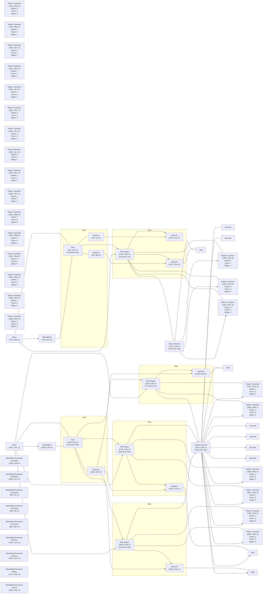

```mermaid
flowchart LR
  subgraph path7 [Path]
    7["Path Region<br>[1178, 1216, 0]<br>Consumed: true"]
      %% [ProgramBodyItem { index: 10 }, VariableDeclarationDeclaration, VariableDeclarationInit]
    40["Segment<br>[1178, 1216, 0]"]
      %% [ProgramBodyItem { index: 10 }, VariableDeclarationDeclaration, VariableDeclarationInit]
    41["Segment<br>[1178, 1216, 0]"]
      %% [ProgramBodyItem { index: 10 }, VariableDeclarationDeclaration, VariableDeclarationInit]
  end
  subgraph path8 [Path]
    8["Path Region<br>[2159, 2199, 0]<br>Consumed: true"]
      %% [ProgramBodyItem { index: 20 }, VariableDeclarationDeclaration, VariableDeclarationInit]
    43["Segment<br>[2159, 2199, 0]"]
      %% [ProgramBodyItem { index: 20 }, VariableDeclarationDeclaration, VariableDeclarationInit]
  end
  subgraph path9 [Path]
    9["Path Region<br>[2705, 2724, 0]<br>Consumed: false"]
      %% [ProgramBodyItem { index: 26 }, VariableDeclarationDeclaration, VariableDeclarationInit, PipeBodyItem { index: 0 }]
    44["Segment<br>[2705, 2724, 0]"]
      %% [ProgramBodyItem { index: 26 }, VariableDeclarationDeclaration, VariableDeclarationInit, PipeBodyItem { index: 0 }]
  end
  subgraph path10 [Path]
    10["Path Region<br>[3109, 3128, 0]<br>Consumed: false"]
      %% [ProgramBodyItem { index: 29 }, VariableDeclarationDeclaration, VariableDeclarationInit, PipeBodyItem { index: 0 }]
    45["Segment<br>[3109, 3128, 0]"]
      %% [ProgramBodyItem { index: 29 }, VariableDeclarationDeclaration, VariableDeclarationInit, PipeBodyItem { index: 0 }]
  end
  subgraph path11 [Path]
    11["Path<br>[1926, 2145, 0]<br>Consumed: false"]
      %% [ProgramBodyItem { index: 19 }, VariableDeclarationDeclaration, VariableDeclarationInit]
    42["Segment<br>[1968, 2033, 0]"]
      %% [ProgramBodyItem { index: 19 }, VariableDeclarationDeclaration, VariableDeclarationInit, SketchBlockBody, SketchBlockBodyItem { index: 0 }, VariableDeclarationDeclaration, VariableDeclarationInit]
  end
  subgraph path12 [Path]
    12["Path<br>[705, 1164, 0]<br>Consumed: false"]
      %% [ProgramBodyItem { index: 9 }, VariableDeclarationDeclaration, VariableDeclarationInit]
    46["Segment<br>[733, 792, 0]"]
      %% [ProgramBodyItem { index: 9 }, VariableDeclarationDeclaration, VariableDeclarationInit, SketchBlockBody, SketchBlockBodyItem { index: 0 }, VariableDeclarationDeclaration, VariableDeclarationInit]
    47["Segment<br>[802, 889, 0]"]
      %% [ProgramBodyItem { index: 9 }, VariableDeclarationDeclaration, VariableDeclarationInit, SketchBlockBody, SketchBlockBodyItem { index: 1 }, VariableDeclarationDeclaration, VariableDeclarationInit]
  end
  1["Cap End"]
    %% face_code_ref=Missing NodePath
  2["Cap End"]
    %% face_code_ref=Missing NodePath
  3["Cap End"]
    %% face_code_ref=Missing NodePath
  4["Cap Start"]
    %% face_code_ref=Missing NodePath
  5["Cap Start"]
    %% face_code_ref=Missing NodePath
  6["Cap Start"]
    %% face_code_ref=Missing NodePath
  13["Pattern Transform<br>[1396, 1513, 0]<br>Copies: 2<br>Faces: 2<br>Edges: 2"]
    %% [ProgramBodyItem { index: 14 }, VariableDeclarationDeclaration, VariableDeclarationInit]
  14["Pattern Transform<br>[1540, 1660, 0]<br>Copies: 2<br>Faces: 2<br>Edges: 2"]
    %% [ProgramBodyItem { index: 15 }, VariableDeclarationDeclaration, VariableDeclarationInit]
  15["Pattern Transform<br>[1540, 1660, 0]<br>Copies: 2<br>Faces: 2<br>Edges: 2"]
    %% [ProgramBodyItem { index: 15 }, VariableDeclarationDeclaration, VariableDeclarationInit]
  16["Pattern Transform<br>[1540, 1660, 0]<br>Copies: 2<br>Faces: 2<br>Edges: 2"]
    %% [ProgramBodyItem { index: 15 }, VariableDeclarationDeclaration, VariableDeclarationInit]
  17["Pattern Transform<br>[1692, 1817, 0]<br>Copies: 2<br>Faces: 2<br>Edges: 2"]
    %% [ProgramBodyItem { index: 16 }, VariableDeclarationDeclaration, VariableDeclarationInit]
  18["Pattern Transform<br>[1692, 1817, 0]<br>Copies: 2<br>Faces: 2<br>Edges: 2"]
    %% [ProgramBodyItem { index: 16 }, VariableDeclarationDeclaration, VariableDeclarationInit]
  19["Pattern Transform<br>[1692, 1817, 0]<br>Copies: 2<br>Faces: 2<br>Edges: 2"]
    %% [ProgramBodyItem { index: 16 }, VariableDeclarationDeclaration, VariableDeclarationInit]
  20["Pattern Transform<br>[1692, 1817, 0]<br>Copies: 2<br>Faces: 2<br>Edges: 2"]
    %% [ProgramBodyItem { index: 16 }, VariableDeclarationDeclaration, VariableDeclarationInit]
  21["Pattern Transform<br>[1692, 1817, 0]<br>Copies: 2<br>Faces: 2<br>Edges: 2"]
    %% [ProgramBodyItem { index: 16 }, VariableDeclarationDeclaration, VariableDeclarationInit]
  22["Pattern Transform<br>[1692, 1817, 0]<br>Copies: 2<br>Faces: 2<br>Edges: 2"]
    %% [ProgramBodyItem { index: 16 }, VariableDeclarationDeclaration, VariableDeclarationInit]
  23["Pattern Transform<br>[1692, 1817, 0]<br>Copies: 2<br>Faces: 2<br>Edges: 2"]
    %% [ProgramBodyItem { index: 16 }, VariableDeclarationDeclaration, VariableDeclarationInit]
  24["Pattern Transform<br>[1692, 1817, 0]<br>Copies: 2<br>Faces: 2<br>Edges: 2"]
    %% [ProgramBodyItem { index: 16 }, VariableDeclarationDeclaration, VariableDeclarationInit]
  25["Pattern Transform<br>[1692, 1817, 0]<br>Copies: 2<br>Faces: 2<br>Edges: 2"]
    %% [ProgramBodyItem { index: 16 }, VariableDeclarationDeclaration, VariableDeclarationInit]
  26["Pattern Transform<br>[2417, 2531, 0]<br>Copies: 2<br>Faces: 6<br>Edges: 6"]
    %% [ProgramBodyItem { index: 24 }, VariableDeclarationDeclaration, VariableDeclarationInit]
  27["Pattern Transform<br>[2563, 2688, 0]<br>Copies: 2<br>Faces: 6<br>Edges: 6"]
    %% [ProgramBodyItem { index: 25 }, VariableDeclarationDeclaration, VariableDeclarationInit]
  28["Pattern Transform<br>[2563, 2688, 0]<br>Copies: 2<br>Faces: 6<br>Edges: 6"]
    %% [ProgramBodyItem { index: 25 }, VariableDeclarationDeclaration, VariableDeclarationInit]
  29["Pattern Transform<br>[2563, 2688, 0]<br>Copies: 2<br>Faces: 6<br>Edges: 6"]
    %% [ProgramBodyItem { index: 25 }, VariableDeclarationDeclaration, VariableDeclarationInit]
  30["Pattern Transform<br>[2839, 2953, 0]<br>Copies: 2<br>Faces: 6<br>Edges: 6"]
    %% [ProgramBodyItem { index: 27 }, VariableDeclarationDeclaration, VariableDeclarationInit]
  31["Pattern Transform<br>[2967, 3092, 0]<br>Copies: 2<br>Faces: 6<br>Edges: 6"]
    %% [ProgramBodyItem { index: 28 }, VariableDeclarationDeclaration, VariableDeclarationInit]
  32["Pattern Transform<br>[2967, 3092, 0]<br>Copies: 2<br>Faces: 6<br>Edges: 6"]
    %% [ProgramBodyItem { index: 28 }, VariableDeclarationDeclaration, VariableDeclarationInit]
  33["Pattern Transform<br>[2967, 3092, 0]<br>Copies: 2<br>Faces: 6<br>Edges: 6"]
    %% [ProgramBodyItem { index: 28 }, VariableDeclarationDeclaration, VariableDeclarationInit]
  34["Pattern Transform<br>[3258, 3372, 0]<br>Copies: 2<br>Faces: 6<br>Edges: 6"]
    %% [ProgramBodyItem { index: 30 }, VariableDeclarationDeclaration, VariableDeclarationInit]
  35["Pattern Transform<br>[3386, 3520, 0]<br>Copies: 2<br>Faces: 6<br>Edges: 6"]
    %% [ProgramBodyItem { index: 31 }, VariableDeclarationDeclaration, VariableDeclarationInit]
  36["Pattern Transform<br>[3386, 3520, 0]<br>Copies: 2<br>Faces: 6<br>Edges: 6"]
    %% [ProgramBodyItem { index: 31 }, VariableDeclarationDeclaration, VariableDeclarationInit]
  37["Pattern Transform<br>[3386, 3520, 0]<br>Copies: 2<br>Faces: 6<br>Edges: 6"]
    %% [ProgramBodyItem { index: 31 }, VariableDeclarationDeclaration, VariableDeclarationInit]
  38["Plane<br>[1870, 1911, 0]"]
    %% [ProgramBodyItem { index: 18 }, VariableDeclarationDeclaration, VariableDeclarationInit]
  39["Plane<br>[705, 1164, 0]"]
    %% [ProgramBodyItem { index: 9 }, VariableDeclarationDeclaration, VariableDeclarationInit]
  48["SketchBlock<br>[1926, 2145, 0]"]
    %% [ProgramBodyItem { index: 19 }, VariableDeclarationDeclaration, VariableDeclarationInit]
  49["SketchBlock<br>[705, 1164, 0]"]
    %% [ProgramBodyItem { index: 9 }, VariableDeclarationDeclaration, VariableDeclarationInit]
  50["SketchBlockConstraint Coincident<br>[1004, 1036, 0]"]
    %% [ProgramBodyItem { index: 9 }, VariableDeclarationDeclaration, VariableDeclarationInit, SketchBlockBody, SketchBlockBodyItem { index: 5 }, ExpressionStatementExpr]
  51["SketchBlockConstraint Coincident<br>[2036, 2072, 0]"]
    %% [ProgramBodyItem { index: 19 }, VariableDeclarationDeclaration, VariableDeclarationInit, SketchBlockBody, SketchBlockBodyItem { index: 1 }, ExpressionStatementExpr]
  52["SketchBlockConstraint Coincident<br>[892, 927, 0]"]
    %% [ProgramBodyItem { index: 9 }, VariableDeclarationDeclaration, VariableDeclarationInit, SketchBlockBody, SketchBlockBodyItem { index: 2 }, ExpressionStatementExpr]
  53["SketchBlockConstraint Coincident<br>[930, 965, 0]"]
    %% [ProgramBodyItem { index: 9 }, VariableDeclarationDeclaration, VariableDeclarationInit, SketchBlockBody, SketchBlockBodyItem { index: 3 }, ExpressionStatementExpr]
  54["SketchBlockConstraint Coincident<br>[968, 1001, 0]"]
    %% [ProgramBodyItem { index: 9 }, VariableDeclarationDeclaration, VariableDeclarationInit, SketchBlockBody, SketchBlockBodyItem { index: 4 }, ExpressionStatementExpr]
  55["SketchBlockConstraint Distance<br>[1057, 1121, 0]"]
    %% [ProgramBodyItem { index: 9 }, VariableDeclarationDeclaration, VariableDeclarationInit, SketchBlockBody, SketchBlockBodyItem { index: 7 }, ExpressionStatementExpr]
  56["SketchBlockConstraint Distance<br>[2075, 2143, 0]"]
    %% [ProgramBodyItem { index: 19 }, VariableDeclarationDeclaration, VariableDeclarationInit, SketchBlockBody, SketchBlockBodyItem { index: 2 }, ExpressionStatementExpr]
  57["SketchBlockConstraint Radius<br>[1124, 1162, 0]"]
    %% [ProgramBodyItem { index: 9 }, VariableDeclarationDeclaration, VariableDeclarationInit, SketchBlockBody, SketchBlockBodyItem { index: 8 }, ExpressionStatementExpr]
  58["SketchBlockConstraint Vertical<br>[1039, 1054, 0]"]
    %% [ProgramBodyItem { index: 9 }, VariableDeclarationDeclaration, VariableDeclarationInit, SketchBlockBody, SketchBlockBodyItem { index: 6 }, ExpressionStatementExpr]
  59["Sweep Extrusion<br>[2215, 2263, 0]<br>Consumed: false"]
    %% [ProgramBodyItem { index: 21 }, VariableDeclarationDeclaration, VariableDeclarationInit, PipeBodyItem { index: 0 }]
  60["Sweep Revolve<br>[1235, 1280, 0]<br>Consumed: false"]
    %% [ProgramBodyItem { index: 11 }, VariableDeclarationDeclaration, VariableDeclarationInit]
  61[Wall]
    %% face_code_ref=Missing NodePath
  62[Wall]
    %% face_code_ref=Missing NodePath
  63[Wall]
    %% face_code_ref=Missing NodePath
  64[Wall]
    %% face_code_ref=Missing NodePath
  59 --- 1
  59 x--> 2
  59 x--> 3
  59 --- 4
  59 x--> 5
  59 x--> 6
  12 x--> 7
  7 --- 13
  7 --- 16
  7 --- 25
  39 x--> 7
  7 <--x 40
  7 <--x 41
  7 ---- 60
  11 x--> 8
  8 --- 26
  8 --- 29
  38 x--> 8
  8 <--x 43
  8 ---- 59
  11 x--> 9
  9 --- 30
  9 --- 33
  38 x--> 9
  9 <--x 44
  9 x---> 59
  11 x--> 10
  10 --- 34
  10 --- 37
  38 x--> 10
  10 <--x 45
  10 x---> 59
  38 --- 11
  11 --- 42
  48 --- 11
  39 --- 12
  12 --- 46
  12 --- 47
  49 --- 12
  60 <--x 13
  60 <--x 16
  60 <--x 25
  59 <--x 26
  59 <--x 29
  59 <--x 30
  59 <--x 33
  59 <--x 34
  59 <--x 37
  38 <--x 48
  39 <--x 49
  46 x--> 40
  47 x--> 41
  41 --- 61
  42 <--x 43
  42 <--x 44
  42 <--x 45
  43 --- 62
  44 --- 63
  45 --- 64
  59 --- 62
  59 <--x 63
  59 <--x 64
  60 --- 61
```
