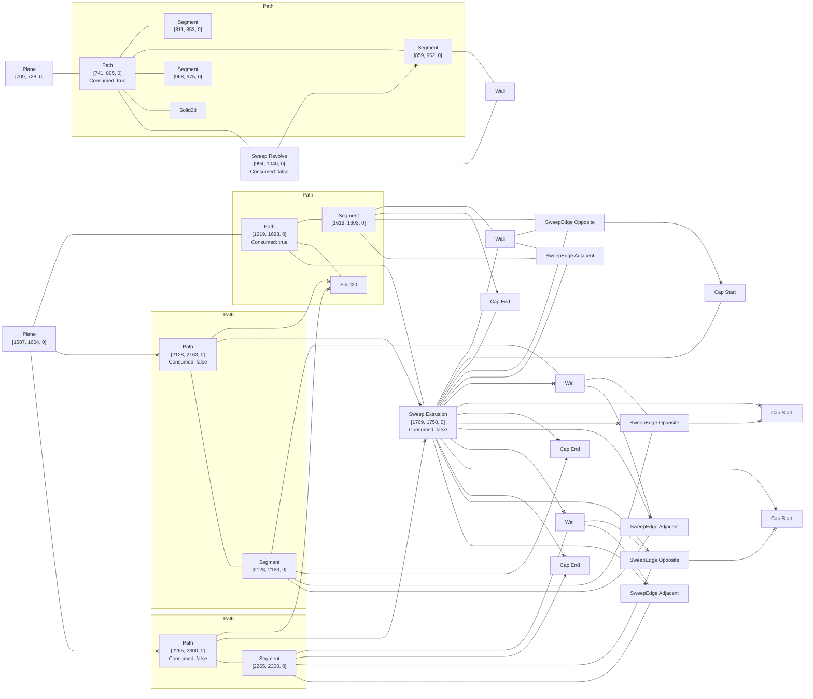

```mermaid
flowchart LR
  subgraph path2 [Path]
    2["Path<br>[741, 805, 0]<br>Consumed: true"]
      %% [ProgramBodyItem { index: 10 }, VariableDeclarationDeclaration, VariableDeclarationInit, PipeBodyItem { index: 0 }]
    3["Segment<br>[811, 853, 0]"]
      %% [ProgramBodyItem { index: 10 }, VariableDeclarationDeclaration, VariableDeclarationInit, PipeBodyItem { index: 1 }]
    4["Segment<br>[859, 962, 0]"]
      %% [ProgramBodyItem { index: 10 }, VariableDeclarationDeclaration, VariableDeclarationInit, PipeBodyItem { index: 2 }]
    5["Segment<br>[968, 975, 0]"]
      %% [ProgramBodyItem { index: 10 }, VariableDeclarationDeclaration, VariableDeclarationInit, PipeBodyItem { index: 3 }]
    6[Solid2d]
  end
  subgraph path10 [Path]
    10["Path<br>[1619, 1693, 0]<br>Consumed: true"]
      %% [ProgramBodyItem { index: 17 }, VariableDeclarationDeclaration, VariableDeclarationInit]
    11["Segment<br>[1619, 1693, 0]"]
      %% [ProgramBodyItem { index: 17 }, VariableDeclarationDeclaration, VariableDeclarationInit]
    12[Solid2d]
  end
  subgraph path19 [Path]
    19["Path<br>[2128, 2163, 0]<br>Consumed: false"]
      %% [ProgramBodyItem { index: 22 }, VariableDeclarationDeclaration, VariableDeclarationInit, PipeBodyItem { index: 0 }]
    20["Segment<br>[2128, 2163, 0]"]
      %% [ProgramBodyItem { index: 22 }, VariableDeclarationDeclaration, VariableDeclarationInit, PipeBodyItem { index: 0 }]
  end
  subgraph path26 [Path]
    26["Path<br>[2265, 2300, 0]<br>Consumed: false"]
      %% [ProgramBodyItem { index: 23 }, VariableDeclarationDeclaration, VariableDeclarationInit, PipeBodyItem { index: 0 }]
    27["Segment<br>[2265, 2300, 0]"]
      %% [ProgramBodyItem { index: 23 }, VariableDeclarationDeclaration, VariableDeclarationInit, PipeBodyItem { index: 0 }]
  end
  1["Plane<br>[709, 726, 0]"]
    %% [ProgramBodyItem { index: 9 }, VariableDeclarationDeclaration, VariableDeclarationInit]
  7["Sweep Revolve<br>[994, 1040, 0]<br>Consumed: false"]
    %% [ProgramBodyItem { index: 11 }, VariableDeclarationDeclaration, VariableDeclarationInit]
  8[Wall]
    %% face_code_ref=Missing NodePath
  9["Plane<br>[1587, 1604, 0]"]
    %% [ProgramBodyItem { index: 16 }, VariableDeclarationDeclaration, VariableDeclarationInit]
  13["Sweep Extrusion<br>[1709, 1758, 0]<br>Consumed: false"]
    %% [ProgramBodyItem { index: 18 }, VariableDeclarationDeclaration, VariableDeclarationInit]
  14[Wall]
    %% face_code_ref=Missing NodePath
  15["Cap Start"]
    %% face_code_ref=Missing NodePath
  16["Cap End"]
    %% face_code_ref=Missing NodePath
  17["SweepEdge Opposite"]
  18["SweepEdge Adjacent"]
  21[Wall]
    %% face_code_ref=Missing NodePath
  22["Cap Start"]
    %% face_code_ref=Missing NodePath
  23["Cap End"]
    %% face_code_ref=Missing NodePath
  24["SweepEdge Opposite"]
  25["SweepEdge Adjacent"]
  28[Wall]
    %% face_code_ref=Missing NodePath
  29["Cap Start"]
    %% face_code_ref=Missing NodePath
  30["Cap End"]
    %% face_code_ref=Missing NodePath
  31["SweepEdge Opposite"]
  32["SweepEdge Adjacent"]
  1 --- 2
  2 --- 3
  2 --- 4
  2 --- 5
  2 --- 6
  2 ---- 7
  7 <--x 4
  4 --- 8
  7 --- 8
  9 --- 10
  9 <--x 19
  9 <--x 26
  10 --- 11
  10 --- 12
  10 ---- 13
  11 --- 14
  11 x--> 16
  11 --- 17
  11 --- 18
  19 <--x 12
  26 <--x 12
  13 --- 14
  13 --- 15
  13 --- 16
  13 --- 17
  13 --- 18
  19 <---x 13
  13 <--x 21
  13 <--x 22
  13 <--x 23
  13 <--x 24
  13 <--x 25
  26 <---x 13
  13 <--x 28
  13 <--x 29
  13 <--x 30
  13 <--x 31
  13 <--x 32
  14 --- 17
  14 --- 18
  17 <--x 15
  19 --- 20
  20 --- 21
  20 x--> 23
  20 --- 24
  20 --- 25
  21 --- 24
  21 --- 25
  24 <--x 22
  26 --- 27
  27 --- 28
  27 x--> 30
  27 --- 31
  27 --- 32
  28 --- 31
  28 --- 32
  31 <--x 29
```
