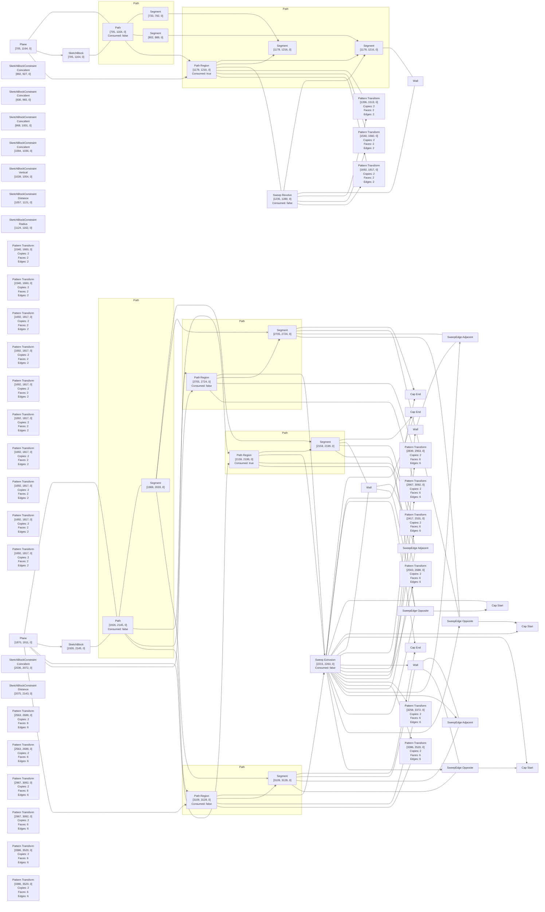

```mermaid
flowchart LR
  subgraph path11 [Path]
    11["Path<br>[705, 1164, 0]<br>Consumed: false"]
      %% [ProgramBodyItem { index: 9 }, VariableDeclarationDeclaration, VariableDeclarationInit]
    14["Segment<br>[733, 792, 0]"]
      %% [ProgramBodyItem { index: 9 }, VariableDeclarationDeclaration, VariableDeclarationInit, SketchBlockBody, SketchBlockBodyItem { index: 0 }, VariableDeclarationDeclaration, VariableDeclarationInit]
    15["Segment<br>[802, 889, 0]"]
      %% [ProgramBodyItem { index: 9 }, VariableDeclarationDeclaration, VariableDeclarationInit, SketchBlockBody, SketchBlockBodyItem { index: 1 }, VariableDeclarationDeclaration, VariableDeclarationInit]
  end
  subgraph path23 [Path]
    23["Path Region<br>[1178, 1216, 0]<br>Consumed: true"]
      %% [ProgramBodyItem { index: 10 }, VariableDeclarationDeclaration, VariableDeclarationInit]
    24["Segment<br>[1178, 1216, 0]"]
      %% [ProgramBodyItem { index: 10 }, VariableDeclarationDeclaration, VariableDeclarationInit]
    25["Segment<br>[1178, 1216, 0]"]
      %% [ProgramBodyItem { index: 10 }, VariableDeclarationDeclaration, VariableDeclarationInit]
  end
  subgraph path41 [Path]
    41["Path<br>[1926, 2145, 0]<br>Consumed: false"]
      %% [ProgramBodyItem { index: 19 }, VariableDeclarationDeclaration, VariableDeclarationInit]
    43["Segment<br>[1968, 2033, 0]"]
      %% [ProgramBodyItem { index: 19 }, VariableDeclarationDeclaration, VariableDeclarationInit, SketchBlockBody, SketchBlockBodyItem { index: 0 }, VariableDeclarationDeclaration, VariableDeclarationInit]
  end
  subgraph path46 [Path]
    46["Path Region<br>[2159, 2199, 0]<br>Consumed: true"]
      %% [ProgramBodyItem { index: 20 }, VariableDeclarationDeclaration, VariableDeclarationInit]
    47["Segment<br>[2159, 2199, 0]"]
      %% [ProgramBodyItem { index: 20 }, VariableDeclarationDeclaration, VariableDeclarationInit]
  end
  subgraph path53 [Path]
    53["Path Region<br>[2705, 2724, 0]<br>Consumed: false"]
      %% [ProgramBodyItem { index: 26 }, VariableDeclarationDeclaration, VariableDeclarationInit, PipeBodyItem { index: 0 }]
    54["Segment<br>[2705, 2724, 0]"]
      %% [ProgramBodyItem { index: 26 }, VariableDeclarationDeclaration, VariableDeclarationInit, PipeBodyItem { index: 0 }]
  end
  subgraph path59 [Path]
    59["Path Region<br>[3109, 3128, 0]<br>Consumed: false"]
      %% [ProgramBodyItem { index: 29 }, VariableDeclarationDeclaration, VariableDeclarationInit, PipeBodyItem { index: 0 }]
    60["Segment<br>[3109, 3128, 0]"]
      %% [ProgramBodyItem { index: 29 }, VariableDeclarationDeclaration, VariableDeclarationInit, PipeBodyItem { index: 0 }]
  end
  1["Cap End"]
    %% face_code_ref=Missing NodePath
  2["Cap End"]
    %% face_code_ref=Missing NodePath
  3["Cap End"]
    %% face_code_ref=Missing NodePath
  4["Cap Start"]
    %% face_code_ref=Missing NodePath
  5["Cap Start"]
    %% face_code_ref=Missing NodePath
  6["Cap Start"]
    %% face_code_ref=Missing NodePath
  7[Wall]
    %% face_code_ref=Missing NodePath
  8[Wall]
    %% face_code_ref=Missing NodePath
  9[Wall]
    %% face_code_ref=Missing NodePath
  10[Wall]
    %% face_code_ref=Missing NodePath
  12["Plane<br>[705, 1164, 0]"]
    %% [ProgramBodyItem { index: 9 }, VariableDeclarationDeclaration, VariableDeclarationInit]
  13["SketchBlock<br>[705, 1164, 0]"]
    %% [ProgramBodyItem { index: 9 }, VariableDeclarationDeclaration, VariableDeclarationInit]
  16["SketchBlockConstraint Coincident<br>[892, 927, 0]"]
    %% [ProgramBodyItem { index: 9 }, VariableDeclarationDeclaration, VariableDeclarationInit, SketchBlockBody, SketchBlockBodyItem { index: 2 }, ExpressionStatementExpr]
  17["SketchBlockConstraint Coincident<br>[930, 965, 0]"]
    %% [ProgramBodyItem { index: 9 }, VariableDeclarationDeclaration, VariableDeclarationInit, SketchBlockBody, SketchBlockBodyItem { index: 3 }, ExpressionStatementExpr]
  18["SketchBlockConstraint Coincident<br>[968, 1001, 0]"]
    %% [ProgramBodyItem { index: 9 }, VariableDeclarationDeclaration, VariableDeclarationInit, SketchBlockBody, SketchBlockBodyItem { index: 4 }, ExpressionStatementExpr]
  19["SketchBlockConstraint Coincident<br>[1004, 1036, 0]"]
    %% [ProgramBodyItem { index: 9 }, VariableDeclarationDeclaration, VariableDeclarationInit, SketchBlockBody, SketchBlockBodyItem { index: 5 }, ExpressionStatementExpr]
  20["SketchBlockConstraint Vertical<br>[1039, 1054, 0]"]
    %% [ProgramBodyItem { index: 9 }, VariableDeclarationDeclaration, VariableDeclarationInit, SketchBlockBody, SketchBlockBodyItem { index: 6 }, ExpressionStatementExpr]
  21["SketchBlockConstraint Distance<br>[1057, 1121, 0]"]
    %% [ProgramBodyItem { index: 9 }, VariableDeclarationDeclaration, VariableDeclarationInit, SketchBlockBody, SketchBlockBodyItem { index: 7 }, ExpressionStatementExpr]
  22["SketchBlockConstraint Radius<br>[1124, 1162, 0]"]
    %% [ProgramBodyItem { index: 9 }, VariableDeclarationDeclaration, VariableDeclarationInit, SketchBlockBody, SketchBlockBodyItem { index: 8 }, ExpressionStatementExpr]
  26["Sweep Revolve<br>[1235, 1280, 0]<br>Consumed: false"]
    %% [ProgramBodyItem { index: 11 }, VariableDeclarationDeclaration, VariableDeclarationInit]
  27["Pattern Transform<br>[1396, 1513, 0]<br>Copies: 2<br>Faces: 2<br>Edges: 2"]
    %% [ProgramBodyItem { index: 14 }, VariableDeclarationDeclaration, VariableDeclarationInit]
  28["Pattern Transform<br>[1540, 1660, 0]<br>Copies: 2<br>Faces: 2<br>Edges: 2"]
    %% [ProgramBodyItem { index: 15 }, VariableDeclarationDeclaration, VariableDeclarationInit]
  29["Pattern Transform<br>[1540, 1660, 0]<br>Copies: 2<br>Faces: 2<br>Edges: 2"]
    %% [ProgramBodyItem { index: 15 }, VariableDeclarationDeclaration, VariableDeclarationInit]
  30["Pattern Transform<br>[1540, 1660, 0]<br>Copies: 2<br>Faces: 2<br>Edges: 2"]
    %% [ProgramBodyItem { index: 15 }, VariableDeclarationDeclaration, VariableDeclarationInit]
  31["Pattern Transform<br>[1692, 1817, 0]<br>Copies: 2<br>Faces: 2<br>Edges: 2"]
    %% [ProgramBodyItem { index: 16 }, VariableDeclarationDeclaration, VariableDeclarationInit]
  32["Pattern Transform<br>[1692, 1817, 0]<br>Copies: 2<br>Faces: 2<br>Edges: 2"]
    %% [ProgramBodyItem { index: 16 }, VariableDeclarationDeclaration, VariableDeclarationInit]
  33["Pattern Transform<br>[1692, 1817, 0]<br>Copies: 2<br>Faces: 2<br>Edges: 2"]
    %% [ProgramBodyItem { index: 16 }, VariableDeclarationDeclaration, VariableDeclarationInit]
  34["Pattern Transform<br>[1692, 1817, 0]<br>Copies: 2<br>Faces: 2<br>Edges: 2"]
    %% [ProgramBodyItem { index: 16 }, VariableDeclarationDeclaration, VariableDeclarationInit]
  35["Pattern Transform<br>[1692, 1817, 0]<br>Copies: 2<br>Faces: 2<br>Edges: 2"]
    %% [ProgramBodyItem { index: 16 }, VariableDeclarationDeclaration, VariableDeclarationInit]
  36["Pattern Transform<br>[1692, 1817, 0]<br>Copies: 2<br>Faces: 2<br>Edges: 2"]
    %% [ProgramBodyItem { index: 16 }, VariableDeclarationDeclaration, VariableDeclarationInit]
  37["Pattern Transform<br>[1692, 1817, 0]<br>Copies: 2<br>Faces: 2<br>Edges: 2"]
    %% [ProgramBodyItem { index: 16 }, VariableDeclarationDeclaration, VariableDeclarationInit]
  38["Pattern Transform<br>[1692, 1817, 0]<br>Copies: 2<br>Faces: 2<br>Edges: 2"]
    %% [ProgramBodyItem { index: 16 }, VariableDeclarationDeclaration, VariableDeclarationInit]
  39["Pattern Transform<br>[1692, 1817, 0]<br>Copies: 2<br>Faces: 2<br>Edges: 2"]
    %% [ProgramBodyItem { index: 16 }, VariableDeclarationDeclaration, VariableDeclarationInit]
  40["Plane<br>[1870, 1911, 0]"]
    %% [ProgramBodyItem { index: 18 }, VariableDeclarationDeclaration, VariableDeclarationInit]
  42["SketchBlock<br>[1926, 2145, 0]"]
    %% [ProgramBodyItem { index: 19 }, VariableDeclarationDeclaration, VariableDeclarationInit]
  44["SketchBlockConstraint Coincident<br>[2036, 2072, 0]"]
    %% [ProgramBodyItem { index: 19 }, VariableDeclarationDeclaration, VariableDeclarationInit, SketchBlockBody, SketchBlockBodyItem { index: 1 }, ExpressionStatementExpr]
  45["SketchBlockConstraint Distance<br>[2075, 2143, 0]"]
    %% [ProgramBodyItem { index: 19 }, VariableDeclarationDeclaration, VariableDeclarationInit, SketchBlockBody, SketchBlockBodyItem { index: 2 }, ExpressionStatementExpr]
  48["Sweep Extrusion<br>[2215, 2263, 0]<br>Consumed: false"]
    %% [ProgramBodyItem { index: 21 }, VariableDeclarationDeclaration, VariableDeclarationInit, PipeBodyItem { index: 0 }]
  49["Pattern Transform<br>[2417, 2531, 0]<br>Copies: 2<br>Faces: 6<br>Edges: 6"]
    %% [ProgramBodyItem { index: 24 }, VariableDeclarationDeclaration, VariableDeclarationInit]
  50["Pattern Transform<br>[2563, 2688, 0]<br>Copies: 2<br>Faces: 6<br>Edges: 6"]
    %% [ProgramBodyItem { index: 25 }, VariableDeclarationDeclaration, VariableDeclarationInit]
  51["Pattern Transform<br>[2563, 2688, 0]<br>Copies: 2<br>Faces: 6<br>Edges: 6"]
    %% [ProgramBodyItem { index: 25 }, VariableDeclarationDeclaration, VariableDeclarationInit]
  52["Pattern Transform<br>[2563, 2688, 0]<br>Copies: 2<br>Faces: 6<br>Edges: 6"]
    %% [ProgramBodyItem { index: 25 }, VariableDeclarationDeclaration, VariableDeclarationInit]
  55["Pattern Transform<br>[2839, 2953, 0]<br>Copies: 2<br>Faces: 6<br>Edges: 6"]
    %% [ProgramBodyItem { index: 27 }, VariableDeclarationDeclaration, VariableDeclarationInit]
  56["Pattern Transform<br>[2967, 3092, 0]<br>Copies: 2<br>Faces: 6<br>Edges: 6"]
    %% [ProgramBodyItem { index: 28 }, VariableDeclarationDeclaration, VariableDeclarationInit]
  57["Pattern Transform<br>[2967, 3092, 0]<br>Copies: 2<br>Faces: 6<br>Edges: 6"]
    %% [ProgramBodyItem { index: 28 }, VariableDeclarationDeclaration, VariableDeclarationInit]
  58["Pattern Transform<br>[2967, 3092, 0]<br>Copies: 2<br>Faces: 6<br>Edges: 6"]
    %% [ProgramBodyItem { index: 28 }, VariableDeclarationDeclaration, VariableDeclarationInit]
  61["Pattern Transform<br>[3258, 3372, 0]<br>Copies: 2<br>Faces: 6<br>Edges: 6"]
    %% [ProgramBodyItem { index: 30 }, VariableDeclarationDeclaration, VariableDeclarationInit]
  62["Pattern Transform<br>[3386, 3520, 0]<br>Copies: 2<br>Faces: 6<br>Edges: 6"]
    %% [ProgramBodyItem { index: 31 }, VariableDeclarationDeclaration, VariableDeclarationInit]
  63["Pattern Transform<br>[3386, 3520, 0]<br>Copies: 2<br>Faces: 6<br>Edges: 6"]
    %% [ProgramBodyItem { index: 31 }, VariableDeclarationDeclaration, VariableDeclarationInit]
  64["Pattern Transform<br>[3386, 3520, 0]<br>Copies: 2<br>Faces: 6<br>Edges: 6"]
    %% [ProgramBodyItem { index: 31 }, VariableDeclarationDeclaration, VariableDeclarationInit]
  65["SweepEdge Adjacent"]
  66["SweepEdge Adjacent"]
  67["SweepEdge Adjacent"]
  68["SweepEdge Opposite"]
  69["SweepEdge Opposite"]
  70["SweepEdge Opposite"]
  47 <--x 1
  48 --- 1
  48 x--> 2
  54 <--x 2
  48 x--> 3
  60 <--x 3
  48 --- 4
  68 <--x 4
  48 x--> 5
  69 <--x 5
  48 x--> 6
  70 <--x 6
  24 --- 7
  26 --- 7
  47 --- 8
  48 --- 8
  8 --- 65
  8 --- 68
  48 x--> 9
  54 --- 9
  9 --- 66
  9 --- 69
  48 x--> 10
  60 --- 10
  10 --- 67
  10 --- 70
  12 --- 11
  13 --- 11
  11 --- 14
  11 --- 15
  11 <--x 23
  12 <--x 13
  12 <--x 23
  14 <--x 25
  15 <--x 24
  23 <--x 24
  23 <--x 25
  23 ---- 26
  23 --- 27
  23 --- 30
  23 --- 39
  26 <--x 24
  26 x--> 27
  26 x--> 30
  26 x--> 39
  40 --- 41
  40 <--x 42
  40 <--x 46
  40 <--x 53
  40 <--x 59
  42 --- 41
  41 --- 43
  41 <--x 46
  41 <--x 53
  41 <--x 59
  43 <--x 47
  43 <--x 54
  43 <--x 60
  46 <--x 47
  46 ---- 48
  46 --- 49
  46 --- 52
  47 --- 65
  47 --- 68
  48 x--> 49
  48 x--> 52
  53 <---x 48
  48 x--> 55
  48 x--> 58
  59 <---x 48
  48 x--> 61
  48 x--> 64
  48 --- 65
  48 <--x 66
  48 <--x 67
  48 --- 68
  48 <--x 69
  48 <--x 70
  53 <--x 54
  53 --- 55
  53 --- 58
  54 --- 66
  54 --- 69
  59 <--x 60
  59 --- 61
  59 --- 64
  60 --- 67
  60 --- 70
```
