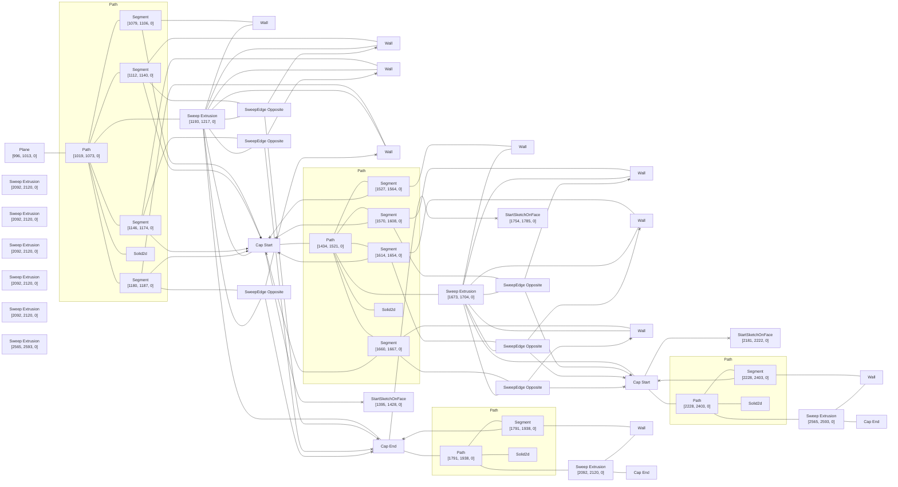

```mermaid
flowchart LR
  subgraph path2 [Path]
    2["Path<br>[1019, 1073, 0]"]
    3["Segment<br>[1079, 1106, 0]"]
    4["Segment<br>[1112, 1140, 0]"]
    5["Segment<br>[1146, 1174, 0]"]
    6["Segment<br>[1180, 1187, 0]"]
    7[Solid2d]
  end
  subgraph path18 [Path]
    18["Path<br>[1434, 1521, 0]"]
    19["Segment<br>[1527, 1564, 0]"]
    20["Segment<br>[1570, 1608, 0]"]
    21["Segment<br>[1614, 1654, 0]"]
    22["Segment<br>[1660, 1667, 0]"]
    23[Solid2d]
  end
  subgraph path33 [Path]
    33["Path<br>[1791, 1938, 0]"]
    34["Segment<br>[1791, 1938, 0]"]
    35[Solid2d]
  end
  subgraph path44 [Path]
    44["Path<br>[2228, 2403, 0]"]
    45["Segment<br>[2228, 2403, 0]"]
    46[Solid2d]
  end
  1["Plane<br>[996, 1013, 0]"]
  8["Sweep Extrusion<br>[1193, 1217, 0]"]
  9[Wall]
  10[Wall]
  11[Wall]
  12[Wall]
  13["Cap Start"]
  14["Cap End"]
  15["SweepEdge Opposite"]
  16["SweepEdge Opposite"]
  17["SweepEdge Opposite"]
  24["Sweep Extrusion<br>[1673, 1704, 0]"]
  25[Wall]
  26[Wall]
  27[Wall]
  28[Wall]
  29["Cap Start"]
  30["SweepEdge Opposite"]
  31["SweepEdge Opposite"]
  32["SweepEdge Opposite"]
  36["Sweep Extrusion<br>[2092, 2120, 0]"]
  37[Wall]
  38["Cap End"]
  39["Sweep Extrusion<br>[2092, 2120, 0]"]
  40["Sweep Extrusion<br>[2092, 2120, 0]"]
  41["Sweep Extrusion<br>[2092, 2120, 0]"]
  42["Sweep Extrusion<br>[2092, 2120, 0]"]
  43["Sweep Extrusion<br>[2092, 2120, 0]"]
  47["Sweep Extrusion<br>[2565, 2593, 0]"]
  48[Wall]
  49["Cap End"]
  50["Sweep Extrusion<br>[2565, 2593, 0]"]
  51["StartSketchOnFace<br>[1395, 1428, 0]"]
  52["StartSketchOnFace<br>[1754, 1785, 0]"]
  53["StartSketchOnFace<br>[2181, 2222, 0]"]
  1 --- 2
  2 --- 3
  2 --- 4
  2 --- 5
  2 --- 6
  2 ---- 8
  2 --- 7
  3 --- 9
  3 x--> 13
  4 --- 10
  4 --- 15
  4 x--> 13
  5 --- 11
  5 --- 16
  5 x--> 13
  6 --- 12
  6 --- 17
  6 x--> 13
  8 --- 9
  8 --- 10
  8 --- 11
  8 --- 12
  8 --- 13
  8 --- 14
  8 --- 15
  8 --- 16
  8 --- 17
  13 --- 18
  14 --- 33
  15 <--x 10
  15 <--x 14
  16 <--x 11
  16 <--x 14
  17 <--x 12
  17 <--x 14
  18 --- 19
  18 --- 20
  18 --- 21
  18 --- 22
  18 ---- 24
  18 --- 23
  19 --- 25
  19 <--x 13
  20 --- 26
  20 --- 30
  20 <--x 13
  21 --- 27
  21 --- 31
  21 <--x 13
  22 --- 28
  22 --- 32
  22 <--x 13
  24 --- 25
  24 --- 26
  24 --- 27
  24 --- 28
  24 --- 29
  24 --- 30
  24 --- 31
  24 --- 32
  29 --- 44
  30 <--x 26
  30 <--x 29
  31 <--x 27
  31 <--x 29
  32 <--x 28
  32 <--x 29
  33 --- 34
  33 ---- 36
  33 --- 35
  34 --- 37
  34 <--x 14
  36 --- 37
  36 --- 38
  44 --- 45
  44 ---- 47
  44 --- 46
  45 --- 48
  45 <--x 29
  47 --- 48
  47 --- 49
  13 <--x 51
  14 <--x 52
  29 <--x 53
```
