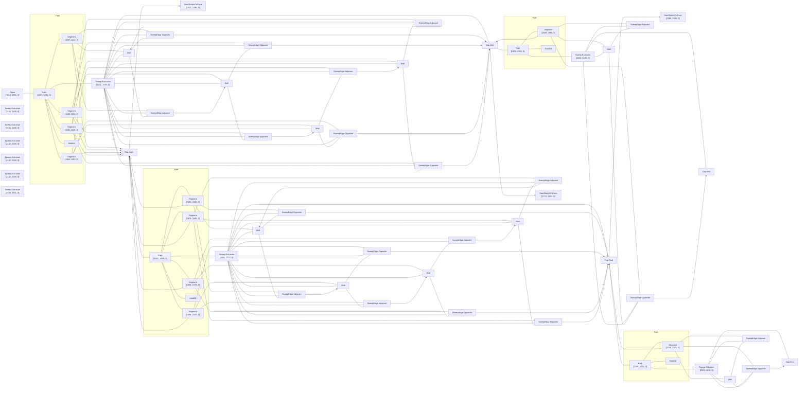

```mermaid
flowchart LR
  subgraph path2 [Path]
    2["Path<br>[1037, 1091, 0]"]
      %% [ProgramBodyItem { index: 15 }, VariableDeclarationDeclaration, VariableDeclarationInit, PipeBodyItem { index: 1 }]
    3["Segment<br>[1097, 1124, 0]"]
      %% [ProgramBodyItem { index: 15 }, VariableDeclarationDeclaration, VariableDeclarationInit, PipeBodyItem { index: 2 }]
    4["Segment<br>[1130, 1158, 0]"]
      %% [ProgramBodyItem { index: 15 }, VariableDeclarationDeclaration, VariableDeclarationInit, PipeBodyItem { index: 3 }]
    5["Segment<br>[1164, 1192, 0]"]
      %% [ProgramBodyItem { index: 15 }, VariableDeclarationDeclaration, VariableDeclarationInit, PipeBodyItem { index: 4 }]
    6["Segment<br>[1198, 1205, 0]"]
      %% [ProgramBodyItem { index: 15 }, VariableDeclarationDeclaration, VariableDeclarationInit, PipeBodyItem { index: 5 }]
    7[Solid2d]
  end
  subgraph path23 [Path]
    23["Path<br>[1452, 1539, 0]"]
      %% [ProgramBodyItem { index: 16 }, VariableDeclarationDeclaration, VariableDeclarationInit, PipeBodyItem { index: 1 }]
    24["Segment<br>[1545, 1582, 0]"]
      %% [ProgramBodyItem { index: 16 }, VariableDeclarationDeclaration, VariableDeclarationInit, PipeBodyItem { index: 2 }]
    25["Segment<br>[1588, 1626, 0]"]
      %% [ProgramBodyItem { index: 16 }, VariableDeclarationDeclaration, VariableDeclarationInit, PipeBodyItem { index: 3 }]
    26["Segment<br>[1632, 1672, 0]"]
      %% [ProgramBodyItem { index: 16 }, VariableDeclarationDeclaration, VariableDeclarationInit, PipeBodyItem { index: 4 }]
    27["Segment<br>[1678, 1685, 0]"]
      %% [ProgramBodyItem { index: 16 }, VariableDeclarationDeclaration, VariableDeclarationInit, PipeBodyItem { index: 5 }]
    28[Solid2d]
  end
  subgraph path43 [Path]
    43["Path<br>[1809, 1956, 0]"]
      %% [ProgramBodyItem { index: 17 }, VariableDeclarationDeclaration, VariableDeclarationInit, PipeBodyItem { index: 1 }]
    44["Segment<br>[1809, 1956, 0]"]
      %% [ProgramBodyItem { index: 17 }, VariableDeclarationDeclaration, VariableDeclarationInit, PipeBodyItem { index: 1 }]
    45[Solid2d]
  end
  subgraph path56 [Path]
    56["Path<br>[2246, 2421, 0]"]
      %% [ProgramBodyItem { index: 18 }, VariableDeclarationDeclaration, VariableDeclarationInit, PipeBodyItem { index: 1 }]
    57["Segment<br>[2246, 2421, 0]"]
      %% [ProgramBodyItem { index: 18 }, VariableDeclarationDeclaration, VariableDeclarationInit, PipeBodyItem { index: 1 }]
    58[Solid2d]
  end
  1["Plane<br>[1014, 1031, 0]"]
    %% [ProgramBodyItem { index: 15 }, VariableDeclarationDeclaration, VariableDeclarationInit, PipeBodyItem { index: 0 }]
  8["Sweep Extrusion<br>[1211, 1235, 0]"]
    %% [ProgramBodyItem { index: 15 }, VariableDeclarationDeclaration, VariableDeclarationInit, PipeBodyItem { index: 6 }]
  9[Wall]
    %% face_code_ref=Missing NodePath
  10[Wall]
    %% face_code_ref=Missing NodePath
  11[Wall]
    %% face_code_ref=Missing NodePath
  12[Wall]
    %% face_code_ref=Missing NodePath
  13["Cap Start"]
    %% face_code_ref=[ProgramBodyItem { index: 16 }, VariableDeclarationDeclaration, VariableDeclarationInit, PipeBodyItem { index: 0 }]
  14["Cap End"]
    %% face_code_ref=[ProgramBodyItem { index: 17 }, VariableDeclarationDeclaration, VariableDeclarationInit, PipeBodyItem { index: 0 }]
  15["SweepEdge Opposite"]
  16["SweepEdge Adjacent"]
  17["SweepEdge Opposite"]
  18["SweepEdge Adjacent"]
  19["SweepEdge Opposite"]
  20["SweepEdge Adjacent"]
  21["SweepEdge Opposite"]
  22["SweepEdge Adjacent"]
  29["Sweep Extrusion<br>[1691, 1722, 0]"]
    %% [ProgramBodyItem { index: 16 }, VariableDeclarationDeclaration, VariableDeclarationInit, PipeBodyItem { index: 6 }]
  30[Wall]
    %% face_code_ref=Missing NodePath
  31[Wall]
    %% face_code_ref=Missing NodePath
  32[Wall]
    %% face_code_ref=Missing NodePath
  33[Wall]
    %% face_code_ref=Missing NodePath
  34["Cap Start"]
    %% face_code_ref=[ProgramBodyItem { index: 18 }, VariableDeclarationDeclaration, VariableDeclarationInit, PipeBodyItem { index: 0 }]
  35["SweepEdge Opposite"]
  36["SweepEdge Adjacent"]
  37["SweepEdge Opposite"]
  38["SweepEdge Adjacent"]
  39["SweepEdge Opposite"]
  40["SweepEdge Adjacent"]
  41["SweepEdge Opposite"]
  42["SweepEdge Adjacent"]
  46["Sweep Extrusion<br>[2110, 2138, 0]"]
    %% [ProgramBodyItem { index: 17 }, VariableDeclarationDeclaration, VariableDeclarationInit, PipeBodyItem { index: 4 }]
  47[Wall]
    %% face_code_ref=Missing NodePath
  48["Cap End"]
    %% face_code_ref=Missing NodePath
  49["SweepEdge Opposite"]
  50["SweepEdge Adjacent"]
  51["Sweep Extrusion<br>[2110, 2138, 0]"]
    %% [ProgramBodyItem { index: 17 }, VariableDeclarationDeclaration, VariableDeclarationInit, PipeBodyItem { index: 4 }]
  52["Sweep Extrusion<br>[2110, 2138, 0]"]
    %% [ProgramBodyItem { index: 17 }, VariableDeclarationDeclaration, VariableDeclarationInit, PipeBodyItem { index: 4 }]
  53["Sweep Extrusion<br>[2110, 2138, 0]"]
    %% [ProgramBodyItem { index: 17 }, VariableDeclarationDeclaration, VariableDeclarationInit, PipeBodyItem { index: 4 }]
  54["Sweep Extrusion<br>[2110, 2138, 0]"]
    %% [ProgramBodyItem { index: 17 }, VariableDeclarationDeclaration, VariableDeclarationInit, PipeBodyItem { index: 4 }]
  55["Sweep Extrusion<br>[2110, 2138, 0]"]
    %% [ProgramBodyItem { index: 17 }, VariableDeclarationDeclaration, VariableDeclarationInit, PipeBodyItem { index: 4 }]
  59["Sweep Extrusion<br>[2583, 2611, 0]"]
    %% [ProgramBodyItem { index: 18 }, VariableDeclarationDeclaration, VariableDeclarationInit, PipeBodyItem { index: 4 }]
  60[Wall]
    %% face_code_ref=Missing NodePath
  61["Cap End"]
    %% face_code_ref=Missing NodePath
  62["SweepEdge Opposite"]
  63["SweepEdge Adjacent"]
  64["Sweep Extrusion<br>[2583, 2611, 0]"]
    %% [ProgramBodyItem { index: 18 }, VariableDeclarationDeclaration, VariableDeclarationInit, PipeBodyItem { index: 4 }]
  65["StartSketchOnFace<br>[1413, 1446, 0]"]
    %% [ProgramBodyItem { index: 16 }, VariableDeclarationDeclaration, VariableDeclarationInit, PipeBodyItem { index: 0 }]
  66["StartSketchOnFace<br>[1772, 1803, 0]"]
    %% [ProgramBodyItem { index: 17 }, VariableDeclarationDeclaration, VariableDeclarationInit, PipeBodyItem { index: 0 }]
  67["StartSketchOnFace<br>[2199, 2240, 0]"]
    %% [ProgramBodyItem { index: 18 }, VariableDeclarationDeclaration, VariableDeclarationInit, PipeBodyItem { index: 0 }]
  1 --- 2
  2 --- 3
  2 --- 4
  2 --- 5
  2 --- 6
  2 --- 7
  2 ---- 8
  3 --- 9
  3 x--> 13
  3 --- 15
  3 --- 16
  4 --- 10
  4 x--> 13
  4 --- 17
  4 --- 18
  5 --- 11
  5 x--> 13
  5 --- 19
  5 --- 20
  6 --- 12
  6 x--> 13
  6 --- 21
  6 --- 22
  8 --- 9
  8 --- 10
  8 --- 11
  8 --- 12
  8 --- 13
  8 --- 14
  8 --- 15
  8 --- 16
  8 --- 17
  8 --- 18
  8 --- 19
  8 --- 20
  8 --- 21
  8 --- 22
  9 --- 15
  9 --- 16
  22 <--x 9
  16 <--x 10
  10 --- 17
  10 --- 18
  18 <--x 11
  11 --- 19
  11 --- 20
  20 <--x 12
  12 --- 21
  12 --- 22
  13 --- 23
  24 <--x 13
  25 <--x 13
  26 <--x 13
  27 <--x 13
  13 <--x 65
  15 <--x 14
  17 <--x 14
  19 <--x 14
  21 <--x 14
  14 --- 43
  44 <--x 14
  14 <--x 66
  23 --- 24
  23 --- 25
  23 --- 26
  23 --- 27
  23 --- 28
  23 ---- 29
  24 --- 30
  24 --- 35
  24 --- 36
  25 --- 31
  25 --- 37
  25 --- 38
  26 --- 32
  26 --- 39
  26 --- 40
  27 --- 33
  27 --- 41
  27 --- 42
  29 --- 30
  29 --- 31
  29 --- 32
  29 --- 33
  29 --- 34
  29 --- 35
  29 --- 36
  29 --- 37
  29 --- 38
  29 --- 39
  29 --- 40
  29 --- 41
  29 --- 42
  30 --- 35
  30 --- 36
  42 <--x 30
  36 <--x 31
  31 --- 37
  31 --- 38
  38 <--x 32
  32 --- 39
  32 --- 40
  40 <--x 33
  33 --- 41
  33 --- 42
  35 <--x 34
  37 <--x 34
  39 <--x 34
  41 <--x 34
  34 --- 56
  57 <--x 34
  34 <--x 67
  43 --- 44
  43 --- 45
  43 ---- 46
  44 --- 47
  44 --- 49
  44 --- 50
  46 --- 47
  46 --- 48
  46 --- 49
  46 --- 50
  47 --- 49
  47 --- 50
  49 <--x 48
  56 --- 57
  56 --- 58
  56 ---- 59
  57 --- 60
  57 --- 62
  57 --- 63
  59 --- 60
  59 --- 61
  59 --- 62
  59 --- 63
  60 --- 62
  60 --- 63
  62 <--x 61
```
