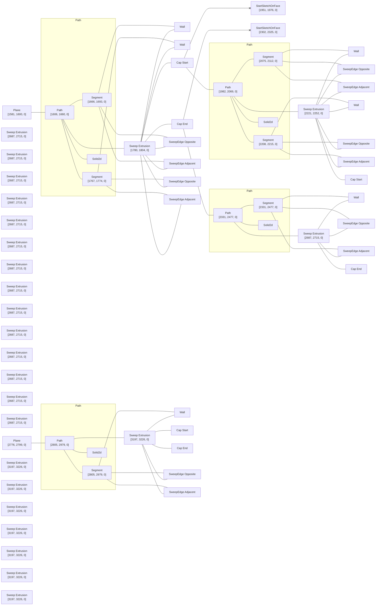

```mermaid
flowchart LR
  subgraph path2 [Path]
    2["Path<br>[1606, 1660, 0]"]
    3["Segment<br>[1666, 1693, 0]"]
    4["Segment<br>[1767, 1774, 0]"]
    5[Solid2d]
  end
  subgraph path15 [Path]
    15["Path<br>[1982, 2069, 0]"]
    16["Segment<br>[2075, 2112, 0]"]
    17["Segment<br>[2208, 2215, 0]"]
    18[Solid2d]
  end
  subgraph path27 [Path]
    27["Path<br>[2331, 2477, 0]"]
    28["Segment<br>[2331, 2477, 0]"]
    29[Solid2d]
  end
  subgraph path50 [Path]
    50["Path<br>[2805, 2979, 0]"]
    51["Segment<br>[2805, 2979, 0]"]
    52[Solid2d]
  end
  1["Plane<br>[1581, 1600, 0]"]
  6["Sweep Extrusion<br>[1780, 1804, 0]"]
  7[Wall]
  8[Wall]
  9["Cap Start"]
  10["Cap End"]
  11["SweepEdge Opposite"]
  12["SweepEdge Adjacent"]
  13["SweepEdge Opposite"]
  14["SweepEdge Adjacent"]
  19["Sweep Extrusion<br>[2221, 2252, 0]"]
  20[Wall]
  21[Wall]
  22["Cap Start"]
  23["SweepEdge Opposite"]
  24["SweepEdge Adjacent"]
  25["SweepEdge Opposite"]
  26["SweepEdge Adjacent"]
  30["Sweep Extrusion<br>[2687, 2715, 0]"]
  31[Wall]
  32["Cap End"]
  33["SweepEdge Opposite"]
  34["SweepEdge Adjacent"]
  35["Sweep Extrusion<br>[2687, 2715, 0]"]
  36["Sweep Extrusion<br>[2687, 2715, 0]"]
  37["Sweep Extrusion<br>[2687, 2715, 0]"]
  38["Sweep Extrusion<br>[2687, 2715, 0]"]
  39["Sweep Extrusion<br>[2687, 2715, 0]"]
  40["Sweep Extrusion<br>[2687, 2715, 0]"]
  41["Sweep Extrusion<br>[2687, 2715, 0]"]
  42["Sweep Extrusion<br>[2687, 2715, 0]"]
  43["Sweep Extrusion<br>[2687, 2715, 0]"]
  44["Sweep Extrusion<br>[2687, 2715, 0]"]
  45["Sweep Extrusion<br>[2687, 2715, 0]"]
  46["Sweep Extrusion<br>[2687, 2715, 0]"]
  47["Sweep Extrusion<br>[2687, 2715, 0]"]
  48["Sweep Extrusion<br>[2687, 2715, 0]"]
  49["Plane<br>[2776, 2799, 0]"]
  53["Sweep Extrusion<br>[3197, 3226, 0]"]
  54[Wall]
  55["Cap Start"]
  56["Cap End"]
  57["SweepEdge Opposite"]
  58["SweepEdge Adjacent"]
  59["Sweep Extrusion<br>[3197, 3226, 0]"]
  60["Sweep Extrusion<br>[3197, 3226, 0]"]
  61["Sweep Extrusion<br>[3197, 3226, 0]"]
  62["Sweep Extrusion<br>[3197, 3226, 0]"]
  63["Sweep Extrusion<br>[3197, 3226, 0]"]
  64["Sweep Extrusion<br>[3197, 3226, 0]"]
  65["Sweep Extrusion<br>[3197, 3226, 0]"]
  66["StartSketchOnFace<br>[1951, 1976, 0]"]
  67["StartSketchOnFace<br>[2302, 2325, 0]"]
  1 --- 2
  2 --- 3
  2 --- 4
  2 ---- 6
  2 --- 5
  3 --- 7
  3 --- 11
  3 --- 12
  4 --- 8
  4 --- 13
  4 --- 14
  6 --- 7
  6 --- 8
  6 --- 9
  6 --- 10
  6 --- 11
  6 --- 12
  6 --- 13
  6 --- 14
  9 --- 15
  10 --- 27
  15 --- 16
  15 --- 17
  15 ---- 19
  15 --- 18
  16 --- 20
  16 --- 23
  16 --- 24
  17 --- 21
  17 --- 25
  17 --- 26
  19 --- 20
  19 --- 21
  19 --- 22
  19 --- 23
  19 --- 24
  19 --- 25
  19 --- 26
  27 --- 28
  27 ---- 30
  27 --- 29
  28 --- 31
  28 --- 33
  28 --- 34
  30 --- 31
  30 --- 32
  30 --- 33
  30 --- 34
  49 --- 50
  50 --- 51
  50 ---- 53
  50 --- 52
  51 --- 54
  51 --- 57
  51 --- 58
  53 --- 54
  53 --- 55
  53 --- 56
  53 --- 57
  53 --- 58
  9 <--x 66
  10 <--x 67
```
