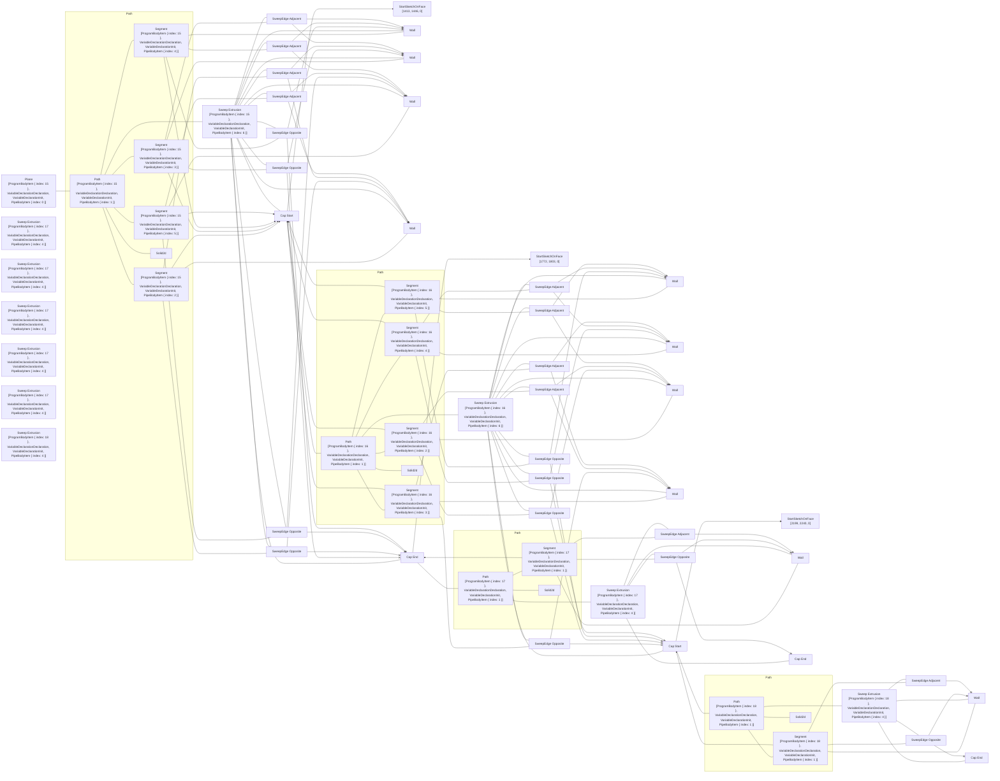

```mermaid
flowchart LR
  subgraph path5 [Path]
    5["Path<br>[ProgramBodyItem { index: 15 }, VariableDeclarationDeclaration, VariableDeclarationInit, PipeBodyItem { index: 1 }]"]
    9["Segment<br>[ProgramBodyItem { index: 15 }, VariableDeclarationDeclaration, VariableDeclarationInit, PipeBodyItem { index: 2 }]"]
    10["Segment<br>[ProgramBodyItem { index: 15 }, VariableDeclarationDeclaration, VariableDeclarationInit, PipeBodyItem { index: 3 }]"]
    11["Segment<br>[ProgramBodyItem { index: 15 }, VariableDeclarationDeclaration, VariableDeclarationInit, PipeBodyItem { index: 4 }]"]
    12["Segment<br>[ProgramBodyItem { index: 15 }, VariableDeclarationDeclaration, VariableDeclarationInit, PipeBodyItem { index: 5 }]"]
    20[Solid2d]
  end
  subgraph path6 [Path]
    6["Path<br>[ProgramBodyItem { index: 16 }, VariableDeclarationDeclaration, VariableDeclarationInit, PipeBodyItem { index: 1 }]"]
    13["Segment<br>[ProgramBodyItem { index: 16 }, VariableDeclarationDeclaration, VariableDeclarationInit, PipeBodyItem { index: 2 }]"]
    14["Segment<br>[ProgramBodyItem { index: 16 }, VariableDeclarationDeclaration, VariableDeclarationInit, PipeBodyItem { index: 3 }]"]
    15["Segment<br>[ProgramBodyItem { index: 16 }, VariableDeclarationDeclaration, VariableDeclarationInit, PipeBodyItem { index: 4 }]"]
    16["Segment<br>[ProgramBodyItem { index: 16 }, VariableDeclarationDeclaration, VariableDeclarationInit, PipeBodyItem { index: 5 }]"]
    19[Solid2d]
  end
  subgraph path7 [Path]
    7["Path<br>[ProgramBodyItem { index: 17 }, VariableDeclarationDeclaration, VariableDeclarationInit, PipeBodyItem { index: 1 }]"]
    17["Segment<br>[ProgramBodyItem { index: 17 }, VariableDeclarationDeclaration, VariableDeclarationInit, PipeBodyItem { index: 1 }]"]
    21[Solid2d]
  end
  subgraph path8 [Path]
    8["Path<br>[ProgramBodyItem { index: 18 }, VariableDeclarationDeclaration, VariableDeclarationInit, PipeBodyItem { index: 1 }]"]
    18["Segment<br>[ProgramBodyItem { index: 18 }, VariableDeclarationDeclaration, VariableDeclarationInit, PipeBodyItem { index: 1 }]"]
    22[Solid2d]
  end
  1["Plane<br>[ProgramBodyItem { index: 15 }, VariableDeclarationDeclaration, VariableDeclarationInit, PipeBodyItem { index: 0 }]"]
  2["StartSketchOnFace<br>[1772, 1803, 0]"]
  3["StartSketchOnFace<br>[2199, 2240, 0]"]
  4["StartSketchOnFace<br>[1413, 1446, 0]"]
  23["Sweep Extrusion<br>[ProgramBodyItem { index: 15 }, VariableDeclarationDeclaration, VariableDeclarationInit, PipeBodyItem { index: 6 }]"]
  24["Sweep Extrusion<br>[ProgramBodyItem { index: 16 }, VariableDeclarationDeclaration, VariableDeclarationInit, PipeBodyItem { index: 6 }]"]
  25["Sweep Extrusion<br>[ProgramBodyItem { index: 17 }, VariableDeclarationDeclaration, VariableDeclarationInit, PipeBodyItem { index: 4 }]"]
  26["Sweep Extrusion<br>[ProgramBodyItem { index: 17 }, VariableDeclarationDeclaration, VariableDeclarationInit, PipeBodyItem { index: 4 }]"]
  27["Sweep Extrusion<br>[ProgramBodyItem { index: 17 }, VariableDeclarationDeclaration, VariableDeclarationInit, PipeBodyItem { index: 4 }]"]
  28["Sweep Extrusion<br>[ProgramBodyItem { index: 17 }, VariableDeclarationDeclaration, VariableDeclarationInit, PipeBodyItem { index: 4 }]"]
  29["Sweep Extrusion<br>[ProgramBodyItem { index: 17 }, VariableDeclarationDeclaration, VariableDeclarationInit, PipeBodyItem { index: 4 }]"]
  30["Sweep Extrusion<br>[ProgramBodyItem { index: 17 }, VariableDeclarationDeclaration, VariableDeclarationInit, PipeBodyItem { index: 4 }]"]
  31["Sweep Extrusion<br>[ProgramBodyItem { index: 18 }, VariableDeclarationDeclaration, VariableDeclarationInit, PipeBodyItem { index: 4 }]"]
  32["Sweep Extrusion<br>[ProgramBodyItem { index: 18 }, VariableDeclarationDeclaration, VariableDeclarationInit, PipeBodyItem { index: 4 }]"]
  33[Wall]
  34[Wall]
  35[Wall]
  36[Wall]
  37[Wall]
  38[Wall]
  39[Wall]
  40[Wall]
  41[Wall]
  42[Wall]
  43["Cap Start"]
  44["Cap Start"]
  45["Cap End"]
  46["Cap End"]
  47["Cap End"]
  48["SweepEdge Opposite"]
  49["SweepEdge Opposite"]
  50["SweepEdge Opposite"]
  51["SweepEdge Opposite"]
  52["SweepEdge Opposite"]
  53["SweepEdge Opposite"]
  54["SweepEdge Opposite"]
  55["SweepEdge Opposite"]
  56["SweepEdge Opposite"]
  57["SweepEdge Opposite"]
  58["SweepEdge Adjacent"]
  59["SweepEdge Adjacent"]
  60["SweepEdge Adjacent"]
  61["SweepEdge Adjacent"]
  62["SweepEdge Adjacent"]
  63["SweepEdge Adjacent"]
  64["SweepEdge Adjacent"]
  65["SweepEdge Adjacent"]
  66["SweepEdge Adjacent"]
  67["SweepEdge Adjacent"]
  1 --- 5
  47 x--> 2
  43 x--> 3
  44 x--> 4
  5 --- 9
  5 --- 10
  5 --- 11
  5 --- 12
  5 --- 20
  5 ---- 23
  6 --- 13
  6 --- 14
  6 --- 15
  6 --- 16
  6 --- 19
  6 ---- 24
  44 --- 6
  7 --- 17
  7 --- 21
  7 ---- 30
  47 --- 7
  8 --- 18
  8 --- 22
  8 ---- 31
  43 --- 8
  9 --- 36
  9 x--> 44
  9 --- 49
  9 --- 58
  10 --- 34
  10 x--> 44
  10 --- 48
  10 --- 61
  11 --- 33
  11 x--> 44
  11 --- 51
  11 --- 60
  12 --- 35
  12 x--> 44
  12 --- 50
  12 --- 59
  13 --- 39
  13 x--> 44
  13 --- 53
  13 --- 62
  14 --- 40
  14 x--> 44
  14 --- 52
  14 --- 64
  15 --- 38
  15 x--> 44
  15 --- 55
  15 --- 63
  16 --- 37
  16 x--> 44
  16 --- 54
  16 --- 65
  17 --- 42
  17 x--> 47
  17 --- 57
  17 --- 67
  18 --- 41
  18 x--> 43
  18 --- 56
  18 --- 66
  23 --- 33
  23 --- 34
  23 --- 35
  23 --- 36
  23 --- 44
  23 --- 47
  23 --- 48
  23 --- 49
  23 --- 50
  23 --- 51
  23 --- 58
  23 --- 59
  23 --- 60
  23 --- 61
  24 --- 37
  24 --- 38
  24 --- 39
  24 --- 40
  24 --- 43
  24 --- 52
  24 --- 53
  24 --- 54
  24 --- 55
  24 --- 62
  24 --- 63
  24 --- 64
  24 --- 65
  30 --- 42
  30 --- 46
  30 --- 57
  30 --- 67
  31 --- 41
  31 --- 45
  31 --- 56
  31 --- 66
  51 <--x 33
  60 <--x 33
  61 <--x 33
  48 <--x 34
  58 <--x 34
  61 <--x 34
  50 <--x 35
  59 <--x 35
  60 <--x 35
  49 <--x 36
  58 <--x 36
  59 <--x 36
  54 <--x 37
  63 <--x 37
  65 <--x 37
  55 <--x 38
  63 <--x 38
  64 <--x 38
  53 <--x 39
  62 <--x 39
  65 <--x 39
  52 <--x 40
  62 <--x 40
  64 <--x 40
  56 <--x 41
  66 <--x 41
  57 <--x 42
  67 <--x 42
  52 <--x 43
  53 <--x 43
  54 <--x 43
  55 <--x 43
  56 <--x 45
  57 <--x 46
  48 <--x 47
  49 <--x 47
  50 <--x 47
  51 <--x 47
```
