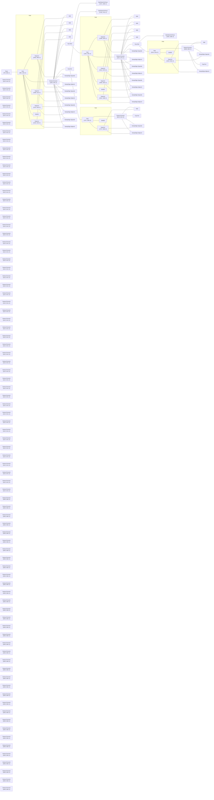

```mermaid
flowchart LR
  subgraph path2 [Path]
    2["Path<br>[995, 1049, 0]"]
    3["Segment<br>[1055, 1082, 0]"]
    4["Segment<br>[1088, 1116, 0]"]
    5["Segment<br>[1122, 1150, 0]"]
    6["Segment<br>[1156, 1163, 0]"]
    7[Solid2d]
  end
  subgraph path23 [Path]
    23["Path<br>[1405, 1492, 0]"]
    24["Segment<br>[1498, 1535, 0]"]
    25["Segment<br>[1541, 1579, 0]"]
    26["Segment<br>[1585, 1625, 0]"]
    27["Segment<br>[1631, 1638, 0]"]
    28[Solid2d]
  end
  subgraph path43 [Path]
    43["Path<br>[1757, 1903, 0]"]
    44["Segment<br>[1757, 1903, 0]"]
    45[Solid2d]
  end
  subgraph path100 [Path]
    100["Path<br>[2244, 2418, 0]"]
    101["Segment<br>[2244, 2418, 0]"]
    102[Solid2d]
  end
  1["Plane<br>[970, 989, 0]"]
  8["Sweep Extrusion<br>[1169, 1193, 0]"]
  9[Wall]
  10[Wall]
  11[Wall]
  12[Wall]
  13["Cap Start"]
  14["Cap End"]
  15["SweepEdge Opposite"]
  16["SweepEdge Adjacent"]
  17["SweepEdge Opposite"]
  18["SweepEdge Adjacent"]
  19["SweepEdge Opposite"]
  20["SweepEdge Adjacent"]
  21["SweepEdge Opposite"]
  22["SweepEdge Adjacent"]
  29["Sweep Extrusion<br>[1644, 1675, 0]"]
  30[Wall]
  31[Wall]
  32[Wall]
  33[Wall]
  34["Cap Start"]
  35["SweepEdge Opposite"]
  36["SweepEdge Adjacent"]
  37["SweepEdge Opposite"]
  38["SweepEdge Adjacent"]
  39["SweepEdge Opposite"]
  40["SweepEdge Adjacent"]
  41["SweepEdge Opposite"]
  42["SweepEdge Adjacent"]
  46["Sweep Extrusion<br>[2113, 2141, 0]"]
  47[Wall]
  48["Cap End"]
  49["SweepEdge Opposite"]
  50["SweepEdge Adjacent"]
  51["Sweep Extrusion<br>[2113, 2141, 0]"]
  52["Sweep Extrusion<br>[2113, 2141, 0]"]
  53["Sweep Extrusion<br>[2113, 2141, 0]"]
  54["Sweep Extrusion<br>[2113, 2141, 0]"]
  55["Sweep Extrusion<br>[2113, 2141, 0]"]
  56["Sweep Extrusion<br>[2113, 2141, 0]"]
  57["Sweep Extrusion<br>[2113, 2141, 0]"]
  58["Sweep Extrusion<br>[2113, 2141, 0]"]
  59["Sweep Extrusion<br>[2113, 2141, 0]"]
  60["Sweep Extrusion<br>[2113, 2141, 0]"]
  61["Sweep Extrusion<br>[2113, 2141, 0]"]
  62["Sweep Extrusion<br>[2113, 2141, 0]"]
  63["Sweep Extrusion<br>[2113, 2141, 0]"]
  64["Sweep Extrusion<br>[2113, 2141, 0]"]
  65["Sweep Extrusion<br>[2113, 2141, 0]"]
  66["Sweep Extrusion<br>[2113, 2141, 0]"]
  67["Sweep Extrusion<br>[2113, 2141, 0]"]
  68["Sweep Extrusion<br>[2113, 2141, 0]"]
  69["Sweep Extrusion<br>[2113, 2141, 0]"]
  70["Sweep Extrusion<br>[2113, 2141, 0]"]
  71["Sweep Extrusion<br>[2113, 2141, 0]"]
  72["Sweep Extrusion<br>[2113, 2141, 0]"]
  73["Sweep Extrusion<br>[2113, 2141, 0]"]
  74["Sweep Extrusion<br>[2113, 2141, 0]"]
  75["Sweep Extrusion<br>[2113, 2141, 0]"]
  76["Sweep Extrusion<br>[2113, 2141, 0]"]
  77["Sweep Extrusion<br>[2113, 2141, 0]"]
  78["Sweep Extrusion<br>[2113, 2141, 0]"]
  79["Sweep Extrusion<br>[2113, 2141, 0]"]
  80["Sweep Extrusion<br>[2113, 2141, 0]"]
  81["Sweep Extrusion<br>[2113, 2141, 0]"]
  82["Sweep Extrusion<br>[2113, 2141, 0]"]
  83["Sweep Extrusion<br>[2113, 2141, 0]"]
  84["Sweep Extrusion<br>[2113, 2141, 0]"]
  85["Sweep Extrusion<br>[2113, 2141, 0]"]
  86["Sweep Extrusion<br>[2113, 2141, 0]"]
  87["Sweep Extrusion<br>[2113, 2141, 0]"]
  88["Sweep Extrusion<br>[2113, 2141, 0]"]
  89["Sweep Extrusion<br>[2113, 2141, 0]"]
  90["Sweep Extrusion<br>[2113, 2141, 0]"]
  91["Sweep Extrusion<br>[2113, 2141, 0]"]
  92["Sweep Extrusion<br>[2113, 2141, 0]"]
  93["Sweep Extrusion<br>[2113, 2141, 0]"]
  94["Sweep Extrusion<br>[2113, 2141, 0]"]
  95["Sweep Extrusion<br>[2113, 2141, 0]"]
  96["Sweep Extrusion<br>[2113, 2141, 0]"]
  97["Sweep Extrusion<br>[2113, 2141, 0]"]
  98["Sweep Extrusion<br>[2113, 2141, 0]"]
  99["Sweep Extrusion<br>[2113, 2141, 0]"]
  103["Sweep Extrusion<br>[2636, 2664, 0]"]
  104[Wall]
  105["Cap End"]
  106["SweepEdge Opposite"]
  107["SweepEdge Adjacent"]
  108["Sweep Extrusion<br>[2636, 2664, 0]"]
  109["Sweep Extrusion<br>[2636, 2664, 0]"]
  110["Sweep Extrusion<br>[2636, 2664, 0]"]
  111["Sweep Extrusion<br>[2636, 2664, 0]"]
  112["Sweep Extrusion<br>[2636, 2664, 0]"]
  113["Sweep Extrusion<br>[2636, 2664, 0]"]
  114["Sweep Extrusion<br>[2636, 2664, 0]"]
  115["Sweep Extrusion<br>[2636, 2664, 0]"]
  116["Sweep Extrusion<br>[2636, 2664, 0]"]
  117["Sweep Extrusion<br>[2636, 2664, 0]"]
  118["Sweep Extrusion<br>[2636, 2664, 0]"]
  119["Sweep Extrusion<br>[2636, 2664, 0]"]
  120["Sweep Extrusion<br>[2636, 2664, 0]"]
  121["Sweep Extrusion<br>[2636, 2664, 0]"]
  122["Sweep Extrusion<br>[2636, 2664, 0]"]
  123["Sweep Extrusion<br>[2636, 2664, 0]"]
  124["Sweep Extrusion<br>[2636, 2664, 0]"]
  125["Sweep Extrusion<br>[2636, 2664, 0]"]
  126["Sweep Extrusion<br>[2636, 2664, 0]"]
  127["Sweep Extrusion<br>[2636, 2664, 0]"]
  128["Sweep Extrusion<br>[2636, 2664, 0]"]
  129["Sweep Extrusion<br>[2636, 2664, 0]"]
  130["Sweep Extrusion<br>[2636, 2664, 0]"]
  131["Sweep Extrusion<br>[2636, 2664, 0]"]
  132["Sweep Extrusion<br>[2636, 2664, 0]"]
  133["Sweep Extrusion<br>[2636, 2664, 0]"]
  134["Sweep Extrusion<br>[2636, 2664, 0]"]
  135["Sweep Extrusion<br>[2636, 2664, 0]"]
  136["Sweep Extrusion<br>[2636, 2664, 0]"]
  137["Sweep Extrusion<br>[2636, 2664, 0]"]
  138["Sweep Extrusion<br>[2636, 2664, 0]"]
  139["Sweep Extrusion<br>[2636, 2664, 0]"]
  140["Sweep Extrusion<br>[2636, 2664, 0]"]
  141["Sweep Extrusion<br>[2636, 2664, 0]"]
  142["Sweep Extrusion<br>[2636, 2664, 0]"]
  143["StartSketchOnFace<br>[1371, 1399, 0]"]
  144["StartSketchOnFace<br>[1725, 1751, 0]"]
  145["StartSketchOnFace<br>[2202, 2238, 0]"]
  1 --- 2
  2 --- 3
  2 --- 4
  2 --- 5
  2 --- 6
  2 ---- 8
  2 --- 7
  3 --- 9
  3 --- 15
  3 --- 16
  4 --- 10
  4 --- 17
  4 --- 18
  5 --- 11
  5 --- 19
  5 --- 20
  6 --- 12
  6 --- 21
  6 --- 22
  8 --- 9
  8 --- 10
  8 --- 11
  8 --- 12
  8 --- 13
  8 --- 14
  8 --- 15
  8 --- 16
  8 --- 17
  8 --- 18
  8 --- 19
  8 --- 20
  8 --- 21
  8 --- 22
  13 --- 23
  14 --- 43
  23 --- 24
  23 --- 25
  23 --- 26
  23 --- 27
  23 ---- 29
  23 --- 28
  24 --- 30
  24 --- 35
  24 --- 36
  25 --- 31
  25 --- 37
  25 --- 38
  26 --- 32
  26 --- 39
  26 --- 40
  27 --- 33
  27 --- 41
  27 --- 42
  29 --- 30
  29 --- 31
  29 --- 32
  29 --- 33
  29 --- 34
  29 --- 35
  29 --- 36
  29 --- 37
  29 --- 38
  29 --- 39
  29 --- 40
  29 --- 41
  29 --- 42
  34 --- 100
  43 --- 44
  43 ---- 46
  43 --- 45
  44 --- 47
  44 --- 49
  44 --- 50
  46 --- 47
  46 --- 48
  46 --- 49
  46 --- 50
  100 --- 101
  100 ---- 103
  100 --- 102
  101 --- 104
  101 --- 106
  101 --- 107
  103 --- 104
  103 --- 105
  103 --- 106
  103 --- 107
  13 <--x 143
  14 <--x 144
  34 <--x 145
```
