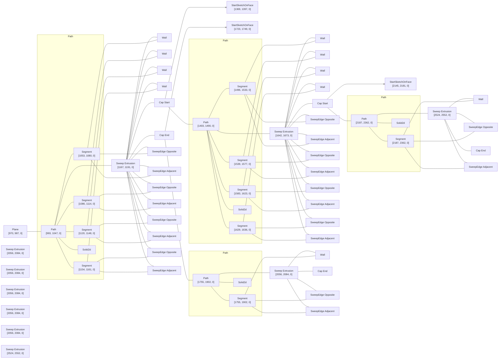

```mermaid
flowchart LR
  subgraph path2 [Path]
    2["Path<br>[993, 1047, 0]"]
    3["Segment<br>[1053, 1080, 0]"]
    4["Segment<br>[1086, 1114, 0]"]
    5["Segment<br>[1120, 1148, 0]"]
    6["Segment<br>[1154, 1161, 0]"]
    7[Solid2d]
  end
  subgraph path23 [Path]
    23["Path<br>[1403, 1490, 0]"]
    24["Segment<br>[1496, 1533, 0]"]
    25["Segment<br>[1539, 1577, 0]"]
    26["Segment<br>[1583, 1623, 0]"]
    27["Segment<br>[1629, 1636, 0]"]
    28[Solid2d]
  end
  subgraph path43 [Path]
    43["Path<br>[1755, 1902, 0]"]
    44["Segment<br>[1755, 1902, 0]"]
    45[Solid2d]
  end
  subgraph path56 [Path]
    56["Path<br>[2187, 2362, 0]"]
    57["Segment<br>[2187, 2362, 0]"]
    58[Solid2d]
  end
  1["Plane<br>[970, 987, 0]"]
  8["Sweep Extrusion<br>[1167, 1191, 0]"]
  9[Wall]
  10[Wall]
  11[Wall]
  12[Wall]
  13["Cap Start"]
  14["Cap End"]
  15["SweepEdge Opposite"]
  16["SweepEdge Adjacent"]
  17["SweepEdge Opposite"]
  18["SweepEdge Adjacent"]
  19["SweepEdge Opposite"]
  20["SweepEdge Adjacent"]
  21["SweepEdge Opposite"]
  22["SweepEdge Adjacent"]
  29["Sweep Extrusion<br>[1642, 1673, 0]"]
  30[Wall]
  31[Wall]
  32[Wall]
  33[Wall]
  34["Cap Start"]
  35["SweepEdge Opposite"]
  36["SweepEdge Adjacent"]
  37["SweepEdge Opposite"]
  38["SweepEdge Adjacent"]
  39["SweepEdge Opposite"]
  40["SweepEdge Adjacent"]
  41["SweepEdge Opposite"]
  42["SweepEdge Adjacent"]
  46["Sweep Extrusion<br>[2056, 2084, 0]"]
  47[Wall]
  48["Cap End"]
  49["SweepEdge Opposite"]
  50["SweepEdge Adjacent"]
  51["Sweep Extrusion<br>[2056, 2084, 0]"]
  52["Sweep Extrusion<br>[2056, 2084, 0]"]
  53["Sweep Extrusion<br>[2056, 2084, 0]"]
  54["Sweep Extrusion<br>[2056, 2084, 0]"]
  55["Sweep Extrusion<br>[2056, 2084, 0]"]
  59["Sweep Extrusion<br>[2524, 2552, 0]"]
  60[Wall]
  61["Cap End"]
  62["SweepEdge Opposite"]
  63["SweepEdge Adjacent"]
  64["Sweep Extrusion<br>[2524, 2552, 0]"]
  65["StartSketchOnFace<br>[1369, 1397, 0]"]
  66["StartSketchOnFace<br>[1723, 1749, 0]"]
  67["StartSketchOnFace<br>[2145, 2181, 0]"]
  1 --- 2
  2 --- 3
  2 --- 4
  2 --- 5
  2 --- 6
  2 ---- 8
  2 --- 7
  3 --- 9
  3 --- 15
  3 --- 16
  4 --- 10
  4 --- 17
  4 --- 18
  5 --- 11
  5 --- 19
  5 --- 20
  6 --- 12
  6 --- 21
  6 --- 22
  8 --- 9
  8 --- 10
  8 --- 11
  8 --- 12
  8 --- 13
  8 --- 14
  8 --- 15
  8 --- 16
  8 --- 17
  8 --- 18
  8 --- 19
  8 --- 20
  8 --- 21
  8 --- 22
  13 --- 23
  14 --- 43
  23 --- 24
  23 --- 25
  23 --- 26
  23 --- 27
  23 ---- 29
  23 --- 28
  24 --- 30
  24 --- 35
  24 --- 36
  25 --- 31
  25 --- 37
  25 --- 38
  26 --- 32
  26 --- 39
  26 --- 40
  27 --- 33
  27 --- 41
  27 --- 42
  29 --- 30
  29 --- 31
  29 --- 32
  29 --- 33
  29 --- 34
  29 --- 35
  29 --- 36
  29 --- 37
  29 --- 38
  29 --- 39
  29 --- 40
  29 --- 41
  29 --- 42
  34 --- 56
  43 --- 44
  43 ---- 46
  43 --- 45
  44 --- 47
  44 --- 49
  44 --- 50
  46 --- 47
  46 --- 48
  46 --- 49
  46 --- 50
  56 --- 57
  56 ---- 59
  56 --- 58
  57 --- 60
  57 --- 62
  57 --- 63
  59 --- 60
  59 --- 61
  59 --- 62
  59 --- 63
  13 <--x 65
  14 <--x 66
  34 <--x 67
```
