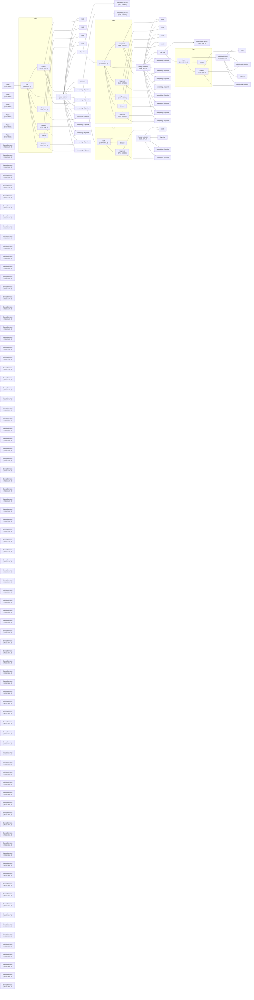

```mermaid
flowchart LR
  subgraph path7 [Path]
    7["Path<br>[995, 1049, 0]"]
    8["Segment<br>[1055, 1082, 0]"]
    9["Segment<br>[1088, 1116, 0]"]
    10["Segment<br>[1122, 1150, 0]"]
    11["Segment<br>[1156, 1163, 0]"]
    12[Solid2d]
  end
  subgraph path28 [Path]
    28["Path<br>[1405, 1492, 0]"]
    29["Segment<br>[1498, 1535, 0]"]
    30["Segment<br>[1541, 1579, 0]"]
    31["Segment<br>[1585, 1625, 0]"]
    32["Segment<br>[1631, 1638, 0]"]
    33[Solid2d]
  end
  subgraph path48 [Path]
    48["Path<br>[1757, 1903, 0]"]
    49["Segment<br>[1757, 1903, 0]"]
    50[Solid2d]
  end
  subgraph path105 [Path]
    105["Path<br>[2244, 2418, 0]"]
    106["Segment<br>[2244, 2418, 0]"]
    107[Solid2d]
  end
  1["Plane<br>[970, 989, 0]"]
  2["Plane<br>[970, 989, 0]"]
  3["Plane<br>[970, 989, 0]"]
  4["Plane<br>[970, 989, 0]"]
  5["Plane<br>[970, 989, 0]"]
  6["Plane<br>[970, 989, 0]"]
  13["Sweep Extrusion<br>[1169, 1193, 0]"]
  14[Wall]
  15[Wall]
  16[Wall]
  17[Wall]
  18["Cap Start"]
  19["Cap End"]
  20["SweepEdge Opposite"]
  21["SweepEdge Adjacent"]
  22["SweepEdge Opposite"]
  23["SweepEdge Adjacent"]
  24["SweepEdge Opposite"]
  25["SweepEdge Adjacent"]
  26["SweepEdge Opposite"]
  27["SweepEdge Adjacent"]
  34["Sweep Extrusion<br>[1644, 1675, 0]"]
  35[Wall]
  36[Wall]
  37[Wall]
  38[Wall]
  39["Cap Start"]
  40["SweepEdge Opposite"]
  41["SweepEdge Adjacent"]
  42["SweepEdge Opposite"]
  43["SweepEdge Adjacent"]
  44["SweepEdge Opposite"]
  45["SweepEdge Adjacent"]
  46["SweepEdge Opposite"]
  47["SweepEdge Adjacent"]
  51["Sweep Extrusion<br>[2113, 2141, 0]"]
  52[Wall]
  53["Cap End"]
  54["SweepEdge Opposite"]
  55["SweepEdge Adjacent"]
  56["Sweep Extrusion<br>[2113, 2141, 0]"]
  57["Sweep Extrusion<br>[2113, 2141, 0]"]
  58["Sweep Extrusion<br>[2113, 2141, 0]"]
  59["Sweep Extrusion<br>[2113, 2141, 0]"]
  60["Sweep Extrusion<br>[2113, 2141, 0]"]
  61["Sweep Extrusion<br>[2113, 2141, 0]"]
  62["Sweep Extrusion<br>[2113, 2141, 0]"]
  63["Sweep Extrusion<br>[2113, 2141, 0]"]
  64["Sweep Extrusion<br>[2113, 2141, 0]"]
  65["Sweep Extrusion<br>[2113, 2141, 0]"]
  66["Sweep Extrusion<br>[2113, 2141, 0]"]
  67["Sweep Extrusion<br>[2113, 2141, 0]"]
  68["Sweep Extrusion<br>[2113, 2141, 0]"]
  69["Sweep Extrusion<br>[2113, 2141, 0]"]
  70["Sweep Extrusion<br>[2113, 2141, 0]"]
  71["Sweep Extrusion<br>[2113, 2141, 0]"]
  72["Sweep Extrusion<br>[2113, 2141, 0]"]
  73["Sweep Extrusion<br>[2113, 2141, 0]"]
  74["Sweep Extrusion<br>[2113, 2141, 0]"]
  75["Sweep Extrusion<br>[2113, 2141, 0]"]
  76["Sweep Extrusion<br>[2113, 2141, 0]"]
  77["Sweep Extrusion<br>[2113, 2141, 0]"]
  78["Sweep Extrusion<br>[2113, 2141, 0]"]
  79["Sweep Extrusion<br>[2113, 2141, 0]"]
  80["Sweep Extrusion<br>[2113, 2141, 0]"]
  81["Sweep Extrusion<br>[2113, 2141, 0]"]
  82["Sweep Extrusion<br>[2113, 2141, 0]"]
  83["Sweep Extrusion<br>[2113, 2141, 0]"]
  84["Sweep Extrusion<br>[2113, 2141, 0]"]
  85["Sweep Extrusion<br>[2113, 2141, 0]"]
  86["Sweep Extrusion<br>[2113, 2141, 0]"]
  87["Sweep Extrusion<br>[2113, 2141, 0]"]
  88["Sweep Extrusion<br>[2113, 2141, 0]"]
  89["Sweep Extrusion<br>[2113, 2141, 0]"]
  90["Sweep Extrusion<br>[2113, 2141, 0]"]
  91["Sweep Extrusion<br>[2113, 2141, 0]"]
  92["Sweep Extrusion<br>[2113, 2141, 0]"]
  93["Sweep Extrusion<br>[2113, 2141, 0]"]
  94["Sweep Extrusion<br>[2113, 2141, 0]"]
  95["Sweep Extrusion<br>[2113, 2141, 0]"]
  96["Sweep Extrusion<br>[2113, 2141, 0]"]
  97["Sweep Extrusion<br>[2113, 2141, 0]"]
  98["Sweep Extrusion<br>[2113, 2141, 0]"]
  99["Sweep Extrusion<br>[2113, 2141, 0]"]
  100["Sweep Extrusion<br>[2113, 2141, 0]"]
  101["Sweep Extrusion<br>[2113, 2141, 0]"]
  102["Sweep Extrusion<br>[2113, 2141, 0]"]
  103["Sweep Extrusion<br>[2113, 2141, 0]"]
  104["Sweep Extrusion<br>[2113, 2141, 0]"]
  108["Sweep Extrusion<br>[2636, 2664, 0]"]
  109[Wall]
  110["Cap End"]
  111["SweepEdge Opposite"]
  112["SweepEdge Adjacent"]
  113["Sweep Extrusion<br>[2636, 2664, 0]"]
  114["Sweep Extrusion<br>[2636, 2664, 0]"]
  115["Sweep Extrusion<br>[2636, 2664, 0]"]
  116["Sweep Extrusion<br>[2636, 2664, 0]"]
  117["Sweep Extrusion<br>[2636, 2664, 0]"]
  118["Sweep Extrusion<br>[2636, 2664, 0]"]
  119["Sweep Extrusion<br>[2636, 2664, 0]"]
  120["Sweep Extrusion<br>[2636, 2664, 0]"]
  121["Sweep Extrusion<br>[2636, 2664, 0]"]
  122["Sweep Extrusion<br>[2636, 2664, 0]"]
  123["Sweep Extrusion<br>[2636, 2664, 0]"]
  124["Sweep Extrusion<br>[2636, 2664, 0]"]
  125["Sweep Extrusion<br>[2636, 2664, 0]"]
  126["Sweep Extrusion<br>[2636, 2664, 0]"]
  127["Sweep Extrusion<br>[2636, 2664, 0]"]
  128["Sweep Extrusion<br>[2636, 2664, 0]"]
  129["Sweep Extrusion<br>[2636, 2664, 0]"]
  130["Sweep Extrusion<br>[2636, 2664, 0]"]
  131["Sweep Extrusion<br>[2636, 2664, 0]"]
  132["Sweep Extrusion<br>[2636, 2664, 0]"]
  133["Sweep Extrusion<br>[2636, 2664, 0]"]
  134["Sweep Extrusion<br>[2636, 2664, 0]"]
  135["Sweep Extrusion<br>[2636, 2664, 0]"]
  136["Sweep Extrusion<br>[2636, 2664, 0]"]
  137["Sweep Extrusion<br>[2636, 2664, 0]"]
  138["Sweep Extrusion<br>[2636, 2664, 0]"]
  139["Sweep Extrusion<br>[2636, 2664, 0]"]
  140["Sweep Extrusion<br>[2636, 2664, 0]"]
  141["Sweep Extrusion<br>[2636, 2664, 0]"]
  142["Sweep Extrusion<br>[2636, 2664, 0]"]
  143["Sweep Extrusion<br>[2636, 2664, 0]"]
  144["Sweep Extrusion<br>[2636, 2664, 0]"]
  145["Sweep Extrusion<br>[2636, 2664, 0]"]
  146["Sweep Extrusion<br>[2636, 2664, 0]"]
  147["Sweep Extrusion<br>[2636, 2664, 0]"]
  148["StartSketchOnFace<br>[1371, 1399, 0]"]
  149["StartSketchOnFace<br>[1725, 1751, 0]"]
  150["StartSketchOnFace<br>[2202, 2238, 0]"]
  1 --- 7
  7 --- 8
  7 --- 9
  7 --- 10
  7 --- 11
  7 ---- 13
  7 --- 12
  8 --- 14
  8 --- 20
  8 --- 21
  9 --- 15
  9 --- 22
  9 --- 23
  10 --- 16
  10 --- 24
  10 --- 25
  11 --- 17
  11 --- 26
  11 --- 27
  13 --- 14
  13 --- 15
  13 --- 16
  13 --- 17
  13 --- 18
  13 --- 19
  13 --- 20
  13 --- 21
  13 --- 22
  13 --- 23
  13 --- 24
  13 --- 25
  13 --- 26
  13 --- 27
  18 --- 28
  19 --- 48
  28 --- 29
  28 --- 30
  28 --- 31
  28 --- 32
  28 ---- 34
  28 --- 33
  29 --- 35
  29 --- 40
  29 --- 41
  30 --- 36
  30 --- 42
  30 --- 43
  31 --- 37
  31 --- 44
  31 --- 45
  32 --- 38
  32 --- 46
  32 --- 47
  34 --- 35
  34 --- 36
  34 --- 37
  34 --- 38
  34 --- 39
  34 --- 40
  34 --- 41
  34 --- 42
  34 --- 43
  34 --- 44
  34 --- 45
  34 --- 46
  34 --- 47
  39 --- 105
  48 --- 49
  48 ---- 51
  48 --- 50
  49 --- 52
  49 --- 54
  49 --- 55
  51 --- 52
  51 --- 53
  51 --- 54
  51 --- 55
  105 --- 106
  105 ---- 108
  105 --- 107
  106 --- 109
  106 --- 111
  106 --- 112
  108 --- 109
  108 --- 110
  108 --- 111
  108 --- 112
  18 <--x 148
  19 <--x 149
  39 <--x 150
```
