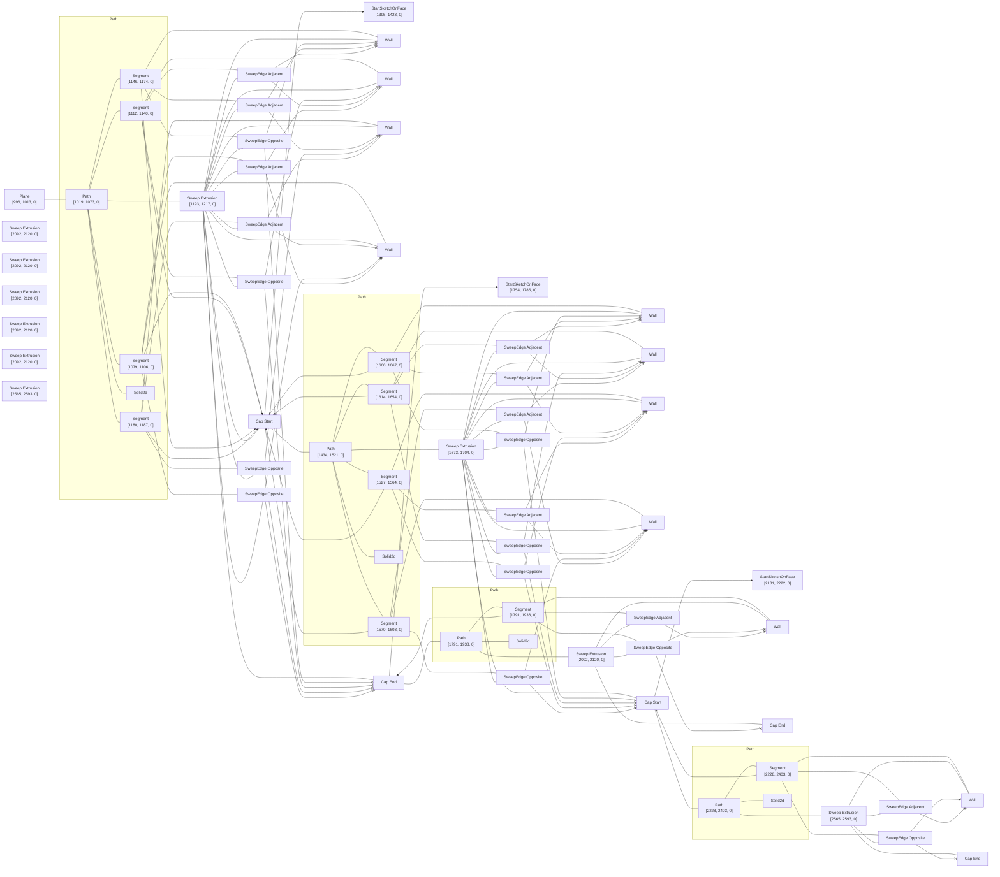

```mermaid
flowchart LR
  subgraph path5 [Path]
    5["Path<br>[1019, 1073, 0]"]
    9["Segment<br>[1079, 1106, 0]"]
    10["Segment<br>[1112, 1140, 0]"]
    11["Segment<br>[1146, 1174, 0]"]
    12["Segment<br>[1180, 1187, 0]"]
    20[Solid2d]
  end
  subgraph path6 [Path]
    6["Path<br>[1434, 1521, 0]"]
    13["Segment<br>[1527, 1564, 0]"]
    14["Segment<br>[1570, 1608, 0]"]
    15["Segment<br>[1614, 1654, 0]"]
    16["Segment<br>[1660, 1667, 0]"]
    19[Solid2d]
  end
  subgraph path7 [Path]
    7["Path<br>[1791, 1938, 0]"]
    17["Segment<br>[1791, 1938, 0]"]
    21[Solid2d]
  end
  subgraph path8 [Path]
    8["Path<br>[2228, 2403, 0]"]
    18["Segment<br>[2228, 2403, 0]"]
    22[Solid2d]
  end
  1["Plane<br>[996, 1013, 0]"]
  2["StartSketchOnFace<br>[1754, 1785, 0]"]
  3["StartSketchOnFace<br>[2181, 2222, 0]"]
  4["StartSketchOnFace<br>[1395, 1428, 0]"]
  23["Sweep Extrusion<br>[1193, 1217, 0]"]
  24["Sweep Extrusion<br>[1673, 1704, 0]"]
  25["Sweep Extrusion<br>[2092, 2120, 0]"]
  26["Sweep Extrusion<br>[2092, 2120, 0]"]
  27["Sweep Extrusion<br>[2092, 2120, 0]"]
  28["Sweep Extrusion<br>[2092, 2120, 0]"]
  29["Sweep Extrusion<br>[2092, 2120, 0]"]
  30["Sweep Extrusion<br>[2092, 2120, 0]"]
  31["Sweep Extrusion<br>[2565, 2593, 0]"]
  32["Sweep Extrusion<br>[2565, 2593, 0]"]
  33[Wall]
  34[Wall]
  35[Wall]
  36[Wall]
  37[Wall]
  38[Wall]
  39[Wall]
  40[Wall]
  41[Wall]
  42[Wall]
  43["Cap End"]
  44["Cap End"]
  45["Cap Start"]
  46["Cap End"]
  47["Cap Start"]
  48["SweepEdge Opposite"]
  49["SweepEdge Adjacent"]
  50["SweepEdge Opposite"]
  51["SweepEdge Adjacent"]
  52["SweepEdge Opposite"]
  53["SweepEdge Adjacent"]
  54["SweepEdge Opposite"]
  55["SweepEdge Adjacent"]
  56["SweepEdge Opposite"]
  57["SweepEdge Adjacent"]
  58["SweepEdge Opposite"]
  59["SweepEdge Adjacent"]
  60["SweepEdge Opposite"]
  61["SweepEdge Adjacent"]
  62["SweepEdge Opposite"]
  63["SweepEdge Adjacent"]
  64["SweepEdge Opposite"]
  65["SweepEdge Adjacent"]
  66["SweepEdge Opposite"]
  67["SweepEdge Adjacent"]
  1 --- 5
  46 x--> 2
  47 x--> 3
  45 x--> 4
  5 --- 9
  5 --- 10
  5 --- 11
  5 --- 12
  5 --- 20
  5 ---- 23
  6 --- 13
  6 --- 14
  6 --- 15
  6 --- 16
  6 --- 19
  6 ---- 24
  45 --- 6
  7 --- 17
  7 --- 21
  7 ---- 30
  46 --- 7
  8 --- 18
  8 --- 22
  8 ---- 31
  47 --- 8
  9 --- 36
  9 x--> 45
  9 --- 54
  9 --- 55
  10 --- 34
  10 x--> 45
  10 --- 50
  10 --- 51
  11 --- 33
  11 x--> 45
  11 --- 48
  11 --- 49
  12 --- 35
  12 x--> 45
  12 --- 52
  12 --- 53
  13 --- 39
  13 x--> 45
  13 --- 60
  13 --- 61
  14 --- 40
  14 x--> 45
  14 --- 62
  14 --- 63
  15 --- 38
  15 x--> 45
  15 --- 58
  15 --- 59
  16 --- 37
  16 x--> 45
  16 --- 56
  16 --- 57
  17 --- 42
  17 x--> 46
  17 --- 66
  17 --- 67
  18 --- 41
  18 x--> 47
  18 --- 64
  18 --- 65
  23 --- 33
  23 --- 34
  23 --- 35
  23 --- 36
  23 --- 45
  23 --- 46
  23 --- 48
  23 --- 49
  23 --- 50
  23 --- 51
  23 --- 52
  23 --- 53
  23 --- 54
  23 --- 55
  24 --- 37
  24 --- 38
  24 --- 39
  24 --- 40
  24 --- 47
  24 --- 56
  24 --- 57
  24 --- 58
  24 --- 59
  24 --- 60
  24 --- 61
  24 --- 62
  24 --- 63
  30 --- 42
  30 --- 43
  30 --- 66
  30 --- 67
  31 --- 41
  31 --- 44
  31 --- 64
  31 --- 65
  48 <--x 33
  49 <--x 33
  51 <--x 33
  50 <--x 34
  51 <--x 34
  55 <--x 34
  49 <--x 35
  52 <--x 35
  53 <--x 35
  53 <--x 36
  54 <--x 36
  55 <--x 36
  56 <--x 37
  57 <--x 37
  59 <--x 37
  58 <--x 38
  59 <--x 38
  63 <--x 38
  57 <--x 39
  60 <--x 39
  61 <--x 39
  61 <--x 40
  62 <--x 40
  63 <--x 40
  64 <--x 41
  65 <--x 41
  66 <--x 42
  67 <--x 42
  66 <--x 43
  64 <--x 44
  48 <--x 46
  50 <--x 46
  52 <--x 46
  54 <--x 46
  56 <--x 47
  58 <--x 47
  60 <--x 47
  62 <--x 47
```
