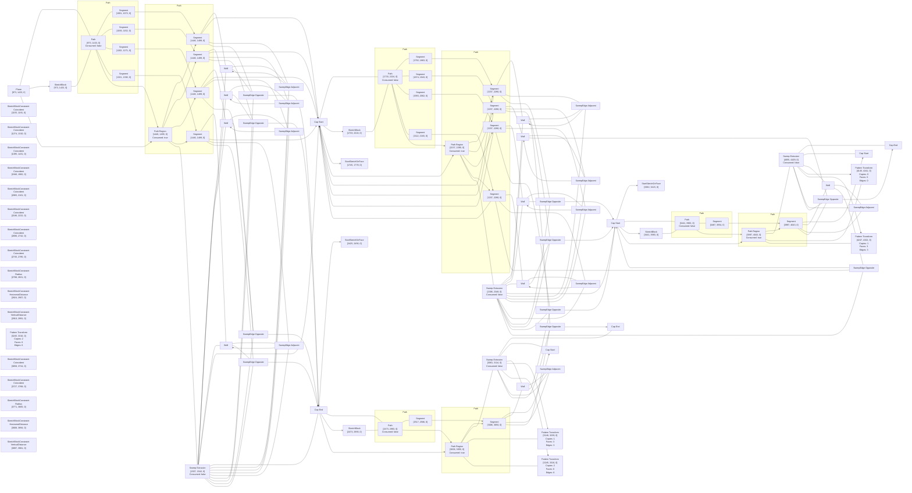

```mermaid
flowchart LR
  subgraph path15 [Path]
    15["Path<br>[973, 1433, 0]<br>Consumed: false"]
      %% [ProgramBodyItem { index: 17 }, VariableDeclarationDeclaration, VariableDeclarationInit]
    18["Segment<br>[1001, 1072, 0]"]
      %% [ProgramBodyItem { index: 17 }, VariableDeclarationDeclaration, VariableDeclarationInit, SketchBlockBody, SketchBlockBodyItem { index: 0 }, VariableDeclarationDeclaration, VariableDeclarationInit]
    19["Segment<br>[1083, 1152, 0]"]
      %% [ProgramBodyItem { index: 17 }, VariableDeclarationDeclaration, VariableDeclarationInit, SketchBlockBody, SketchBlockBodyItem { index: 1 }, VariableDeclarationDeclaration, VariableDeclarationInit]
    21["Segment<br>[1202, 1271, 0]"]
      %% [ProgramBodyItem { index: 17 }, VariableDeclarationDeclaration, VariableDeclarationInit, SketchBlockBody, SketchBlockBodyItem { index: 3 }, VariableDeclarationDeclaration, VariableDeclarationInit]
    23["Segment<br>[1321, 1392, 0]"]
      %% [ProgramBodyItem { index: 17 }, VariableDeclarationDeclaration, VariableDeclarationInit, SketchBlockBody, SketchBlockBodyItem { index: 5 }, VariableDeclarationDeclaration, VariableDeclarationInit]
  end
  subgraph path25 [Path]
    25["Path Region<br>[1446, 1499, 0]<br>Consumed: true"]
      %% [ProgramBodyItem { index: 18 }, VariableDeclarationDeclaration, VariableDeclarationInit]
    26["Segment<br>[1446, 1499, 0]"]
      %% [ProgramBodyItem { index: 18 }, VariableDeclarationDeclaration, VariableDeclarationInit]
    27["Segment<br>[1446, 1499, 0]"]
      %% [ProgramBodyItem { index: 18 }, VariableDeclarationDeclaration, VariableDeclarationInit]
    28["Segment<br>[1446, 1499, 0]"]
      %% [ProgramBodyItem { index: 18 }, VariableDeclarationDeclaration, VariableDeclarationInit]
    29["Segment<br>[1446, 1499, 0]"]
      %% [ProgramBodyItem { index: 18 }, VariableDeclarationDeclaration, VariableDeclarationInit]
  end
  subgraph path31 [Path]
    31["Path<br>[1733, 2224, 0]<br>Consumed: false"]
      %% [ProgramBodyItem { index: 21 }, VariableDeclarationDeclaration, VariableDeclarationInit]
    35["Segment<br>[1792, 1863, 0]"]
      %% [ProgramBodyItem { index: 21 }, VariableDeclarationDeclaration, VariableDeclarationInit, SketchBlockBody, SketchBlockBodyItem { index: 0 }, VariableDeclarationDeclaration, VariableDeclarationInit]
    36["Segment<br>[1874, 1943, 0]"]
      %% [ProgramBodyItem { index: 21 }, VariableDeclarationDeclaration, VariableDeclarationInit, SketchBlockBody, SketchBlockBodyItem { index: 1 }, VariableDeclarationDeclaration, VariableDeclarationInit]
    38["Segment<br>[1993, 2062, 0]"]
      %% [ProgramBodyItem { index: 21 }, VariableDeclarationDeclaration, VariableDeclarationInit, SketchBlockBody, SketchBlockBodyItem { index: 3 }, VariableDeclarationDeclaration, VariableDeclarationInit]
    40["Segment<br>[2112, 2183, 0]"]
      %% [ProgramBodyItem { index: 21 }, VariableDeclarationDeclaration, VariableDeclarationInit, SketchBlockBody, SketchBlockBodyItem { index: 5 }, VariableDeclarationDeclaration, VariableDeclarationInit]
  end
  subgraph path42 [Path]
    42["Path Region<br>[2237, 2290, 0]<br>Consumed: true"]
      %% [ProgramBodyItem { index: 22 }, VariableDeclarationDeclaration, VariableDeclarationInit]
    43["Segment<br>[2237, 2290, 0]"]
      %% [ProgramBodyItem { index: 22 }, VariableDeclarationDeclaration, VariableDeclarationInit]
    44["Segment<br>[2237, 2290, 0]"]
      %% [ProgramBodyItem { index: 22 }, VariableDeclarationDeclaration, VariableDeclarationInit]
    45["Segment<br>[2237, 2290, 0]"]
      %% [ProgramBodyItem { index: 22 }, VariableDeclarationDeclaration, VariableDeclarationInit]
    46["Segment<br>[2237, 2290, 0]"]
      %% [ProgramBodyItem { index: 22 }, VariableDeclarationDeclaration, VariableDeclarationInit]
  end
  subgraph path50 [Path]
    50["Path<br>[2473, 2993, 0]<br>Consumed: false"]
      %% [ProgramBodyItem { index: 26 }, VariableDeclarationDeclaration, VariableDeclarationInit]
    52["Segment<br>[2517, 2586, 0]"]
      %% [ProgramBodyItem { index: 26 }, VariableDeclarationDeclaration, VariableDeclarationInit, SketchBlockBody, SketchBlockBodyItem { index: 0 }, VariableDeclarationDeclaration, VariableDeclarationInit]
  end
  subgraph path58 [Path]
    58["Path Region<br>[3006, 3050, 0]<br>Consumed: true"]
      %% [ProgramBodyItem { index: 27 }, VariableDeclarationDeclaration, VariableDeclarationInit]
    59["Segment<br>[3006, 3050, 0]"]
      %% [ProgramBodyItem { index: 27 }, VariableDeclarationDeclaration, VariableDeclarationInit]
  end
  subgraph path66 [Path]
    66["Path<br>[3441, 3983, 0]<br>Consumed: false"]
      %% [ProgramBodyItem { index: 32 }, VariableDeclarationDeclaration, VariableDeclarationInit]
    68["Segment<br>[3487, 3554, 0]"]
      %% [ProgramBodyItem { index: 32 }, VariableDeclarationDeclaration, VariableDeclarationInit, SketchBlockBody, SketchBlockBodyItem { index: 0 }, VariableDeclarationDeclaration, VariableDeclarationInit]
  end
  subgraph path74 [Path]
    74["Path Region<br>[3997, 4043, 0]<br>Consumed: true"]
      %% [ProgramBodyItem { index: 33 }, VariableDeclarationDeclaration, VariableDeclarationInit]
    75["Segment<br>[3997, 4043, 0]"]
      %% [ProgramBodyItem { index: 33 }, VariableDeclarationDeclaration, VariableDeclarationInit]
  end
  1["Cap End"]
    %% face_code_ref=Missing NodePath
  2["Cap End"]
    %% face_code_ref=Missing NodePath
  3["Cap Start"]
    %% face_code_ref=Missing NodePath
  4["Cap Start"]
    %% face_code_ref=Missing NodePath
  5[Wall]
    %% face_code_ref=Missing NodePath
  6[Wall]
    %% face_code_ref=Missing NodePath
  7[Wall]
    %% face_code_ref=Missing NodePath
  8[Wall]
    %% face_code_ref=Missing NodePath
  9[Wall]
    %% face_code_ref=Missing NodePath
  10[Wall]
    %% face_code_ref=Missing NodePath
  11[Wall]
    %% face_code_ref=Missing NodePath
  12[Wall]
    %% face_code_ref=Missing NodePath
  13[Wall]
    %% face_code_ref=Missing NodePath
  14[Wall]
    %% face_code_ref=Missing NodePath
  16["Plane<br>[973, 1433, 0]"]
    %% [ProgramBodyItem { index: 17 }, VariableDeclarationDeclaration, VariableDeclarationInit]
  17["SketchBlock<br>[973, 1433, 0]"]
    %% [ProgramBodyItem { index: 17 }, VariableDeclarationDeclaration, VariableDeclarationInit]
  20["SketchBlockConstraint Coincident<br>[1155, 1191, 0]"]
    %% [ProgramBodyItem { index: 17 }, VariableDeclarationDeclaration, VariableDeclarationInit, SketchBlockBody, SketchBlockBodyItem { index: 2 }, ExpressionStatementExpr]
  22["SketchBlockConstraint Coincident<br>[1274, 1310, 0]"]
    %% [ProgramBodyItem { index: 17 }, VariableDeclarationDeclaration, VariableDeclarationInit, SketchBlockBody, SketchBlockBodyItem { index: 4 }, ExpressionStatementExpr]
  24["SketchBlockConstraint Coincident<br>[1395, 1431, 0]"]
    %% [ProgramBodyItem { index: 17 }, VariableDeclarationDeclaration, VariableDeclarationInit, SketchBlockBody, SketchBlockBodyItem { index: 6 }, ExpressionStatementExpr]
  30["Sweep Extrusion<br>[1507, 1542, 0]<br>Consumed: false"]
    %% [ProgramBodyItem { index: 19 }, VariableDeclarationDeclaration, VariableDeclarationInit]
  32["SketchBlock<br>[1733, 2224, 0]"]
    %% [ProgramBodyItem { index: 21 }, VariableDeclarationDeclaration, VariableDeclarationInit]
  33["Cap Start"]
    %% face_code_ref=[ProgramBodyItem { index: 21 }, VariableDeclarationDeclaration, VariableDeclarationInit, SketchBlockArgs]
  34["StartSketchOnFace<br>[1745, 1778, 0]"]
    %% [ProgramBodyItem { index: 21 }, VariableDeclarationDeclaration, VariableDeclarationInit, SketchBlockArgs]
  37["SketchBlockConstraint Coincident<br>[1946, 1982, 0]"]
    %% [ProgramBodyItem { index: 21 }, VariableDeclarationDeclaration, VariableDeclarationInit, SketchBlockBody, SketchBlockBodyItem { index: 2 }, ExpressionStatementExpr]
  39["SketchBlockConstraint Coincident<br>[2065, 2101, 0]"]
    %% [ProgramBodyItem { index: 21 }, VariableDeclarationDeclaration, VariableDeclarationInit, SketchBlockBody, SketchBlockBodyItem { index: 4 }, ExpressionStatementExpr]
  41["SketchBlockConstraint Coincident<br>[2186, 2222, 0]"]
    %% [ProgramBodyItem { index: 21 }, VariableDeclarationDeclaration, VariableDeclarationInit, SketchBlockBody, SketchBlockBodyItem { index: 6 }, ExpressionStatementExpr]
  47["Sweep Extrusion<br>[2306, 2348, 0]<br>Consumed: false"]
    %% [ProgramBodyItem { index: 23 }, VariableDeclarationDeclaration, VariableDeclarationInit]
  48["Cap End"]
    %% face_code_ref=[ProgramBodyItem { index: 25 }, VariableDeclarationDeclaration, VariableDeclarationInit]
  49["StartSketchOnFace<br>[2425, 2456, 0]"]
    %% [ProgramBodyItem { index: 25 }, VariableDeclarationDeclaration, VariableDeclarationInit]
  51["SketchBlock<br>[2473, 2993, 0]"]
    %% [ProgramBodyItem { index: 26 }, VariableDeclarationDeclaration, VariableDeclarationInit]
  53["SketchBlockConstraint Coincident<br>[2690, 2742, 0]"]
    %% [ProgramBodyItem { index: 26 }, VariableDeclarationDeclaration, VariableDeclarationInit, SketchBlockBody, SketchBlockBodyItem { index: 2 }, ExpressionStatementExpr]
  54["SketchBlockConstraint Coincident<br>[2745, 2785, 0]"]
    %% [ProgramBodyItem { index: 26 }, VariableDeclarationDeclaration, VariableDeclarationInit, SketchBlockBody, SketchBlockBodyItem { index: 3 }, ExpressionStatementExpr]
  55["SketchBlockConstraint Radius<br>[2788, 2821, 0]"]
    %% [ProgramBodyItem { index: 26 }, VariableDeclarationDeclaration, VariableDeclarationInit, SketchBlockBody, SketchBlockBodyItem { index: 4 }, ExpressionStatementExpr]
  56["SketchBlockConstraint HorizontalDistance<br>[2824, 2907, 0]"]
    %% [ProgramBodyItem { index: 26 }, VariableDeclarationDeclaration, VariableDeclarationInit, SketchBlockBody, SketchBlockBodyItem { index: 5 }, ExpressionStatementExpr]
  57["SketchBlockConstraint VerticalDistance<br>[2910, 2991, 0]"]
    %% [ProgramBodyItem { index: 26 }, VariableDeclarationDeclaration, VariableDeclarationInit, SketchBlockBody, SketchBlockBodyItem { index: 6 }, ExpressionStatementExpr]
  60["Sweep Extrusion<br>[3061, 3114, 0]<br>Consumed: false"]
    %% [ProgramBodyItem { index: 28 }, VariableDeclarationDeclaration, VariableDeclarationInit]
  61["Pattern Transform<br>[3148, 3239, 0]<br>Copies: 1<br>Faces: 3<br>Edges: 3"]
    %% [ProgramBodyItem { index: 30 }, VariableDeclarationDeclaration, VariableDeclarationInit, PipeBodyItem { index: 0 }]
  62["Pattern Transform<br>[3245, 3316, 0]<br>Copies: 2<br>Faces: 6<br>Edges: 6"]
    %% [ProgramBodyItem { index: 30 }, VariableDeclarationDeclaration, VariableDeclarationInit, PipeBodyItem { index: 1 }]
  63["Pattern Transform<br>[3245, 3316, 0]<br>Copies: 2<br>Faces: 6<br>Edges: 6"]
    %% [ProgramBodyItem { index: 30 }, VariableDeclarationDeclaration, VariableDeclarationInit, PipeBodyItem { index: 1 }]
  64["Cap Start"]
    %% face_code_ref=[ProgramBodyItem { index: 31 }, VariableDeclarationDeclaration, VariableDeclarationInit]
  65["StartSketchOnFace<br>[3382, 3423, 0]"]
    %% [ProgramBodyItem { index: 31 }, VariableDeclarationDeclaration, VariableDeclarationInit]
  67["SketchBlock<br>[3441, 3983, 0]"]
    %% [ProgramBodyItem { index: 32 }, VariableDeclarationDeclaration, VariableDeclarationInit]
  69["SketchBlockConstraint Coincident<br>[3658, 3724, 0]"]
    %% [ProgramBodyItem { index: 32 }, VariableDeclarationDeclaration, VariableDeclarationInit, SketchBlockBody, SketchBlockBodyItem { index: 2 }, ExpressionStatementExpr]
  70["SketchBlockConstraint Coincident<br>[3727, 3768, 0]"]
    %% [ProgramBodyItem { index: 32 }, VariableDeclarationDeclaration, VariableDeclarationInit, SketchBlockBody, SketchBlockBodyItem { index: 3 }, ExpressionStatementExpr]
  71["SketchBlockConstraint Radius<br>[3771, 3805, 0]"]
    %% [ProgramBodyItem { index: 32 }, VariableDeclarationDeclaration, VariableDeclarationInit, SketchBlockBody, SketchBlockBodyItem { index: 4 }, ExpressionStatementExpr]
  72["SketchBlockConstraint HorizontalDistance<br>[3808, 3894, 0]"]
    %% [ProgramBodyItem { index: 32 }, VariableDeclarationDeclaration, VariableDeclarationInit, SketchBlockBody, SketchBlockBodyItem { index: 5 }, ExpressionStatementExpr]
  73["SketchBlockConstraint VerticalDistance<br>[3897, 3981, 0]"]
    %% [ProgramBodyItem { index: 32 }, VariableDeclarationDeclaration, VariableDeclarationInit, SketchBlockBody, SketchBlockBodyItem { index: 6 }, ExpressionStatementExpr]
  76["Sweep Extrusion<br>[4055, 4109, 0]<br>Consumed: false"]
    %% [ProgramBodyItem { index: 34 }, VariableDeclarationDeclaration, VariableDeclarationInit]
  77["Pattern Transform<br>[4145, 4241, 0]<br>Copies: 0<br>Faces: 0<br>Edges: 0"]
    %% [ProgramBodyItem { index: 36 }, VariableDeclarationDeclaration, VariableDeclarationInit, PipeBodyItem { index: 0 }]
  78["Pattern Transform<br>[4247, 4322, 0]<br>Copies: 1<br>Faces: 3<br>Edges: 3"]
    %% [ProgramBodyItem { index: 36 }, VariableDeclarationDeclaration, VariableDeclarationInit, PipeBodyItem { index: 1 }]
  79["SweepEdge Adjacent"]
  80["SweepEdge Adjacent"]
  81["SweepEdge Adjacent"]
  82["SweepEdge Adjacent"]
  83["SweepEdge Adjacent"]
  84["SweepEdge Adjacent"]
  85["SweepEdge Adjacent"]
  86["SweepEdge Adjacent"]
  87["SweepEdge Adjacent"]
  88["SweepEdge Adjacent"]
  89["SweepEdge Opposite"]
  90["SweepEdge Opposite"]
  91["SweepEdge Opposite"]
  92["SweepEdge Opposite"]
  93["SweepEdge Opposite"]
  94["SweepEdge Opposite"]
  95["SweepEdge Opposite"]
  96["SweepEdge Opposite"]
  97["SweepEdge Opposite"]
  98["SweepEdge Opposite"]
  60 --- 1
  93 <--x 1
  76 --- 2
  94 <--x 2
  59 <--x 3
  60 --- 3
  75 <--x 4
  76 --- 4
  26 --- 5
  30 --- 5
  5 --- 79
  79 <--x 5
  5 --- 89
  27 --- 6
  30 --- 6
  6 --- 80
  80 <--x 6
  6 --- 90
  28 --- 7
  30 --- 7
  7 --- 81
  81 <--x 7
  7 --- 91
  29 --- 8
  30 --- 8
  8 --- 82
  82 <--x 8
  8 --- 92
  43 --- 9
  47 --- 9
  9 --- 83
  83 <--x 9
  9 --- 93
  44 --- 10
  47 --- 10
  10 --- 84
  84 <--x 10
  10 --- 94
  45 --- 11
  47 --- 11
  11 --- 85
  85 <--x 11
  11 --- 95
  46 --- 12
  47 --- 12
  12 --- 86
  86 <--x 12
  12 --- 96
  59 --- 13
  60 --- 13
  13 --- 87
  13 --- 97
  75 --- 14
  76 --- 14
  14 --- 88
  14 --- 98
  16 --- 15
  17 --- 15
  15 --- 18
  15 --- 19
  15 --- 21
  15 --- 23
  15 <--x 25
  16 <--x 17
  16 <--x 25
  18 <--x 26
  19 <--x 27
  21 <--x 28
  23 <--x 29
  25 <--x 26
  25 <--x 27
  25 <--x 28
  25 <--x 29
  25 ---- 30
  26 x--> 33
  26 --- 79
  26 --- 89
  27 x--> 33
  27 --- 80
  27 --- 90
  28 x--> 33
  28 --- 81
  28 --- 91
  29 x--> 33
  29 --- 82
  29 --- 92
  30 --- 33
  30 --- 48
  30 --- 79
  30 --- 80
  30 --- 81
  30 --- 82
  30 --- 89
  30 --- 90
  30 --- 91
  30 --- 92
  32 --- 31
  33 --- 31
  31 --- 35
  31 --- 36
  31 --- 38
  31 --- 40
  31 <--x 42
  33 x--> 32
  33 <--x 34
  33 <--x 42
  43 <--x 33
  44 <--x 33
  45 <--x 33
  46 <--x 33
  35 <--x 43
  36 <--x 44
  38 <--x 45
  40 <--x 46
  42 <--x 43
  42 <--x 44
  42 <--x 45
  42 <--x 46
  42 ---- 47
  43 --- 83
  43 --- 95
  44 --- 84
  44 --- 96
  45 --- 85
  45 --- 97
  46 --- 86
  46 --- 98
  47 --- 64
  47 --- 83
  47 --- 84
  47 --- 85
  47 --- 86
  47 --- 95
  47 --- 96
  47 --- 97
  47 --- 98
  48 <--x 49
  48 --- 50
  48 <--x 51
  48 <--x 58
  89 <--x 48
  90 <--x 48
  91 <--x 48
  92 <--x 48
  51 --- 50
  50 --- 52
  50 <--x 58
  52 <--x 59
  58 <--x 59
  58 ---- 60
  58 --- 61
  58 --- 63
  59 --- 87
  59 --- 93
  60 x--> 61
  60 x--> 63
  60 --- 87
  60 --- 93
  64 <--x 65
  64 --- 66
  64 <--x 67
  64 <--x 74
  95 <--x 64
  96 <--x 64
  97 <--x 64
  98 <--x 64
  67 --- 66
  66 --- 68
  66 <--x 74
  68 <--x 75
  74 <--x 75
  74 ---- 76
  74 --- 77
  74 --- 78
  75 --- 88
  75 --- 94
  76 x--> 77
  76 x--> 78
  76 --- 88
  76 --- 94
```
