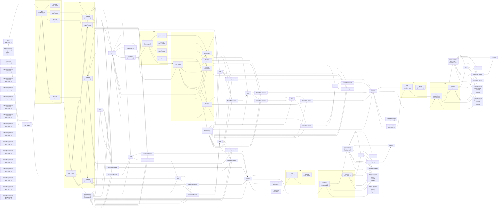

```mermaid
flowchart LR
  subgraph path2 [Path]
    2["Path<br>[1196, 1656, 0]<br>Consumed: false"]
      %% [ProgramBodyItem { index: 19 }, VariableDeclarationDeclaration, VariableDeclarationInit]
    3["Segment<br>[1224, 1295, 0]"]
      %% [ProgramBodyItem { index: 19 }, VariableDeclarationDeclaration, VariableDeclarationInit, SketchBlockBody, SketchBlockBodyItem { index: 0 }, VariableDeclarationDeclaration, VariableDeclarationInit]
    4["Segment<br>[1306, 1375, 0]"]
      %% [ProgramBodyItem { index: 19 }, VariableDeclarationDeclaration, VariableDeclarationInit, SketchBlockBody, SketchBlockBodyItem { index: 1 }, VariableDeclarationDeclaration, VariableDeclarationInit]
    5["Segment<br>[1425, 1494, 0]"]
      %% [ProgramBodyItem { index: 19 }, VariableDeclarationDeclaration, VariableDeclarationInit, SketchBlockBody, SketchBlockBodyItem { index: 3 }, VariableDeclarationDeclaration, VariableDeclarationInit]
    6["Segment<br>[1544, 1615, 0]"]
      %% [ProgramBodyItem { index: 19 }, VariableDeclarationDeclaration, VariableDeclarationInit, SketchBlockBody, SketchBlockBodyItem { index: 5 }, VariableDeclarationDeclaration, VariableDeclarationInit]
  end
  subgraph path7 [Path]
    7["Path Region<br>[1669, 1722, 0]<br>Consumed: true"]
      %% [ProgramBodyItem { index: 20 }, VariableDeclarationDeclaration, VariableDeclarationInit]
    8["Segment<br>[1669, 1722, 0]"]
      %% [ProgramBodyItem { index: 20 }, VariableDeclarationDeclaration, VariableDeclarationInit]
    9["Segment<br>[1669, 1722, 0]"]
      %% [ProgramBodyItem { index: 20 }, VariableDeclarationDeclaration, VariableDeclarationInit]
    10["Segment<br>[1669, 1722, 0]"]
      %% [ProgramBodyItem { index: 20 }, VariableDeclarationDeclaration, VariableDeclarationInit]
    11["Segment<br>[1669, 1722, 0]"]
      %% [ProgramBodyItem { index: 20 }, VariableDeclarationDeclaration, VariableDeclarationInit]
  end
  subgraph path27 [Path]
    27["Path<br>[1956, 2447, 0]<br>Consumed: false"]
      %% [ProgramBodyItem { index: 23 }, VariableDeclarationDeclaration, VariableDeclarationInit]
    28["Segment<br>[2015, 2086, 0]"]
      %% [ProgramBodyItem { index: 23 }, VariableDeclarationDeclaration, VariableDeclarationInit, SketchBlockBody, SketchBlockBodyItem { index: 0 }, VariableDeclarationDeclaration, VariableDeclarationInit]
    29["Segment<br>[2097, 2166, 0]"]
      %% [ProgramBodyItem { index: 23 }, VariableDeclarationDeclaration, VariableDeclarationInit, SketchBlockBody, SketchBlockBodyItem { index: 1 }, VariableDeclarationDeclaration, VariableDeclarationInit]
    30["Segment<br>[2216, 2285, 0]"]
      %% [ProgramBodyItem { index: 23 }, VariableDeclarationDeclaration, VariableDeclarationInit, SketchBlockBody, SketchBlockBodyItem { index: 3 }, VariableDeclarationDeclaration, VariableDeclarationInit]
    31["Segment<br>[2335, 2406, 0]"]
      %% [ProgramBodyItem { index: 23 }, VariableDeclarationDeclaration, VariableDeclarationInit, SketchBlockBody, SketchBlockBodyItem { index: 5 }, VariableDeclarationDeclaration, VariableDeclarationInit]
  end
  subgraph path32 [Path]
    32["Path Region<br>[2460, 2513, 0]<br>Consumed: true"]
      %% [ProgramBodyItem { index: 24 }, VariableDeclarationDeclaration, VariableDeclarationInit]
    33["Segment<br>[2460, 2513, 0]"]
      %% [ProgramBodyItem { index: 24 }, VariableDeclarationDeclaration, VariableDeclarationInit]
    34["Segment<br>[2460, 2513, 0]"]
      %% [ProgramBodyItem { index: 24 }, VariableDeclarationDeclaration, VariableDeclarationInit]
    35["Segment<br>[2460, 2513, 0]"]
      %% [ProgramBodyItem { index: 24 }, VariableDeclarationDeclaration, VariableDeclarationInit]
    36["Segment<br>[2460, 2513, 0]"]
      %% [ProgramBodyItem { index: 24 }, VariableDeclarationDeclaration, VariableDeclarationInit]
  end
  subgraph path51 [Path]
    51["Path<br>[2696, 3216, 0]<br>Consumed: false"]
      %% [ProgramBodyItem { index: 28 }, VariableDeclarationDeclaration, VariableDeclarationInit]
    52["Segment<br>[2740, 2809, 0]"]
      %% [ProgramBodyItem { index: 28 }, VariableDeclarationDeclaration, VariableDeclarationInit, SketchBlockBody, SketchBlockBodyItem { index: 0 }, VariableDeclarationDeclaration, VariableDeclarationInit]
  end
  subgraph path53 [Path]
    53["Path Region<br>[3229, 3273, 0]<br>Consumed: true"]
      %% [ProgramBodyItem { index: 29 }, VariableDeclarationDeclaration, VariableDeclarationInit]
    54["Segment<br>[3229, 3273, 0]"]
      %% [ProgramBodyItem { index: 29 }, VariableDeclarationDeclaration, VariableDeclarationInit]
  end
  subgraph path64 [Path]
    64["Path<br>[3664, 4206, 0]<br>Consumed: false"]
      %% [ProgramBodyItem { index: 34 }, VariableDeclarationDeclaration, VariableDeclarationInit]
    65["Segment<br>[3710, 3777, 0]"]
      %% [ProgramBodyItem { index: 34 }, VariableDeclarationDeclaration, VariableDeclarationInit, SketchBlockBody, SketchBlockBodyItem { index: 0 }, VariableDeclarationDeclaration, VariableDeclarationInit]
  end
  subgraph path66 [Path]
    66["Path Region<br>[4220, 4266, 0]<br>Consumed: true"]
      %% [ProgramBodyItem { index: 35 }, VariableDeclarationDeclaration, VariableDeclarationInit]
    67["Segment<br>[4220, 4266, 0]"]
      %% [ProgramBodyItem { index: 35 }, VariableDeclarationDeclaration, VariableDeclarationInit]
  end
  1["Plane<br>[1196, 1656, 0]"]
    %% [ProgramBodyItem { index: 19 }, VariableDeclarationDeclaration, VariableDeclarationInit]
  12["Sweep Extrusion<br>[1730, 1765, 0]<br>Consumed: false"]
    %% [ProgramBodyItem { index: 21 }, VariableDeclarationDeclaration, VariableDeclarationInit]
  13[Wall]
    %% face_code_ref=Missing NodePath
  14[Wall]
    %% face_code_ref=Missing NodePath
  15[Wall]
    %% face_code_ref=Missing NodePath
  16[Wall]
    %% face_code_ref=Missing NodePath
  17["Cap Start"]
    %% face_code_ref=[ProgramBodyItem { index: 23 }, VariableDeclarationDeclaration, VariableDeclarationInit, SketchBlockArgs]
  18["Cap End"]
    %% face_code_ref=[ProgramBodyItem { index: 27 }, VariableDeclarationDeclaration, VariableDeclarationInit]
  19["SweepEdge Opposite"]
  20["SweepEdge Adjacent"]
  21["SweepEdge Opposite"]
  22["SweepEdge Adjacent"]
  23["SweepEdge Opposite"]
  24["SweepEdge Adjacent"]
  25["SweepEdge Opposite"]
  26["SweepEdge Adjacent"]
  37["Sweep Extrusion<br>[2529, 2571, 0]<br>Consumed: false"]
    %% [ProgramBodyItem { index: 25 }, VariableDeclarationDeclaration, VariableDeclarationInit]
  38[Wall]
    %% face_code_ref=Missing NodePath
  39[Wall]
    %% face_code_ref=Missing NodePath
  40[Wall]
    %% face_code_ref=Missing NodePath
  41[Wall]
    %% face_code_ref=Missing NodePath
  42["Cap Start"]
    %% face_code_ref=[ProgramBodyItem { index: 33 }, VariableDeclarationDeclaration, VariableDeclarationInit]
  43["SweepEdge Opposite"]
  44["SweepEdge Adjacent"]
  45["SweepEdge Opposite"]
  46["SweepEdge Adjacent"]
  47["SweepEdge Opposite"]
  48["SweepEdge Adjacent"]
  49["SweepEdge Opposite"]
  50["SweepEdge Adjacent"]
  55["Sweep Extrusion<br>[3284, 3337, 0]<br>Consumed: false"]
    %% [ProgramBodyItem { index: 30 }, VariableDeclarationDeclaration, VariableDeclarationInit]
  56[Wall]
    %% face_code_ref=Missing NodePath
  57["Cap Start"]
    %% face_code_ref=Missing NodePath
  58["Cap End"]
    %% face_code_ref=Missing NodePath
  59["SweepEdge Opposite"]
  60["SweepEdge Adjacent"]
  61["Pattern Transform<br>[3371, 3462, 0]<br>Copies: 1<br>Faces: 3<br>Edges: 3"]
    %% [ProgramBodyItem { index: 32 }, VariableDeclarationDeclaration, VariableDeclarationInit, PipeBodyItem { index: 0 }]
  62["Pattern Transform<br>[3468, 3539, 0]<br>Copies: 2<br>Faces: 6<br>Edges: 6"]
    %% [ProgramBodyItem { index: 32 }, VariableDeclarationDeclaration, VariableDeclarationInit, PipeBodyItem { index: 1 }]
  63["Pattern Transform<br>[3468, 3539, 0]<br>Copies: 2<br>Faces: 6<br>Edges: 6"]
    %% [ProgramBodyItem { index: 32 }, VariableDeclarationDeclaration, VariableDeclarationInit, PipeBodyItem { index: 1 }]
  68["Sweep Extrusion<br>[4278, 4332, 0]<br>Consumed: false"]
    %% [ProgramBodyItem { index: 36 }, VariableDeclarationDeclaration, VariableDeclarationInit]
  69[Wall]
    %% face_code_ref=Missing NodePath
  70["Cap Start"]
    %% face_code_ref=Missing NodePath
  71["Cap End"]
    %% face_code_ref=Missing NodePath
  72["SweepEdge Opposite"]
  73["SweepEdge Adjacent"]
  74["Pattern Transform<br>[4368, 4464, 0]<br>Copies: 0<br>Faces: 0<br>Edges: 0"]
    %% [ProgramBodyItem { index: 38 }, VariableDeclarationDeclaration, VariableDeclarationInit, PipeBodyItem { index: 0 }]
  75["Pattern Transform<br>[4470, 4545, 0]<br>Copies: 1<br>Faces: 3<br>Edges: 3"]
    %% [ProgramBodyItem { index: 38 }, VariableDeclarationDeclaration, VariableDeclarationInit, PipeBodyItem { index: 1 }]
  76["SketchBlock<br>[1196, 1656, 0]"]
    %% [ProgramBodyItem { index: 19 }, VariableDeclarationDeclaration, VariableDeclarationInit]
  77["SketchBlockConstraint Coincident<br>[1378, 1414, 0]"]
    %% [ProgramBodyItem { index: 19 }, VariableDeclarationDeclaration, VariableDeclarationInit, SketchBlockBody, SketchBlockBodyItem { index: 2 }, ExpressionStatementExpr]
  78["SketchBlockConstraint Coincident<br>[1497, 1533, 0]"]
    %% [ProgramBodyItem { index: 19 }, VariableDeclarationDeclaration, VariableDeclarationInit, SketchBlockBody, SketchBlockBodyItem { index: 4 }, ExpressionStatementExpr]
  79["SketchBlockConstraint Coincident<br>[1618, 1654, 0]"]
    %% [ProgramBodyItem { index: 19 }, VariableDeclarationDeclaration, VariableDeclarationInit, SketchBlockBody, SketchBlockBodyItem { index: 6 }, ExpressionStatementExpr]
  80["StartSketchOnFace<br>[1968, 2001, 0]"]
    %% [ProgramBodyItem { index: 23 }, VariableDeclarationDeclaration, VariableDeclarationInit, SketchBlockArgs]
  81["SketchBlock<br>[1956, 2447, 0]"]
    %% [ProgramBodyItem { index: 23 }, VariableDeclarationDeclaration, VariableDeclarationInit]
  82["SketchBlockConstraint Coincident<br>[2169, 2205, 0]"]
    %% [ProgramBodyItem { index: 23 }, VariableDeclarationDeclaration, VariableDeclarationInit, SketchBlockBody, SketchBlockBodyItem { index: 2 }, ExpressionStatementExpr]
  83["SketchBlockConstraint Coincident<br>[2288, 2324, 0]"]
    %% [ProgramBodyItem { index: 23 }, VariableDeclarationDeclaration, VariableDeclarationInit, SketchBlockBody, SketchBlockBodyItem { index: 4 }, ExpressionStatementExpr]
  84["SketchBlockConstraint Coincident<br>[2409, 2445, 0]"]
    %% [ProgramBodyItem { index: 23 }, VariableDeclarationDeclaration, VariableDeclarationInit, SketchBlockBody, SketchBlockBodyItem { index: 6 }, ExpressionStatementExpr]
  85["StartSketchOnFace<br>[2648, 2679, 0]"]
    %% [ProgramBodyItem { index: 27 }, VariableDeclarationDeclaration, VariableDeclarationInit]
  86["SketchBlock<br>[2696, 3216, 0]"]
    %% [ProgramBodyItem { index: 28 }, VariableDeclarationDeclaration, VariableDeclarationInit]
  87["SketchBlockConstraint Coincident<br>[2913, 2965, 0]"]
    %% [ProgramBodyItem { index: 28 }, VariableDeclarationDeclaration, VariableDeclarationInit, SketchBlockBody, SketchBlockBodyItem { index: 2 }, ExpressionStatementExpr]
  88["SketchBlockConstraint Coincident<br>[2968, 3008, 0]"]
    %% [ProgramBodyItem { index: 28 }, VariableDeclarationDeclaration, VariableDeclarationInit, SketchBlockBody, SketchBlockBodyItem { index: 3 }, ExpressionStatementExpr]
  89["SketchBlockConstraint Radius<br>[3011, 3044, 0]"]
    %% [ProgramBodyItem { index: 28 }, VariableDeclarationDeclaration, VariableDeclarationInit, SketchBlockBody, SketchBlockBodyItem { index: 4 }, ExpressionStatementExpr]
  90["SketchBlockConstraint HorizontalDistance<br>[3047, 3130, 0]"]
    %% [ProgramBodyItem { index: 28 }, VariableDeclarationDeclaration, VariableDeclarationInit, SketchBlockBody, SketchBlockBodyItem { index: 5 }, ExpressionStatementExpr]
  91["SketchBlockConstraint VerticalDistance<br>[3133, 3214, 0]"]
    %% [ProgramBodyItem { index: 28 }, VariableDeclarationDeclaration, VariableDeclarationInit, SketchBlockBody, SketchBlockBodyItem { index: 6 }, ExpressionStatementExpr]
  92["StartSketchOnFace<br>[3605, 3646, 0]"]
    %% [ProgramBodyItem { index: 33 }, VariableDeclarationDeclaration, VariableDeclarationInit]
  93["SketchBlock<br>[3664, 4206, 0]"]
    %% [ProgramBodyItem { index: 34 }, VariableDeclarationDeclaration, VariableDeclarationInit]
  94["SketchBlockConstraint Coincident<br>[3881, 3947, 0]"]
    %% [ProgramBodyItem { index: 34 }, VariableDeclarationDeclaration, VariableDeclarationInit, SketchBlockBody, SketchBlockBodyItem { index: 2 }, ExpressionStatementExpr]
  95["SketchBlockConstraint Coincident<br>[3950, 3991, 0]"]
    %% [ProgramBodyItem { index: 34 }, VariableDeclarationDeclaration, VariableDeclarationInit, SketchBlockBody, SketchBlockBodyItem { index: 3 }, ExpressionStatementExpr]
  96["SketchBlockConstraint Radius<br>[3994, 4028, 0]"]
    %% [ProgramBodyItem { index: 34 }, VariableDeclarationDeclaration, VariableDeclarationInit, SketchBlockBody, SketchBlockBodyItem { index: 4 }, ExpressionStatementExpr]
  97["SketchBlockConstraint HorizontalDistance<br>[4031, 4117, 0]"]
    %% [ProgramBodyItem { index: 34 }, VariableDeclarationDeclaration, VariableDeclarationInit, SketchBlockBody, SketchBlockBodyItem { index: 5 }, ExpressionStatementExpr]
  98["SketchBlockConstraint VerticalDistance<br>[4120, 4204, 0]"]
    %% [ProgramBodyItem { index: 34 }, VariableDeclarationDeclaration, VariableDeclarationInit, SketchBlockBody, SketchBlockBodyItem { index: 6 }, ExpressionStatementExpr]
  1 --- 2
  1 <--x 7
  1 <--x 76
  2 --- 3
  2 --- 4
  2 --- 5
  2 --- 6
  2 <--x 7
  76 --- 2
  3 <--x 8
  4 <--x 9
  5 <--x 10
  6 <--x 11
  7 <--x 8
  7 <--x 9
  7 <--x 10
  7 <--x 11
  7 ---- 12
  8 --- 16
  8 x--> 17
  8 --- 25
  8 --- 26
  9 --- 15
  9 x--> 17
  9 --- 23
  9 --- 24
  10 --- 13
  10 x--> 17
  10 --- 19
  10 --- 20
  11 --- 14
  11 x--> 17
  11 --- 21
  11 --- 22
  12 --- 13
  12 --- 14
  12 --- 15
  12 --- 16
  12 --- 17
  12 --- 18
  12 --- 19
  12 --- 20
  12 --- 21
  12 --- 22
  12 --- 23
  12 --- 24
  12 --- 25
  12 --- 26
  13 --- 19
  13 --- 20
  22 <--x 13
  14 --- 21
  14 --- 22
  24 <--x 14
  15 --- 23
  15 --- 24
  26 <--x 15
  20 <--x 16
  16 --- 25
  16 --- 26
  17 --- 27
  17 <--x 32
  33 <--x 17
  34 <--x 17
  35 <--x 17
  36 <--x 17
  17 <--x 80
  17 <--x 81
  19 <--x 18
  21 <--x 18
  23 <--x 18
  25 <--x 18
  18 --- 51
  18 <--x 53
  18 <--x 85
  18 <--x 86
  27 --- 28
  27 --- 29
  27 --- 30
  27 --- 31
  27 <--x 32
  81 --- 27
  28 <--x 33
  29 <--x 34
  30 <--x 35
  31 <--x 36
  32 <--x 33
  32 <--x 34
  32 <--x 35
  32 <--x 36
  32 ---- 37
  33 --- 41
  33 --- 49
  33 --- 50
  34 --- 40
  34 --- 47
  34 --- 48
  35 --- 38
  35 --- 43
  35 --- 44
  36 --- 39
  36 --- 45
  36 --- 46
  37 --- 38
  37 --- 39
  37 --- 40
  37 --- 41
  37 --- 42
  37 --- 43
  37 --- 44
  37 --- 45
  37 --- 46
  37 --- 47
  37 --- 48
  37 --- 49
  37 --- 50
  38 --- 43
  38 --- 44
  46 <--x 38
  39 --- 45
  39 --- 46
  48 <--x 39
  40 --- 47
  40 --- 48
  50 <--x 40
  44 <--x 41
  41 --- 49
  41 --- 50
  43 <--x 42
  45 <--x 42
  47 <--x 42
  49 <--x 42
  42 --- 64
  42 <--x 66
  42 <--x 92
  42 <--x 93
  51 --- 52
  51 <--x 53
  86 --- 51
  52 <--x 54
  53 <--x 54
  53 ---- 55
  53 --- 61
  53 --- 62
  54 --- 56
  54 x--> 57
  54 --- 59
  54 --- 60
  55 --- 56
  55 --- 57
  55 --- 58
  55 --- 59
  55 --- 60
  55 x--> 61
  55 x--> 62
  56 --- 59
  56 --- 60
  59 <--x 58
  64 --- 65
  64 <--x 66
  93 --- 64
  65 <--x 67
  66 <--x 67
  66 ---- 68
  66 --- 74
  66 --- 75
  67 --- 69
  67 x--> 70
  67 --- 72
  67 --- 73
  68 --- 69
  68 --- 70
  68 --- 71
  68 --- 72
  68 --- 73
  68 x--> 74
  68 x--> 75
  69 --- 72
  69 --- 73
  72 <--x 71
```
