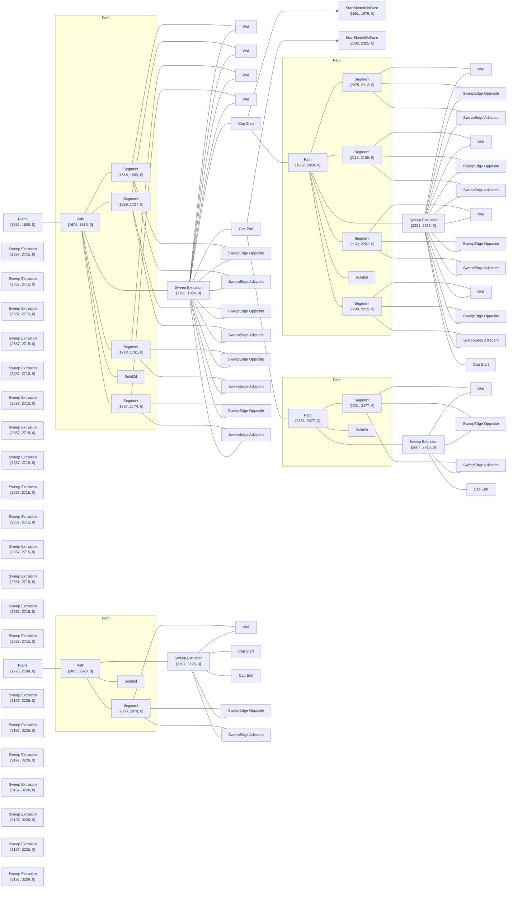

```mermaid
flowchart LR
  subgraph path2 [Path]
    2["Path<br>[1606, 1660, 0]"]
    3["Segment<br>[1666, 1693, 0]"]
    4["Segment<br>[1699, 1727, 0]"]
    5["Segment<br>[1733, 1761, 0]"]
    6["Segment<br>[1767, 1774, 0]"]
    7[Solid2d]
  end
  subgraph path23 [Path]
    23["Path<br>[1982, 2069, 0]"]
    24["Segment<br>[2075, 2112, 0]"]
    25["Segment<br>[2118, 2156, 0]"]
    26["Segment<br>[2162, 2202, 0]"]
    27["Segment<br>[2208, 2215, 0]"]
    28[Solid2d]
  end
  subgraph path43 [Path]
    43["Path<br>[2331, 2477, 0]"]
    44["Segment<br>[2331, 2477, 0]"]
    45[Solid2d]
  end
  subgraph path66 [Path]
    66["Path<br>[2805, 2979, 0]"]
    67["Segment<br>[2805, 2979, 0]"]
    68[Solid2d]
  end
  1["Plane<br>[1581, 1600, 0]"]
  8["Sweep Extrusion<br>[1780, 1804, 0]"]
  9[Wall]
  10[Wall]
  11[Wall]
  12[Wall]
  13["Cap Start"]
  14["Cap End"]
  15["SweepEdge Opposite"]
  16["SweepEdge Adjacent"]
  17["SweepEdge Opposite"]
  18["SweepEdge Adjacent"]
  19["SweepEdge Opposite"]
  20["SweepEdge Adjacent"]
  21["SweepEdge Opposite"]
  22["SweepEdge Adjacent"]
  29["Sweep Extrusion<br>[2221, 2252, 0]"]
  30[Wall]
  31[Wall]
  32[Wall]
  33[Wall]
  34["Cap Start"]
  35["SweepEdge Opposite"]
  36["SweepEdge Adjacent"]
  37["SweepEdge Opposite"]
  38["SweepEdge Adjacent"]
  39["SweepEdge Opposite"]
  40["SweepEdge Adjacent"]
  41["SweepEdge Opposite"]
  42["SweepEdge Adjacent"]
  46["Sweep Extrusion<br>[2687, 2715, 0]"]
  47[Wall]
  48["Cap End"]
  49["SweepEdge Opposite"]
  50["SweepEdge Adjacent"]
  51["Sweep Extrusion<br>[2687, 2715, 0]"]
  52["Sweep Extrusion<br>[2687, 2715, 0]"]
  53["Sweep Extrusion<br>[2687, 2715, 0]"]
  54["Sweep Extrusion<br>[2687, 2715, 0]"]
  55["Sweep Extrusion<br>[2687, 2715, 0]"]
  56["Sweep Extrusion<br>[2687, 2715, 0]"]
  57["Sweep Extrusion<br>[2687, 2715, 0]"]
  58["Sweep Extrusion<br>[2687, 2715, 0]"]
  59["Sweep Extrusion<br>[2687, 2715, 0]"]
  60["Sweep Extrusion<br>[2687, 2715, 0]"]
  61["Sweep Extrusion<br>[2687, 2715, 0]"]
  62["Sweep Extrusion<br>[2687, 2715, 0]"]
  63["Sweep Extrusion<br>[2687, 2715, 0]"]
  64["Sweep Extrusion<br>[2687, 2715, 0]"]
  65["Plane<br>[2776, 2799, 0]"]
  69["Sweep Extrusion<br>[3197, 3226, 0]"]
  70[Wall]
  71["Cap Start"]
  72["Cap End"]
  73["SweepEdge Opposite"]
  74["SweepEdge Adjacent"]
  75["Sweep Extrusion<br>[3197, 3226, 0]"]
  76["Sweep Extrusion<br>[3197, 3226, 0]"]
  77["Sweep Extrusion<br>[3197, 3226, 0]"]
  78["Sweep Extrusion<br>[3197, 3226, 0]"]
  79["Sweep Extrusion<br>[3197, 3226, 0]"]
  80["Sweep Extrusion<br>[3197, 3226, 0]"]
  81["Sweep Extrusion<br>[3197, 3226, 0]"]
  82["StartSketchOnFace<br>[1951, 1976, 0]"]
  83["StartSketchOnFace<br>[2302, 2325, 0]"]
  1 --- 2
  2 --- 3
  2 --- 4
  2 --- 5
  2 --- 6
  2 ---- 8
  2 --- 7
  3 --- 9
  3 --- 15
  3 --- 16
  4 --- 10
  4 --- 17
  4 --- 18
  5 --- 11
  5 --- 19
  5 --- 20
  6 --- 12
  6 --- 21
  6 --- 22
  8 --- 9
  8 --- 10
  8 --- 11
  8 --- 12
  8 --- 13
  8 --- 14
  8 --- 15
  8 --- 16
  8 --- 17
  8 --- 18
  8 --- 19
  8 --- 20
  8 --- 21
  8 --- 22
  13 --- 23
  14 --- 43
  23 --- 24
  23 --- 25
  23 --- 26
  23 --- 27
  23 ---- 29
  23 --- 28
  24 --- 30
  24 --- 35
  24 --- 36
  25 --- 31
  25 --- 37
  25 --- 38
  26 --- 32
  26 --- 39
  26 --- 40
  27 --- 33
  27 --- 41
  27 --- 42
  29 --- 30
  29 --- 31
  29 --- 32
  29 --- 33
  29 --- 34
  29 --- 35
  29 --- 36
  29 --- 37
  29 --- 38
  29 --- 39
  29 --- 40
  29 --- 41
  29 --- 42
  43 --- 44
  43 ---- 46
  43 --- 45
  44 --- 47
  44 --- 49
  44 --- 50
  46 --- 47
  46 --- 48
  46 --- 49
  46 --- 50
  65 --- 66
  66 --- 67
  66 ---- 69
  66 --- 68
  67 --- 70
  67 --- 73
  67 --- 74
  69 --- 70
  69 --- 71
  69 --- 72
  69 --- 73
  69 --- 74
  13 <--x 82
  14 <--x 83
```
