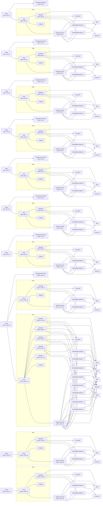

```mermaid
flowchart LR
  subgraph path19 [Path]
    19["Path<br>[583, 628, 0]"]
    31["Segment<br>[583, 628, 0]"]
    46[Solid2d]
  end
  subgraph path20 [Path]
    20["Path<br>[583, 628, 0]"]
    36["Segment<br>[583, 628, 0]"]
    47[Solid2d]
  end
  subgraph path21 [Path]
    21["Path<br>[583, 628, 0]"]
    30["Segment<br>[583, 628, 0]"]
    48[Solid2d]
  end
  subgraph path22 [Path]
    22["Path<br>[583, 628, 0]"]
    35["Segment<br>[583, 628, 0]"]
    49[Solid2d]
  end
  subgraph path23 [Path]
    23["Path<br>[583, 628, 0]"]
    33["Segment<br>[583, 628, 0]"]
    51[Solid2d]
  end
  subgraph path24 [Path]
    24["Path<br>[583, 628, 0]"]
    34["Segment<br>[583, 628, 0]"]
    52[Solid2d]
  end
  subgraph path25 [Path]
    25["Path<br>[583, 628, 0]"]
    32["Segment<br>[583, 628, 0]"]
    53[Solid2d]
  end
  subgraph path26 [Path]
    26["Path<br>[1228, 1283, 0]"]
    38["Segment<br>[1228, 1283, 0]"]
    45[Solid2d]
  end
  subgraph path27 [Path]
    27["Path<br>[1228, 1283, 0]"]
    37["Segment<br>[1228, 1283, 0]"]
    55[Solid2d]
  end
  subgraph path28 [Path]
    28["Path<br>[1676, 1739, 0]"]
    39["Segment<br>[1676, 1739, 0]"]
    50[Solid2d]
  end
  subgraph path29 [Path]
    29["Path<br>[1785, 1844, 0]"]
    40["Segment<br>[1852, 1876, 0]"]
    41["Segment<br>[1884, 1984, 0]"]
    42["Segment<br>[1992, 2016, 0]"]
    43["Segment<br>[2024, 2202, 0]"]
    44["Segment<br>[2210, 2217, 0]"]
    54[Solid2d]
  end
  1["Plane<br>[547, 574, 0]"]
  2["Plane<br>[547, 574, 0]"]
  3["Plane<br>[547, 574, 0]"]
  4["Plane<br>[547, 574, 0]"]
  5["Plane<br>[547, 574, 0]"]
  6["Plane<br>[547, 574, 0]"]
  7["Plane<br>[547, 574, 0]"]
  8["Plane<br>[1200, 1220, 0]"]
  9["Plane<br>[1200, 1220, 0]"]
  10["Plane<br>[1612, 1662, 0]"]
  11["StartSketchOnPlane<br>[533, 575, 0]"]
  12["StartSketchOnPlane<br>[533, 575, 0]"]
  13["StartSketchOnPlane<br>[533, 575, 0]"]
  14["StartSketchOnPlane<br>[533, 575, 0]"]
  15["StartSketchOnPlane<br>[533, 575, 0]"]
  16["StartSketchOnPlane<br>[1596, 1663, 0]"]
  17["StartSketchOnPlane<br>[533, 575, 0]"]
  18["StartSketchOnPlane<br>[533, 575, 0]"]
  56["Sweep Extrusion<br>[636, 665, 0]"]
  57["Sweep Extrusion<br>[636, 665, 0]"]
  58["Sweep Extrusion<br>[636, 665, 0]"]
  59["Sweep Extrusion<br>[636, 665, 0]"]
  60["Sweep Extrusion<br>[636, 665, 0]"]
  61["Sweep Extrusion<br>[636, 665, 0]"]
  62["Sweep Extrusion<br>[636, 665, 0]"]
  63["Sweep Extrusion<br>[1291, 1318, 0]"]
  64["Sweep Extrusion<br>[1291, 1318, 0]"]
  65["Sweep Extrusion<br>[1747, 1770, 0]"]
  66["Sweep Extrusion<br>[2225, 2248, 0]"]
  67[Wall]
  68[Wall]
  69[Wall]
  70[Wall]
  71[Wall]
  72[Wall]
  73[Wall]
  74[Wall]
  75[Wall]
  76[Wall]
  77[Wall]
  78[Wall]
  79[Wall]
  80[Wall]
  81["Cap Start"]
  82["Cap Start"]
  83["Cap Start"]
  84["Cap Start"]
  85["Cap Start"]
  86["Cap Start"]
  87["Cap Start"]
  88["Cap Start"]
  89["Cap Start"]
  90["Cap Start"]
  91["Cap Start"]
  92["Cap End"]
  93["Cap End"]
  94["Cap End"]
  95["Cap End"]
  96["Cap End"]
  97["Cap End"]
  98["Cap End"]
  99["Cap End"]
  100["Cap End"]
  101["Cap End"]
  102["Cap End"]
  103["SweepEdge Opposite"]
  104["SweepEdge Adjacent"]
  105["SweepEdge Opposite"]
  106["SweepEdge Adjacent"]
  107["SweepEdge Opposite"]
  108["SweepEdge Adjacent"]
  109["SweepEdge Opposite"]
  110["SweepEdge Adjacent"]
  111["SweepEdge Opposite"]
  112["SweepEdge Adjacent"]
  113["SweepEdge Opposite"]
  114["SweepEdge Adjacent"]
  115["SweepEdge Opposite"]
  116["SweepEdge Adjacent"]
  117["SweepEdge Opposite"]
  118["SweepEdge Adjacent"]
  119["SweepEdge Opposite"]
  120["SweepEdge Adjacent"]
  121["SweepEdge Opposite"]
  122["SweepEdge Adjacent"]
  123["SweepEdge Opposite"]
  124["SweepEdge Adjacent"]
  125["SweepEdge Opposite"]
  126["SweepEdge Adjacent"]
  127["SweepEdge Opposite"]
  128["SweepEdge Adjacent"]
  129["SweepEdge Opposite"]
  130["SweepEdge Adjacent"]
  1 <--x 12
  1 --- 23
  2 <--x 15
  2 --- 24
  3 <--x 13
  3 --- 21
  4 <--x 18
  4 --- 25
  5 <--x 14
  5 --- 22
  6 <--x 11
  6 --- 20
  7 <--x 17
  7 --- 19
  8 --- 26
  9 --- 27
  10 <--x 16
  10 --- 28
  10 --- 29
  19 --- 31
  19 --- 46
  19 ---- 61
  20 --- 36
  20 --- 47
  20 ---- 56
  21 --- 30
  21 --- 48
  21 ---- 59
  22 --- 35
  22 --- 49
  22 ---- 62
  23 --- 33
  23 --- 51
  23 ---- 58
  24 --- 34
  24 --- 52
  24 ---- 57
  25 --- 32
  25 --- 53
  25 ---- 60
  26 --- 38
  26 --- 45
  26 ---- 63
  27 --- 37
  27 --- 55
  27 ---- 64
  28 --- 39
  28 --- 50
  28 ---- 65
  29 --- 40
  29 --- 41
  29 --- 42
  29 --- 43
  29 --- 44
  29 --- 54
  29 ---- 66
  30 --- 76
  30 x--> 85
  30 --- 121
  30 --- 122
  31 --- 79
  31 x--> 87
  31 --- 127
  31 --- 128
  32 --- 78
  32 x--> 84
  32 --- 125
  32 --- 126
  33 --- 75
  33 x--> 82
  33 --- 119
  33 --- 120
  34 --- 73
  34 x--> 81
  34 --- 115
  34 --- 116
  35 --- 80
  35 x--> 83
  35 --- 129
  35 --- 130
  36 --- 67
  36 x--> 86
  36 --- 103
  36 --- 104
  37 --- 77
  37 x--> 89
  37 --- 123
  37 --- 124
  38 --- 74
  38 x--> 88
  38 --- 117
  38 --- 118
  39 --- 68
  39 x--> 90
  39 --- 105
  39 --- 106
  40 --- 70
  40 x--> 91
  40 --- 109
  40 --- 110
  41 --- 72
  41 x--> 91
  41 --- 113
  41 --- 114
  42 --- 71
  42 x--> 91
  42 --- 111
  42 --- 112
  43 --- 69
  43 x--> 91
  43 --- 107
  43 --- 108
  56 --- 67
  56 --- 86
  56 --- 97
  56 --- 103
  56 --- 104
  57 --- 73
  57 --- 81
  57 --- 92
  57 --- 115
  57 --- 116
  58 --- 75
  58 --- 82
  58 --- 93
  58 --- 119
  58 --- 120
  59 --- 76
  59 --- 85
  59 --- 96
  59 --- 121
  59 --- 122
  60 --- 78
  60 --- 84
  60 --- 95
  60 --- 125
  60 --- 126
  61 --- 79
  61 --- 87
  61 --- 98
  61 --- 127
  61 --- 128
  62 --- 80
  62 --- 83
  62 --- 94
  62 --- 129
  62 --- 130
  63 --- 74
  63 --- 88
  63 --- 99
  63 --- 117
  63 --- 118
  64 --- 77
  64 --- 89
  64 --- 100
  64 --- 123
  64 --- 124
  65 --- 68
  65 --- 90
  65 --- 101
  65 --- 105
  65 --- 106
  66 --- 69
  66 --- 70
  66 --- 71
  66 --- 72
  66 --- 91
  66 --- 102
  66 --- 107
  66 --- 108
  66 --- 109
  66 --- 110
  66 --- 111
  66 --- 112
  66 --- 113
  66 --- 114
  103 <--x 67
  104 <--x 67
  105 <--x 68
  106 <--x 68
  107 <--x 69
  108 <--x 69
  112 <--x 69
  108 <--x 70
  109 <--x 70
  110 <--x 70
  111 <--x 71
  112 <--x 71
  114 <--x 71
  110 <--x 72
  113 <--x 72
  114 <--x 72
  115 <--x 73
  116 <--x 73
  117 <--x 74
  118 <--x 74
  119 <--x 75
  120 <--x 75
  121 <--x 76
  122 <--x 76
  123 <--x 77
  124 <--x 77
  125 <--x 78
  126 <--x 78
  127 <--x 79
  128 <--x 79
  129 <--x 80
  130 <--x 80
  115 <--x 92
  119 <--x 93
  129 <--x 94
  125 <--x 95
  121 <--x 96
  103 <--x 97
  127 <--x 98
  117 <--x 99
  123 <--x 100
  105 <--x 101
  107 <--x 102
  109 <--x 102
  111 <--x 102
  113 <--x 102
```
