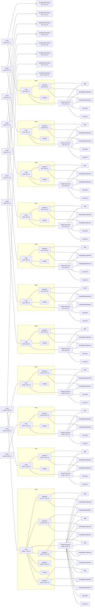

```mermaid
flowchart LR
  subgraph path2 [Path]
    2["Path<br>[520, 565, 0]"]
    3["Segment<br>[520, 565, 0]"]
    4[Solid2d]
  end
  subgraph path12 [Path]
    12["Path<br>[520, 565, 0]"]
    13["Segment<br>[520, 565, 0]"]
    14[Solid2d]
  end
  subgraph path22 [Path]
    22["Path<br>[520, 565, 0]"]
    23["Segment<br>[520, 565, 0]"]
    24[Solid2d]
  end
  subgraph path32 [Path]
    32["Path<br>[520, 565, 0]"]
    33["Segment<br>[520, 565, 0]"]
    34[Solid2d]
  end
  subgraph path42 [Path]
    42["Path<br>[520, 565, 0]"]
    43["Segment<br>[520, 565, 0]"]
    44[Solid2d]
  end
  subgraph path52 [Path]
    52["Path<br>[520, 565, 0]"]
    53["Segment<br>[520, 565, 0]"]
    54[Solid2d]
  end
  subgraph path62 [Path]
    62["Path<br>[520, 565, 0]"]
    63["Segment<br>[520, 565, 0]"]
    64[Solid2d]
  end
  subgraph path72 [Path]
    72["Path<br>[1136, 1191, 0]"]
    73["Segment<br>[1136, 1191, 0]"]
    74[Solid2d]
  end
  subgraph path82 [Path]
    82["Path<br>[1136, 1191, 0]"]
    83["Segment<br>[1136, 1191, 0]"]
    84[Solid2d]
  end
  subgraph path92 [Path]
    92["Path<br>[1553, 1616, 0]"]
    93["Segment<br>[1553, 1616, 0]"]
    94[Solid2d]
  end
  subgraph path101 [Path]
    101["Path<br>[1662, 1716, 0]"]
    102["Segment<br>[1724, 1748, 0]"]
    103["Segment<br>[1756, 1870, 0]"]
    104["Segment<br>[1878, 1902, 0]"]
    105["Segment<br>[1910, 2041, 0]"]
    106["Segment<br>[2049, 2056, 0]"]
    107[Solid2d]
  end
  1["Plane<br>[484, 511, 0]"]
  5["Sweep Extrusion<br>[573, 602, 0]"]
  6[Wall]
  7["Cap Start"]
  8["Cap End"]
  9["SweepEdge Opposite"]
  10["SweepEdge Adjacent"]
  11["Plane<br>[484, 511, 0]"]
  15["Sweep Extrusion<br>[573, 602, 0]"]
  16[Wall]
  17["Cap Start"]
  18["Cap End"]
  19["SweepEdge Opposite"]
  20["SweepEdge Adjacent"]
  21["Plane<br>[484, 511, 0]"]
  25["Sweep Extrusion<br>[573, 602, 0]"]
  26[Wall]
  27["Cap Start"]
  28["Cap End"]
  29["SweepEdge Opposite"]
  30["SweepEdge Adjacent"]
  31["Plane<br>[484, 511, 0]"]
  35["Sweep Extrusion<br>[573, 602, 0]"]
  36[Wall]
  37["Cap Start"]
  38["Cap End"]
  39["SweepEdge Opposite"]
  40["SweepEdge Adjacent"]
  41["Plane<br>[484, 511, 0]"]
  45["Sweep Extrusion<br>[573, 602, 0]"]
  46[Wall]
  47["Cap Start"]
  48["Cap End"]
  49["SweepEdge Opposite"]
  50["SweepEdge Adjacent"]
  51["Plane<br>[484, 511, 0]"]
  55["Sweep Extrusion<br>[573, 602, 0]"]
  56[Wall]
  57["Cap Start"]
  58["Cap End"]
  59["SweepEdge Opposite"]
  60["SweepEdge Adjacent"]
  61["Plane<br>[484, 511, 0]"]
  65["Sweep Extrusion<br>[573, 602, 0]"]
  66[Wall]
  67["Cap Start"]
  68["Cap End"]
  69["SweepEdge Opposite"]
  70["SweepEdge Adjacent"]
  71["Plane<br>[1108, 1128, 0]"]
  75["Sweep Extrusion<br>[1199, 1226, 0]"]
  76[Wall]
  77["Cap Start"]
  78["Cap End"]
  79["SweepEdge Opposite"]
  80["SweepEdge Adjacent"]
  81["Plane<br>[1108, 1128, 0]"]
  85["Sweep Extrusion<br>[1199, 1226, 0]"]
  86[Wall]
  87["Cap Start"]
  88["Cap End"]
  89["SweepEdge Opposite"]
  90["SweepEdge Adjacent"]
  91["Plane<br>[1489, 1539, 0]"]
  95["Sweep Extrusion<br>[1624, 1647, 0]"]
  96[Wall]
  97["Cap Start"]
  98["Cap End"]
  99["SweepEdge Opposite"]
  100["SweepEdge Adjacent"]
  108["Sweep Extrusion<br>[2064, 2087, 0]"]
  109[Wall]
  110[Wall]
  111[Wall]
  112[Wall]
  113["Cap Start"]
  114["Cap End"]
  115["SweepEdge Opposite"]
  116["SweepEdge Adjacent"]
  117["SweepEdge Opposite"]
  118["SweepEdge Adjacent"]
  119["SweepEdge Opposite"]
  120["SweepEdge Adjacent"]
  121["SweepEdge Opposite"]
  122["SweepEdge Adjacent"]
  123["StartSketchOnPlane<br>[470, 512, 0]"]
  124["StartSketchOnPlane<br>[470, 512, 0]"]
  125["StartSketchOnPlane<br>[470, 512, 0]"]
  126["StartSketchOnPlane<br>[470, 512, 0]"]
  127["StartSketchOnPlane<br>[470, 512, 0]"]
  128["StartSketchOnPlane<br>[470, 512, 0]"]
  129["StartSketchOnPlane<br>[470, 512, 0]"]
  130["StartSketchOnPlane<br>[1475, 1540, 0]"]
  1 --- 2
  2 --- 3
  2 ---- 5
  2 --- 4
  3 --- 6
  3 --- 9
  3 --- 10
  5 --- 6
  5 --- 7
  5 --- 8
  5 --- 9
  5 --- 10
  11 --- 12
  12 --- 13
  12 ---- 15
  12 --- 14
  13 --- 16
  13 --- 19
  13 --- 20
  15 --- 16
  15 --- 17
  15 --- 18
  15 --- 19
  15 --- 20
  21 --- 22
  22 --- 23
  22 ---- 25
  22 --- 24
  23 --- 26
  23 --- 29
  23 --- 30
  25 --- 26
  25 --- 27
  25 --- 28
  25 --- 29
  25 --- 30
  31 --- 32
  32 --- 33
  32 ---- 35
  32 --- 34
  33 --- 36
  33 --- 39
  33 --- 40
  35 --- 36
  35 --- 37
  35 --- 38
  35 --- 39
  35 --- 40
  41 --- 42
  42 --- 43
  42 ---- 45
  42 --- 44
  43 --- 46
  43 --- 49
  43 --- 50
  45 --- 46
  45 --- 47
  45 --- 48
  45 --- 49
  45 --- 50
  51 --- 52
  52 --- 53
  52 ---- 55
  52 --- 54
  53 --- 56
  53 --- 59
  53 --- 60
  55 --- 56
  55 --- 57
  55 --- 58
  55 --- 59
  55 --- 60
  61 --- 62
  62 --- 63
  62 ---- 65
  62 --- 64
  63 --- 66
  63 --- 69
  63 --- 70
  65 --- 66
  65 --- 67
  65 --- 68
  65 --- 69
  65 --- 70
  71 --- 72
  72 --- 73
  72 ---- 75
  72 --- 74
  73 --- 76
  73 --- 79
  73 --- 80
  75 --- 76
  75 --- 77
  75 --- 78
  75 --- 79
  75 --- 80
  81 --- 82
  82 --- 83
  82 ---- 85
  82 --- 84
  83 --- 86
  83 --- 89
  83 --- 90
  85 --- 86
  85 --- 87
  85 --- 88
  85 --- 89
  85 --- 90
  91 --- 92
  91 --- 101
  92 --- 93
  92 ---- 95
  92 --- 94
  93 --- 96
  93 --- 99
  93 --- 100
  95 --- 96
  95 --- 97
  95 --- 98
  95 --- 99
  95 --- 100
  101 --- 102
  101 --- 103
  101 --- 104
  101 --- 105
  101 --- 106
  101 ---- 108
  101 --- 107
  102 --- 112
  102 --- 121
  102 --- 122
  103 --- 111
  103 --- 119
  103 --- 120
  104 --- 110
  104 --- 117
  104 --- 118
  105 --- 109
  105 --- 115
  105 --- 116
  108 --- 109
  108 --- 110
  108 --- 111
  108 --- 112
  108 --- 113
  108 --- 114
  108 --- 115
  108 --- 116
  108 --- 117
  108 --- 118
  108 --- 119
  108 --- 120
  108 --- 121
  108 --- 122
  1 <--x 123
  11 <--x 124
  21 <--x 125
  31 <--x 126
  41 <--x 127
  51 <--x 128
  61 <--x 129
  91 <--x 130
```
