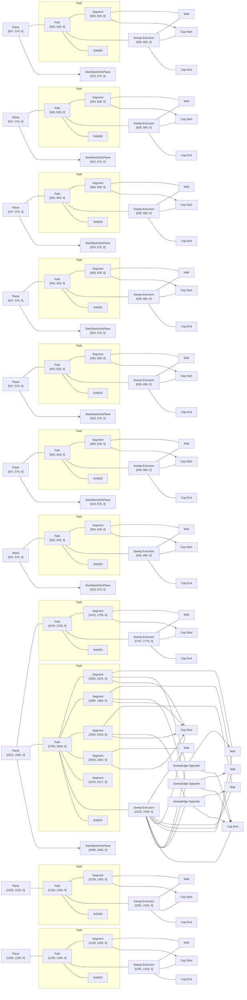

```mermaid
flowchart LR
  subgraph path2 [Path]
    2["Path<br>[583, 628, 0]"]
    3["Segment<br>[583, 628, 0]"]
    4[Solid2d]
  end
  subgraph path10 [Path]
    10["Path<br>[583, 628, 0]"]
    11["Segment<br>[583, 628, 0]"]
    12[Solid2d]
  end
  subgraph path18 [Path]
    18["Path<br>[583, 628, 0]"]
    19["Segment<br>[583, 628, 0]"]
    20[Solid2d]
  end
  subgraph path26 [Path]
    26["Path<br>[583, 628, 0]"]
    27["Segment<br>[583, 628, 0]"]
    28[Solid2d]
  end
  subgraph path34 [Path]
    34["Path<br>[583, 628, 0]"]
    35["Segment<br>[583, 628, 0]"]
    36[Solid2d]
  end
  subgraph path42 [Path]
    42["Path<br>[583, 628, 0]"]
    43["Segment<br>[583, 628, 0]"]
    44[Solid2d]
  end
  subgraph path50 [Path]
    50["Path<br>[583, 628, 0]"]
    51["Segment<br>[583, 628, 0]"]
    52[Solid2d]
  end
  subgraph path58 [Path]
    58["Path<br>[1228, 1283, 0]"]
    59["Segment<br>[1228, 1283, 0]"]
    60[Solid2d]
  end
  subgraph path66 [Path]
    66["Path<br>[1228, 1283, 0]"]
    67["Segment<br>[1228, 1283, 0]"]
    68[Solid2d]
  end
  subgraph path74 [Path]
    74["Path<br>[1676, 1739, 0]"]
    75["Segment<br>[1676, 1739, 0]"]
    76[Solid2d]
  end
  subgraph path81 [Path]
    81["Path<br>[1785, 1844, 0]"]
    82["Segment<br>[1852, 1876, 0]"]
    83["Segment<br>[1884, 1984, 0]"]
    84["Segment<br>[1992, 2016, 0]"]
    85["Segment<br>[2024, 2202, 0]"]
    86["Segment<br>[2210, 2217, 0]"]
    87[Solid2d]
  end
  1["Plane<br>[547, 574, 0]"]
  5["Sweep Extrusion<br>[636, 665, 0]"]
  6[Wall]
  7["Cap Start"]
  8["Cap End"]
  9["Plane<br>[547, 574, 0]"]
  13["Sweep Extrusion<br>[636, 665, 0]"]
  14[Wall]
  15["Cap Start"]
  16["Cap End"]
  17["Plane<br>[547, 574, 0]"]
  21["Sweep Extrusion<br>[636, 665, 0]"]
  22[Wall]
  23["Cap Start"]
  24["Cap End"]
  25["Plane<br>[547, 574, 0]"]
  29["Sweep Extrusion<br>[636, 665, 0]"]
  30[Wall]
  31["Cap Start"]
  32["Cap End"]
  33["Plane<br>[547, 574, 0]"]
  37["Sweep Extrusion<br>[636, 665, 0]"]
  38[Wall]
  39["Cap Start"]
  40["Cap End"]
  41["Plane<br>[547, 574, 0]"]
  45["Sweep Extrusion<br>[636, 665, 0]"]
  46[Wall]
  47["Cap Start"]
  48["Cap End"]
  49["Plane<br>[547, 574, 0]"]
  53["Sweep Extrusion<br>[636, 665, 0]"]
  54[Wall]
  55["Cap Start"]
  56["Cap End"]
  57["Plane<br>[1200, 1220, 0]"]
  61["Sweep Extrusion<br>[1291, 1318, 0]"]
  62[Wall]
  63["Cap Start"]
  64["Cap End"]
  65["Plane<br>[1200, 1220, 0]"]
  69["Sweep Extrusion<br>[1291, 1318, 0]"]
  70[Wall]
  71["Cap Start"]
  72["Cap End"]
  73["Plane<br>[1612, 1662, 0]"]
  77["Sweep Extrusion<br>[1747, 1770, 0]"]
  78[Wall]
  79["Cap Start"]
  80["Cap End"]
  88["Sweep Extrusion<br>[2225, 2248, 0]"]
  89[Wall]
  90[Wall]
  91[Wall]
  92[Wall]
  93["Cap Start"]
  94["Cap End"]
  95["SweepEdge Opposite"]
  96["SweepEdge Opposite"]
  97["SweepEdge Opposite"]
  98["StartSketchOnPlane<br>[533, 575, 0]"]
  99["StartSketchOnPlane<br>[533, 575, 0]"]
  100["StartSketchOnPlane<br>[533, 575, 0]"]
  101["StartSketchOnPlane<br>[533, 575, 0]"]
  102["StartSketchOnPlane<br>[533, 575, 0]"]
  103["StartSketchOnPlane<br>[533, 575, 0]"]
  104["StartSketchOnPlane<br>[533, 575, 0]"]
  105["StartSketchOnPlane<br>[1596, 1663, 0]"]
  1 --- 2
  2 --- 3
  2 ---- 5
  2 --- 4
  3 --- 6
  3 x--> 7
  5 --- 6
  5 --- 7
  5 --- 8
  9 --- 10
  10 --- 11
  10 ---- 13
  10 --- 12
  11 --- 14
  11 x--> 15
  13 --- 14
  13 --- 15
  13 --- 16
  17 --- 18
  18 --- 19
  18 ---- 21
  18 --- 20
  19 --- 22
  19 x--> 23
  21 --- 22
  21 --- 23
  21 --- 24
  25 --- 26
  26 --- 27
  26 ---- 29
  26 --- 28
  27 --- 30
  27 x--> 31
  29 --- 30
  29 --- 31
  29 --- 32
  33 --- 34
  34 --- 35
  34 ---- 37
  34 --- 36
  35 --- 38
  35 x--> 39
  37 --- 38
  37 --- 39
  37 --- 40
  41 --- 42
  42 --- 43
  42 ---- 45
  42 --- 44
  43 --- 46
  43 x--> 47
  45 --- 46
  45 --- 47
  45 --- 48
  49 --- 50
  50 --- 51
  50 ---- 53
  50 --- 52
  51 --- 54
  51 x--> 55
  53 --- 54
  53 --- 55
  53 --- 56
  57 --- 58
  58 --- 59
  58 ---- 61
  58 --- 60
  59 --- 62
  59 x--> 63
  61 --- 62
  61 --- 63
  61 --- 64
  65 --- 66
  66 --- 67
  66 ---- 69
  66 --- 68
  67 --- 70
  67 x--> 71
  69 --- 70
  69 --- 71
  69 --- 72
  73 --- 74
  73 --- 81
  74 --- 75
  74 ---- 77
  74 --- 76
  75 --- 78
  75 x--> 79
  77 --- 78
  77 --- 79
  77 --- 80
  81 --- 82
  81 --- 83
  81 --- 84
  81 --- 85
  81 --- 86
  81 ---- 88
  81 --- 87
  82 --- 92
  82 --- 97
  82 x--> 93
  83 --- 91
  83 --- 96
  83 x--> 93
  84 --- 90
  84 --- 95
  84 x--> 93
  85 --- 89
  85 x--> 93
  88 --- 89
  88 --- 90
  88 --- 91
  88 --- 92
  88 --- 93
  88 --- 94
  88 --- 95
  88 --- 96
  88 --- 97
  95 <--x 90
  95 <--x 94
  96 <--x 91
  96 <--x 94
  97 <--x 92
  97 <--x 94
  1 <--x 98
  9 <--x 99
  17 <--x 100
  25 <--x 101
  33 <--x 102
  41 <--x 103
  49 <--x 104
  73 <--x 105
```
