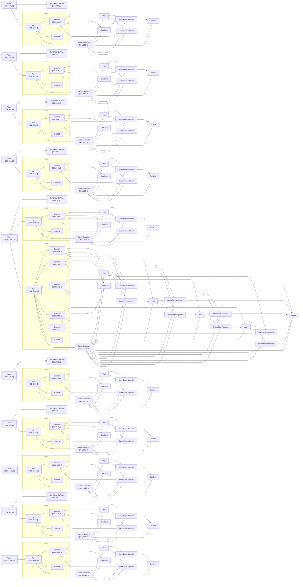

```mermaid
flowchart LR
  subgraph path19 [Path]
    19["Path<br>[601, 646, 0]"]
    33["Segment<br>[601, 646, 0]"]
    45[Solid2d]
  end
  subgraph path20 [Path]
    20["Path<br>[601, 646, 0]"]
    35["Segment<br>[601, 646, 0]"]
    46[Solid2d]
  end
  subgraph path21 [Path]
    21["Path<br>[601, 646, 0]"]
    32["Segment<br>[601, 646, 0]"]
    50[Solid2d]
  end
  subgraph path22 [Path]
    22["Path<br>[601, 646, 0]"]
    31["Segment<br>[601, 646, 0]"]
    52[Solid2d]
  end
  subgraph path23 [Path]
    23["Path<br>[601, 646, 0]"]
    30["Segment<br>[601, 646, 0]"]
    53[Solid2d]
  end
  subgraph path24 [Path]
    24["Path<br>[601, 646, 0]"]
    34["Segment<br>[601, 646, 0]"]
    54[Solid2d]
  end
  subgraph path25 [Path]
    25["Path<br>[601, 646, 0]"]
    36["Segment<br>[601, 646, 0]"]
    55[Solid2d]
  end
  subgraph path26 [Path]
    26["Path<br>[1330, 1385, 0]"]
    37["Segment<br>[1330, 1385, 0]"]
    48[Solid2d]
  end
  subgraph path27 [Path]
    27["Path<br>[1330, 1385, 0]"]
    38["Segment<br>[1330, 1385, 0]"]
    51[Solid2d]
  end
  subgraph path28 [Path]
    28["Path<br>[1832, 1895, 0]"]
    39["Segment<br>[1832, 1895, 0]"]
    47[Solid2d]
  end
  subgraph path29 [Path]
    29["Path<br>[1941, 2000, 0]"]
    40["Segment<br>[2008, 2032, 0]"]
    41["Segment<br>[2040, 2140, 0]"]
    42["Segment<br>[2148, 2172, 0]"]
    43["Segment<br>[2180, 2358, 0]"]
    44["Segment<br>[2366, 2373, 0]"]
    49[Solid2d]
  end
  1["Plane<br>[565, 592, 0]"]
  2["Plane<br>[565, 592, 0]"]
  3["Plane<br>[565, 592, 0]"]
  4["Plane<br>[565, 592, 0]"]
  5["Plane<br>[565, 592, 0]"]
  6["Plane<br>[565, 592, 0]"]
  7["Plane<br>[565, 592, 0]"]
  8["Plane<br>[1302, 1322, 0]"]
  9["Plane<br>[1302, 1322, 0]"]
  10["Plane<br>[1768, 1818, 0]"]
  11["StartSketchOnPlane<br>[551, 593, 0]"]
  12["StartSketchOnPlane<br>[1754, 1819, 0]"]
  13["StartSketchOnPlane<br>[551, 593, 0]"]
  14["StartSketchOnPlane<br>[551, 593, 0]"]
  15["StartSketchOnPlane<br>[551, 593, 0]"]
  16["StartSketchOnPlane<br>[551, 593, 0]"]
  17["StartSketchOnPlane<br>[551, 593, 0]"]
  18["StartSketchOnPlane<br>[551, 593, 0]"]
  56["Sweep Extrusion<br>[654, 683, 0]"]
  57["Sweep Extrusion<br>[654, 683, 0]"]
  58["Sweep Extrusion<br>[654, 683, 0]"]
  59["Sweep Extrusion<br>[654, 683, 0]"]
  60["Sweep Extrusion<br>[654, 683, 0]"]
  61["Sweep Extrusion<br>[654, 683, 0]"]
  62["Sweep Extrusion<br>[654, 683, 0]"]
  63["Sweep Extrusion<br>[1393, 1420, 0]"]
  64["Sweep Extrusion<br>[1393, 1420, 0]"]
  65["Sweep Extrusion<br>[1903, 1926, 0]"]
  66["Sweep Extrusion<br>[2381, 2404, 0]"]
  67[Wall]
  68[Wall]
  69[Wall]
  70[Wall]
  71[Wall]
  72[Wall]
  73[Wall]
  74[Wall]
  75[Wall]
  76[Wall]
  77[Wall]
  78[Wall]
  79[Wall]
  80[Wall]
  81["Cap Start"]
  82["Cap Start"]
  83["Cap Start"]
  84["Cap Start"]
  85["Cap Start"]
  86["Cap Start"]
  87["Cap Start"]
  88["Cap Start"]
  89["Cap Start"]
  90["Cap Start"]
  91["Cap Start"]
  92["Cap End"]
  93["Cap End"]
  94["Cap End"]
  95["Cap End"]
  96["Cap End"]
  97["Cap End"]
  98["Cap End"]
  99["Cap End"]
  100["Cap End"]
  101["Cap End"]
  102["Cap End"]
  103["SweepEdge Opposite"]
  104["SweepEdge Opposite"]
  105["SweepEdge Opposite"]
  106["SweepEdge Opposite"]
  107["SweepEdge Opposite"]
  108["SweepEdge Opposite"]
  109["SweepEdge Opposite"]
  110["SweepEdge Opposite"]
  111["SweepEdge Opposite"]
  112["SweepEdge Opposite"]
  113["SweepEdge Opposite"]
  114["SweepEdge Opposite"]
  115["SweepEdge Opposite"]
  116["SweepEdge Opposite"]
  117["SweepEdge Adjacent"]
  118["SweepEdge Adjacent"]
  119["SweepEdge Adjacent"]
  120["SweepEdge Adjacent"]
  121["SweepEdge Adjacent"]
  122["SweepEdge Adjacent"]
  123["SweepEdge Adjacent"]
  124["SweepEdge Adjacent"]
  125["SweepEdge Adjacent"]
  126["SweepEdge Adjacent"]
  127["SweepEdge Adjacent"]
  128["SweepEdge Adjacent"]
  129["SweepEdge Adjacent"]
  130["SweepEdge Adjacent"]
  1 <--x 15
  1 --- 22
  2 <--x 17
  2 --- 21
  3 <--x 11
  3 --- 20
  4 <--x 14
  4 --- 23
  5 <--x 18
  5 --- 19
  6 <--x 13
  6 --- 25
  7 <--x 16
  7 --- 24
  8 --- 27
  9 --- 26
  10 <--x 12
  10 --- 28
  10 --- 29
  19 --- 33
  19 --- 45
  19 ---- 58
  20 --- 35
  20 --- 46
  20 ---- 57
  21 --- 32
  21 --- 50
  21 ---- 62
  22 --- 31
  22 --- 52
  22 ---- 60
  23 --- 30
  23 --- 53
  23 ---- 56
  24 --- 34
  24 --- 54
  24 ---- 61
  25 --- 36
  25 --- 55
  25 ---- 59
  26 --- 37
  26 --- 48
  26 ---- 64
  27 --- 38
  27 --- 51
  27 ---- 63
  28 --- 39
  28 --- 47
  28 ---- 65
  29 --- 40
  29 --- 41
  29 --- 42
  29 --- 43
  29 --- 44
  29 --- 49
  29 ---- 66
  30 --- 67
  30 x--> 85
  30 --- 103
  30 --- 117
  31 --- 71
  31 x--> 84
  31 --- 107
  31 --- 121
  32 --- 75
  32 x--> 87
  32 --- 111
  32 --- 125
  33 --- 69
  33 x--> 86
  33 --- 105
  33 --- 119
  34 --- 74
  34 x--> 90
  34 --- 110
  34 --- 124
  35 --- 68
  35 x--> 82
  35 --- 104
  35 --- 118
  36 --- 70
  36 x--> 91
  36 --- 106
  36 --- 120
  37 --- 76
  37 x--> 88
  37 --- 112
  37 --- 126
  38 --- 73
  38 x--> 83
  38 --- 109
  38 --- 123
  39 --- 72
  39 x--> 81
  39 --- 108
  39 --- 122
  40 --- 77
  40 x--> 89
  40 --- 116
  40 --- 130
  41 --- 80
  41 x--> 89
  41 --- 115
  41 --- 129
  42 --- 79
  42 x--> 89
  42 --- 114
  42 --- 128
  43 --- 78
  43 x--> 89
  43 --- 113
  43 --- 127
  56 --- 67
  56 --- 85
  56 --- 96
  56 --- 103
  56 --- 117
  57 --- 68
  57 --- 82
  57 --- 93
  57 --- 104
  57 --- 118
  58 --- 69
  58 --- 86
  58 --- 97
  58 --- 105
  58 --- 119
  59 --- 70
  59 --- 91
  59 --- 102
  59 --- 106
  59 --- 120
  60 --- 71
  60 --- 84
  60 --- 95
  60 --- 107
  60 --- 121
  61 --- 74
  61 --- 90
  61 --- 101
  61 --- 110
  61 --- 124
  62 --- 75
  62 --- 87
  62 --- 98
  62 --- 111
  62 --- 125
  63 --- 73
  63 --- 83
  63 --- 94
  63 --- 109
  63 --- 123
  64 --- 76
  64 --- 88
  64 --- 99
  64 --- 112
  64 --- 126
  65 --- 72
  65 --- 81
  65 --- 92
  65 --- 108
  65 --- 122
  66 --- 77
  66 --- 78
  66 --- 79
  66 --- 80
  66 --- 89
  66 --- 100
  66 --- 113
  66 --- 114
  66 --- 115
  66 --- 116
  66 --- 127
  66 --- 128
  66 --- 129
  66 --- 130
  67 --- 103
  67 --- 117
  68 --- 104
  68 --- 118
  69 --- 105
  69 --- 119
  70 --- 106
  70 --- 120
  71 --- 107
  71 --- 121
  72 --- 108
  72 --- 122
  73 --- 109
  73 --- 123
  74 --- 110
  74 --- 124
  75 --- 111
  75 --- 125
  76 --- 112
  76 --- 126
  77 --- 116
  127 <--x 77
  77 --- 130
  78 --- 113
  78 --- 127
  128 <--x 78
  79 --- 114
  79 --- 128
  129 <--x 79
  80 --- 115
  80 --- 129
  130 <--x 80
  108 <--x 92
  104 <--x 93
  109 <--x 94
  107 <--x 95
  103 <--x 96
  105 <--x 97
  111 <--x 98
  112 <--x 99
  113 <--x 100
  114 <--x 100
  115 <--x 100
  116 <--x 100
  110 <--x 101
  106 <--x 102
```
