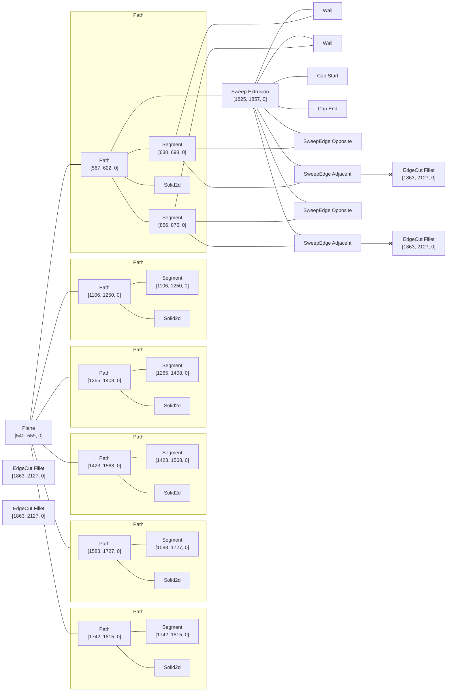

```mermaid
flowchart LR
  subgraph path2 [Path]
    2["Path<br>[567, 622, 0]"]
    3["Segment<br>[630, 698, 0]"]
    4["Segment<br>[856, 875, 0]"]
    5[Solid2d]
  end
  subgraph path6 [Path]
    6["Path<br>[1106, 1250, 0]"]
    7["Segment<br>[1106, 1250, 0]"]
    8[Solid2d]
  end
  subgraph path9 [Path]
    9["Path<br>[1265, 1408, 0]"]
    10["Segment<br>[1265, 1408, 0]"]
    11[Solid2d]
  end
  subgraph path12 [Path]
    12["Path<br>[1423, 1568, 0]"]
    13["Segment<br>[1423, 1568, 0]"]
    14[Solid2d]
  end
  subgraph path15 [Path]
    15["Path<br>[1583, 1727, 0]"]
    16["Segment<br>[1583, 1727, 0]"]
    17[Solid2d]
  end
  subgraph path18 [Path]
    18["Path<br>[1742, 1815, 0]"]
    19["Segment<br>[1742, 1815, 0]"]
    20[Solid2d]
  end
  1["Plane<br>[540, 559, 0]"]
  21["Sweep Extrusion<br>[1825, 1857, 0]"]
  22[Wall]
  23[Wall]
  24["Cap Start"]
  25["Cap End"]
  26["SweepEdge Opposite"]
  27["SweepEdge Adjacent"]
  28["SweepEdge Opposite"]
  29["SweepEdge Adjacent"]
  30["EdgeCut Fillet<br>[1863, 2127, 0]"]
  31["EdgeCut Fillet<br>[1863, 2127, 0]"]
  32["EdgeCut Fillet<br>[1863, 2127, 0]"]
  33["EdgeCut Fillet<br>[1863, 2127, 0]"]
  1 --- 2
  1 --- 6
  1 --- 9
  1 --- 12
  1 --- 15
  1 --- 18
  2 --- 3
  2 --- 4
  2 ---- 21
  2 --- 5
  3 --- 22
  3 --- 26
  3 --- 27
  4 --- 23
  4 --- 28
  4 --- 29
  6 --- 7
  6 --- 8
  9 --- 10
  9 --- 11
  12 --- 13
  12 --- 14
  15 --- 16
  15 --- 17
  18 --- 19
  18 --- 20
  21 --- 22
  21 --- 23
  21 --- 24
  21 --- 25
  21 --- 26
  21 --- 27
  21 --- 28
  21 --- 29
  29 <--x 30
  27 <--x 31
```
