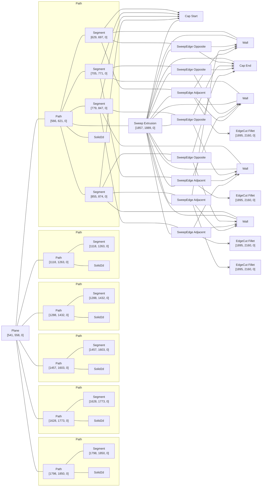

```mermaid
flowchart LR
  subgraph path2 [Path]
    2["Path<br>[566, 621, 0]"]
    8["Segment<br>[629, 697, 0]"]
    9["Segment<br>[705, 771, 0]"]
    10["Segment<br>[779, 847, 0]"]
    11["Segment<br>[855, 874, 0]"]
    20[Solid2d]
  end
  subgraph path3 [Path]
    3["Path<br>[1118, 1263, 0]"]
    12["Segment<br>[1118, 1263, 0]"]
    19[Solid2d]
  end
  subgraph path4 [Path]
    4["Path<br>[1288, 1432, 0]"]
    13["Segment<br>[1288, 1432, 0]"]
    22[Solid2d]
  end
  subgraph path5 [Path]
    5["Path<br>[1457, 1603, 0]"]
    14["Segment<br>[1457, 1603, 0]"]
    21[Solid2d]
  end
  subgraph path6 [Path]
    6["Path<br>[1628, 1773, 0]"]
    15["Segment<br>[1628, 1773, 0]"]
    17[Solid2d]
  end
  subgraph path7 [Path]
    7["Path<br>[1798, 1850, 0]"]
    16["Segment<br>[1798, 1850, 0]"]
    18[Solid2d]
  end
  1["Plane<br>[541, 558, 0]"]
  23["Sweep Extrusion<br>[1857, 1889, 0]"]
  24[Wall]
  25[Wall]
  26[Wall]
  27[Wall]
  28["Cap Start"]
  29["Cap End"]
  30["SweepEdge Opposite"]
  31["SweepEdge Opposite"]
  32["SweepEdge Opposite"]
  33["SweepEdge Opposite"]
  34["SweepEdge Adjacent"]
  35["SweepEdge Adjacent"]
  36["SweepEdge Adjacent"]
  37["SweepEdge Adjacent"]
  38["EdgeCut Fillet<br>[1895, 2160, 0]"]
  39["EdgeCut Fillet<br>[1895, 2160, 0]"]
  40["EdgeCut Fillet<br>[1895, 2160, 0]"]
  41["EdgeCut Fillet<br>[1895, 2160, 0]"]
  1 --- 2
  1 --- 3
  1 --- 4
  1 --- 5
  1 --- 6
  1 --- 7
  2 --- 8
  2 --- 9
  2 --- 10
  2 --- 11
  2 --- 20
  2 ---- 23
  3 --- 12
  3 --- 19
  4 --- 13
  4 --- 22
  5 --- 14
  5 --- 21
  6 --- 15
  6 --- 17
  7 --- 16
  7 --- 18
  8 --- 27
  8 x--> 28
  8 --- 30
  8 --- 37
  9 --- 25
  9 x--> 28
  9 --- 32
  9 --- 34
  10 --- 24
  10 x--> 28
  10 --- 31
  10 --- 35
  11 --- 26
  11 x--> 28
  11 --- 33
  11 --- 36
  23 --- 24
  23 --- 25
  23 --- 26
  23 --- 27
  23 --- 28
  23 --- 29
  23 --- 30
  23 --- 31
  23 --- 32
  23 --- 33
  23 --- 34
  23 --- 35
  23 --- 36
  23 --- 37
  31 <--x 24
  34 <--x 24
  35 <--x 24
  32 <--x 25
  34 <--x 25
  37 <--x 25
  33 <--x 26
  35 <--x 26
  36 <--x 26
  30 <--x 27
  36 <--x 27
  37 <--x 27
  30 <--x 29
  31 <--x 29
  32 <--x 29
  33 <--x 29
  34 <--x 40
  35 <--x 41
  36 <--x 38
  37 <--x 39
```
