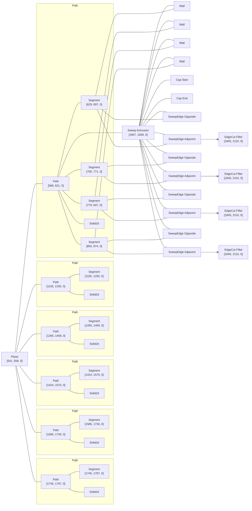

```mermaid
flowchart LR
  subgraph path2 [Path]
    2["Path<br>[566, 621, 0]"]
    3["Segment<br>[629, 697, 0]"]
    4["Segment<br>[705, 771, 0]"]
    5["Segment<br>[779, 847, 0]"]
    6["Segment<br>[855, 874, 0]"]
    7[Solid2d]
  end
  subgraph path8 [Path]
    8["Path<br>[1105, 1250, 0]"]
    9["Segment<br>[1105, 1250, 0]"]
    10[Solid2d]
  end
  subgraph path11 [Path]
    11["Path<br>[1265, 1409, 0]"]
    12["Segment<br>[1265, 1409, 0]"]
    13[Solid2d]
  end
  subgraph path14 [Path]
    14["Path<br>[1424, 1570, 0]"]
    15["Segment<br>[1424, 1570, 0]"]
    16[Solid2d]
  end
  subgraph path17 [Path]
    17["Path<br>[1585, 1730, 0]"]
    18["Segment<br>[1585, 1730, 0]"]
    19[Solid2d]
  end
  subgraph path20 [Path]
    20["Path<br>[1745, 1797, 0]"]
    21["Segment<br>[1745, 1797, 0]"]
    22[Solid2d]
  end
  1["Plane<br>[541, 558, 0]"]
  23["Sweep Extrusion<br>[1807, 1839, 0]"]
  24[Wall]
  25[Wall]
  26[Wall]
  27[Wall]
  28["Cap Start"]
  29["Cap End"]
  30["SweepEdge Opposite"]
  31["SweepEdge Adjacent"]
  32["SweepEdge Opposite"]
  33["SweepEdge Adjacent"]
  34["SweepEdge Opposite"]
  35["SweepEdge Adjacent"]
  36["SweepEdge Opposite"]
  37["SweepEdge Adjacent"]
  38["EdgeCut Fillet<br>[1845, 2110, 0]"]
  39["EdgeCut Fillet<br>[1845, 2110, 0]"]
  40["EdgeCut Fillet<br>[1845, 2110, 0]"]
  41["EdgeCut Fillet<br>[1845, 2110, 0]"]
  1 --- 2
  1 --- 8
  1 --- 11
  1 --- 14
  1 --- 17
  1 --- 20
  2 --- 3
  2 --- 4
  2 --- 5
  2 --- 6
  2 ---- 23
  2 --- 7
  3 --- 24
  3 --- 30
  3 --- 31
  4 --- 25
  4 --- 32
  4 --- 33
  5 --- 26
  5 --- 34
  5 --- 35
  6 --- 27
  6 --- 36
  6 --- 37
  8 --- 9
  8 --- 10
  11 --- 12
  11 --- 13
  14 --- 15
  14 --- 16
  17 --- 18
  17 --- 19
  20 --- 21
  20 --- 22
  23 --- 24
  23 --- 25
  23 --- 26
  23 --- 27
  23 --- 28
  23 --- 29
  23 --- 30
  23 --- 31
  23 --- 32
  23 --- 33
  23 --- 34
  23 --- 35
  23 --- 36
  23 --- 37
  37 <--x 38
  31 <--x 39
  33 <--x 40
  35 <--x 41
```
