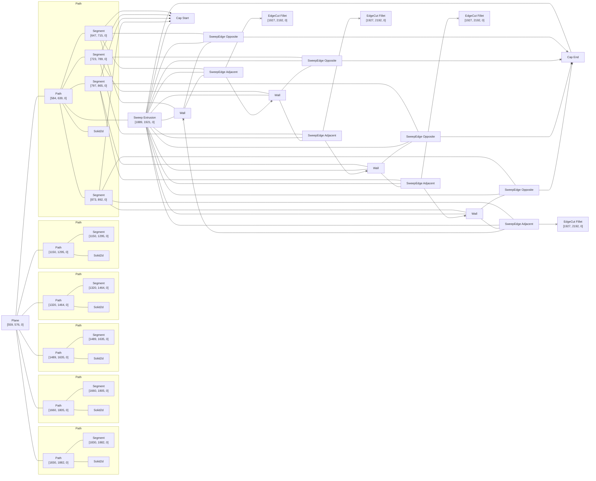

```mermaid
flowchart LR
  subgraph path2 [Path]
    2["Path<br>[584, 639, 0]"]
      %% [ProgramBodyItem { index: 5 }, VariableDeclarationDeclaration, VariableDeclarationInit, FunctionExpressionBody, FunctionExpressionBodyItem { index: 0 }, VariableDeclarationDeclaration, VariableDeclarationInit, PipeBodyItem { index: 1 }]
    8["Segment<br>[647, 715, 0]"]
      %% [ProgramBodyItem { index: 5 }, VariableDeclarationDeclaration, VariableDeclarationInit, FunctionExpressionBody, FunctionExpressionBodyItem { index: 0 }, VariableDeclarationDeclaration, VariableDeclarationInit, PipeBodyItem { index: 2 }]
    9["Segment<br>[723, 789, 0]"]
      %% [ProgramBodyItem { index: 5 }, VariableDeclarationDeclaration, VariableDeclarationInit, FunctionExpressionBody, FunctionExpressionBodyItem { index: 0 }, VariableDeclarationDeclaration, VariableDeclarationInit, PipeBodyItem { index: 3 }]
    10["Segment<br>[797, 865, 0]"]
      %% [ProgramBodyItem { index: 5 }, VariableDeclarationDeclaration, VariableDeclarationInit, FunctionExpressionBody, FunctionExpressionBodyItem { index: 0 }, VariableDeclarationDeclaration, VariableDeclarationInit, PipeBodyItem { index: 4 }]
    11["Segment<br>[873, 892, 0]"]
      %% [ProgramBodyItem { index: 5 }, VariableDeclarationDeclaration, VariableDeclarationInit, FunctionExpressionBody, FunctionExpressionBodyItem { index: 0 }, VariableDeclarationDeclaration, VariableDeclarationInit, PipeBodyItem { index: 5 }]
    20[Solid2d]
  end
  subgraph path3 [Path]
    3["Path<br>[1150, 1295, 0]"]
      %% [ProgramBodyItem { index: 9 }, VariableDeclarationDeclaration, VariableDeclarationInit, PipeBodyItem { index: 1 }, CallKwArg { index: 0 }]
    12["Segment<br>[1150, 1295, 0]"]
      %% [ProgramBodyItem { index: 9 }, VariableDeclarationDeclaration, VariableDeclarationInit, PipeBodyItem { index: 1 }, CallKwArg { index: 0 }]
    19[Solid2d]
  end
  subgraph path4 [Path]
    4["Path<br>[1320, 1464, 0]"]
      %% [ProgramBodyItem { index: 9 }, VariableDeclarationDeclaration, VariableDeclarationInit, PipeBodyItem { index: 2 }, CallKwArg { index: 0 }]
    13["Segment<br>[1320, 1464, 0]"]
      %% [ProgramBodyItem { index: 9 }, VariableDeclarationDeclaration, VariableDeclarationInit, PipeBodyItem { index: 2 }, CallKwArg { index: 0 }]
    22[Solid2d]
  end
  subgraph path5 [Path]
    5["Path<br>[1489, 1635, 0]"]
      %% [ProgramBodyItem { index: 9 }, VariableDeclarationDeclaration, VariableDeclarationInit, PipeBodyItem { index: 3 }, CallKwArg { index: 0 }]
    14["Segment<br>[1489, 1635, 0]"]
      %% [ProgramBodyItem { index: 9 }, VariableDeclarationDeclaration, VariableDeclarationInit, PipeBodyItem { index: 3 }, CallKwArg { index: 0 }]
    21[Solid2d]
  end
  subgraph path6 [Path]
    6["Path<br>[1660, 1805, 0]"]
      %% [ProgramBodyItem { index: 9 }, VariableDeclarationDeclaration, VariableDeclarationInit, PipeBodyItem { index: 4 }, CallKwArg { index: 0 }]
    15["Segment<br>[1660, 1805, 0]"]
      %% [ProgramBodyItem { index: 9 }, VariableDeclarationDeclaration, VariableDeclarationInit, PipeBodyItem { index: 4 }, CallKwArg { index: 0 }]
    17[Solid2d]
  end
  subgraph path7 [Path]
    7["Path<br>[1830, 1882, 0]"]
      %% [ProgramBodyItem { index: 9 }, VariableDeclarationDeclaration, VariableDeclarationInit, PipeBodyItem { index: 5 }, CallKwArg { index: 0 }]
    16["Segment<br>[1830, 1882, 0]"]
      %% [ProgramBodyItem { index: 9 }, VariableDeclarationDeclaration, VariableDeclarationInit, PipeBodyItem { index: 5 }, CallKwArg { index: 0 }]
    18[Solid2d]
  end
  1["Plane<br>[559, 576, 0]"]
    %% [ProgramBodyItem { index: 5 }, VariableDeclarationDeclaration, VariableDeclarationInit, FunctionExpressionBody, FunctionExpressionBodyItem { index: 0 }, VariableDeclarationDeclaration, VariableDeclarationInit, PipeBodyItem { index: 0 }]
  23["Sweep Extrusion<br>[1889, 1921, 0]"]
    %% [ProgramBodyItem { index: 9 }, VariableDeclarationDeclaration, VariableDeclarationInit, PipeBodyItem { index: 6 }]
  24[Wall]
  25[Wall]
  26[Wall]
  27[Wall]
  28["Cap Start"]
  29["Cap End"]
  30["SweepEdge Opposite"]
  31["SweepEdge Opposite"]
  32["SweepEdge Opposite"]
  33["SweepEdge Opposite"]
  34["SweepEdge Adjacent"]
  35["SweepEdge Adjacent"]
  36["SweepEdge Adjacent"]
  37["SweepEdge Adjacent"]
  38["EdgeCut Fillet<br>[1927, 2192, 0]"]
    %% [ProgramBodyItem { index: 9 }, VariableDeclarationDeclaration, VariableDeclarationInit, PipeBodyItem { index: 7 }]
  39["EdgeCut Fillet<br>[1927, 2192, 0]"]
    %% [ProgramBodyItem { index: 9 }, VariableDeclarationDeclaration, VariableDeclarationInit, PipeBodyItem { index: 7 }]
  40["EdgeCut Fillet<br>[1927, 2192, 0]"]
    %% [ProgramBodyItem { index: 9 }, VariableDeclarationDeclaration, VariableDeclarationInit, PipeBodyItem { index: 7 }]
  41["EdgeCut Fillet<br>[1927, 2192, 0]"]
    %% [ProgramBodyItem { index: 9 }, VariableDeclarationDeclaration, VariableDeclarationInit, PipeBodyItem { index: 7 }]
  1 --- 2
  1 --- 3
  1 --- 4
  1 --- 5
  1 --- 6
  1 --- 7
  2 --- 8
  2 --- 9
  2 --- 10
  2 --- 11
  2 --- 20
  2 ---- 23
  3 --- 12
  3 --- 19
  4 --- 13
  4 --- 22
  5 --- 14
  5 --- 21
  6 --- 15
  6 --- 17
  7 --- 16
  7 --- 18
  8 --- 27
  8 x--> 28
  8 --- 30
  8 --- 34
  9 --- 25
  9 x--> 28
  9 --- 31
  9 --- 35
  10 --- 24
  10 x--> 28
  10 --- 32
  10 --- 36
  11 --- 26
  11 x--> 28
  11 --- 33
  11 --- 37
  23 --- 24
  23 --- 25
  23 --- 26
  23 --- 27
  23 --- 28
  23 --- 29
  23 --- 30
  23 --- 31
  23 --- 32
  23 --- 33
  23 --- 34
  23 --- 35
  23 --- 36
  23 --- 37
  24 --- 32
  35 <--x 24
  24 --- 36
  25 --- 31
  34 <--x 25
  25 --- 35
  26 --- 33
  36 <--x 26
  26 --- 37
  27 --- 30
  27 --- 34
  37 <--x 27
  30 <--x 29
  31 <--x 29
  32 <--x 29
  33 <--x 29
  34 <--x 38
  35 <--x 39
  36 <--x 41
  37 <--x 40
```
