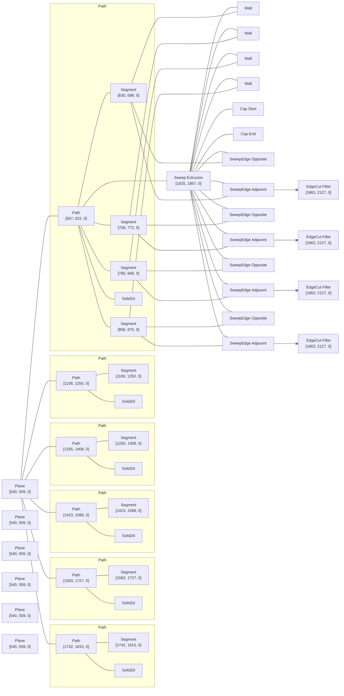

```mermaid
flowchart LR
  subgraph path7 [Path]
    7["Path<br>[567, 622, 0]"]
    8["Segment<br>[630, 698, 0]"]
    9["Segment<br>[706, 772, 0]"]
    10["Segment<br>[780, 848, 0]"]
    11["Segment<br>[856, 875, 0]"]
    12[Solid2d]
  end
  subgraph path13 [Path]
    13["Path<br>[1106, 1250, 0]"]
    14["Segment<br>[1106, 1250, 0]"]
    15[Solid2d]
  end
  subgraph path16 [Path]
    16["Path<br>[1265, 1408, 0]"]
    17["Segment<br>[1265, 1408, 0]"]
    18[Solid2d]
  end
  subgraph path19 [Path]
    19["Path<br>[1423, 1568, 0]"]
    20["Segment<br>[1423, 1568, 0]"]
    21[Solid2d]
  end
  subgraph path22 [Path]
    22["Path<br>[1583, 1727, 0]"]
    23["Segment<br>[1583, 1727, 0]"]
    24[Solid2d]
  end
  subgraph path25 [Path]
    25["Path<br>[1742, 1815, 0]"]
    26["Segment<br>[1742, 1815, 0]"]
    27[Solid2d]
  end
  1["Plane<br>[540, 559, 0]"]
  2["Plane<br>[540, 559, 0]"]
  3["Plane<br>[540, 559, 0]"]
  4["Plane<br>[540, 559, 0]"]
  5["Plane<br>[540, 559, 0]"]
  6["Plane<br>[540, 559, 0]"]
  28["Sweep Extrusion<br>[1825, 1857, 0]"]
  29[Wall]
  30[Wall]
  31[Wall]
  32[Wall]
  33["Cap Start"]
  34["Cap End"]
  35["SweepEdge Opposite"]
  36["SweepEdge Adjacent"]
  37["SweepEdge Opposite"]
  38["SweepEdge Adjacent"]
  39["SweepEdge Opposite"]
  40["SweepEdge Adjacent"]
  41["SweepEdge Opposite"]
  42["SweepEdge Adjacent"]
  43["EdgeCut Fillet<br>[1863, 2127, 0]"]
  44["EdgeCut Fillet<br>[1863, 2127, 0]"]
  45["EdgeCut Fillet<br>[1863, 2127, 0]"]
  46["EdgeCut Fillet<br>[1863, 2127, 0]"]
  1 --- 7
  1 --- 13
  1 --- 16
  1 --- 19
  1 --- 22
  1 --- 25
  7 --- 8
  7 --- 9
  7 --- 10
  7 --- 11
  7 ---- 28
  7 --- 12
  8 --- 29
  8 --- 35
  8 --- 36
  9 --- 30
  9 --- 37
  9 --- 38
  10 --- 31
  10 --- 39
  10 --- 40
  11 --- 32
  11 --- 41
  11 --- 42
  13 --- 14
  13 --- 15
  16 --- 17
  16 --- 18
  19 --- 20
  19 --- 21
  22 --- 23
  22 --- 24
  25 --- 26
  25 --- 27
  28 --- 29
  28 --- 30
  28 --- 31
  28 --- 32
  28 --- 33
  28 --- 34
  28 --- 35
  28 --- 36
  28 --- 37
  28 --- 38
  28 --- 39
  28 --- 40
  28 --- 41
  28 --- 42
  42 <--x 43
  36 <--x 44
  38 <--x 45
  40 <--x 46
```
