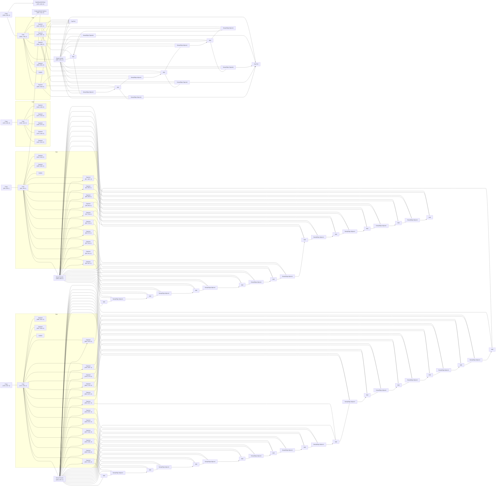

```mermaid
flowchart LR
  subgraph path6 [Path]
    6["Path<br>[406, 448, 0]"]
      %% [ProgramBodyItem { index: 5 }, VariableDeclarationDeclaration, VariableDeclarationInit, PipeBodyItem { index: 1 }]
    10["Segment<br>[454, 487, 0]"]
      %% [ProgramBodyItem { index: 5 }, VariableDeclarationDeclaration, VariableDeclarationInit, PipeBodyItem { index: 2 }]
    11["Segment<br>[493, 561, 0]"]
      %% [ProgramBodyItem { index: 5 }, VariableDeclarationDeclaration, VariableDeclarationInit, PipeBodyItem { index: 3 }]
    12["Segment<br>[567, 634, 0]"]
      %% [ProgramBodyItem { index: 5 }, VariableDeclarationDeclaration, VariableDeclarationInit, PipeBodyItem { index: 4 }]
    13["Segment<br>[640, 675, 0]"]
      %% [ProgramBodyItem { index: 5 }, VariableDeclarationDeclaration, VariableDeclarationInit, PipeBodyItem { index: 5 }]
    14["Segment<br>[681, 745, 0]"]
      %% [ProgramBodyItem { index: 5 }, VariableDeclarationDeclaration, VariableDeclarationInit, PipeBodyItem { index: 6 }]
    15["Segment<br>[751, 790, 0]"]
      %% [ProgramBodyItem { index: 5 }, VariableDeclarationDeclaration, VariableDeclarationInit, PipeBodyItem { index: 7 }]
    16["Segment<br>[796, 850, 0]"]
      %% [ProgramBodyItem { index: 5 }, VariableDeclarationDeclaration, VariableDeclarationInit, PipeBodyItem { index: 8 }]
    17["Segment<br>[856, 908, 0]"]
      %% [ProgramBodyItem { index: 5 }, VariableDeclarationDeclaration, VariableDeclarationInit, PipeBodyItem { index: 9 }]
    18["Segment<br>[914, 965, 0]"]
      %% [ProgramBodyItem { index: 5 }, VariableDeclarationDeclaration, VariableDeclarationInit, PipeBodyItem { index: 10 }]
    19["Segment<br>[971, 1007, 0]"]
      %% [ProgramBodyItem { index: 5 }, VariableDeclarationDeclaration, VariableDeclarationInit, PipeBodyItem { index: 11 }]
    20["Segment<br>[1013, 1049, 0]"]
      %% [ProgramBodyItem { index: 5 }, VariableDeclarationDeclaration, VariableDeclarationInit, PipeBodyItem { index: 12 }]
    21["Segment<br>[1055, 1062, 0]"]
      %% [ProgramBodyItem { index: 5 }, VariableDeclarationDeclaration, VariableDeclarationInit, PipeBodyItem { index: 13 }]
    48[Solid2d]
  end
  subgraph path7 [Path]
    7["Path<br>[1158, 1212, 0]"]
      %% [ProgramBodyItem { index: 6 }, VariableDeclarationDeclaration, VariableDeclarationInit, PipeBodyItem { index: 1 }]
    22["Segment<br>[1218, 1266, 0]"]
      %% [ProgramBodyItem { index: 6 }, VariableDeclarationDeclaration, VariableDeclarationInit, PipeBodyItem { index: 2 }]
    23["Segment<br>[1272, 1324, 0]"]
      %% [ProgramBodyItem { index: 6 }, VariableDeclarationDeclaration, VariableDeclarationInit, PipeBodyItem { index: 3 }]
    24["Segment<br>[1330, 1373, 0]"]
      %% [ProgramBodyItem { index: 6 }, VariableDeclarationDeclaration, VariableDeclarationInit, PipeBodyItem { index: 4 }]
    25["Segment<br>[1379, 1445, 0]"]
      %% [ProgramBodyItem { index: 6 }, VariableDeclarationDeclaration, VariableDeclarationInit, PipeBodyItem { index: 5 }]
    26["Segment<br>[1451, 1522, 0]"]
      %% [ProgramBodyItem { index: 6 }, VariableDeclarationDeclaration, VariableDeclarationInit, PipeBodyItem { index: 6 }]
  end
  subgraph path8 [Path]
    8["Path<br>[1638, 1736, 0]"]
      %% [ProgramBodyItem { index: 7 }, VariableDeclarationDeclaration, VariableDeclarationInit, PipeBodyItem { index: 1 }]
    27["Segment<br>[1742, 1907, 0]"]
      %% [ProgramBodyItem { index: 7 }, VariableDeclarationDeclaration, VariableDeclarationInit, PipeBodyItem { index: 2 }]
    28["Segment<br>[1913, 1955, 0]"]
      %% [ProgramBodyItem { index: 7 }, VariableDeclarationDeclaration, VariableDeclarationInit, PipeBodyItem { index: 3 }]
    29["Segment<br>[1961, 1999, 0]"]
      %% [ProgramBodyItem { index: 7 }, VariableDeclarationDeclaration, VariableDeclarationInit, PipeBodyItem { index: 4 }]
    30["Segment<br>[2005, 2048, 0]"]
      %% [ProgramBodyItem { index: 7 }, VariableDeclarationDeclaration, VariableDeclarationInit, PipeBodyItem { index: 5 }]
    31["Segment<br>[2054, 2061, 0]"]
      %% [ProgramBodyItem { index: 7 }, VariableDeclarationDeclaration, VariableDeclarationInit, PipeBodyItem { index: 6 }]
    47[Solid2d]
  end
  subgraph path9 [Path]
    9["Path<br>[2173, 2215, 0]"]
      %% [ProgramBodyItem { index: 8 }, VariableDeclarationDeclaration, VariableDeclarationInit, PipeBodyItem { index: 1 }]
    32["Segment<br>[2221, 2254, 0]"]
      %% [ProgramBodyItem { index: 8 }, VariableDeclarationDeclaration, VariableDeclarationInit, PipeBodyItem { index: 2 }]
    33["Segment<br>[2260, 2328, 0]"]
      %% [ProgramBodyItem { index: 8 }, VariableDeclarationDeclaration, VariableDeclarationInit, PipeBodyItem { index: 3 }]
    34["Segment<br>[2334, 2401, 0]"]
      %% [ProgramBodyItem { index: 8 }, VariableDeclarationDeclaration, VariableDeclarationInit, PipeBodyItem { index: 4 }]
    35["Segment<br>[2407, 2442, 0]"]
      %% [ProgramBodyItem { index: 8 }, VariableDeclarationDeclaration, VariableDeclarationInit, PipeBodyItem { index: 5 }]
    36["Segment<br>[2448, 2512, 0]"]
      %% [ProgramBodyItem { index: 8 }, VariableDeclarationDeclaration, VariableDeclarationInit, PipeBodyItem { index: 6 }]
    37["Segment<br>[2518, 2557, 0]"]
      %% [ProgramBodyItem { index: 8 }, VariableDeclarationDeclaration, VariableDeclarationInit, PipeBodyItem { index: 7 }]
    38["Segment<br>[2563, 2617, 0]"]
      %% [ProgramBodyItem { index: 8 }, VariableDeclarationDeclaration, VariableDeclarationInit, PipeBodyItem { index: 8 }]
    39["Segment<br>[2623, 2675, 0]"]
      %% [ProgramBodyItem { index: 8 }, VariableDeclarationDeclaration, VariableDeclarationInit, PipeBodyItem { index: 9 }]
    40["Segment<br>[2681, 2733, 0]"]
      %% [ProgramBodyItem { index: 8 }, VariableDeclarationDeclaration, VariableDeclarationInit, PipeBodyItem { index: 10 }]
    41["Segment<br>[2739, 2778, 0]"]
      %% [ProgramBodyItem { index: 8 }, VariableDeclarationDeclaration, VariableDeclarationInit, PipeBodyItem { index: 11 }]
    42["Segment<br>[2784, 2837, 0]"]
      %% [ProgramBodyItem { index: 8 }, VariableDeclarationDeclaration, VariableDeclarationInit, PipeBodyItem { index: 12 }]
    43["Segment<br>[2843, 2879, 0]"]
      %% [ProgramBodyItem { index: 8 }, VariableDeclarationDeclaration, VariableDeclarationInit, PipeBodyItem { index: 13 }]
    44["Segment<br>[2885, 2921, 0]"]
      %% [ProgramBodyItem { index: 8 }, VariableDeclarationDeclaration, VariableDeclarationInit, PipeBodyItem { index: 14 }]
    45["Segment<br>[2927, 2934, 0]"]
      %% [ProgramBodyItem { index: 8 }, VariableDeclarationDeclaration, VariableDeclarationInit, PipeBodyItem { index: 15 }]
    46[Solid2d]
  end
  1["Plane<br>[383, 400, 0]"]
    %% [ProgramBodyItem { index: 5 }, VariableDeclarationDeclaration, VariableDeclarationInit, PipeBodyItem { index: 0 }]
  2["Plane<br>[1135, 1152, 0]"]
    %% [ProgramBodyItem { index: 6 }, VariableDeclarationDeclaration, VariableDeclarationInit, PipeBodyItem { index: 0 }]
  3["Plane<br>[1590, 1631, 0]"]
    %% [ProgramBodyItem { index: 7 }, VariableDeclarationDeclaration, VariableDeclarationInit, PipeBodyItem { index: 0 }, CallKwUnlabeledArg]
  4["Plane<br>[2150, 2167, 0]"]
    %% [ProgramBodyItem { index: 8 }, VariableDeclarationDeclaration, VariableDeclarationInit, PipeBodyItem { index: 0 }]
  5["StartSketchOnPlane<br>[1576, 1632, 0]"]
    %% [ProgramBodyItem { index: 7 }, VariableDeclarationDeclaration, VariableDeclarationInit, PipeBodyItem { index: 0 }]
  49["Sweep Revolve<br>[1068, 1085, 0]"]
    %% [ProgramBodyItem { index: 5 }, VariableDeclarationDeclaration, VariableDeclarationInit, PipeBodyItem { index: 14 }]
  50["Sweep Sweep<br>[2067, 2091, 0]"]
    %% [ProgramBodyItem { index: 7 }, VariableDeclarationDeclaration, VariableDeclarationInit, PipeBodyItem { index: 7 }]
  51["Sweep Revolve<br>[2940, 2957, 0]"]
    %% [ProgramBodyItem { index: 8 }, VariableDeclarationDeclaration, VariableDeclarationInit, PipeBodyItem { index: 16 }]
  52["CompositeSolid Subtract<br>[2097, 2112, 0]"]
    %% [ProgramBodyItem { index: 7 }, VariableDeclarationDeclaration, VariableDeclarationInit, PipeBodyItem { index: 8 }]
  53[Wall]
    %% face_code_ref=Missing NodePath
  54[Wall]
    %% face_code_ref=Missing NodePath
  55[Wall]
    %% face_code_ref=Missing NodePath
  56[Wall]
    %% face_code_ref=Missing NodePath
  57[Wall]
    %% face_code_ref=Missing NodePath
  58[Wall]
    %% face_code_ref=Missing NodePath
  59[Wall]
    %% face_code_ref=Missing NodePath
  60[Wall]
    %% face_code_ref=Missing NodePath
  61[Wall]
    %% face_code_ref=Missing NodePath
  62[Wall]
    %% face_code_ref=Missing NodePath
  63[Wall]
    %% face_code_ref=Missing NodePath
  64[Wall]
    %% face_code_ref=Missing NodePath
  65[Wall]
    %% face_code_ref=Missing NodePath
  66[Wall]
    %% face_code_ref=Missing NodePath
  67[Wall]
    %% face_code_ref=Missing NodePath
  68[Wall]
    %% face_code_ref=Missing NodePath
  69[Wall]
    %% face_code_ref=Missing NodePath
  70[Wall]
    %% face_code_ref=Missing NodePath
  71[Wall]
    %% face_code_ref=Missing NodePath
  72[Wall]
    %% face_code_ref=Missing NodePath
  73[Wall]
    %% face_code_ref=Missing NodePath
  74[Wall]
    %% face_code_ref=Missing NodePath
  75[Wall]
    %% face_code_ref=Missing NodePath
  76[Wall]
    %% face_code_ref=Missing NodePath
  77[Wall]
    %% face_code_ref=Missing NodePath
  78[Wall]
    %% face_code_ref=Missing NodePath
  79["Cap End"]
    %% face_code_ref=Missing NodePath
  80["Cap End"]
    %% face_code_ref=Missing NodePath
  81["SweepEdge Opposite"]
  82["SweepEdge Opposite"]
  83["SweepEdge Opposite"]
  84["SweepEdge Opposite"]
  85["SweepEdge Adjacent"]
  86["SweepEdge Adjacent"]
  87["SweepEdge Adjacent"]
  88["SweepEdge Adjacent"]
  89["SweepEdge Adjacent"]
  90["SweepEdge Adjacent"]
  91["SweepEdge Adjacent"]
  92["SweepEdge Adjacent"]
  93["SweepEdge Adjacent"]
  94["SweepEdge Adjacent"]
  95["SweepEdge Adjacent"]
  96["SweepEdge Adjacent"]
  97["SweepEdge Adjacent"]
  98["SweepEdge Adjacent"]
  99["SweepEdge Adjacent"]
  100["SweepEdge Adjacent"]
  101["SweepEdge Adjacent"]
  102["SweepEdge Adjacent"]
  103["SweepEdge Adjacent"]
  104["SweepEdge Adjacent"]
  105["SweepEdge Adjacent"]
  106["SweepEdge Adjacent"]
  107["SweepEdge Adjacent"]
  108["SweepEdge Adjacent"]
  1 --- 6
  2 --- 7
  3 <--x 5
  3 --- 8
  4 --- 9
  6 --- 10
  6 --- 11
  6 --- 12
  6 --- 13
  6 --- 14
  6 --- 15
  6 --- 16
  6 --- 17
  6 --- 18
  6 --- 19
  6 --- 20
  6 --- 21
  6 --- 48
  6 ---- 49
  6 --- 52
  7 --- 22
  7 --- 23
  7 --- 24
  7 --- 25
  7 --- 26
  8 --- 27
  8 --- 28
  8 --- 29
  8 --- 30
  8 --- 31
  8 --- 47
  8 ---- 50
  8 --- 52
  9 --- 32
  9 --- 33
  9 --- 34
  9 --- 35
  9 --- 36
  9 --- 37
  9 --- 38
  9 --- 39
  9 --- 40
  9 --- 41
  9 --- 42
  9 --- 43
  9 --- 44
  9 --- 45
  9 --- 46
  9 ---- 51
  49 <--x 10
  10 --- 72
  10 --- 96
  49 <--x 11
  11 --- 69
  11 --- 97
  49 <--x 12
  12 --- 68
  12 --- 98
  49 <--x 13
  13 --- 70
  13 --- 99
  49 <--x 14
  14 --- 67
  14 --- 100
  49 <--x 15
  15 --- 66
  15 --- 101
  49 <--x 16
  16 --- 71
  16 --- 102
  49 <--x 17
  17 --- 74
  17 --- 103
  49 <--x 18
  18 --- 73
  18 --- 104
  49 <--x 19
  19 --- 65
  27 --- 77
  27 x--> 80
  27 --- 81
  27 --- 105
  28 --- 78
  28 x--> 80
  28 --- 82
  28 --- 106
  29 --- 76
  29 x--> 80
  29 --- 83
  29 --- 107
  30 --- 75
  30 x--> 80
  30 --- 84
  30 --- 108
  51 <--x 32
  32 --- 53
  32 --- 85
  51 <--x 33
  33 --- 55
  33 --- 86
  51 <--x 34
  34 --- 62
  34 --- 87
  51 <--x 35
  35 --- 64
  35 --- 88
  51 <--x 36
  36 --- 56
  36 --- 89
  51 <--x 37
  37 --- 57
  37 --- 90
  51 <--x 38
  38 --- 54
  38 --- 91
  51 <--x 39
  39 --- 58
  39 --- 92
  51 <--x 40
  40 --- 61
  40 --- 93
  51 <--x 41
  41 --- 60
  41 --- 94
  51 <--x 42
  42 --- 63
  42 --- 95
  51 <--x 43
  43 --- 59
  49 --- 65
  49 --- 66
  49 --- 67
  49 --- 68
  49 --- 69
  49 --- 70
  49 --- 71
  49 --- 72
  49 --- 73
  49 --- 74
  49 --- 96
  49 --- 97
  49 --- 98
  49 --- 99
  49 --- 100
  49 --- 101
  49 --- 102
  49 --- 103
  49 --- 104
  50 --- 75
  50 --- 76
  50 --- 77
  50 --- 78
  50 --- 79
  50 --- 80
  50 --- 81
  50 --- 82
  50 --- 83
  50 --- 84
  50 --- 105
  50 --- 106
  50 --- 107
  50 --- 108
  51 --- 53
  51 --- 54
  51 --- 55
  51 --- 56
  51 --- 57
  51 --- 58
  51 --- 59
  51 --- 60
  51 --- 61
  51 --- 62
  51 --- 63
  51 --- 64
  51 --- 85
  51 --- 86
  51 --- 87
  51 --- 88
  51 --- 89
  51 --- 90
  51 --- 91
  51 --- 92
  51 --- 93
  51 --- 94
  51 --- 95
  53 --- 85
  90 <--x 54
  54 --- 91
  85 <--x 55
  55 --- 86
  88 <--x 56
  56 --- 89
  89 <--x 57
  57 --- 90
  91 <--x 58
  58 --- 92
  95 <--x 59
  93 <--x 60
  60 --- 94
  92 <--x 61
  61 --- 93
  86 <--x 62
  62 --- 87
  94 <--x 63
  63 --- 95
  87 <--x 64
  64 --- 88
  104 <--x 65
  100 <--x 66
  66 --- 101
  99 <--x 67
  67 --- 100
  97 <--x 68
  68 --- 98
  96 <--x 69
  69 --- 97
  98 <--x 70
  70 --- 99
  101 <--x 71
  71 --- 102
  72 --- 96
  103 <--x 73
  73 --- 104
  102 <--x 74
  74 --- 103
  75 --- 84
  105 <--x 75
  75 --- 108
  76 --- 83
  76 --- 107
  108 <--x 76
  77 --- 81
  77 --- 105
  106 <--x 77
  78 --- 82
  78 --- 106
  107 <--x 78
  81 <--x 79
  82 <--x 79
  83 <--x 79
  84 <--x 79
```
