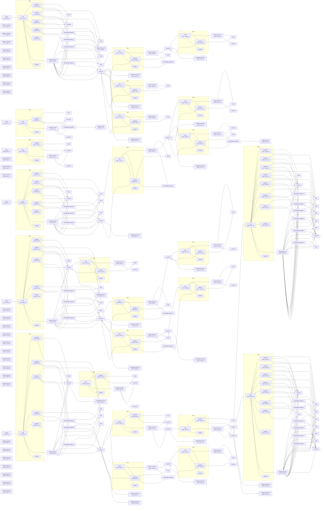

```mermaid
flowchart LR
  subgraph path2 [Path]
    2["Path<br>[224, 279, 6]"]
    3["Segment<br>[285, 365, 6]"]
    4["Segment<br>[371, 483, 6]"]
    5["Segment<br>[489, 606, 6]"]
    6["Segment<br>[612, 697, 6]"]
    7["Segment<br>[703, 710, 6]"]
    8[Solid2d]
  end
  subgraph path24 [Path]
    24["Path<br>[1151, 1208, 6]"]
    25["Segment<br>[1151, 1208, 6]"]
    26[Solid2d]
  end
  subgraph path31 [Path]
    31["Path<br>[1411, 1448, 6]"]
    32["Segment<br>[1411, 1448, 6]"]
    33[Solid2d]
  end
  subgraph path37 [Path]
    37["Path<br>[1585, 1725, 6]"]
    38["Segment<br>[1585, 1725, 6]"]
    39[Solid2d]
  end
  subgraph path45 [Path]
    45["Path<br>[1976, 2116, 6]"]
    46["Segment<br>[1976, 2116, 6]"]
    47[Solid2d]
  end
  subgraph path54 [Path]
    54["Path<br>[203, 263, 7]"]
    55["Segment<br>[203, 263, 7]"]
    56[Solid2d]
  end
  subgraph path63 [Path]
    63["Path<br>[493, 529, 7]"]
    64["Segment<br>[535, 572, 7]"]
    65["Segment<br>[578, 633, 7]"]
    66["Segment<br>[639, 688, 7]"]
    67["Segment<br>[694, 750, 7]"]
    68["Segment<br>[756, 763, 7]"]
    69[Solid2d]
  end
  subgraph path80 [Path]
    80["Path<br>[865, 1040, 7]"]
    81["Segment<br>[865, 1040, 7]"]
    82[Solid2d]
  end
  subgraph path87 [Path]
    87["Path<br>[1249, 1396, 7]"]
    88["Segment<br>[1249, 1396, 7]"]
    89[Solid2d]
  end
  subgraph path96 [Path]
    96["Path<br>[1718, 1892, 7]"]
    97["Segment<br>[1718, 1892, 7]"]
    98[Solid2d]
  end
  subgraph path104 [Path]
    104["Path<br>[2117, 2157, 7]"]
    105["Segment<br>[2117, 2157, 7]"]
    106[Solid2d]
  end
  subgraph path114 [Path]
    114["Path<br>[251, 394, 8]"]
    115["Segment<br>[400, 483, 8]"]
    116["Segment<br>[489, 541, 8]"]
    117["Segment<br>[547, 630, 8]"]
    118["Segment<br>[636, 692, 8]"]
    119["Segment<br>[698, 705, 8]"]
    120[Solid2d]
  end
  subgraph path131 [Path]
    131["Path<br>[826, 890, 8]"]
    132["Segment<br>[826, 890, 8]"]
    133[Solid2d]
  end
  subgraph path138 [Path]
    138["Path<br>[1064, 1272, 8]"]
    139["Segment<br>[1064, 1272, 8]"]
    140[Solid2d]
  end
  subgraph path145 [Path]
    145["Path<br>[1480, 1524, 8]"]
    146["Segment<br>[1480, 1524, 8]"]
    147[Solid2d]
  end
  subgraph path158 [Path]
    158["Path<br>[1767, 1959, 8]"]
    159["Segment<br>[1767, 1959, 8]"]
    160[Solid2d]
  end
  subgraph path167 [Path]
    167["Path<br>[2317, 2492, 8]"]
    168["Segment<br>[2317, 2492, 8]"]
    169[Solid2d]
  end
  subgraph path174 [Path]
    174["Path<br>[271, 504, 9]"]
    175["Segment<br>[510, 596, 9]"]
    176["Segment<br>[602, 656, 9]"]
    177["Segment<br>[662, 748, 9]"]
    178["Segment<br>[754, 824, 9]"]
    179["Segment<br>[830, 837, 9]"]
    180[Solid2d]
  end
  subgraph path191 [Path]
    191["Path<br>[956, 1165, 9]"]
    192["Segment<br>[956, 1165, 9]"]
    193[Solid2d]
  end
  subgraph path198 [Path]
    198["Path<br>[1375, 1564, 9]"]
    199["Segment<br>[1375, 1564, 9]"]
    200[Solid2d]
  end
  subgraph path211 [Path]
    211["Path<br>[1990, 2276, 9]"]
    212["Segment<br>[1990, 2276, 9]"]
    213[Solid2d]
  end
  subgraph path218 [Path]
    218["Path<br>[2380, 2664, 9]"]
    219["Segment<br>[2380, 2664, 9]"]
    220[Solid2d]
  end
  subgraph path225 [Path]
    225["Path<br>[2823, 2861, 9]"]
    226["Segment<br>[2823, 2861, 9]"]
    227[Solid2d]
  end
  subgraph path232 [Path]
    232["Path<br>[2996, 3221, 9]"]
    233["Segment<br>[3227, 3295, 9]"]
    234["Segment<br>[3301, 3411, 9]"]
    235["Segment<br>[3417, 3485, 9]"]
    236["Segment<br>[3491, 3567, 9]"]
    237["Segment<br>[3573, 3649, 9]"]
    238["Segment<br>[3655, 3729, 9]"]
    239["Segment<br>[3735, 3791, 9]"]
    240["Segment<br>[3797, 3804, 9]"]
    241[Solid2d]
  end
  subgraph path258 [Path]
    258["Path<br>[3938, 4163, 9]"]
    259["Segment<br>[4169, 4239, 9]"]
    260["Segment<br>[4245, 4360, 9]"]
    261["Segment<br>[4366, 4436, 9]"]
    262["Segment<br>[4442, 4520, 9]"]
    263["Segment<br>[4526, 4604, 9]"]
    264["Segment<br>[4610, 4686, 9]"]
    265["Segment<br>[4692, 4748, 9]"]
    266["Segment<br>[4754, 4761, 9]"]
    267[Solid2d]
  end
  1["Plane<br>[201, 218, 6]"]
  9["Sweep Extrusion<br>[724, 771, 6]"]
  10[Wall]
  11[Wall]
  12[Wall]
  13[Wall]
  14["Cap Start"]
  15["Cap End"]
  16["SweepEdge Opposite"]
  17["SweepEdge Opposite"]
  18["SweepEdge Opposite"]
  19["SweepEdge Adjacent"]
  20["EdgeCut Chamfer<br>[777, 1054, 6]"]
  21["EdgeCut Chamfer<br>[777, 1054, 6]"]
  22["EdgeCut Chamfer<br>[777, 1054, 6]"]
  23["EdgeCut Chamfer<br>[777, 1054, 6]"]
  27["Sweep Extrusion<br>[1222, 1288, 6]"]
  28[Wall]
  29["Cap End"]
  30["SweepEdge Opposite"]
  34["Sweep Extrusion<br>[1462, 1492, 6]"]
  35[Wall]
  36["Cap End"]
  40["Sweep Extrusion<br>[1873, 1920, 6]"]
  41[Wall]
  42["Sweep Extrusion<br>[1873, 1920, 6]"]
  43["Sweep Extrusion<br>[1873, 1920, 6]"]
  44["Sweep Extrusion<br>[1873, 1920, 6]"]
  48["Sweep Extrusion<br>[2252, 2299, 6]"]
  49[Wall]
  50["Sweep Extrusion<br>[2252, 2299, 6]"]
  51["Sweep Extrusion<br>[2252, 2299, 6]"]
  52["Sweep Extrusion<br>[2252, 2299, 6]"]
  53["Plane<br>[174, 197, 7]"]
  57["Sweep Extrusion<br>[277, 315, 7]"]
  58[Wall]
  59["Cap Start"]
  60["Cap End"]
  61["SweepEdge Opposite"]
  62["Plane<br>[464, 487, 7]"]
  70["Sweep Extrusion<br>[778, 808, 7]"]
  71[Wall]
  72[Wall]
  73[Wall]
  74[Wall]
  75["Cap Start"]
  76["Cap End"]
  77["SweepEdge Opposite"]
  78["SweepEdge Opposite"]
  79["SweepEdge Opposite"]
  83["Sweep Extrusion<br>[1054, 1086, 7]"]
  84[Wall]
  85["Cap End"]
  86["SweepEdge Opposite"]
  90["Sweep Extrusion<br>[1629, 1661, 7]"]
  91[Wall]
  92["Cap End"]
  93["Sweep Extrusion<br>[1629, 1661, 7]"]
  94["Sweep Extrusion<br>[1629, 1661, 7]"]
  95["Sweep Extrusion<br>[1629, 1661, 7]"]
  99["Sweep Extrusion<br>[1906, 1939, 7]"]
  100[Wall]
  101["Cap End"]
  102["SweepEdge Opposite"]
  103["Plane<br>[2088, 2111, 7]"]
  107["Sweep Extrusion<br>[2159, 2190, 7]"]
  108[Wall]
  109["Cap Start"]
  110["Cap End"]
  111["EdgeCut Fillet<br>[321, 383, 7]"]
  112["EdgeCut Fillet<br>[1945, 2007, 7]"]
  113["Plane<br>[222, 245, 8]"]
  121["Sweep Extrusion<br>[719, 767, 8]"]
  122[Wall]
  123[Wall]
  124[Wall]
  125[Wall]
  126["Cap Start"]
  127["Cap End"]
  128["SweepEdge Opposite"]
  129["SweepEdge Opposite"]
  130["SweepEdge Opposite"]
  134["Sweep Extrusion<br>[905, 938, 8]"]
  135[Wall]
  136["Cap End"]
  137["SweepEdge Opposite"]
  141["Sweep Extrusion<br>[1287, 1317, 8]"]
  142[Wall]
  143["Cap End"]
  144["SweepEdge Opposite"]
  148["Sweep Extrusion<br>[1677, 1710, 8]"]
  149[Wall]
  150["Cap End"]
  151["Sweep Extrusion<br>[1677, 1710, 8]"]
  152["Sweep Extrusion<br>[1677, 1710, 8]"]
  153["Sweep Extrusion<br>[1677, 1710, 8]"]
  154["Sweep Extrusion<br>[1677, 1710, 8]"]
  155["Sweep Extrusion<br>[1677, 1710, 8]"]
  156["Sweep Extrusion<br>[1677, 1710, 8]"]
  157["Sweep Extrusion<br>[1677, 1710, 8]"]
  161["Sweep Extrusion<br>[2227, 2260, 8]"]
  162[Wall]
  163["Cap End"]
  164["Sweep Extrusion<br>[2227, 2260, 8]"]
  165["Sweep Extrusion<br>[2227, 2260, 8]"]
  166["Sweep Extrusion<br>[2227, 2260, 8]"]
  170["Sweep Extrusion<br>[2494, 2524, 8]"]
  171[Wall]
  172["Cap End"]
  173["Plane<br>[242, 265, 9]"]
  181["Sweep Extrusion<br>[851, 899, 9]"]
  182[Wall]
  183[Wall]
  184[Wall]
  185[Wall]
  186["Cap Start"]
  187["Cap End"]
  188["SweepEdge Opposite"]
  189["SweepEdge Opposite"]
  190["SweepEdge Opposite"]
  194["Sweep Extrusion<br>[1180, 1213, 9]"]
  195[Wall]
  196["Cap End"]
  197["SweepEdge Opposite"]
  201["Sweep Extrusion<br>[1829, 1862, 9]"]
  202[Wall]
  203["Cap End"]
  204["Sweep Extrusion<br>[1829, 1862, 9]"]
  205["Sweep Extrusion<br>[1829, 1862, 9]"]
  206["Sweep Extrusion<br>[1829, 1862, 9]"]
  207["Sweep Extrusion<br>[1829, 1862, 9]"]
  208["Sweep Extrusion<br>[1829, 1862, 9]"]
  209["Sweep Extrusion<br>[1829, 1862, 9]"]
  210["Sweep Extrusion<br>[1829, 1862, 9]"]
  214["Sweep Extrusion<br>[2290, 2323, 9]"]
  215[Wall]
  216["Cap Start"]
  217["Cap End"]
  221["Sweep Extrusion<br>[2679, 2712, 9]"]
  222[Wall]
  223["Cap Start"]
  224["Cap End"]
  228["Sweep Extrusion<br>[2876, 2910, 9]"]
  229[Wall]
  230["Cap Start"]
  231["Cap End"]
  242["Sweep Extrusion<br>[3819, 3852, 9]"]
  243[Wall]
  244[Wall]
  245[Wall]
  246[Wall]
  247[Wall]
  248[Wall]
  249[Wall]
  250["Cap Start"]
  251["Cap End"]
  252["SweepEdge Opposite"]
  253["SweepEdge Opposite"]
  254["SweepEdge Opposite"]
  255["SweepEdge Opposite"]
  256["SweepEdge Opposite"]
  257["SweepEdge Opposite"]
  268["Sweep Extrusion<br>[4763, 4796, 9]"]
  269[Wall]
  270[Wall]
  271[Wall]
  272[Wall]
  273[Wall]
  274[Wall]
  275[Wall]
  276["Cap Start"]
  277["Cap End"]
  278["SweepEdge Opposite"]
  279["SweepEdge Opposite"]
  280["SweepEdge Opposite"]
  281["SweepEdge Opposite"]
  282["SweepEdge Opposite"]
  283["SweepEdge Opposite"]
  284["StartSketchOnFace<br>[1108, 1145, 6]"]
  285["StartSketchOnFace<br>[1368, 1405, 6]"]
  286["StartSketchOnFace<br>[1542, 1579, 6]"]
  287["StartSketchOnFace<br>[1933, 1970, 6]"]
  288["StartSketchOnFace<br>[822, 859, 7]"]
  289["StartSketchOnFace<br>[1206, 1243, 7]"]
  290["StartSketchOnFace<br>[1675, 1712, 7]"]
  291["StartSketchOnFace<br>[781, 820, 8]"]
  292["StartSketchOnFace<br>[1019, 1058, 8]"]
  293["StartSketchOnFace<br>[1437, 1474, 8]"]
  294["StartSketchOnFace<br>[1724, 1761, 8]"]
  295["StartSketchOnFace<br>[2274, 2311, 8]"]
  296["StartSketchOnFace<br>[913, 950, 9]"]
  297["StartSketchOnFace<br>[1332, 1369, 9]"]
  298["StartSketchOnFace<br>[1945, 1984, 9]"]
  299["StartSketchOnFace<br>[2337, 2374, 9]"]
  300["StartSketchOnFace<br>[2778, 2817, 9]"]
  301["StartSketchOnFace<br>[2951, 2990, 9]"]
  302["StartSketchOnFace<br>[3893, 3932, 9]"]
  1 --- 2
  2 --- 3
  2 --- 4
  2 --- 5
  2 --- 6
  2 --- 7
  2 ---- 9
  2 --- 8
  3 --- 10
  3 --- 19
  3 x--> 14
  4 --- 11
  4 --- 16
  4 x--> 14
  5 --- 12
  5 --- 17
  5 x--> 14
  6 --- 13
  6 --- 18
  6 x--> 14
  9 --- 10
  9 --- 11
  9 --- 12
  9 --- 13
  9 --- 14
  9 --- 15
  9 --- 16
  9 --- 17
  9 --- 18
  9 --- 19
  15 --- 24
  15 --- 37
  15 --- 45
  16 <--x 11
  16 <--x 15
  17 <--x 12
  17 <--x 15
  18 <--x 13
  18 <--x 15
  19 <--x 20
  24 --- 25
  24 ---- 27
  24 --- 26
  25 --- 28
  25 --- 30
  25 <--x 15
  27 --- 28
  27 --- 29
  27 --- 30
  29 --- 31
  31 --- 32
  31 ---- 34
  31 --- 33
  32 --- 35
  32 <--x 29
  34 --- 35
  34 --- 36
  37 --- 38
  37 ---- 40
  37 --- 39
  38 --- 41
  38 <--x 15
  40 --- 41
  45 --- 46
  45 ---- 48
  45 --- 47
  46 --- 49
  46 <--x 15
  48 --- 49
  53 --- 54
  54 --- 55
  54 ---- 57
  54 --- 56
  55 --- 58
  55 --- 61
  55 x--> 59
  57 --- 58
  57 --- 59
  57 --- 60
  57 --- 61
  62 --- 63
  63 --- 64
  63 --- 65
  63 --- 66
  63 --- 67
  63 --- 68
  63 ---- 70
  63 --- 69
  64 --- 71
  64 x--> 75
  65 --- 72
  65 --- 77
  65 x--> 75
  66 --- 73
  66 --- 78
  66 x--> 75
  67 --- 74
  67 --- 79
  67 x--> 75
  70 --- 71
  70 --- 72
  70 --- 73
  70 --- 74
  70 --- 75
  70 --- 76
  70 --- 77
  70 --- 78
  70 --- 79
  76 --- 80
  77 <--x 72
  77 <--x 76
  78 <--x 73
  78 <--x 76
  79 <--x 74
  79 <--x 76
  80 --- 81
  80 ---- 83
  80 --- 82
  81 --- 84
  81 --- 86
  81 <--x 76
  83 --- 84
  83 --- 85
  83 --- 86
  85 --- 87
  85 --- 96
  87 --- 88
  87 ---- 90
  87 --- 89
  88 --- 91
  88 <--x 85
  90 --- 91
  90 --- 92
  96 --- 97
  96 ---- 99
  96 --- 98
  97 --- 100
  97 --- 102
  97 <--x 85
  99 --- 100
  99 --- 101
  99 --- 102
  103 --- 104
  104 --- 105
  104 ---- 107
  104 --- 106
  105 --- 108
  105 x--> 110
  107 --- 108
  107 --- 109
  107 --- 110
  61 <--x 111
  102 <--x 112
  113 --- 114
  114 --- 115
  114 --- 116
  114 --- 117
  114 --- 118
  114 --- 119
  114 ---- 121
  114 --- 120
  115 --- 122
  115 x--> 127
  116 --- 123
  116 --- 128
  116 x--> 127
  117 --- 124
  117 --- 129
  117 x--> 127
  118 --- 125
  118 --- 130
  118 x--> 127
  121 --- 122
  121 --- 123
  121 --- 124
  121 --- 125
  121 --- 126
  121 --- 127
  121 --- 128
  121 --- 129
  121 --- 130
  126 --- 131
  126 --- 138
  127 --- 167
  128 <--x 123
  128 <--x 126
  129 <--x 124
  129 <--x 126
  130 <--x 125
  130 <--x 126
  131 --- 132
  131 ---- 134
  131 --- 133
  132 --- 135
  132 --- 137
  132 <--x 126
  134 --- 135
  134 --- 136
  134 --- 137
  136 --- 145
  138 --- 139
  138 ---- 141
  138 --- 140
  139 --- 142
  139 --- 144
  139 <--x 126
  141 --- 142
  141 --- 143
  141 --- 144
  143 --- 158
  145 --- 146
  145 ---- 148
  145 --- 147
  146 --- 149
  146 <--x 136
  148 --- 149
  148 --- 150
  158 --- 159
  158 ---- 161
  158 --- 160
  159 --- 162
  159 <--x 143
  161 --- 162
  161 --- 163
  167 --- 168
  167 ---- 170
  167 --- 169
  168 --- 171
  168 <--x 127
  170 --- 171
  170 --- 172
  173 --- 174
  174 --- 175
  174 --- 176
  174 --- 177
  174 --- 178
  174 --- 179
  174 ---- 181
  174 --- 180
  175 --- 182
  175 x--> 186
  176 --- 183
  176 --- 188
  176 x--> 186
  177 --- 184
  177 --- 189
  177 x--> 186
  178 --- 185
  178 --- 190
  178 x--> 186
  181 --- 182
  181 --- 183
  181 --- 184
  181 --- 185
  181 --- 186
  181 --- 187
  181 --- 188
  181 --- 189
  181 --- 190
  186 --- 211
  187 --- 191
  187 --- 218
  188 <--x 183
  188 <--x 187
  189 <--x 184
  189 <--x 187
  190 <--x 185
  190 <--x 187
  191 --- 192
  191 ---- 194
  191 --- 193
  192 --- 195
  192 --- 197
  192 <--x 187
  194 --- 195
  194 --- 196
  194 --- 197
  196 --- 198
  198 --- 199
  198 ---- 201
  198 --- 200
  199 --- 202
  199 <--x 196
  201 --- 202
  201 --- 203
  211 --- 212
  211 ---- 214
  211 --- 213
  212 --- 215
  212 x--> 217
  214 --- 215
  214 --- 216
  214 --- 217
  218 --- 219
  218 ---- 221
  218 --- 220
  219 --- 222
  219 x--> 224
  221 --- 222
  221 --- 223
  221 --- 224
  223 --- 225
  225 --- 226
  225 ---- 228
  225 --- 227
  226 --- 229
  226 x--> 231
  228 --- 229
  228 --- 230
  228 --- 231
  230 --- 232
  230 --- 258
  232 --- 233
  232 --- 234
  232 --- 235
  232 --- 236
  232 --- 237
  232 --- 238
  232 --- 239
  232 --- 240
  232 ---- 242
  232 --- 241
  233 --- 243
  233 x--> 251
  234 --- 244
  234 --- 252
  234 x--> 251
  235 --- 245
  235 --- 253
  235 x--> 251
  236 --- 246
  236 --- 254
  236 x--> 251
  237 --- 247
  237 --- 255
  237 x--> 251
  238 --- 248
  238 --- 256
  238 x--> 251
  239 --- 249
  239 --- 257
  239 x--> 251
  242 --- 243
  242 --- 244
  242 --- 245
  242 --- 246
  242 --- 247
  242 --- 248
  242 --- 249
  242 --- 250
  242 --- 251
  242 --- 252
  242 --- 253
  242 --- 254
  242 --- 255
  242 --- 256
  242 --- 257
  252 <--x 244
  252 <--x 250
  253 <--x 245
  253 <--x 250
  254 <--x 246
  254 <--x 250
  255 <--x 247
  255 <--x 250
  256 <--x 248
  256 <--x 250
  257 <--x 249
  257 <--x 250
  258 --- 259
  258 --- 260
  258 --- 261
  258 --- 262
  258 --- 263
  258 --- 264
  258 --- 265
  258 --- 266
  258 ---- 268
  258 --- 267
  259 --- 275
  259 --- 283
  259 x--> 277
  260 --- 274
  260 --- 282
  260 x--> 277
  261 --- 273
  261 --- 281
  261 x--> 277
  262 --- 272
  262 --- 280
  262 x--> 277
  263 --- 271
  263 --- 279
  263 x--> 277
  264 --- 270
  264 --- 278
  264 x--> 277
  265 --- 269
  265 x--> 277
  268 --- 269
  268 --- 270
  268 --- 271
  268 --- 272
  268 --- 273
  268 --- 274
  268 --- 275
  268 --- 276
  268 --- 277
  268 --- 278
  268 --- 279
  268 --- 280
  268 --- 281
  268 --- 282
  268 --- 283
  278 <--x 270
  278 <--x 276
  279 <--x 271
  279 <--x 276
  280 <--x 272
  280 <--x 276
  281 <--x 273
  281 <--x 276
  282 <--x 274
  282 <--x 276
  283 <--x 275
  283 <--x 276
  15 <--x 284
  29 <--x 285
  15 <--x 286
  15 <--x 287
  76 <--x 288
  85 <--x 289
  85 <--x 290
  126 <--x 291
  126 <--x 292
  136 <--x 293
  143 <--x 294
  127 <--x 295
  187 <--x 296
  196 <--x 297
  186 <--x 298
  187 <--x 299
  223 <--x 300
  230 <--x 301
  230 <--x 302
```
