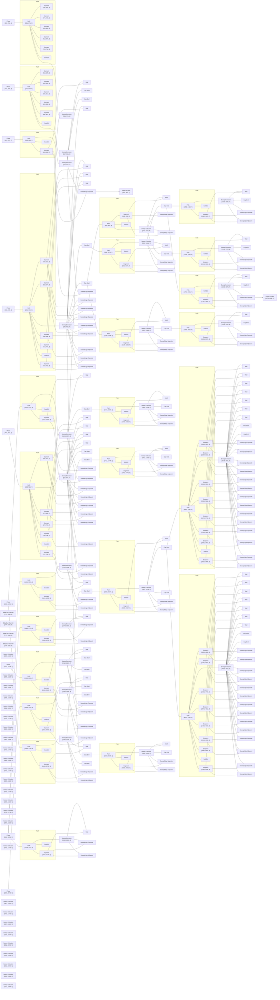

```mermaid
flowchart LR
  subgraph path2 [Path]
    2["Path<br>[224, 279, 5]"]
    6["Segment<br>[285, 365, 5]"]
    15["Segment<br>[371, 483, 5]"]
    19["Segment<br>[489, 606, 5]"]
    22["Segment<br>[612, 697, 5]"]
    29["Segment<br>[703, 710, 5]"]
    30[Solid2d]
  end
  subgraph path4 [Path]
    4["Path<br>[251, 394, 8]"]
    5["Segment<br>[400, 516, 8]"]
    14["Segment<br>[522, 574, 8]"]
    18["Segment<br>[580, 696, 8]"]
    21["Segment<br>[702, 758, 8]"]
    27["Segment<br>[764, 771, 8]"]
    28[Solid2d]
  end
  subgraph path9 [Path]
    9["Path<br>[203, 263, 7]"]
    11["Segment<br>[203, 263, 7]"]
    12[Solid2d]
  end
  subgraph path10 [Path]
    10["Path<br>[271, 504, 9]"]
    13["Segment<br>[510, 629, 9]"]
    16["Segment<br>[635, 689, 9]"]
    20["Segment<br>[695, 814, 9]"]
    23["Segment<br>[820, 890, 9]"]
    31["Segment<br>[896, 903, 9]"]
    32[Solid2d]
  end
  subgraph path52 [Path]
    52["Path<br>[892, 956, 8]"]
    53["Segment<br>[892, 956, 8]"]
    54[Solid2d]
  end
  subgraph path59 [Path]
    59["Path<br>[1022, 1231, 9]"]
    60["Segment<br>[1022, 1231, 9]"]
    61[Solid2d]
  end
  subgraph path66 [Path]
    66["Path<br>[493, 529, 7]"]
    67["Segment<br>[535, 572, 7]"]
    68["Segment<br>[578, 666, 7]"]
    69["Segment<br>[672, 721, 7]"]
    70["Segment<br>[727, 783, 7]"]
    71["Segment<br>[789, 796, 7]"]
    72[Solid2d]
  end
  subgraph path92 [Path]
    92["Path<br>[898, 1073, 7]"]
    93["Segment<br>[898, 1073, 7]"]
    94[Solid2d]
  end
  subgraph path100 [Path]
    100["Path<br>[1130, 1338, 8]"]
    101["Segment<br>[1130, 1338, 8]"]
    102[Solid2d]
  end
  subgraph path106 [Path]
    106["Path<br>[1441, 1630, 9]"]
    107["Segment<br>[1441, 1630, 9]"]
    108[Solid2d]
  end
  subgraph path118 [Path]
    118["Path<br>[1282, 1429, 7]"]
    119["Segment<br>[1282, 1429, 7]"]
    120[Solid2d]
  end
  subgraph path125 [Path]
    125["Path<br>[1151, 1208, 5]"]
    126["Segment<br>[1151, 1208, 5]"]
    127[Solid2d]
  end
  subgraph path134 [Path]
    134["Path<br>[1546, 1590, 8]"]
    135["Segment<br>[1546, 1590, 8]"]
    136[Solid2d]
  end
  subgraph path152 [Path]
    152["Path<br>[1411, 1448, 5]"]
    153["Segment<br>[1411, 1448, 5]"]
    154[Solid2d]
  end
  subgraph path165 [Path]
    165["Path<br>[1585, 1725, 5]"]
    166["Segment<br>[1585, 1725, 5]"]
    167[Solid2d]
  end
  subgraph path168 [Path]
    168["Path<br>[1751, 1925, 7]"]
    169["Segment<br>[1751, 1925, 7]"]
    170[Solid2d]
  end
  subgraph path185 [Path]
    185["Path<br>[2150, 2190, 7]"]
    186["Segment<br>[2150, 2190, 7]"]
    187[Solid2d]
  end
  subgraph path194 [Path]
    194["Path<br>[2056, 2342, 9]"]
    195["Segment<br>[2056, 2342, 9]"]
    196[Solid2d]
  end
  subgraph path210 [Path]
    210["Path<br>[2446, 2730, 9]"]
    211["Segment<br>[2446, 2730, 9]"]
    212[Solid2d]
  end
  subgraph path217 [Path]
    217["Path<br>[1833, 2025, 8]"]
    218["Segment<br>[1833, 2025, 8]"]
    219[Solid2d]
  end
  subgraph path222 [Path]
    222["Path<br>[1976, 2116, 5]"]
    223["Segment<br>[1976, 2116, 5]"]
    224[Solid2d]
  end
  subgraph path228 [Path]
    228["Path<br>[2889, 2927, 9]"]
    229["Segment<br>[2889, 2927, 9]"]
    230[Solid2d]
  end
  subgraph path246 [Path]
    246["Path<br>[3062, 3287, 9]"]
    247["Segment<br>[3293, 3361, 9]"]
    248["Segment<br>[3367, 3510, 9]"]
    249["Segment<br>[3516, 3584, 9]"]
    250["Segment<br>[3590, 3666, 9]"]
    251["Segment<br>[3672, 3748, 9]"]
    252["Segment<br>[3754, 3828, 9]"]
    253["Segment<br>[3834, 3890, 9]"]
    254["Segment<br>[3896, 3903, 9]"]
    255[Solid2d]
  end
  subgraph path283 [Path]
    283["Path<br>[4037, 4262, 9]"]
    284["Segment<br>[4268, 4338, 9]"]
    285["Segment<br>[4344, 4492, 9]"]
    286["Segment<br>[4498, 4568, 9]"]
    287["Segment<br>[4574, 4652, 9]"]
    288["Segment<br>[4658, 4736, 9]"]
    289["Segment<br>[4742, 4818, 9]"]
    290["Segment<br>[4824, 4880, 9]"]
    291["Segment<br>[4886, 4893, 9]"]
    292[Solid2d]
  end
  subgraph path303 [Path]
    303["Path<br>[2383, 2558, 8]"]
    304["Segment<br>[2383, 2558, 8]"]
    305[Solid2d]
  end
  1["Plane<br>[201, 218, 5]"]
  3["Plane<br>[222, 245, 8]"]
  7["Plane<br>[174, 197, 7]"]
  8["Plane<br>[242, 265, 9]"]
  17["Sweep Extrusion<br>[277, 315, 7]"]
  24[Wall]
  25["Cap Start"]
  26["Cap End"]
  33["Sweep Extrusion<br>[785, 833, 8]"]
  34["Sweep Extrusion<br>[724, 771, 5]"]
  35["Sweep Extrusion<br>[917, 965, 9]"]
  36[Wall]
  37[Wall]
  38[Wall]
  39[Wall]
  40["Cap Start"]
  41["Cap End"]
  42["SweepEdge Opposite"]
  43["SweepEdge Adjacent"]
  44["SweepEdge Opposite"]
  45["SweepEdge Adjacent"]
  46["SweepEdge Opposite"]
  47["SweepEdge Adjacent"]
  48["SweepEdge Opposite"]
  49["SweepEdge Adjacent"]
  50["SweepEdge Opposite"]
  51["SweepEdge Adjacent"]
  55["Sweep Extrusion<br>[971, 1004, 8]"]
  56[Wall]
  57["Cap End"]
  58["Plane<br>[1022, 1231, 9]"]
  62["Sweep Extrusion<br>[1246, 1279, 9]"]
  63[Wall]
  64["Cap End"]
  65["Plane<br>[464, 487, 7]"]
  73["Sweep Extrusion<br>[811, 841, 7]"]
  74[Wall]
  75[Wall]
  76[Wall]
  77[Wall]
  78["Cap Start"]
  79["Cap End"]
  80["SweepEdge Opposite"]
  81["SweepEdge Adjacent"]
  82["SweepEdge Opposite"]
  83["SweepEdge Adjacent"]
  84["SweepEdge Opposite"]
  85["SweepEdge Adjacent"]
  86["SweepEdge Opposite"]
  87["SweepEdge Adjacent"]
  88["SweepEdge Opposite"]
  89["SweepEdge Adjacent"]
  90["SweepEdge Opposite"]
  91["SweepEdge Adjacent"]
  95["Sweep Extrusion<br>[1087, 1119, 7]"]
  96[Wall]
  97["Cap End"]
  98["SweepEdge Opposite"]
  99["SweepEdge Adjacent"]
  103["Sweep Extrusion<br>[1353, 1383, 8]"]
  104[Wall]
  105["Cap End"]
  109["SweepEdge Opposite"]
  110["SweepEdge Adjacent"]
  111["Sweep Extrusion<br>[1895, 1928, 9]"]
  112[Wall]
  113["Cap End"]
  114["EdgeCut Chamfer<br>[777, 1054, 5]"]
  115["EdgeCut Chamfer<br>[777, 1054, 5]"]
  116["EdgeCut Chamfer<br>[777, 1054, 5]"]
  117["EdgeCut Chamfer<br>[777, 1054, 5]"]
  121["SweepEdge Opposite"]
  122["SweepEdge Adjacent"]
  123["Sweep Extrusion<br>[1895, 1928, 9]"]
  124["Plane<br>[1151, 1208, 5]"]
  128["Sweep Extrusion<br>[1222, 1288, 5]"]
  129[Wall]
  130["Cap End"]
  131["Sweep Extrusion<br>[1662, 1694, 7]"]
  132[Wall]
  133["Cap End"]
  137["Sweep Extrusion<br>[1895, 1928, 9]"]
  138["SweepEdge Opposite"]
  139["SweepEdge Adjacent"]
  140["SweepEdge Opposite"]
  141["SweepEdge Adjacent"]
  142["Sweep Extrusion<br>[1662, 1694, 7]"]
  143["Sweep Extrusion<br>[1743, 1776, 8]"]
  144[Wall]
  145["Cap End"]
  146["Sweep Extrusion<br>[1895, 1928, 9]"]
  147["Sweep Extrusion<br>[1662, 1694, 7]"]
  148["SweepEdge Opposite"]
  149["SweepEdge Adjacent"]
  150["Sweep Extrusion<br>[1743, 1776, 8]"]
  151["Sweep Extrusion<br>[1895, 1928, 9]"]
  155["Sweep Extrusion<br>[1462, 1492, 5]"]
  156[Wall]
  157["Cap End"]
  158["Sweep Extrusion<br>[1662, 1694, 7]"]
  159["Sweep Extrusion<br>[1743, 1776, 8]"]
  160["Sweep Extrusion<br>[1895, 1928, 9]"]
  161["SweepEdge Opposite"]
  162["SweepEdge Adjacent"]
  163["Sweep Extrusion<br>[1743, 1776, 8]"]
  164["Sweep Extrusion<br>[1895, 1928, 9]"]
  171["Sweep Extrusion<br>[1939, 1972, 7]"]
  172[Wall]
  173["Cap End"]
  174["Sweep Extrusion<br>[1743, 1776, 8]"]
  175["Sweep Extrusion<br>[1895, 1928, 9]"]
  176["Sweep Extrusion<br>[1873, 1920, 5]"]
  177[Wall]
  178["SweepEdge Opposite"]
  179["SweepEdge Adjacent"]
  180["Sweep Extrusion<br>[1743, 1776, 8]"]
  181["SweepEdge Opposite"]
  182["SweepEdge Adjacent"]
  183["Sweep Extrusion<br>[1873, 1920, 5]"]
  184["Plane<br>[2121, 2144, 7]"]
  188["Sweep Extrusion<br>[2192, 2223, 7]"]
  189[Wall]
  190["Cap Start"]
  191["Cap End"]
  192["Sweep Extrusion<br>[1743, 1776, 8]"]
  193["Plane<br>[2056, 2342, 9]"]
  197["Sweep Extrusion<br>[2356, 2389, 9]"]
  198[Wall]
  199["Cap Start"]
  200["Cap End"]
  201["Sweep Extrusion<br>[1873, 1920, 5]"]
  202["SweepEdge Opposite"]
  203["SweepEdge Adjacent"]
  204["EdgeCut Fillet<br>[321, 383, 7]"]
  205["EdgeCut Fillet<br>[1978, 2040, 7]"]
  206["Sweep Extrusion<br>[1743, 1776, 8]"]
  207["SweepEdge Opposite"]
  208["SweepEdge Adjacent"]
  209["Sweep Extrusion<br>[1873, 1920, 5]"]
  213["Sweep Extrusion<br>[2745, 2778, 9]"]
  214[Wall]
  215["Cap Start"]
  216["Cap End"]
  220["SweepEdge Opposite"]
  221["SweepEdge Adjacent"]
  225["Sweep Extrusion<br>[2293, 2326, 8]"]
  226[Wall]
  227["Cap End"]
  231["Sweep Extrusion<br>[2942, 2976, 9]"]
  232[Wall]
  233["Cap Start"]
  234["Cap End"]
  235["Sweep Extrusion<br>[2252, 2299, 5]"]
  236[Wall]
  237["SweepEdge Opposite"]
  238["SweepEdge Adjacent"]
  239["Sweep Extrusion<br>[2293, 2326, 8]"]
  240["SweepEdge Opposite"]
  241["SweepEdge Adjacent"]
  242["SweepEdge Opposite"]
  243["SweepEdge Adjacent"]
  244["Sweep Extrusion<br>[2252, 2299, 5]"]
  245["Sweep Extrusion<br>[2293, 2326, 8]"]
  256["Sweep Extrusion<br>[3918, 3951, 9]"]
  257[Wall]
  258[Wall]
  259[Wall]
  260[Wall]
  261[Wall]
  262[Wall]
  263[Wall]
  264["Cap Start"]
  265["Cap End"]
  266["Sweep Extrusion<br>[2252, 2299, 5]"]
  267["Sweep Extrusion<br>[2293, 2326, 8]"]
  268["SweepEdge Opposite"]
  269["SweepEdge Adjacent"]
  270["SweepEdge Opposite"]
  271["SweepEdge Adjacent"]
  272["SweepEdge Opposite"]
  273["SweepEdge Adjacent"]
  274["SweepEdge Opposite"]
  275["SweepEdge Adjacent"]
  276["SweepEdge Opposite"]
  277["SweepEdge Adjacent"]
  278["SweepEdge Opposite"]
  279["SweepEdge Adjacent"]
  280["SweepEdge Opposite"]
  281["SweepEdge Adjacent"]
  282["Sweep Extrusion<br>[2252, 2299, 5]"]
  293["Sweep Extrusion<br>[4895, 4928, 9]"]
  294[Wall]
  295[Wall]
  296[Wall]
  297[Wall]
  298[Wall]
  299[Wall]
  300[Wall]
  301["Cap Start"]
  302["Cap End"]
  306["Sweep Extrusion<br>[2560, 2590, 8]"]
  307[Wall]
  308["Cap End"]
  309["SweepEdge Opposite"]
  310["SweepEdge Adjacent"]
  311["SweepEdge Opposite"]
  312["SweepEdge Adjacent"]
  313["SweepEdge Opposite"]
  314["SweepEdge Adjacent"]
  315["SweepEdge Opposite"]
  316["SweepEdge Adjacent"]
  317["SweepEdge Opposite"]
  318["SweepEdge Adjacent"]
  319["SweepEdge Opposite"]
  320["SweepEdge Adjacent"]
  321["SweepEdge Opposite"]
  322["SweepEdge Adjacent"]
  323["SweepEdge Opposite"]
  324["SweepEdge Adjacent"]
  1 --- 2
  2 --- 6
  2 --- 15
  2 --- 19
  2 --- 22
  2 --- 29
  2 ---- 34
  2 --- 30
  3 --- 4
  4 --- 5
  4 --- 14
  4 --- 18
  4 --- 21
  4 --- 27
  4 ---- 33
  4 --- 28
  5 --- 36
  5 --- 44
  5 --- 45
  7 --- 9
  8 --- 10
  9 --- 11
  9 ---- 17
  9 --- 12
  10 --- 13
  10 --- 16
  10 --- 20
  10 --- 23
  10 --- 31
  10 ---- 35
  10 --- 32
  11 --- 24
  11 --- 42
  11 --- 43
  14 --- 37
  14 --- 46
  14 --- 47
  17 --- 24
  17 --- 25
  17 --- 26
  17 --- 42
  17 --- 43
  18 --- 38
  18 --- 48
  18 --- 49
  21 --- 39
  21 --- 50
  21 --- 51
  33 --- 36
  33 --- 37
  33 --- 38
  33 --- 39
  33 --- 40
  33 --- 41
  33 --- 44
  33 --- 45
  33 --- 46
  33 --- 47
  33 --- 48
  33 --- 49
  33 --- 50
  33 --- 51
  40 --- 52
  40 --- 100
  41 --- 303
  52 --- 53
  52 ---- 55
  52 --- 54
  53 --- 56
  53 --- 80
  53 --- 81
  55 --- 56
  55 --- 57
  55 --- 80
  55 --- 81
  57 --- 134
  58 --- 59
  58 --- 210
  59 --- 60
  59 ---- 62
  59 --- 61
  60 --- 63
  60 --- 82
  60 --- 83
  62 --- 63
  62 --- 64
  62 --- 82
  62 --- 83
  64 --- 106
  65 --- 66
  66 --- 67
  66 --- 68
  66 --- 69
  66 --- 70
  66 --- 71
  66 ---- 73
  66 --- 72
  67 --- 74
  67 --- 84
  67 --- 85
  68 --- 75
  68 --- 86
  68 --- 87
  69 --- 76
  69 --- 88
  69 --- 89
  70 --- 77
  70 --- 90
  70 --- 91
  73 --- 74
  73 --- 75
  73 --- 76
  73 --- 77
  73 --- 78
  73 --- 79
  73 --- 84
  73 --- 85
  73 --- 86
  73 --- 87
  73 --- 88
  73 --- 89
  73 --- 90
  73 --- 91
  79 --- 92
  92 --- 93
  92 ---- 95
  92 --- 94
  93 --- 96
  93 --- 98
  93 --- 99
  95 --- 96
  95 --- 97
  95 --- 98
  95 --- 99
  97 --- 118
  97 --- 168
  100 --- 101
  100 ---- 103
  100 --- 102
  101 --- 104
  101 --- 109
  101 --- 110
  103 --- 104
  103 --- 105
  103 --- 109
  103 --- 110
  105 --- 217
  106 --- 107
  106 ---- 111
  106 --- 108
  107 --- 112
  107 --- 121
  107 --- 122
  111 --- 112
  111 --- 113
  111 --- 121
  111 --- 122
  118 --- 119
  118 ---- 131
  118 --- 120
  119 --- 132
  119 --- 140
  119 --- 141
  124 --- 125
  124 --- 165
  124 --- 222
  125 --- 126
  125 ---- 128
  125 --- 127
  126 --- 129
  126 --- 138
  126 --- 139
  128 --- 129
  128 --- 130
  128 --- 138
  128 --- 139
  130 --- 152
  131 --- 132
  131 --- 133
  131 --- 140
  131 --- 141
  134 --- 135
  134 ---- 143
  134 --- 136
  135 --- 144
  135 --- 148
  135 --- 149
  143 --- 144
  143 --- 145
  143 --- 148
  143 --- 149
  152 --- 153
  152 ---- 155
  152 --- 154
  153 --- 156
  153 --- 161
  153 --- 162
  155 --- 156
  155 --- 157
  155 --- 161
  155 --- 162
  165 --- 166
  165 ---- 176
  165 --- 167
  166 --- 177
  166 --- 181
  166 --- 182
  168 --- 169
  168 ---- 171
  168 --- 170
  169 --- 172
  169 --- 178
  169 --- 179
  171 --- 172
  171 --- 173
  171 --- 178
  171 --- 179
  176 --- 177
  176 --- 181
  176 --- 182
  184 --- 185
  185 --- 186
  185 ---- 188
  185 --- 187
  186 --- 189
  186 --- 202
  186 --- 203
  188 --- 189
  188 --- 190
  188 --- 191
  188 --- 202
  188 --- 203
  193 --- 194
  194 --- 195
  194 ---- 197
  194 --- 196
  195 --- 198
  195 --- 207
  195 --- 208
  197 --- 198
  197 --- 199
  197 --- 200
  197 --- 207
  197 --- 208
  42 <--x 204
  178 <--x 205
  210 --- 211
  210 ---- 213
  210 --- 212
  211 --- 214
  211 --- 220
  211 --- 221
  213 --- 214
  213 --- 215
  213 --- 216
  213 --- 220
  213 --- 221
  215 --- 228
  217 --- 218
  217 ---- 225
  217 --- 219
  218 --- 226
  218 --- 237
  218 --- 238
  222 --- 223
  222 ---- 235
  222 --- 224
  223 --- 236
  223 --- 242
  223 --- 243
  225 --- 226
  225 --- 227
  225 --- 237
  225 --- 238
  228 --- 229
  228 ---- 231
  228 --- 230
  229 --- 232
  229 --- 240
  229 --- 241
  231 --- 232
  231 --- 233
  231 --- 234
  231 --- 240
  231 --- 241
  233 --- 246
  233 --- 283
  235 --- 236
  235 --- 242
  235 --- 243
  246 --- 247
  246 --- 248
  246 --- 249
  246 --- 250
  246 --- 251
  246 --- 252
  246 --- 253
  246 --- 254
  246 ---- 256
  246 --- 255
  247 --- 257
  247 --- 268
  247 --- 269
  248 --- 258
  248 --- 270
  248 --- 271
  249 --- 259
  249 --- 272
  249 --- 273
  250 --- 260
  250 --- 274
  250 --- 275
  251 --- 261
  251 --- 276
  251 --- 277
  252 --- 262
  252 --- 278
  252 --- 279
  253 --- 263
  253 --- 280
  253 --- 281
  256 --- 257
  256 --- 258
  256 --- 259
  256 --- 260
  256 --- 261
  256 --- 262
  256 --- 263
  256 --- 264
  256 --- 265
  256 --- 268
  256 --- 269
  256 --- 270
  256 --- 271
  256 --- 272
  256 --- 273
  256 --- 274
  256 --- 275
  256 --- 276
  256 --- 277
  256 --- 278
  256 --- 279
  256 --- 280
  256 --- 281
  283 --- 284
  283 --- 285
  283 --- 286
  283 --- 287
  283 --- 288
  283 --- 289
  283 --- 290
  283 --- 291
  283 ---- 293
  283 --- 292
  284 --- 300
  284 --- 321
  284 --- 322
  285 --- 299
  285 --- 319
  285 --- 320
  286 --- 298
  286 --- 317
  286 --- 318
  287 --- 297
  287 --- 315
  287 --- 316
  288 --- 296
  288 --- 313
  288 --- 314
  289 --- 295
  289 --- 311
  289 --- 312
  290 --- 294
  290 --- 309
  290 --- 310
  293 --- 294
  293 --- 295
  293 --- 296
  293 --- 297
  293 --- 298
  293 --- 299
  293 --- 300
  293 --- 301
  293 --- 302
  293 --- 309
  293 --- 310
  293 --- 311
  293 --- 312
  293 --- 313
  293 --- 314
  293 --- 315
  293 --- 316
  293 --- 317
  293 --- 318
  293 --- 319
  293 --- 320
  293 --- 321
  293 --- 322
  303 --- 304
  303 ---- 306
  303 --- 305
  304 --- 307
  304 --- 323
  304 --- 324
  306 --- 307
  306 --- 308
  306 --- 323
  306 --- 324
```
