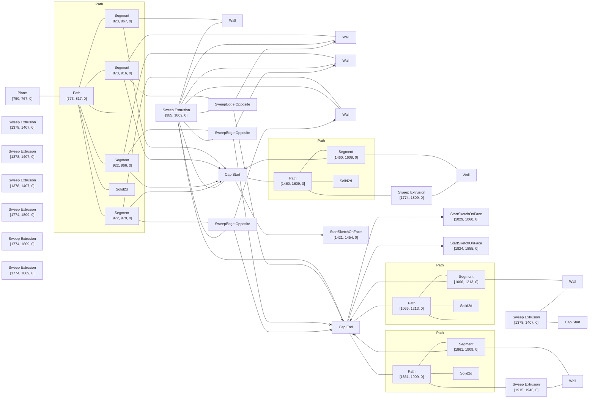

```mermaid
flowchart LR
  subgraph path2 [Path]
    2["Path<br>[773, 817, 0]"]
    3["Segment<br>[823, 867, 0]"]
    4["Segment<br>[873, 916, 0]"]
    5["Segment<br>[922, 966, 0]"]
    6["Segment<br>[972, 979, 0]"]
    7[Solid2d]
  end
  subgraph path18 [Path]
    18["Path<br>[1066, 1213, 0]"]
    19["Segment<br>[1066, 1213, 0]"]
    20[Solid2d]
  end
  subgraph path27 [Path]
    27["Path<br>[1460, 1609, 0]"]
    28["Segment<br>[1460, 1609, 0]"]
    29[Solid2d]
  end
  subgraph path35 [Path]
    35["Path<br>[1861, 1909, 0]"]
    36["Segment<br>[1861, 1909, 0]"]
    37[Solid2d]
  end
  1["Plane<br>[750, 767, 0]"]
  8["Sweep Extrusion<br>[985, 1009, 0]"]
  9[Wall]
  10[Wall]
  11[Wall]
  12[Wall]
  13["Cap Start"]
  14["Cap End"]
  15["SweepEdge Opposite"]
  16["SweepEdge Opposite"]
  17["SweepEdge Opposite"]
  21["Sweep Extrusion<br>[1378, 1407, 0]"]
  22[Wall]
  23["Cap Start"]
  24["Sweep Extrusion<br>[1378, 1407, 0]"]
  25["Sweep Extrusion<br>[1378, 1407, 0]"]
  26["Sweep Extrusion<br>[1378, 1407, 0]"]
  30["Sweep Extrusion<br>[1774, 1809, 0]"]
  31[Wall]
  32["Sweep Extrusion<br>[1774, 1809, 0]"]
  33["Sweep Extrusion<br>[1774, 1809, 0]"]
  34["Sweep Extrusion<br>[1774, 1809, 0]"]
  38["Sweep Extrusion<br>[1915, 1940, 0]"]
  39[Wall]
  40["StartSketchOnFace<br>[1029, 1060, 0]"]
  41["StartSketchOnFace<br>[1421, 1454, 0]"]
  42["StartSketchOnFace<br>[1824, 1855, 0]"]
  1 --- 2
  2 --- 3
  2 --- 4
  2 --- 5
  2 --- 6
  2 ---- 8
  2 --- 7
  3 --- 9
  3 x--> 13
  4 --- 10
  4 --- 15
  4 x--> 13
  5 --- 11
  5 --- 16
  5 x--> 13
  6 --- 12
  6 --- 17
  6 x--> 13
  8 --- 9
  8 --- 10
  8 --- 11
  8 --- 12
  8 --- 13
  8 --- 14
  8 --- 15
  8 --- 16
  8 --- 17
  13 --- 27
  14 --- 18
  14 --- 35
  15 <--x 10
  15 <--x 14
  16 <--x 11
  16 <--x 14
  17 <--x 12
  17 <--x 14
  18 --- 19
  18 ---- 21
  18 --- 20
  19 --- 22
  19 <--x 14
  21 --- 22
  21 --- 23
  27 --- 28
  27 ---- 30
  27 --- 29
  28 --- 31
  28 <--x 13
  30 --- 31
  35 --- 36
  35 ---- 38
  35 --- 37
  36 --- 39
  36 <--x 14
  38 --- 39
  14 <--x 40
  13 <--x 41
  14 <--x 42
```
