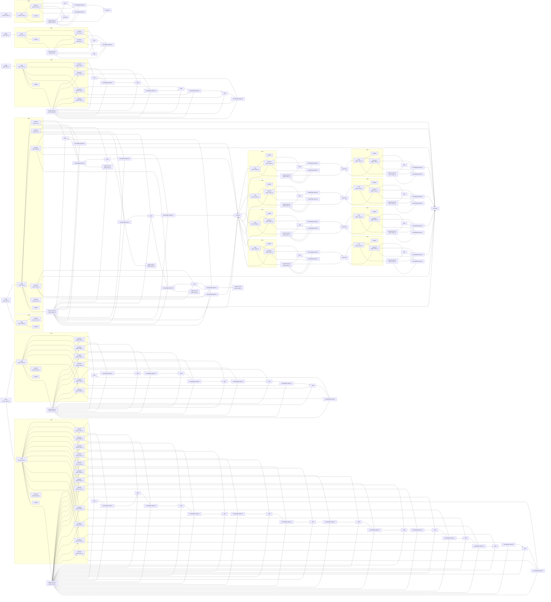

```mermaid
flowchart LR
  subgraph path6 [Path]
    6["Path<br>[410, 467, 2]"]
    21["Segment<br>[473, 532, 2]"]
    22["Segment<br>[538, 545, 2]"]
    63[Solid2d]
  end
  subgraph path7 [Path]
    7["Path<br>[953, 1079, 2]"]
    23["Segment<br>[1085, 1145, 2]"]
    24["Segment<br>[1151, 1182, 2]"]
    25["Segment<br>[1188, 1216, 2]"]
    26["Segment<br>[1222, 1229, 2]"]
    69[Solid2d]
  end
  subgraph path8 [Path]
    8["Path<br>[1559, 1719, 2]"]
    27["Segment<br>[1559, 1719, 2]"]
    73[Solid2d]
  end
  subgraph path9 [Path]
    9["Path<br>[1803, 1932, 2]"]
    28["Segment<br>[1938, 1976, 2]"]
    29["Segment<br>[1982, 2060, 2]"]
    30["Segment<br>[2066, 2092, 2]"]
    31["Segment<br>[2098, 2120, 2]"]
    32["Segment<br>[2126, 2181, 2]"]
    33["Segment<br>[2187, 2243, 2]"]
    34["Segment<br>[2249, 2256, 2]"]
    71[Solid2d]
  end
  subgraph path10 [Path]
    10["Path<br>[2347, 2411, 2]"]
    35["Segment<br>[2417, 2437, 2]"]
    36["Segment<br>[2443, 2494, 2]"]
    37["Segment<br>[2500, 2520, 2]"]
    38["Segment<br>[2526, 2573, 2]"]
    39["Segment<br>[2579, 2624, 2]"]
    40["Segment<br>[2630, 2660, 2]"]
    41["Segment<br>[2666, 2687, 2]"]
    42["Segment<br>[2693, 2756, 2]"]
    43["Segment<br>[2762, 2805, 2]"]
    44["Segment<br>[2811, 2871, 2]"]
    45["Segment<br>[2877, 2914, 2]"]
    46["Segment<br>[2920, 2976, 2]"]
    47["Segment<br>[2982, 2989, 2]"]
    65[Solid2d]
  end
  subgraph path11 [Path]
    11["Path<br>[655, 709, 3]"]
    48["Segment<br>[715, 787, 3]"]
    49["Segment<br>[793, 896, 3]"]
    50["Segment<br>[902, 1019, 3]"]
    51["Segment<br>[1025, 1110, 3]"]
    52["Segment<br>[1116, 1123, 3]"]
    66[Solid2d]
  end
  subgraph path12 [Path]
    12["Path<br>[1147, 1205, 3]"]
    53["Segment<br>[1147, 1205, 3]"]
    72[Solid2d]
  end
  subgraph path13 [Path]
    13["Path<br>[1933, 1996, 3]"]
    54["Segment<br>[1933, 1996, 3]"]
    62[Solid2d]
  end
  subgraph path14 [Path]
    14["Path<br>[1933, 1996, 3]"]
    57["Segment<br>[1933, 1996, 3]"]
    64[Solid2d]
  end
  subgraph path15 [Path]
    15["Path<br>[1933, 1996, 3]"]
    55["Segment<br>[1933, 1996, 3]"]
    70[Solid2d]
  end
  subgraph path16 [Path]
    16["Path<br>[1933, 1996, 3]"]
    56["Segment<br>[1933, 1996, 3]"]
    76[Solid2d]
  end
  subgraph path17 [Path]
    17["Path<br>[2094, 2165, 3]"]
    58["Segment<br>[2094, 2165, 3]"]
    67[Solid2d]
  end
  subgraph path18 [Path]
    18["Path<br>[2094, 2165, 3]"]
    59["Segment<br>[2094, 2165, 3]"]
    68[Solid2d]
  end
  subgraph path19 [Path]
    19["Path<br>[2094, 2165, 3]"]
    61["Segment<br>[2094, 2165, 3]"]
    74[Solid2d]
  end
  subgraph path20 [Path]
    20["Path<br>[2094, 2165, 3]"]
    60["Segment<br>[2094, 2165, 3]"]
    75[Solid2d]
  end
  1["Plane<br>[359, 403, 2]"]
  2["Plane<br>[902, 946, 2]"]
  3["Plane<br>[1536, 1553, 2]"]
  4["Plane<br>[1770, 1787, 2]"]
  5["Plane<br>[632, 649, 3]"]
  77["Sweep Revolve<br>[627, 657, 2]"]
  78["Sweep Revolve<br>[1271, 1301, 2]"]
  79["Sweep Revolve<br>[2262, 2292, 2]"]
  80["Sweep Revolve<br>[2995, 3025, 2]"]
  81["Sweep Revolve<br>[3092, 3139, 2]"]
  82["Sweep Extrusion<br>[1219, 1264, 3]"]
  83["Sweep Extrusion<br>[2004, 2039, 3]"]
  84["Sweep Extrusion<br>[2004, 2039, 3]"]
  85["Sweep Extrusion<br>[2004, 2039, 3]"]
  86["Sweep Extrusion<br>[2004, 2039, 3]"]
  87["Sweep Extrusion<br>[2173, 2225, 3]"]
  88["Sweep Extrusion<br>[2173, 2225, 3]"]
  89["Sweep Extrusion<br>[2173, 2225, 3]"]
  90["Sweep Extrusion<br>[2173, 2225, 3]"]
  91[Wall]
    %% face_code_ref=Missing NodePath
  92[Wall]
    %% face_code_ref=Missing NodePath
  93[Wall]
    %% face_code_ref=Missing NodePath
  94[Wall]
    %% face_code_ref=Missing NodePath
  95[Wall]
    %% face_code_ref=Missing NodePath
  96[Wall]
    %% face_code_ref=Missing NodePath
  97[Wall]
    %% face_code_ref=Missing NodePath
  98[Wall]
    %% face_code_ref=Missing NodePath
  99[Wall]
    %% face_code_ref=Missing NodePath
  100[Wall]
    %% face_code_ref=Missing NodePath
  101[Wall]
    %% face_code_ref=Missing NodePath
  102[Wall]
    %% face_code_ref=Missing NodePath
  103[Wall]
    %% face_code_ref=Missing NodePath
  104[Wall]
    %% face_code_ref=Missing NodePath
  105[Wall]
    %% face_code_ref=Missing NodePath
  106[Wall]
    %% face_code_ref=Missing NodePath
  107[Wall]
    %% face_code_ref=Missing NodePath
  108[Wall]
    %% face_code_ref=Missing NodePath
  109[Wall]
    %% face_code_ref=Missing NodePath
  110[Wall]
    %% face_code_ref=Missing NodePath
  111[Wall]
    %% face_code_ref=Missing NodePath
  112[Wall]
    %% face_code_ref=Missing NodePath
  113[Wall]
    %% face_code_ref=Missing NodePath
  114[Wall]
    %% face_code_ref=Missing NodePath
  115[Wall]
    %% face_code_ref=Missing NodePath
  116[Wall]
    %% face_code_ref=Missing NodePath
  117[Wall]
    %% face_code_ref=Missing NodePath
  118[Wall]
    %% face_code_ref=Missing NodePath
  119[Wall]
    %% face_code_ref=Missing NodePath
  120[Wall]
    %% face_code_ref=Missing NodePath
  121[Wall]
    %% face_code_ref=Missing NodePath
  122[Wall]
    %% face_code_ref=Missing NodePath
  123[Wall]
    %% face_code_ref=Missing NodePath
  124[Wall]
    %% face_code_ref=Missing NodePath
  125[Wall]
    %% face_code_ref=Missing NodePath
  126[Wall]
    %% face_code_ref=Missing NodePath
  127[Wall]
    %% face_code_ref=Missing NodePath
  128["Cap Start"]
    %% face_code_ref=Missing NodePath
  129["Cap Start"]
    %% face_code_ref=Missing NodePath
  130["Cap Start"]
    %% face_code_ref=Missing NodePath
  131["Cap Start"]
    %% face_code_ref=Missing NodePath
  132["Cap Start"]
    %% face_code_ref=Missing NodePath
  133["Cap Start"]
    %% face_code_ref=Missing NodePath
  134["Cap End"]
    %% face_code_ref=Missing NodePath
  135["Cap End"]
    %% face_code_ref=Missing NodePath
  136["SweepEdge Opposite"]
  137["SweepEdge Opposite"]
  138["SweepEdge Opposite"]
  139["SweepEdge Opposite"]
  140["SweepEdge Opposite"]
  141["SweepEdge Opposite"]
  142["SweepEdge Opposite"]
  143["SweepEdge Opposite"]
  144["SweepEdge Opposite"]
  145["SweepEdge Opposite"]
  146["SweepEdge Opposite"]
  147["SweepEdge Opposite"]
  148["SweepEdge Opposite"]
  149["SweepEdge Adjacent"]
  150["SweepEdge Adjacent"]
  151["SweepEdge Adjacent"]
  152["SweepEdge Adjacent"]
  153["SweepEdge Adjacent"]
  154["SweepEdge Adjacent"]
  155["SweepEdge Adjacent"]
  156["SweepEdge Adjacent"]
  157["SweepEdge Adjacent"]
  158["SweepEdge Adjacent"]
  159["SweepEdge Adjacent"]
  160["SweepEdge Adjacent"]
  161["SweepEdge Adjacent"]
  162["SweepEdge Adjacent"]
  163["SweepEdge Adjacent"]
  164["SweepEdge Adjacent"]
  165["SweepEdge Adjacent"]
  166["SweepEdge Adjacent"]
  167["SweepEdge Adjacent"]
  168["SweepEdge Adjacent"]
  169["SweepEdge Adjacent"]
  170["SweepEdge Adjacent"]
  171["SweepEdge Adjacent"]
  172["SweepEdge Adjacent"]
  173["SweepEdge Adjacent"]
  174["SweepEdge Adjacent"]
  175["SweepEdge Adjacent"]
  176["SweepEdge Adjacent"]
  177["SweepEdge Adjacent"]
  178["SweepEdge Adjacent"]
  179["SweepEdge Adjacent"]
  180["SweepEdge Adjacent"]
  181["SweepEdge Adjacent"]
  182["SweepEdge Adjacent"]
  183["SweepEdge Adjacent"]
  184["SweepEdge Adjacent"]
  185["EdgeCut Fillet<br>[1308, 1593, 3]"]
  186["EdgeCut Fillet<br>[1308, 1593, 3]"]
  187["EdgeCut Fillet<br>[1308, 1593, 3]"]
  188["EdgeCut Fillet<br>[1308, 1593, 3]"]
  1 --- 6
  2 --- 7
  3 --- 8
  4 --- 9
  4 --- 10
  5 --- 11
  5 --- 12
  6 --- 21
  6 --- 22
  6 --- 63
  6 ---- 77
  7 --- 23
  7 --- 24
  7 --- 25
  7 --- 26
  7 --- 69
  7 ---- 78
  8 --- 27
  8 --- 73
  8 ---- 81
  9 --- 28
  9 --- 29
  9 --- 30
  9 --- 31
  9 --- 32
  9 --- 33
  9 --- 34
  9 --- 71
  9 ---- 79
  10 --- 35
  10 --- 36
  10 --- 37
  10 --- 38
  10 --- 39
  10 --- 40
  10 --- 41
  10 --- 42
  10 --- 43
  10 --- 44
  10 --- 45
  10 --- 46
  10 --- 47
  10 --- 65
  10 ---- 80
  11 --- 48
  11 --- 49
  11 --- 50
  11 --- 51
  11 --- 52
  11 --- 66
  11 ---- 82
  12 --- 53
  12 --- 72
  13 --- 54
  13 --- 62
  13 ---- 85
  134 --- 13
  14 --- 57
  14 --- 64
  14 ---- 84
  134 --- 14
  15 --- 55
  15 --- 70
  15 ---- 86
  134 --- 15
  16 --- 56
  16 --- 76
  16 ---- 83
  134 --- 16
  17 --- 58
  17 --- 67
  17 ---- 88
  130 --- 17
  18 --- 59
  18 --- 68
  18 ---- 89
  131 --- 18
  19 --- 61
  19 --- 74
  19 ---- 90
  132 --- 19
  20 --- 60
  20 --- 75
  20 ---- 87
  129 --- 20
  77 <--x 21
  21 --- 103
  21 x--> 161
  77 <--x 22
  22 --- 104
  22 --- 161
  78 <--x 23
  23 --- 124
  23 --- 181
  78 <--x 24
  24 --- 125
  24 --- 182
  78 <--x 25
  25 --- 126
  25 --- 183
  78 <--x 26
  26 --- 127
  26 --- 184
  27 --- 107
  27 x--> 135
  27 --- 138
  27 --- 164
  79 <--x 28
  28 --- 114
  28 --- 166
  79 <--x 29
  29 --- 113
  29 --- 167
  79 <--x 30
  30 --- 111
  30 --- 168
  79 <--x 31
  31 --- 112
  31 --- 169
  79 <--x 32
  32 --- 109
  32 --- 170
  79 <--x 33
  33 --- 110
  33 --- 171
  80 <--x 35
  35 --- 101
  35 --- 149
  80 <--x 36
  36 --- 93
  36 --- 150
  80 <--x 37
  37 --- 99
  37 --- 151
  80 <--x 38
  38 --- 96
  38 --- 152
  80 <--x 39
  39 --- 100
  39 --- 153
  80 <--x 40
  40 --- 102
  40 --- 154
  80 <--x 41
  41 --- 92
  41 --- 155
  80 <--x 42
  42 --- 91
  42 --- 156
  80 <--x 43
  43 --- 97
  43 --- 157
  80 <--x 44
  44 --- 94
  44 --- 158
  80 <--x 45
  45 --- 95
  45 --- 159
  80 <--x 46
  46 --- 98
  46 --- 160
  48 --- 116
  48 x--> 128
  48 --- 140
  48 --- 172
  49 --- 117
  49 x--> 128
  49 --- 141
  49 --- 173
  50 --- 118
  50 x--> 128
  50 --- 142
  50 --- 174
  51 --- 115
  51 x--> 128
  51 --- 143
  51 --- 175
  54 --- 122
  54 x--> 134
  54 --- 147
  54 --- 179
  55 --- 123
  55 x--> 134
  55 --- 148
  55 --- 180
  56 --- 106
  56 x--> 134
  56 --- 137
  56 --- 163
  57 --- 119
  57 x--> 134
  57 --- 144
  57 --- 176
  58 --- 108
  58 x--> 130
  58 --- 139
  58 --- 165
  59 --- 120
  59 x--> 131
  59 --- 145
  59 --- 177
  60 --- 105
  60 x--> 129
  60 --- 136
  60 --- 162
  61 --- 121
  61 x--> 132
  61 --- 146
  61 --- 178
  77 --- 103
  77 --- 104
  77 --- 161
  78 --- 124
  78 --- 125
  78 --- 126
  78 --- 127
  78 --- 181
  78 --- 182
  78 --- 183
  78 --- 184
  79 --- 109
  79 --- 110
  79 --- 111
  79 --- 112
  79 --- 113
  79 --- 114
  79 --- 166
  79 --- 167
  79 --- 168
  79 --- 169
  79 --- 170
  79 --- 171
  80 --- 91
  80 --- 92
  80 --- 93
  80 --- 94
  80 --- 95
  80 --- 96
  80 --- 97
  80 --- 98
  80 --- 99
  80 --- 100
  80 --- 101
  80 --- 102
  80 --- 149
  80 --- 150
  80 --- 151
  80 --- 152
  80 --- 153
  80 --- 154
  80 --- 155
  80 --- 156
  80 --- 157
  80 --- 158
  80 --- 159
  80 --- 160
  81 --- 107
  81 --- 133
  81 --- 135
  81 --- 138
  81 --- 164
  82 --- 115
  82 --- 116
  82 --- 117
  82 --- 118
  82 --- 128
  82 --- 134
  82 --- 140
  82 --- 141
  82 --- 142
  82 --- 143
  82 --- 172
  82 --- 173
  82 --- 174
  82 --- 175
  83 --- 106
  83 --- 131
  83 --- 137
  83 --- 163
  84 --- 119
  84 --- 130
  84 --- 144
  84 --- 176
  85 --- 122
  85 --- 129
  85 --- 147
  85 --- 179
  86 --- 123
  86 --- 132
  86 --- 148
  86 --- 180
  87 --- 105
  87 --- 136
  87 --- 162
  88 --- 108
  88 --- 139
  88 --- 165
  89 --- 120
  89 --- 145
  89 --- 177
  90 --- 121
  90 --- 146
  90 --- 178
  155 <--x 91
  91 --- 156
  154 <--x 92
  92 --- 155
  149 <--x 93
  93 --- 150
  157 <--x 94
  94 --- 158
  158 <--x 95
  95 --- 159
  151 <--x 96
  96 --- 152
  156 <--x 97
  97 --- 157
  159 <--x 98
  98 --- 160
  150 <--x 99
  99 --- 151
  152 <--x 100
  100 --- 153
  101 --- 149
  160 <--x 101
  153 <--x 102
  102 --- 154
  103 --- 161
  104 --- 161
  105 --- 136
  105 --- 162
  106 --- 137
  106 --- 163
  107 --- 138
  107 --- 164
  108 --- 139
  108 --- 165
  169 <--x 109
  109 --- 170
  170 <--x 110
  110 --- 171
  167 <--x 111
  111 --- 168
  168 <--x 112
  112 --- 169
  166 <--x 113
  113 --- 167
  114 --- 166
  171 <--x 114
  115 --- 143
  174 <--x 115
  115 --- 175
  116 --- 140
  116 --- 172
  175 <--x 116
  117 --- 141
  172 <--x 117
  117 --- 173
  118 --- 142
  173 <--x 118
  118 --- 174
  119 --- 144
  119 --- 176
  120 --- 145
  120 --- 177
  121 --- 146
  121 --- 178
  122 --- 147
  122 --- 179
  123 --- 148
  123 --- 180
  124 --- 181
  184 <--x 124
  181 <--x 125
  125 --- 182
  182 <--x 126
  126 --- 183
  183 <--x 127
  127 --- 184
  136 <--x 128
  139 <--x 128
  145 <--x 128
  146 <--x 128
  147 <--x 129
  144 <--x 130
  137 <--x 131
  148 <--x 132
  138 <--x 133
  140 <--x 134
  141 <--x 134
  142 <--x 134
  143 <--x 134
  172 <--x 187
  173 <--x 186
  174 <--x 185
  175 <--x 188
```
