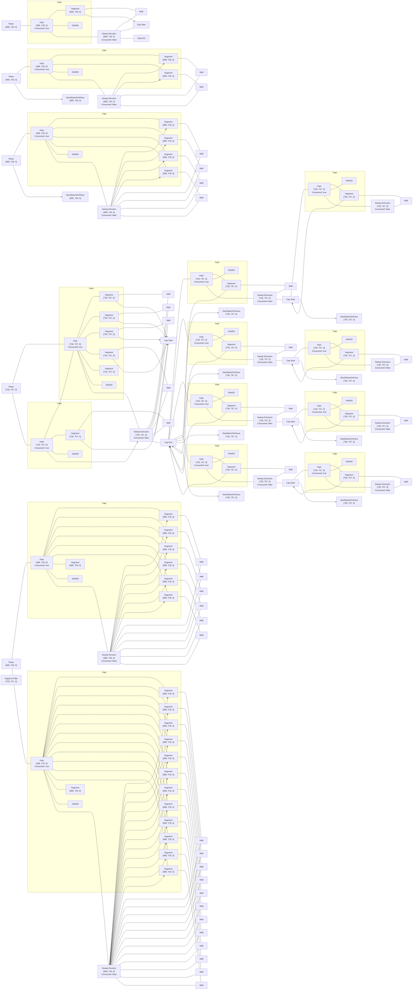

```mermaid
flowchart LR
  subgraph path2 [Path]
    2["Path<br>[689, 729, 0]<br>Consumed: true"]
      %% [ProgramBodyItem { index: 1 }]
    3["Segment<br>[689, 729, 0]"]
      %% [ProgramBodyItem { index: 1 }]
    4["Segment<br>[689, 729, 0]"]
      %% [ProgramBodyItem { index: 1 }]
    5[Solid2d]
  end
  subgraph path10 [Path]
    10["Path<br>[689, 729, 0]<br>Consumed: true"]
      %% [ProgramBodyItem { index: 1 }]
    11["Segment<br>[689, 729, 0]"]
      %% [ProgramBodyItem { index: 1 }]
    12["Segment<br>[689, 729, 0]"]
      %% [ProgramBodyItem { index: 1 }]
    13["Segment<br>[689, 729, 0]"]
      %% [ProgramBodyItem { index: 1 }]
    14["Segment<br>[689, 729, 0]"]
      %% [ProgramBodyItem { index: 1 }]
    15[Solid2d]
  end
  subgraph path22 [Path]
    22["Path<br>[689, 729, 0]<br>Consumed: true"]
      %% [ProgramBodyItem { index: 1 }]
    23["Segment<br>[689, 729, 0]"]
      %% [ProgramBodyItem { index: 1 }]
    24[Solid2d]
  end
  subgraph path26 [Path]
    26["Path<br>[689, 729, 0]<br>Consumed: true"]
      %% [ProgramBodyItem { index: 1 }]
    27["Segment<br>[689, 729, 0]"]
      %% [ProgramBodyItem { index: 1 }]
    28["Segment<br>[689, 729, 0]"]
      %% [ProgramBodyItem { index: 1 }]
    29["Segment<br>[689, 729, 0]"]
      %% [ProgramBodyItem { index: 1 }]
    30["Segment<br>[689, 729, 0]"]
      %% [ProgramBodyItem { index: 1 }]
    31["Segment<br>[689, 729, 0]"]
      %% [ProgramBodyItem { index: 1 }]
    32["Segment<br>[689, 729, 0]"]
      %% [ProgramBodyItem { index: 1 }]
    33["Segment<br>[689, 729, 0]"]
      %% [ProgramBodyItem { index: 1 }]
    34[Solid2d]
  end
  subgraph path42 [Path]
    42["Path<br>[689, 729, 0]<br>Consumed: true"]
      %% [ProgramBodyItem { index: 1 }]
    43["Segment<br>[689, 729, 0]"]
      %% [ProgramBodyItem { index: 1 }]
    44["Segment<br>[689, 729, 0]"]
      %% [ProgramBodyItem { index: 1 }]
    45["Segment<br>[689, 729, 0]"]
      %% [ProgramBodyItem { index: 1 }]
    46["Segment<br>[689, 729, 0]"]
      %% [ProgramBodyItem { index: 1 }]
    47["Segment<br>[689, 729, 0]"]
      %% [ProgramBodyItem { index: 1 }]
    48["Segment<br>[689, 729, 0]"]
      %% [ProgramBodyItem { index: 1 }]
    49["Segment<br>[689, 729, 0]"]
      %% [ProgramBodyItem { index: 1 }]
    50["Segment<br>[689, 729, 0]"]
      %% [ProgramBodyItem { index: 1 }]
    51["Segment<br>[689, 729, 0]"]
      %% [ProgramBodyItem { index: 1 }]
    52["Segment<br>[689, 729, 0]"]
      %% [ProgramBodyItem { index: 1 }]
    53["Segment<br>[689, 729, 0]"]
      %% [ProgramBodyItem { index: 1 }]
    54["Segment<br>[689, 729, 0]"]
      %% [ProgramBodyItem { index: 1 }]
    55["Segment<br>[689, 729, 0]"]
      %% [ProgramBodyItem { index: 1 }]
    56[Solid2d]
  end
  subgraph path75 [Path]
    75["Path<br>[730, 757, 0]<br>Consumed: true"]
      %% [ProgramBodyItem { index: 2 }]
    76["Segment<br>[730, 757, 0]"]
      %% [ProgramBodyItem { index: 2 }]
    77["Segment<br>[730, 757, 0]"]
      %% [ProgramBodyItem { index: 2 }]
    78["Segment<br>[730, 757, 0]"]
      %% [ProgramBodyItem { index: 2 }]
    79["Segment<br>[730, 757, 0]"]
      %% [ProgramBodyItem { index: 2 }]
    80["Segment<br>[730, 757, 0]"]
      %% [ProgramBodyItem { index: 2 }]
    81[Solid2d]
  end
  subgraph path82 [Path]
    82["Path<br>[730, 757, 0]<br>Consumed: true"]
      %% [ProgramBodyItem { index: 2 }]
    83["Segment<br>[730, 757, 0]"]
      %% [ProgramBodyItem { index: 2 }]
    84[Solid2d]
  end
  subgraph path94 [Path]
    94["Path<br>[730, 757, 0]<br>Consumed: true"]
      %% [ProgramBodyItem { index: 2 }]
    95["Segment<br>[730, 757, 0]"]
      %% [ProgramBodyItem { index: 2 }]
    96[Solid2d]
  end
  subgraph path100 [Path]
    100["Path<br>[730, 757, 0]<br>Consumed: true"]
      %% [ProgramBodyItem { index: 2 }]
    101["Segment<br>[730, 757, 0]"]
      %% [ProgramBodyItem { index: 2 }]
    102[Solid2d]
  end
  subgraph path105 [Path]
    105["Path<br>[730, 757, 0]<br>Consumed: true"]
      %% [ProgramBodyItem { index: 2 }]
    106["Segment<br>[730, 757, 0]"]
      %% [ProgramBodyItem { index: 2 }]
    107[Solid2d]
  end
  subgraph path111 [Path]
    111["Path<br>[730, 757, 0]<br>Consumed: true"]
      %% [ProgramBodyItem { index: 2 }]
    112["Segment<br>[730, 757, 0]"]
      %% [ProgramBodyItem { index: 2 }]
    113[Solid2d]
  end
  subgraph path116 [Path]
    116["Path<br>[730, 757, 0]<br>Consumed: true"]
      %% [ProgramBodyItem { index: 2 }]
    117["Segment<br>[730, 757, 0]"]
      %% [ProgramBodyItem { index: 2 }]
    118[Solid2d]
  end
  subgraph path122 [Path]
    122["Path<br>[730, 757, 0]<br>Consumed: true"]
      %% [ProgramBodyItem { index: 2 }]
    123["Segment<br>[730, 757, 0]"]
      %% [ProgramBodyItem { index: 2 }]
    124[Solid2d]
  end
  subgraph path127 [Path]
    127["Path<br>[730, 757, 0]<br>Consumed: true"]
      %% [ProgramBodyItem { index: 2 }]
    128["Segment<br>[730, 757, 0]"]
      %% [ProgramBodyItem { index: 2 }]
    129[Solid2d]
  end
  subgraph path133 [Path]
    133["Path<br>[730, 757, 0]<br>Consumed: true"]
      %% [ProgramBodyItem { index: 2 }]
    134["Segment<br>[730, 757, 0]"]
      %% [ProgramBodyItem { index: 2 }]
    135[Solid2d]
  end
  1["Plane<br>[689, 729, 0]"]
    %% [ProgramBodyItem { index: 1 }]
  6["Sweep Revolve<br>[689, 729, 0]<br>Consumed: false"]
    %% [ProgramBodyItem { index: 1 }]
  7[Wall]
    %% face_code_ref=Missing NodePath
  8[Wall]
    %% face_code_ref=Missing NodePath
  9["Plane<br>[689, 729, 0]"]
    %% [ProgramBodyItem { index: 1 }]
  16["Sweep Revolve<br>[689, 729, 0]<br>Consumed: false"]
    %% [ProgramBodyItem { index: 1 }]
  17[Wall]
    %% face_code_ref=Missing NodePath
  18[Wall]
    %% face_code_ref=Missing NodePath
  19[Wall]
    %% face_code_ref=Missing NodePath
  20[Wall]
    %% face_code_ref=Missing NodePath
  21["Plane<br>[689, 729, 0]"]
    %% [ProgramBodyItem { index: 1 }]
  25["Plane<br>[689, 729, 0]"]
    %% [ProgramBodyItem { index: 1 }]
  35["Sweep Revolve<br>[689, 729, 0]<br>Consumed: false"]
    %% [ProgramBodyItem { index: 1 }]
  36[Wall]
    %% face_code_ref=Missing NodePath
  37[Wall]
    %% face_code_ref=Missing NodePath
  38[Wall]
    %% face_code_ref=Missing NodePath
  39[Wall]
    %% face_code_ref=Missing NodePath
  40[Wall]
    %% face_code_ref=Missing NodePath
  41[Wall]
    %% face_code_ref=Missing NodePath
  57["Sweep Revolve<br>[689, 729, 0]<br>Consumed: false"]
    %% [ProgramBodyItem { index: 1 }]
  58[Wall]
    %% face_code_ref=Missing NodePath
  59[Wall]
    %% face_code_ref=Missing NodePath
  60[Wall]
    %% face_code_ref=Missing NodePath
  61[Wall]
    %% face_code_ref=Missing NodePath
  62[Wall]
    %% face_code_ref=Missing NodePath
  63[Wall]
    %% face_code_ref=Missing NodePath
  64[Wall]
    %% face_code_ref=Missing NodePath
  65[Wall]
    %% face_code_ref=Missing NodePath
  66[Wall]
    %% face_code_ref=Missing NodePath
  67[Wall]
    %% face_code_ref=Missing NodePath
  68[Wall]
    %% face_code_ref=Missing NodePath
  69[Wall]
    %% face_code_ref=Missing NodePath
  70["Sweep Revolve<br>[689, 729, 0]<br>Consumed: false"]
    %% [ProgramBodyItem { index: 1 }]
  71[Wall]
    %% face_code_ref=Missing NodePath
  72["Cap Start"]
    %% face_code_ref=Missing NodePath
  73["Cap End"]
    %% face_code_ref=Missing NodePath
  74["Plane<br>[730, 757, 0]"]
    %% [ProgramBodyItem { index: 2 }]
  85["Sweep Extrusion<br>[730, 757, 0]<br>Consumed: false"]
    %% [ProgramBodyItem { index: 2 }]
  86[Wall]
    %% face_code_ref=Missing NodePath
  87[Wall]
    %% face_code_ref=Missing NodePath
  88[Wall]
    %% face_code_ref=Missing NodePath
  89[Wall]
    %% face_code_ref=Missing NodePath
  90[Wall]
    %% face_code_ref=Missing NodePath
  91["Cap Start"]
    %% face_code_ref=Missing NodePath
  92["Cap End"]
    %% face_code_ref=[ProgramBodyItem { index: 2 }]
  93["EdgeCut Fillet<br>[730, 757, 0]"]
    %% [ProgramBodyItem { index: 2 }]
  97["Sweep Extrusion<br>[730, 757, 0]<br>Consumed: false"]
    %% [ProgramBodyItem { index: 2 }]
  98[Wall]
    %% face_code_ref=Missing NodePath
  99["Cap Start"]
    %% face_code_ref=[ProgramBodyItem { index: 2 }]
  103["Sweep Extrusion<br>[730, 757, 0]<br>Consumed: false"]
    %% [ProgramBodyItem { index: 2 }]
  104[Wall]
    %% face_code_ref=Missing NodePath
  108["Sweep Extrusion<br>[730, 757, 0]<br>Consumed: false"]
    %% [ProgramBodyItem { index: 2 }]
  109[Wall]
    %% face_code_ref=Missing NodePath
  110["Cap Start"]
    %% face_code_ref=[ProgramBodyItem { index: 2 }]
  114["Sweep Extrusion<br>[730, 757, 0]<br>Consumed: false"]
    %% [ProgramBodyItem { index: 2 }]
  115[Wall]
    %% face_code_ref=Missing NodePath
  119["Sweep Extrusion<br>[730, 757, 0]<br>Consumed: false"]
    %% [ProgramBodyItem { index: 2 }]
  120[Wall]
    %% face_code_ref=Missing NodePath
  121["Cap Start"]
    %% face_code_ref=[ProgramBodyItem { index: 2 }]
  125["Sweep Extrusion<br>[730, 757, 0]<br>Consumed: false"]
    %% [ProgramBodyItem { index: 2 }]
  126[Wall]
    %% face_code_ref=Missing NodePath
  130["Sweep Extrusion<br>[730, 757, 0]<br>Consumed: false"]
    %% [ProgramBodyItem { index: 2 }]
  131[Wall]
    %% face_code_ref=Missing NodePath
  132["Cap Start"]
    %% face_code_ref=[ProgramBodyItem { index: 2 }]
  136["Sweep Extrusion<br>[730, 757, 0]<br>Consumed: false"]
    %% [ProgramBodyItem { index: 2 }]
  137[Wall]
    %% face_code_ref=Missing NodePath
  138["StartSketchOnPlane<br>[689, 729, 0]"]
    %% [ProgramBodyItem { index: 1 }]
  139["StartSketchOnPlane<br>[689, 729, 0]"]
    %% [ProgramBodyItem { index: 1 }]
  140["StartSketchOnFace<br>[730, 757, 0]"]
    %% [ProgramBodyItem { index: 2 }]
  141["StartSketchOnFace<br>[730, 757, 0]"]
    %% [ProgramBodyItem { index: 2 }]
  142["StartSketchOnFace<br>[730, 757, 0]"]
    %% [ProgramBodyItem { index: 2 }]
  143["StartSketchOnFace<br>[730, 757, 0]"]
    %% [ProgramBodyItem { index: 2 }]
  144["StartSketchOnFace<br>[730, 757, 0]"]
    %% [ProgramBodyItem { index: 2 }]
  145["StartSketchOnFace<br>[730, 757, 0]"]
    %% [ProgramBodyItem { index: 2 }]
  146["StartSketchOnFace<br>[730, 757, 0]"]
    %% [ProgramBodyItem { index: 2 }]
  147["StartSketchOnFace<br>[730, 757, 0]"]
    %% [ProgramBodyItem { index: 2 }]
  1 --- 2
  1 <--x 138
  2 --- 3
  2 --- 4
  2 --- 5
  2 ---- 6
  6 <--x 3
  3 --- 7
  6 <--x 4
  4 --- 8
  6 --- 7
  6 --- 8
  9 --- 10
  9 <--x 139
  10 --- 11
  10 --- 12
  10 --- 13
  10 --- 14
  10 --- 15
  10 ---- 16
  16 <--x 11
  11 --- 17
  16 <--x 12
  12 --- 18
  16 <--x 13
  13 --- 19
  16 <--x 14
  14 --- 20
  16 --- 17
  16 --- 18
  16 --- 19
  16 --- 20
  21 --- 22
  22 --- 23
  22 --- 24
  22 ---- 70
  23 --- 71
  23 x--> 72
  25 --- 26
  25 --- 42
  26 --- 27
  26 --- 28
  26 --- 29
  26 --- 30
  26 --- 31
  26 --- 32
  26 --- 33
  26 --- 34
  26 ---- 35
  35 <--x 27
  27 --- 36
  35 <--x 28
  28 --- 37
  35 <--x 29
  29 --- 38
  35 <--x 30
  30 --- 39
  35 <--x 31
  31 --- 40
  35 <--x 32
  32 --- 41
  35 --- 36
  35 --- 37
  35 --- 38
  35 --- 39
  35 --- 40
  35 --- 41
  42 --- 43
  42 --- 44
  42 --- 45
  42 --- 46
  42 --- 47
  42 --- 48
  42 --- 49
  42 --- 50
  42 --- 51
  42 --- 52
  42 --- 53
  42 --- 54
  42 --- 55
  42 --- 56
  42 ---- 57
  57 <--x 43
  43 --- 58
  57 <--x 44
  44 --- 59
  57 <--x 45
  45 --- 60
  57 <--x 46
  46 --- 61
  57 <--x 47
  47 --- 62
  57 <--x 48
  48 --- 63
  57 <--x 49
  49 --- 64
  57 <--x 50
  50 --- 65
  57 <--x 51
  51 --- 66
  57 <--x 52
  52 --- 67
  57 <--x 53
  53 --- 68
  57 <--x 54
  54 --- 69
  57 --- 58
  57 --- 59
  57 --- 60
  57 --- 61
  57 --- 62
  57 --- 63
  57 --- 64
  57 --- 65
  57 --- 66
  57 --- 67
  57 --- 68
  57 --- 69
  70 --- 71
  70 --- 72
  70 --- 73
  74 --- 75
  74 --- 82
  75 --- 76
  75 --- 77
  75 --- 78
  75 --- 79
  75 --- 80
  75 --- 81
  82 --- 75
  75 ---- 85
  76 --- 86
  76 x--> 91
  77 --- 87
  77 x--> 91
  78 --- 88
  78 x--> 91
  79 --- 89
  79 x--> 91
  82 --- 83
  82 --- 84
  82 x---> 85
  83 --- 90
  83 x--> 91
  85 --- 86
  85 --- 87
  85 --- 88
  85 --- 89
  85 --- 90
  85 --- 91
  85 --- 92
  92 --- 94
  95 <--x 92
  92 --- 105
  106 <--x 92
  92 --- 116
  117 <--x 92
  92 --- 127
  128 <--x 92
  92 <--x 140
  92 <--x 142
  92 <--x 144
  92 <--x 146
  94 --- 95
  94 --- 96
  94 ---- 97
  95 --- 98
  97 --- 98
  97 --- 99
  99 --- 100
  101 <--x 99
  99 <--x 141
  100 --- 101
  100 --- 102
  100 ---- 103
  101 --- 104
  103 --- 104
  105 --- 106
  105 --- 107
  105 ---- 108
  106 --- 109
  108 --- 109
  108 --- 110
  110 --- 111
  112 <--x 110
  110 <--x 143
  111 --- 112
  111 --- 113
  111 ---- 114
  112 --- 115
  114 --- 115
  116 --- 117
  116 --- 118
  116 ---- 119
  117 --- 120
  119 --- 120
  119 --- 121
  121 --- 122
  123 <--x 121
  121 <--x 145
  122 --- 123
  122 --- 124
  122 ---- 125
  123 --- 126
  125 --- 126
  127 --- 128
  127 --- 129
  127 ---- 130
  128 --- 131
  130 --- 131
  130 --- 132
  132 --- 133
  134 <--x 132
  132 <--x 147
  133 --- 134
  133 --- 135
  133 ---- 136
  134 --- 137
  136 --- 137
```
