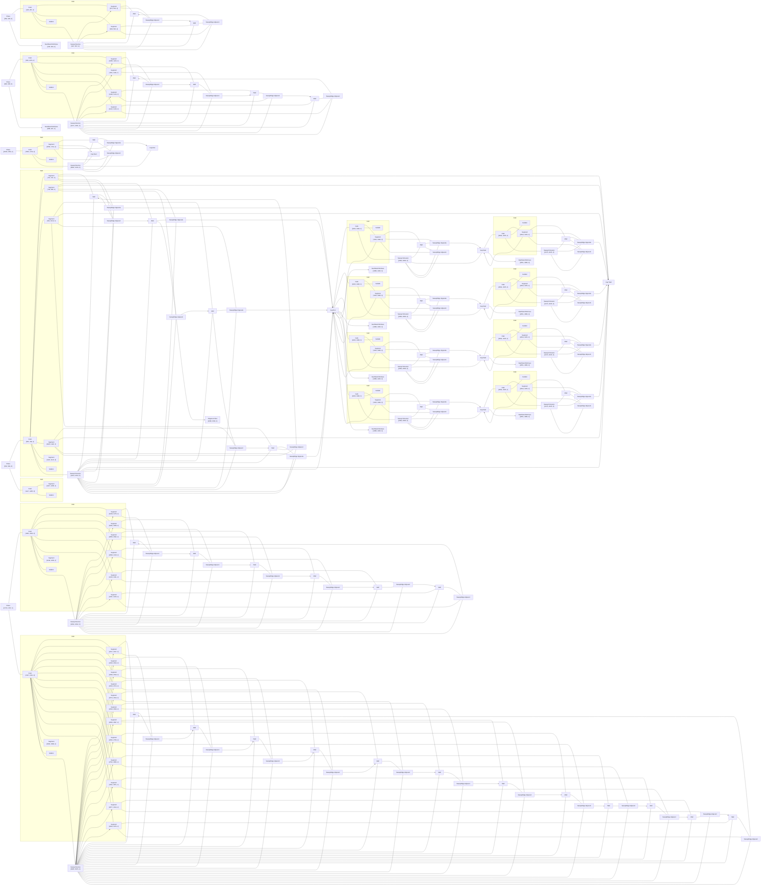

```mermaid
flowchart LR
  subgraph path2 [Path]
    2["Path<br>[410, 467, 2]"]
    3["Segment<br>[473, 532, 2]"]
    4["Segment<br>[538, 545, 2]"]
    5[Solid2d]
  end
  subgraph path12 [Path]
    12["Path<br>[953, 1079, 2]"]
    13["Segment<br>[1085, 1145, 2]"]
    14["Segment<br>[1151, 1182, 2]"]
    15["Segment<br>[1188, 1216, 2]"]
    16["Segment<br>[1222, 1229, 2]"]
    17[Solid2d]
  end
  subgraph path28 [Path]
    28["Path<br>[1559, 1719, 2]"]
    29["Segment<br>[1559, 1719, 2]"]
    30[Solid2d]
  end
  subgraph path32 [Path]
    32["Path<br>[1803, 1932, 2]"]
    33["Segment<br>[1938, 1976, 2]"]
    34["Segment<br>[1982, 2060, 2]"]
    35["Segment<br>[2066, 2092, 2]"]
    36["Segment<br>[2098, 2120, 2]"]
    37["Segment<br>[2126, 2181, 2]"]
    38["Segment<br>[2187, 2243, 2]"]
    39["Segment<br>[2249, 2256, 2]"]
    40[Solid2d]
  end
  subgraph path54 [Path]
    54["Path<br>[2347, 2411, 2]"]
    55["Segment<br>[2417, 2437, 2]"]
    56["Segment<br>[2443, 2494, 2]"]
    57["Segment<br>[2500, 2520, 2]"]
    58["Segment<br>[2526, 2573, 2]"]
    59["Segment<br>[2579, 2624, 2]"]
    60["Segment<br>[2630, 2660, 2]"]
    61["Segment<br>[2666, 2687, 2]"]
    62["Segment<br>[2693, 2756, 2]"]
    63["Segment<br>[2762, 2805, 2]"]
    64["Segment<br>[2811, 2871, 2]"]
    65["Segment<br>[2877, 2914, 2]"]
    66["Segment<br>[2920, 2976, 2]"]
    67["Segment<br>[2982, 2989, 2]"]
    68[Solid2d]
  end
  subgraph path101 [Path]
    101["Path<br>[655, 709, 3]"]
    102["Segment<br>[715, 787, 3]"]
    103["Segment<br>[793, 896, 3]"]
    104["Segment<br>[902, 1019, 3]"]
    105["Segment<br>[1025, 1110, 3]"]
    106["Segment<br>[1116, 1123, 3]"]
    107[Solid2d]
  end
  subgraph path108 [Path]
    108["Path<br>[1147, 1205, 3]"]
    109["Segment<br>[1147, 1205, 3]"]
    110[Solid2d]
  end
  subgraph path127 [Path]
    127["Path<br>[1933, 1996, 3]"]
    128["Segment<br>[1933, 1996, 3]"]
    129[Solid2d]
  end
  subgraph path135 [Path]
    135["Path<br>[2094, 2165, 3]"]
    136["Segment<br>[2094, 2165, 3]"]
    137[Solid2d]
  end
  subgraph path142 [Path]
    142["Path<br>[1933, 1996, 3]"]
    143["Segment<br>[1933, 1996, 3]"]
    144[Solid2d]
  end
  subgraph path150 [Path]
    150["Path<br>[2094, 2165, 3]"]
    151["Segment<br>[2094, 2165, 3]"]
    152[Solid2d]
  end
  subgraph path157 [Path]
    157["Path<br>[1933, 1996, 3]"]
    158["Segment<br>[1933, 1996, 3]"]
    159[Solid2d]
  end
  subgraph path165 [Path]
    165["Path<br>[2094, 2165, 3]"]
    166["Segment<br>[2094, 2165, 3]"]
    167[Solid2d]
  end
  subgraph path172 [Path]
    172["Path<br>[1933, 1996, 3]"]
    173["Segment<br>[1933, 1996, 3]"]
    174[Solid2d]
  end
  subgraph path180 [Path]
    180["Path<br>[2094, 2165, 3]"]
    181["Segment<br>[2094, 2165, 3]"]
    182[Solid2d]
  end
  1["Plane<br>[359, 403, 2]"]
  6["Sweep Revolve<br>[627, 657, 2]"]
  7[Wall]
    %% face_code_ref=Missing NodePath
  8[Wall]
    %% face_code_ref=Missing NodePath
  9["SweepEdge Adjacent"]
  10["SweepEdge Adjacent"]
  11["Plane<br>[902, 946, 2]"]
  18["Sweep Revolve<br>[1271, 1301, 2]"]
  19[Wall]
    %% face_code_ref=Missing NodePath
  20[Wall]
    %% face_code_ref=Missing NodePath
  21[Wall]
    %% face_code_ref=Missing NodePath
  22[Wall]
    %% face_code_ref=Missing NodePath
  23["SweepEdge Adjacent"]
  24["SweepEdge Adjacent"]
  25["SweepEdge Adjacent"]
  26["SweepEdge Adjacent"]
  27["Plane<br>[1536, 1553, 2]"]
  31["Plane<br>[1770, 1787, 2]"]
  41["Sweep Revolve<br>[2262, 2292, 2]"]
  42[Wall]
    %% face_code_ref=Missing NodePath
  43[Wall]
    %% face_code_ref=Missing NodePath
  44[Wall]
    %% face_code_ref=Missing NodePath
  45[Wall]
    %% face_code_ref=Missing NodePath
  46[Wall]
    %% face_code_ref=Missing NodePath
  47[Wall]
    %% face_code_ref=Missing NodePath
  48["SweepEdge Adjacent"]
  49["SweepEdge Adjacent"]
  50["SweepEdge Adjacent"]
  51["SweepEdge Adjacent"]
  52["SweepEdge Adjacent"]
  53["SweepEdge Adjacent"]
  69["Sweep Revolve<br>[2995, 3025, 2]"]
  70[Wall]
    %% face_code_ref=Missing NodePath
  71[Wall]
    %% face_code_ref=Missing NodePath
  72[Wall]
    %% face_code_ref=Missing NodePath
  73[Wall]
    %% face_code_ref=Missing NodePath
  74[Wall]
    %% face_code_ref=Missing NodePath
  75[Wall]
    %% face_code_ref=Missing NodePath
  76[Wall]
    %% face_code_ref=Missing NodePath
  77[Wall]
    %% face_code_ref=Missing NodePath
  78[Wall]
    %% face_code_ref=Missing NodePath
  79[Wall]
    %% face_code_ref=Missing NodePath
  80[Wall]
    %% face_code_ref=Missing NodePath
  81[Wall]
    %% face_code_ref=Missing NodePath
  82["SweepEdge Adjacent"]
  83["SweepEdge Adjacent"]
  84["SweepEdge Adjacent"]
  85["SweepEdge Adjacent"]
  86["SweepEdge Adjacent"]
  87["SweepEdge Adjacent"]
  88["SweepEdge Adjacent"]
  89["SweepEdge Adjacent"]
  90["SweepEdge Adjacent"]
  91["SweepEdge Adjacent"]
  92["SweepEdge Adjacent"]
  93["SweepEdge Adjacent"]
  94["Sweep Revolve<br>[3092, 3139, 2]"]
  95[Wall]
    %% face_code_ref=Missing NodePath
  96["Cap Start"]
    %% face_code_ref=Missing NodePath
  97["Cap End"]
    %% face_code_ref=Missing NodePath
  98["SweepEdge Opposite"]
  99["SweepEdge Adjacent"]
  100["Plane<br>[632, 649, 3]"]
  111["Sweep Extrusion<br>[1219, 1264, 3]"]
  112[Wall]
    %% face_code_ref=Missing NodePath
  113[Wall]
    %% face_code_ref=Missing NodePath
  114[Wall]
    %% face_code_ref=Missing NodePath
  115[Wall]
    %% face_code_ref=Missing NodePath
  116["Cap Start"]
    %% face_code_ref=Missing NodePath
  117["Cap End"]
  118["SweepEdge Opposite"]
  119["SweepEdge Adjacent"]
  120["SweepEdge Opposite"]
  121["SweepEdge Adjacent"]
  122["SweepEdge Opposite"]
  123["SweepEdge Adjacent"]
  124["SweepEdge Opposite"]
  125["SweepEdge Adjacent"]
  126["EdgeCut Fillet<br>[1308, 1593, 3]"]
  130["Sweep Extrusion<br>[2004, 2039, 3]"]
  131[Wall]
    %% face_code_ref=Missing NodePath
  132["Cap Start"]
  133["SweepEdge Opposite"]
  134["SweepEdge Adjacent"]
  138["Sweep Extrusion<br>[2173, 2225, 3]"]
  139[Wall]
    %% face_code_ref=Missing NodePath
  140["SweepEdge Opposite"]
  141["SweepEdge Adjacent"]
  145["Sweep Extrusion<br>[2004, 2039, 3]"]
  146[Wall]
    %% face_code_ref=Missing NodePath
  147["Cap Start"]
  148["SweepEdge Opposite"]
  149["SweepEdge Adjacent"]
  153["Sweep Extrusion<br>[2173, 2225, 3]"]
  154[Wall]
    %% face_code_ref=Missing NodePath
  155["SweepEdge Opposite"]
  156["SweepEdge Adjacent"]
  160["Sweep Extrusion<br>[2004, 2039, 3]"]
  161[Wall]
    %% face_code_ref=Missing NodePath
  162["Cap Start"]
  163["SweepEdge Opposite"]
  164["SweepEdge Adjacent"]
  168["Sweep Extrusion<br>[2173, 2225, 3]"]
  169[Wall]
    %% face_code_ref=Missing NodePath
  170["SweepEdge Opposite"]
  171["SweepEdge Adjacent"]
  175["Sweep Extrusion<br>[2004, 2039, 3]"]
  176[Wall]
    %% face_code_ref=Missing NodePath
  177["Cap Start"]
  178["SweepEdge Opposite"]
  179["SweepEdge Adjacent"]
  183["Sweep Extrusion<br>[2173, 2225, 3]"]
  184[Wall]
    %% face_code_ref=Missing NodePath
  185["SweepEdge Opposite"]
  186["SweepEdge Adjacent"]
  187["StartSketchOnPlane<br>[345, 404, 2]"]
  188["StartSketchOnPlane<br>[888, 947, 2]"]
  189["StartSketchOnFace<br>[1889, 1925, 3]"]
  190["StartSketchOnFace<br>[2051, 2086, 3]"]
  191["StartSketchOnFace<br>[1889, 1925, 3]"]
  192["StartSketchOnFace<br>[2051, 2086, 3]"]
  193["StartSketchOnFace<br>[1889, 1925, 3]"]
  194["StartSketchOnFace<br>[2051, 2086, 3]"]
  195["StartSketchOnFace<br>[1889, 1925, 3]"]
  196["StartSketchOnFace<br>[2051, 2086, 3]"]
  1 --- 2
  1 <--x 187
  2 --- 3
  2 --- 4
  2 --- 5
  2 ---- 6
  6 <--x 3
  3 --- 7
  3 --- 9
  6 <--x 4
  4 --- 8
  4 --- 10
  6 --- 7
  6 --- 8
  6 --- 9
  6 --- 10
  7 --- 9
  10 <--x 7
  9 <--x 8
  8 --- 10
  11 --- 12
  11 <--x 188
  12 --- 13
  12 --- 14
  12 --- 15
  12 --- 16
  12 --- 17
  12 ---- 18
  18 <--x 13
  13 --- 19
  13 --- 23
  18 <--x 14
  14 --- 20
  14 --- 24
  18 <--x 15
  15 --- 21
  15 --- 25
  18 <--x 16
  16 --- 22
  16 --- 26
  18 --- 19
  18 --- 20
  18 --- 21
  18 --- 22
  18 --- 23
  18 --- 24
  18 --- 25
  18 --- 26
  19 --- 23
  26 <--x 19
  23 <--x 20
  20 --- 24
  24 <--x 21
  21 --- 25
  25 <--x 22
  22 --- 26
  27 --- 28
  28 --- 29
  28 --- 30
  28 ---- 94
  29 --- 95
  29 x--> 96
  29 --- 98
  29 --- 99
  31 --- 32
  31 --- 54
  32 --- 33
  32 --- 34
  32 --- 35
  32 --- 36
  32 --- 37
  32 --- 38
  32 --- 39
  32 --- 40
  32 ---- 41
  41 <--x 33
  33 --- 42
  33 --- 48
  41 <--x 34
  34 --- 43
  34 --- 49
  41 <--x 35
  35 --- 44
  35 --- 50
  41 <--x 36
  36 --- 45
  36 --- 51
  41 <--x 37
  37 --- 46
  37 --- 52
  41 <--x 38
  38 --- 47
  38 --- 53
  41 --- 42
  41 --- 43
  41 --- 44
  41 --- 45
  41 --- 46
  41 --- 47
  41 --- 48
  41 --- 49
  41 --- 50
  41 --- 51
  41 --- 52
  41 --- 53
  42 --- 48
  53 <--x 42
  48 <--x 43
  43 --- 49
  49 <--x 44
  44 --- 50
  50 <--x 45
  45 --- 51
  51 <--x 46
  46 --- 52
  52 <--x 47
  47 --- 53
  54 --- 55
  54 --- 56
  54 --- 57
  54 --- 58
  54 --- 59
  54 --- 60
  54 --- 61
  54 --- 62
  54 --- 63
  54 --- 64
  54 --- 65
  54 --- 66
  54 --- 67
  54 --- 68
  54 ---- 69
  69 <--x 55
  55 --- 70
  55 --- 82
  69 <--x 56
  56 --- 71
  56 --- 83
  69 <--x 57
  57 --- 72
  57 --- 84
  69 <--x 58
  58 --- 73
  58 --- 85
  69 <--x 59
  59 --- 74
  59 --- 86
  69 <--x 60
  60 --- 75
  60 --- 87
  69 <--x 61
  61 --- 76
  61 --- 88
  69 <--x 62
  62 --- 77
  62 --- 89
  69 <--x 63
  63 --- 78
  63 --- 90
  69 <--x 64
  64 --- 79
  64 --- 91
  69 <--x 65
  65 --- 80
  65 --- 92
  69 <--x 66
  66 --- 81
  66 --- 93
  69 --- 70
  69 --- 71
  69 --- 72
  69 --- 73
  69 --- 74
  69 --- 75
  69 --- 76
  69 --- 77
  69 --- 78
  69 --- 79
  69 --- 80
  69 --- 81
  69 --- 82
  69 --- 83
  69 --- 84
  69 --- 85
  69 --- 86
  69 --- 87
  69 --- 88
  69 --- 89
  69 --- 90
  69 --- 91
  69 --- 92
  69 --- 93
  70 --- 82
  93 <--x 70
  82 <--x 71
  71 --- 83
  83 <--x 72
  72 --- 84
  84 <--x 73
  73 --- 85
  85 <--x 74
  74 --- 86
  86 <--x 75
  75 --- 87
  87 <--x 76
  76 --- 88
  88 <--x 77
  77 --- 89
  89 <--x 78
  78 --- 90
  90 <--x 79
  79 --- 91
  91 <--x 80
  80 --- 92
  92 <--x 81
  81 --- 93
  94 --- 95
  94 --- 96
  94 --- 97
  94 --- 98
  94 --- 99
  95 --- 98
  95 --- 99
  98 <--x 97
  100 --- 101
  100 --- 108
  101 --- 102
  101 --- 103
  101 --- 104
  101 --- 105
  101 --- 106
  101 --- 107
  101 ---- 111
  102 --- 112
  102 x--> 116
  102 --- 118
  102 --- 119
  103 --- 113
  103 x--> 116
  103 --- 120
  103 --- 121
  104 --- 114
  104 x--> 116
  104 --- 122
  104 --- 123
  105 --- 115
  105 x--> 116
  105 --- 124
  105 --- 125
  108 --- 109
  108 --- 110
  111 --- 112
  111 --- 113
  111 --- 114
  111 --- 115
  111 --- 116
  111 --- 117
  111 --- 118
  111 --- 119
  111 --- 120
  111 --- 121
  111 --- 122
  111 --- 123
  111 --- 124
  111 --- 125
  112 --- 118
  112 --- 119
  125 <--x 112
  119 <--x 113
  113 --- 120
  113 --- 121
  121 <--x 114
  114 --- 122
  114 --- 123
  123 <--x 115
  115 --- 124
  115 --- 125
  140 <--x 116
  155 <--x 116
  170 <--x 116
  185 <--x 116
  118 <--x 117
  120 <--x 117
  122 <--x 117
  124 <--x 117
  117 --- 127
  128 <--x 117
  117 --- 142
  143 <--x 117
  117 --- 157
  158 <--x 117
  117 --- 172
  173 <--x 117
  117 <--x 189
  117 <--x 191
  117 <--x 193
  117 <--x 195
  121 <--x 126
  127 --- 128
  127 --- 129
  127 ---- 130
  128 --- 131
  128 --- 133
  128 --- 134
  130 --- 131
  130 --- 132
  130 --- 133
  130 --- 134
  131 --- 133
  131 --- 134
  133 <--x 132
  132 --- 135
  136 <--x 132
  132 <--x 190
  135 --- 136
  135 --- 137
  135 ---- 138
  136 --- 139
  136 --- 140
  136 --- 141
  138 --- 139
  138 --- 140
  138 --- 141
  139 --- 140
  139 --- 141
  142 --- 143
  142 --- 144
  142 ---- 145
  143 --- 146
  143 --- 148
  143 --- 149
  145 --- 146
  145 --- 147
  145 --- 148
  145 --- 149
  146 --- 148
  146 --- 149
  148 <--x 147
  147 --- 150
  151 <--x 147
  147 <--x 192
  150 --- 151
  150 --- 152
  150 ---- 153
  151 --- 154
  151 --- 155
  151 --- 156
  153 --- 154
  153 --- 155
  153 --- 156
  154 --- 155
  154 --- 156
  157 --- 158
  157 --- 159
  157 ---- 160
  158 --- 161
  158 --- 163
  158 --- 164
  160 --- 161
  160 --- 162
  160 --- 163
  160 --- 164
  161 --- 163
  161 --- 164
  163 <--x 162
  162 --- 165
  166 <--x 162
  162 <--x 194
  165 --- 166
  165 --- 167
  165 ---- 168
  166 --- 169
  166 --- 170
  166 --- 171
  168 --- 169
  168 --- 170
  168 --- 171
  169 --- 170
  169 --- 171
  172 --- 173
  172 --- 174
  172 ---- 175
  173 --- 176
  173 --- 178
  173 --- 179
  175 --- 176
  175 --- 177
  175 --- 178
  175 --- 179
  176 --- 178
  176 --- 179
  178 <--x 177
  177 --- 180
  181 <--x 177
  177 <--x 196
  180 --- 181
  180 --- 182
  180 ---- 183
  181 --- 184
  181 --- 185
  181 --- 186
  183 --- 184
  183 --- 185
  183 --- 186
  184 --- 185
  184 --- 186
```
