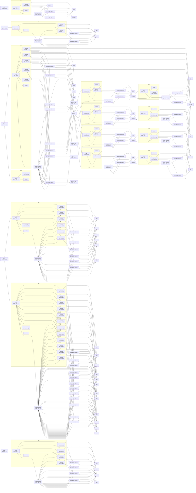

```mermaid
flowchart LR
  subgraph path6 [Path]
    6["Path<br>[410, 467, 2]"]
      %% Missing NodePath
    21["Segment<br>[473, 532, 2]"]
      %% Missing NodePath
    22["Segment<br>[538, 545, 2]"]
      %% Missing NodePath
    64[Solid2d]
  end
  subgraph path7 [Path]
    7["Path<br>[953, 1079, 2]"]
      %% Missing NodePath
    23["Segment<br>[1085, 1145, 2]"]
      %% Missing NodePath
    24["Segment<br>[1151, 1182, 2]"]
      %% Missing NodePath
    25["Segment<br>[1188, 1216, 2]"]
      %% Missing NodePath
    26["Segment<br>[1222, 1229, 2]"]
      %% Missing NodePath
    69[Solid2d]
  end
  subgraph path8 [Path]
    8["Path<br>[1559, 1719, 2]"]
      %% Missing NodePath
    27["Segment<br>[1559, 1719, 2]"]
      %% Missing NodePath
    72[Solid2d]
  end
  subgraph path9 [Path]
    9["Path<br>[1803, 1932, 2]"]
      %% Missing NodePath
    28["Segment<br>[1938, 1976, 2]"]
      %% Missing NodePath
    29["Segment<br>[1982, 2060, 2]"]
      %% Missing NodePath
    30["Segment<br>[2066, 2092, 2]"]
      %% Missing NodePath
    31["Segment<br>[2098, 2120, 2]"]
      %% Missing NodePath
    32["Segment<br>[2126, 2181, 2]"]
      %% Missing NodePath
    33["Segment<br>[2187, 2243, 2]"]
      %% Missing NodePath
    34["Segment<br>[2249, 2256, 2]"]
      %% Missing NodePath
    71[Solid2d]
  end
  subgraph path10 [Path]
    10["Path<br>[2347, 2411, 2]"]
      %% Missing NodePath
    35["Segment<br>[2417, 2437, 2]"]
      %% Missing NodePath
    36["Segment<br>[2443, 2494, 2]"]
      %% Missing NodePath
    37["Segment<br>[2500, 2520, 2]"]
      %% Missing NodePath
    38["Segment<br>[2526, 2573, 2]"]
      %% Missing NodePath
    39["Segment<br>[2579, 2624, 2]"]
      %% Missing NodePath
    40["Segment<br>[2630, 2660, 2]"]
      %% Missing NodePath
    41["Segment<br>[2666, 2687, 2]"]
      %% Missing NodePath
    42["Segment<br>[2693, 2756, 2]"]
      %% Missing NodePath
    43["Segment<br>[2762, 2805, 2]"]
      %% Missing NodePath
    44["Segment<br>[2811, 2871, 2]"]
      %% Missing NodePath
    45["Segment<br>[2877, 2914, 2]"]
      %% Missing NodePath
    46["Segment<br>[2920, 2976, 2]"]
      %% Missing NodePath
    47["Segment<br>[2982, 2989, 2]"]
      %% Missing NodePath
    70[Solid2d]
  end
  subgraph path11 [Path]
    11["Path<br>[655, 709, 3]"]
      %% Missing NodePath
    48["Segment<br>[715, 787, 3]"]
      %% Missing NodePath
    49["Segment<br>[793, 896, 3]"]
      %% Missing NodePath
    50["Segment<br>[902, 1019, 3]"]
      %% Missing NodePath
    51["Segment<br>[1025, 1110, 3]"]
      %% Missing NodePath
    52["Segment<br>[1116, 1123, 3]"]
      %% Missing NodePath
    67[Solid2d]
  end
  subgraph path12 [Path]
    12["Path<br>[1147, 1205, 3]"]
      %% Missing NodePath
    53["Segment<br>[1147, 1205, 3]"]
      %% Missing NodePath
    74[Solid2d]
  end
  subgraph path13 [Path]
    13["Path<br>[1933, 1996, 3]"]
      %% Missing NodePath
    54["Segment<br>[1933, 1996, 3]"]
      %% Missing NodePath
    62[Solid2d]
  end
  subgraph path14 [Path]
    14["Path<br>[1933, 1996, 3]"]
      %% Missing NodePath
    57["Segment<br>[1933, 1996, 3]"]
      %% Missing NodePath
    65[Solid2d]
  end
  subgraph path15 [Path]
    15["Path<br>[1933, 1996, 3]"]
      %% Missing NodePath
    55["Segment<br>[1933, 1996, 3]"]
      %% Missing NodePath
    68[Solid2d]
  end
  subgraph path16 [Path]
    16["Path<br>[1933, 1996, 3]"]
      %% Missing NodePath
    56["Segment<br>[1933, 1996, 3]"]
      %% Missing NodePath
    75[Solid2d]
  end
  subgraph path17 [Path]
    17["Path<br>[2094, 2165, 3]"]
      %% Missing NodePath
    60["Segment<br>[2094, 2165, 3]"]
      %% Missing NodePath
    63[Solid2d]
  end
  subgraph path18 [Path]
    18["Path<br>[2094, 2165, 3]"]
      %% Missing NodePath
    58["Segment<br>[2094, 2165, 3]"]
      %% Missing NodePath
    66[Solid2d]
  end
  subgraph path19 [Path]
    19["Path<br>[2094, 2165, 3]"]
      %% Missing NodePath
    59["Segment<br>[2094, 2165, 3]"]
      %% Missing NodePath
    73[Solid2d]
  end
  subgraph path20 [Path]
    20["Path<br>[2094, 2165, 3]"]
      %% Missing NodePath
    61["Segment<br>[2094, 2165, 3]"]
      %% Missing NodePath
    76[Solid2d]
  end
  1["Plane<br>[359, 403, 2]"]
    %% Missing NodePath
  2["Plane<br>[902, 946, 2]"]
    %% Missing NodePath
  3["Plane<br>[1536, 1553, 2]"]
    %% Missing NodePath
  4["Plane<br>[1770, 1787, 2]"]
    %% Missing NodePath
  5["Plane<br>[632, 649, 3]"]
    %% Missing NodePath
  77["Sweep Revolve<br>[627, 657, 2]"]
    %% Missing NodePath
  78["Sweep Revolve<br>[1271, 1301, 2]"]
    %% Missing NodePath
  79["Sweep Revolve<br>[2262, 2292, 2]"]
    %% Missing NodePath
  80["Sweep Revolve<br>[2995, 3025, 2]"]
    %% Missing NodePath
  81["Sweep Revolve<br>[3092, 3139, 2]"]
    %% Missing NodePath
  82["Sweep Extrusion<br>[1219, 1264, 3]"]
    %% Missing NodePath
  83["Sweep Extrusion<br>[2004, 2039, 3]"]
    %% Missing NodePath
  84["Sweep Extrusion<br>[2004, 2039, 3]"]
    %% Missing NodePath
  85["Sweep Extrusion<br>[2004, 2039, 3]"]
    %% Missing NodePath
  86["Sweep Extrusion<br>[2004, 2039, 3]"]
    %% Missing NodePath
  87["Sweep Extrusion<br>[2173, 2225, 3]"]
    %% Missing NodePath
  88["Sweep Extrusion<br>[2173, 2225, 3]"]
    %% Missing NodePath
  89["Sweep Extrusion<br>[2173, 2225, 3]"]
    %% Missing NodePath
  90["Sweep Extrusion<br>[2173, 2225, 3]"]
    %% Missing NodePath
  91[Wall]
  92[Wall]
  93[Wall]
  94[Wall]
  95[Wall]
  96[Wall]
  97[Wall]
  98[Wall]
  99[Wall]
  100[Wall]
  101[Wall]
  102[Wall]
  103[Wall]
  104[Wall]
  105[Wall]
  106[Wall]
  107[Wall]
  108[Wall]
  109[Wall]
  110[Wall]
  111[Wall]
  112[Wall]
  113[Wall]
  114[Wall]
  115[Wall]
  116[Wall]
  117[Wall]
  118[Wall]
  119[Wall]
  120[Wall]
  121[Wall]
  122[Wall]
  123[Wall]
  124[Wall]
  125[Wall]
  126[Wall]
  127[Wall]
  128["Cap Start"]
  129["Cap Start"]
  130["Cap Start"]
  131["Cap Start"]
  132["Cap Start"]
  133["Cap Start"]
  134["Cap End"]
  135["Cap End"]
  136["SweepEdge Opposite"]
  137["SweepEdge Opposite"]
  138["SweepEdge Opposite"]
  139["SweepEdge Opposite"]
  140["SweepEdge Opposite"]
  141["SweepEdge Opposite"]
  142["SweepEdge Opposite"]
  143["SweepEdge Opposite"]
  144["SweepEdge Opposite"]
  145["SweepEdge Opposite"]
  146["SweepEdge Opposite"]
  147["SweepEdge Opposite"]
  148["SweepEdge Opposite"]
  149["SweepEdge Adjacent"]
  150["SweepEdge Adjacent"]
  151["SweepEdge Adjacent"]
  152["SweepEdge Adjacent"]
  153["SweepEdge Adjacent"]
  154["SweepEdge Adjacent"]
  155["SweepEdge Adjacent"]
  156["SweepEdge Adjacent"]
  157["SweepEdge Adjacent"]
  158["SweepEdge Adjacent"]
  159["SweepEdge Adjacent"]
  160["SweepEdge Adjacent"]
  161["SweepEdge Adjacent"]
  162["SweepEdge Adjacent"]
  163["SweepEdge Adjacent"]
  164["SweepEdge Adjacent"]
  165["SweepEdge Adjacent"]
  166["SweepEdge Adjacent"]
  167["SweepEdge Adjacent"]
  168["SweepEdge Adjacent"]
  169["SweepEdge Adjacent"]
  170["SweepEdge Adjacent"]
  171["SweepEdge Adjacent"]
  172["SweepEdge Adjacent"]
  173["SweepEdge Adjacent"]
  174["SweepEdge Adjacent"]
  175["SweepEdge Adjacent"]
  176["SweepEdge Adjacent"]
  177["SweepEdge Adjacent"]
  178["SweepEdge Adjacent"]
  179["SweepEdge Adjacent"]
  180["SweepEdge Adjacent"]
  181["SweepEdge Adjacent"]
  182["SweepEdge Adjacent"]
  183["SweepEdge Adjacent"]
  184["SweepEdge Adjacent"]
  185["SweepEdge Adjacent"]
  186["EdgeCut Fillet<br>[1308, 1593, 3]"]
    %% Missing NodePath
  187["EdgeCut Fillet<br>[1308, 1593, 3]"]
    %% Missing NodePath
  188["EdgeCut Fillet<br>[1308, 1593, 3]"]
    %% Missing NodePath
  189["EdgeCut Fillet<br>[1308, 1593, 3]"]
    %% Missing NodePath
  1 --- 6
  2 --- 7
  3 --- 8
  4 --- 9
  4 --- 10
  5 --- 11
  5 --- 12
  6 --- 21
  6 --- 22
  6 --- 64
  6 ---- 77
  7 --- 23
  7 --- 24
  7 --- 25
  7 --- 26
  7 --- 69
  7 ---- 78
  8 --- 27
  8 --- 72
  8 ---- 81
  9 --- 28
  9 --- 29
  9 --- 30
  9 --- 31
  9 --- 32
  9 --- 33
  9 --- 34
  9 --- 71
  9 ---- 79
  10 --- 35
  10 --- 36
  10 --- 37
  10 --- 38
  10 --- 39
  10 --- 40
  10 --- 41
  10 --- 42
  10 --- 43
  10 --- 44
  10 --- 45
  10 --- 46
  10 --- 47
  10 --- 70
  10 ---- 80
  11 --- 48
  11 --- 49
  11 --- 50
  11 --- 51
  11 --- 52
  11 --- 67
  11 ---- 82
  12 --- 53
  12 --- 74
  13 --- 54
  13 --- 62
  13 ---- 86
  134 --- 13
  14 --- 57
  14 --- 65
  14 ---- 83
  134 --- 14
  15 --- 55
  15 --- 68
  15 ---- 85
  134 --- 15
  16 --- 56
  16 --- 75
  16 ---- 84
  134 --- 16
  17 --- 60
  17 --- 63
  17 ---- 87
  132 --- 17
  18 --- 58
  18 --- 66
  18 ---- 90
  129 --- 18
  19 --- 59
  19 --- 73
  19 ---- 89
  130 --- 19
  20 --- 61
  20 --- 76
  20 ---- 88
  131 --- 20
  77 <--x 21
  21 --- 92
  21 --- 150
  77 <--x 22
  22 --- 93
  22 --- 151
  78 <--x 23
  23 --- 125
  23 --- 182
  78 <--x 24
  24 --- 122
  24 --- 180
  78 <--x 25
  25 --- 123
  25 --- 181
  78 <--x 26
  26 --- 124
  26 --- 183
  27 --- 94
  27 x--> 135
  27 --- 137
  27 --- 152
  79 <--x 28
  28 --- 120
  28 --- 174
  79 <--x 29
  29 --- 115
  29 --- 177
  79 <--x 30
  30 --- 119
  30 --- 173
  79 <--x 31
  31 --- 117
  31 --- 178
  79 <--x 32
  32 --- 116
  32 --- 175
  79 <--x 33
  33 --- 118
  33 --- 176
  80 <--x 35
  35 --- 106
  35 --- 165
  80 <--x 36
  36 --- 96
  36 --- 156
  80 <--x 37
  37 --- 98
  37 --- 164
  80 <--x 38
  38 --- 101
  38 --- 159
  80 <--x 39
  39 --- 100
  39 --- 162
  80 <--x 40
  40 --- 105
  40 --- 160
  80 <--x 41
  41 --- 104
  41 --- 158
  80 <--x 42
  42 --- 107
  42 --- 154
  80 <--x 43
  43 --- 97
  43 --- 155
  80 <--x 44
  44 --- 102
  44 --- 157
  80 <--x 45
  45 --- 103
  45 --- 163
  80 <--x 46
  46 --- 99
  46 --- 161
  48 --- 112
  48 x--> 128
  48 --- 143
  48 --- 172
  49 --- 113
  49 x--> 128
  49 --- 145
  49 --- 169
  50 --- 114
  50 x--> 128
  50 --- 142
  50 --- 171
  51 --- 111
  51 x--> 128
  51 --- 144
  51 --- 170
  54 --- 126
  54 x--> 134
  54 --- 147
  54 --- 184
  55 --- 121
  55 x--> 134
  55 --- 146
  55 --- 179
  56 --- 110
  56 x--> 134
  56 --- 141
  56 --- 168
  57 --- 108
  57 x--> 134
  57 --- 139
  57 --- 166
  58 --- 127
  58 x--> 129
  58 --- 148
  58 --- 185
  59 --- 109
  59 x--> 130
  59 --- 140
  59 --- 167
  60 --- 91
  60 x--> 132
  60 --- 136
  60 --- 149
  61 --- 95
  61 x--> 131
  61 --- 138
  61 --- 153
  77 --- 92
  77 --- 93
  77 --- 150
  77 --- 151
  78 --- 122
  78 --- 123
  78 --- 124
  78 --- 125
  78 --- 180
  78 --- 181
  78 --- 182
  78 --- 183
  79 --- 115
  79 --- 116
  79 --- 117
  79 --- 118
  79 --- 119
  79 --- 120
  79 --- 173
  79 --- 174
  79 --- 175
  79 --- 176
  79 --- 177
  79 --- 178
  80 --- 96
  80 --- 97
  80 --- 98
  80 --- 99
  80 --- 100
  80 --- 101
  80 --- 102
  80 --- 103
  80 --- 104
  80 --- 105
  80 --- 106
  80 --- 107
  80 --- 154
  80 --- 155
  80 --- 156
  80 --- 157
  80 --- 158
  80 --- 159
  80 --- 160
  80 --- 161
  80 --- 162
  80 --- 163
  80 --- 164
  80 --- 165
  81 --- 94
  81 --- 133
  81 --- 135
  81 --- 137
  81 --- 152
  82 --- 111
  82 --- 112
  82 --- 113
  82 --- 114
  82 --- 128
  82 --- 134
  82 --- 142
  82 --- 143
  82 --- 144
  82 --- 145
  82 --- 169
  82 --- 170
  82 --- 171
  82 --- 172
  83 --- 108
  83 --- 131
  83 --- 139
  83 --- 166
  84 --- 110
  84 --- 132
  84 --- 141
  84 --- 168
  85 --- 121
  85 --- 130
  85 --- 146
  85 --- 179
  86 --- 126
  86 --- 129
  86 --- 147
  86 --- 184
  87 --- 91
  87 --- 136
  87 --- 149
  88 --- 95
  88 --- 138
  88 --- 153
  89 --- 109
  89 --- 140
  89 --- 167
  90 --- 127
  90 --- 148
  90 --- 185
  136 <--x 91
  149 <--x 91
  150 <--x 92
  151 <--x 92
  150 <--x 93
  151 <--x 93
  137 <--x 94
  152 <--x 94
  138 <--x 95
  153 <--x 95
  156 <--x 96
  165 <--x 96
  154 <--x 97
  155 <--x 97
  156 <--x 98
  164 <--x 98
  161 <--x 99
  163 <--x 99
  159 <--x 100
  162 <--x 100
  159 <--x 101
  164 <--x 101
  155 <--x 102
  157 <--x 102
  157 <--x 103
  163 <--x 103
  158 <--x 104
  160 <--x 104
  160 <--x 105
  162 <--x 105
  161 <--x 106
  165 <--x 106
  154 <--x 107
  158 <--x 107
  139 <--x 108
  166 <--x 108
  140 <--x 109
  167 <--x 109
  141 <--x 110
  168 <--x 110
  144 <--x 111
  143 <--x 112
  145 <--x 113
  142 <--x 114
  174 <--x 115
  177 <--x 115
  175 <--x 116
  178 <--x 116
  173 <--x 117
  178 <--x 117
  175 <--x 118
  176 <--x 118
  173 <--x 119
  177 <--x 119
  174 <--x 120
  176 <--x 120
  146 <--x 121
  179 <--x 121
  180 <--x 122
  182 <--x 122
  180 <--x 123
  181 <--x 123
  181 <--x 124
  183 <--x 124
  182 <--x 125
  183 <--x 125
  147 <--x 126
  184 <--x 126
  148 <--x 127
  185 <--x 127
  136 <--x 128
  138 <--x 128
  140 <--x 128
  148 <--x 128
  147 <--x 129
  146 <--x 130
  139 <--x 131
  141 <--x 132
  137 <--x 133
  142 <--x 134
  143 <--x 134
  144 <--x 134
  145 <--x 134
  169 <--x 188
  170 <--x 186
  171 <--x 187
  172 <--x 189
```
