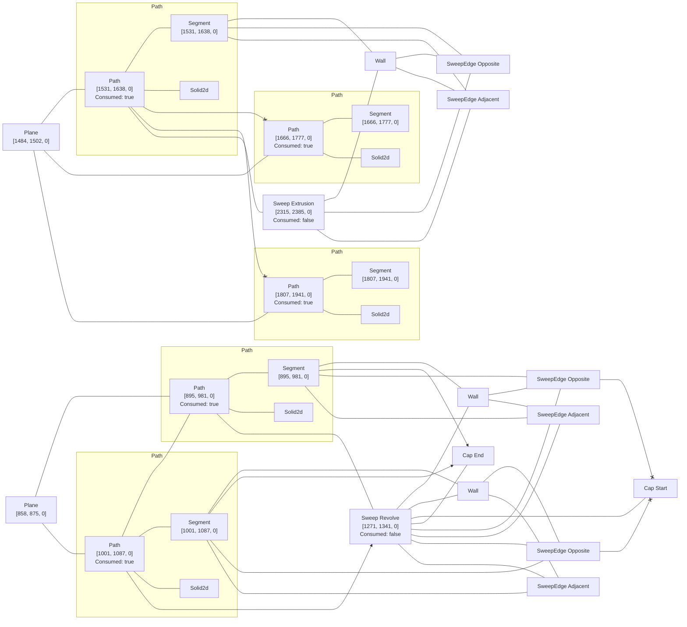

```mermaid
flowchart LR
  subgraph path2 [Path]
    2["Path<br>[895, 981, 0]<br>Consumed: true"]
      %% [ProgramBodyItem { index: 15 }, VariableDeclarationDeclaration, VariableDeclarationInit]
    3["Segment<br>[895, 981, 0]"]
      %% [ProgramBodyItem { index: 15 }, VariableDeclarationDeclaration, VariableDeclarationInit]
    4[Solid2d]
  end
  subgraph path5 [Path]
    5["Path<br>[1001, 1087, 0]<br>Consumed: true"]
      %% [ProgramBodyItem { index: 16 }, VariableDeclarationDeclaration, VariableDeclarationInit]
    6["Segment<br>[1001, 1087, 0]"]
      %% [ProgramBodyItem { index: 16 }, VariableDeclarationDeclaration, VariableDeclarationInit]
    7[Solid2d]
  end
  subgraph path18 [Path]
    18["Path<br>[1531, 1638, 0]<br>Consumed: true"]
      %% [ProgramBodyItem { index: 20 }, VariableDeclarationDeclaration, VariableDeclarationInit]
    19["Segment<br>[1531, 1638, 0]"]
      %% [ProgramBodyItem { index: 20 }, VariableDeclarationDeclaration, VariableDeclarationInit]
    20[Solid2d]
  end
  subgraph path21 [Path]
    21["Path<br>[1666, 1777, 0]<br>Consumed: true"]
      %% [ProgramBodyItem { index: 21 }, VariableDeclarationDeclaration, VariableDeclarationInit]
    22["Segment<br>[1666, 1777, 0]"]
      %% [ProgramBodyItem { index: 21 }, VariableDeclarationDeclaration, VariableDeclarationInit]
    23[Solid2d]
  end
  subgraph path24 [Path]
    24["Path<br>[1807, 1941, 0]<br>Consumed: true"]
      %% [ProgramBodyItem { index: 22 }, VariableDeclarationDeclaration, VariableDeclarationInit]
    25["Segment<br>[1807, 1941, 0]"]
      %% [ProgramBodyItem { index: 22 }, VariableDeclarationDeclaration, VariableDeclarationInit]
    26[Solid2d]
  end
  1["Plane<br>[858, 875, 0]"]
    %% [ProgramBodyItem { index: 14 }, VariableDeclarationDeclaration, VariableDeclarationInit]
  8["Sweep Revolve<br>[1271, 1341, 0]<br>Consumed: false"]
    %% [ProgramBodyItem { index: 18 }, VariableDeclarationDeclaration, VariableDeclarationInit]
  9[Wall]
    %% face_code_ref=Missing NodePath
  10[Wall]
    %% face_code_ref=Missing NodePath
  11["Cap Start"]
    %% face_code_ref=Missing NodePath
  12["Cap End"]
    %% face_code_ref=Missing NodePath
  13["SweepEdge Opposite"]
  14["SweepEdge Adjacent"]
  15["SweepEdge Opposite"]
  16["SweepEdge Adjacent"]
  17["Plane<br>[1484, 1502, 0]"]
    %% [ProgramBodyItem { index: 19 }, VariableDeclarationDeclaration, VariableDeclarationInit]
  27["Sweep Extrusion<br>[2315, 2385, 0]<br>Consumed: false"]
    %% [ProgramBodyItem { index: 25 }, VariableDeclarationDeclaration, VariableDeclarationInit]
  28[Wall]
    %% face_code_ref=Missing NodePath
  29["SweepEdge Opposite"]
  30["SweepEdge Adjacent"]
  1 --- 2
  1 --- 5
  2 --- 3
  2 --- 4
  5 --- 2
  2 ---- 8
  3 --- 9
  3 x--> 12
  3 --- 13
  3 --- 14
  5 --- 6
  5 --- 7
  5 x---> 8
  6 --- 10
  6 x--> 12
  6 --- 15
  6 --- 16
  8 --- 9
  8 --- 10
  8 --- 11
  8 --- 12
  8 --- 13
  8 --- 14
  8 --- 15
  8 --- 16
  9 --- 13
  9 --- 14
  10 --- 15
  10 --- 16
  13 <--x 11
  15 <--x 11
  17 --- 18
  17 --- 21
  17 --- 24
  18 --- 19
  18 --- 20
  18 <--x 21
  18 <--x 24
  18 ---- 27
  19 --- 28
  19 --- 29
  19 --- 30
  21 --- 22
  21 --- 23
  24 --- 25
  24 --- 26
  27 --- 28
  27 --- 29
  27 --- 30
  28 --- 29
  28 --- 30
```
