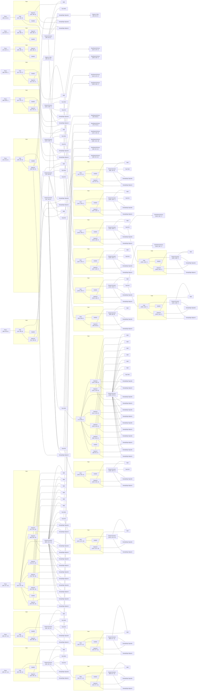

```mermaid
flowchart LR
  subgraph path2 [Path]
    2["Path<br>[422, 484, 6]"]
    3["Segment<br>[422, 484, 6]"]
    4[Solid2d]
  end
  subgraph path11 [Path]
    11["Path<br>[617, 677, 6]"]
    12["Segment<br>[617, 677, 6]"]
    13[Solid2d]
  end
  subgraph path20 [Path]
    20["Path<br>[595, 688, 7]"]
    21["Segment<br>[595, 688, 7]"]
    22[Solid2d]
  end
  subgraph path24 [Path]
    24["Path<br>[917, 972, 7]"]
    25["Segment<br>[917, 972, 7]"]
    26[Solid2d]
  end
  subgraph path33 [Path]
    33["Path<br>[1187, 1246, 7]"]
    34["Segment<br>[1187, 1246, 7]"]
    35[Solid2d]
  end
  subgraph path41 [Path]
    41["Path<br>[1348, 1408, 7]"]
    42["Segment<br>[1348, 1408, 7]"]
    43[Solid2d]
  end
  subgraph path49 [Path]
    49["Path<br>[1565, 1618, 7]"]
    50["Segment<br>[1565, 1618, 7]"]
    51[Solid2d]
  end
  subgraph path57 [Path]
    57["Path<br>[595, 688, 7]"]
    58["Segment<br>[595, 688, 7]"]
    59[Solid2d]
  end
  subgraph path61 [Path]
    61["Path<br>[917, 972, 7]"]
    62["Segment<br>[917, 972, 7]"]
    63[Solid2d]
  end
  subgraph path70 [Path]
    70["Path<br>[1187, 1246, 7]"]
    71["Segment<br>[1187, 1246, 7]"]
    72[Solid2d]
  end
  subgraph path78 [Path]
    78["Path<br>[1348, 1408, 7]"]
    79["Segment<br>[1348, 1408, 7]"]
    80[Solid2d]
  end
  subgraph path86 [Path]
    86["Path<br>[1565, 1618, 7]"]
    87["Segment<br>[1565, 1618, 7]"]
    88[Solid2d]
  end
  subgraph path94 [Path]
    94["Path<br>[411, 463, 8]"]
    95["Segment<br>[411, 463, 8]"]
    96[Solid2d]
  end
  subgraph path103 [Path]
    103["Path<br>[596, 648, 8]"]
    104["Segment<br>[596, 648, 8]"]
    105[Solid2d]
  end
  subgraph path111 [Path]
    111["Path<br>[439, 509, 9]"]
    112["Segment<br>[439, 509, 9]"]
    113[Solid2d]
  end
  subgraph path122 [Path]
    122["Path<br>[773, 860, 9]"]
    123["Segment<br>[868, 951, 9]"]
    124["Segment<br>[959, 1042, 9]"]
    125["Segment<br>[1050, 1133, 9]"]
    126["Segment<br>[1141, 1223, 9]"]
    127["Segment<br>[1231, 1313, 9]"]
    128["Segment<br>[1321, 1328, 9]"]
    129[Solid2d]
  end
  subgraph path150 [Path]
    150["Path<br>[1462, 1531, 9]"]
    151["Segment<br>[1462, 1531, 9]"]
    152[Solid2d]
  end
  subgraph path159 [Path]
    159["Path<br>[425, 515, 10]"]
    160["Segment<br>[523, 605, 10]"]
    161["Segment<br>[613, 695, 10]"]
    162["Segment<br>[703, 785, 10]"]
    163["Segment<br>[793, 874, 10]"]
    164["Segment<br>[882, 963, 10]"]
    165["Segment<br>[971, 978, 10]"]
    166[Solid2d]
  end
  subgraph path188 [Path]
    188["Path<br>[1122, 1174, 10]"]
    189["Segment<br>[1122, 1174, 10]"]
    190[Solid2d]
  end
  subgraph path196 [Path]
    196["Path<br>[325, 383, 11]"]
    197["Segment<br>[325, 383, 11]"]
    198[Solid2d]
  end
  subgraph path205 [Path]
    205["Path<br>[522, 577, 11]"]
    206["Segment<br>[522, 577, 11]"]
    207[Solid2d]
  end
  subgraph path213 [Path]
    213["Path<br>[325, 383, 11]"]
    214["Segment<br>[325, 383, 11]"]
    215[Solid2d]
  end
  subgraph path222 [Path]
    222["Path<br>[522, 577, 11]"]
    223["Segment<br>[522, 577, 11]"]
    224[Solid2d]
  end
  1["Plane<br>[399, 416, 6]"]
  5["Sweep Extrusion<br>[490, 526, 6]"]
  6[Wall]
  7["Cap Start"]
  8["Cap End"]
  9["SweepEdge Opposite"]
  10["SweepEdge Adjacent"]
  14["Sweep Extrusion<br>[683, 720, 6]"]
  15[Wall]
  16["Cap Start"]
  17["SweepEdge Opposite"]
  18["SweepEdge Adjacent"]
  19["Plane<br>[570, 587, 7]"]
  23["Plane<br>[892, 909, 7]"]
  27["Sweep Extrusion<br>[1010, 1050, 7]"]
  28[Wall]
  29["Cap Start"]
  30["Cap End"]
  31["SweepEdge Opposite"]
  32["SweepEdge Adjacent"]
  36["Sweep Extrusion<br>[1254, 1291, 7]"]
  37[Wall]
  38["Cap End"]
  39["SweepEdge Opposite"]
  40["SweepEdge Adjacent"]
  44["Sweep Extrusion<br>[1416, 1454, 7]"]
  45[Wall]
  46["Cap End"]
  47["SweepEdge Opposite"]
  48["SweepEdge Adjacent"]
  52["Sweep Extrusion<br>[1626, 1668, 7]"]
  53[Wall]
  54["SweepEdge Opposite"]
  55["SweepEdge Adjacent"]
  56["Plane<br>[570, 587, 7]"]
  60["Plane<br>[892, 909, 7]"]
  64["Sweep Extrusion<br>[1010, 1050, 7]"]
  65[Wall]
  66["Cap Start"]
  67["Cap End"]
  68["SweepEdge Opposite"]
  69["SweepEdge Adjacent"]
  73["Sweep Extrusion<br>[1254, 1291, 7]"]
  74[Wall]
  75["Cap End"]
  76["SweepEdge Opposite"]
  77["SweepEdge Adjacent"]
  81["Sweep Extrusion<br>[1416, 1454, 7]"]
  82[Wall]
  83["Cap End"]
  84["SweepEdge Opposite"]
  85["SweepEdge Adjacent"]
  89["Sweep Extrusion<br>[1626, 1668, 7]"]
  90[Wall]
  91["SweepEdge Opposite"]
  92["SweepEdge Adjacent"]
  93["Plane<br>[386, 403, 8]"]
  97["Sweep Extrusion<br>[471, 504, 8]"]
  98[Wall]
  99["Cap Start"]
  100["Cap End"]
  101["SweepEdge Opposite"]
  102["SweepEdge Adjacent"]
  106["Sweep Extrusion<br>[656, 693, 8]"]
  107[Wall]
  108["SweepEdge Opposite"]
  109["SweepEdge Adjacent"]
  110["Plane<br>[414, 431, 9]"]
  114["Sweep Extrusion<br>[517, 550, 9]"]
  115[Wall]
  116["Cap Start"]
  117["Cap End"]
  118["SweepEdge Opposite"]
  119["SweepEdge Adjacent"]
  120["EdgeCut Fillet<br>[558, 624, 9]"]
  121["EdgeCut Fillet<br>[558, 624, 9]"]
  130["Sweep Extrusion<br>[1336, 1376, 9]"]
  131[Wall]
  132[Wall]
  133[Wall]
  134[Wall]
  135[Wall]
  136[Wall]
  137["Cap Start"]
  138["SweepEdge Opposite"]
  139["SweepEdge Adjacent"]
  140["SweepEdge Opposite"]
  141["SweepEdge Adjacent"]
  142["SweepEdge Opposite"]
  143["SweepEdge Adjacent"]
  144["SweepEdge Opposite"]
  145["SweepEdge Adjacent"]
  146["SweepEdge Opposite"]
  147["SweepEdge Adjacent"]
  148["SweepEdge Opposite"]
  149["SweepEdge Adjacent"]
  153["Sweep Extrusion<br>[1539, 1567, 9]"]
  154[Wall]
  155["Cap End"]
  156["SweepEdge Opposite"]
  157["SweepEdge Adjacent"]
  158["Plane<br>[400, 417, 10]"]
  167["Sweep Extrusion<br>[986, 1019, 10]"]
  168[Wall]
  169[Wall]
  170[Wall]
  171[Wall]
  172[Wall]
  173[Wall]
  174["Cap Start"]
  175["Cap End"]
  176["SweepEdge Opposite"]
  177["SweepEdge Adjacent"]
  178["SweepEdge Opposite"]
  179["SweepEdge Adjacent"]
  180["SweepEdge Opposite"]
  181["SweepEdge Adjacent"]
  182["SweepEdge Opposite"]
  183["SweepEdge Adjacent"]
  184["SweepEdge Opposite"]
  185["SweepEdge Adjacent"]
  186["SweepEdge Opposite"]
  187["SweepEdge Adjacent"]
  191["Sweep Extrusion<br>[1182, 1219, 10]"]
  192[Wall]
  193["SweepEdge Opposite"]
  194["SweepEdge Adjacent"]
  195["Plane<br>[300, 317, 11]"]
  199["Sweep Extrusion<br>[391, 422, 11]"]
  200[Wall]
  201["Cap Start"]
  202["Cap End"]
  203["SweepEdge Opposite"]
  204["SweepEdge Adjacent"]
  208["Sweep Extrusion<br>[585, 617, 11]"]
  209[Wall]
  210["SweepEdge Opposite"]
  211["SweepEdge Adjacent"]
  212["Plane<br>[300, 317, 11]"]
  216["Sweep Extrusion<br>[391, 422, 11]"]
  217[Wall]
  218["Cap Start"]
  219["Cap End"]
  220["SweepEdge Opposite"]
  221["SweepEdge Adjacent"]
  225["Sweep Extrusion<br>[585, 617, 11]"]
  226[Wall]
  227["SweepEdge Opposite"]
  228["SweepEdge Adjacent"]
  229["StartSketchOnFace<br>[1145, 1179, 7]"]
  230["StartSketchOnFace<br>[1308, 1340, 7]"]
  231["StartSketchOnFace<br>[1524, 1557, 7]"]
  232["StartSketchOnFace<br>[1145, 1179, 7]"]
  233["StartSketchOnFace<br>[1308, 1340, 7]"]
  234["StartSketchOnFace<br>[1524, 1557, 7]"]
  235["StartSketchOnFace<br>[556, 588, 8]"]
  236["StartSketchOnFace<br>[733, 765, 9]"]
  237["StartSketchOnFace<br>[1424, 1454, 9]"]
  238["StartSketchOnFace<br>[1082, 1114, 10]"]
  239["StartSketchOnFace<br>[484, 514, 11]"]
  240["StartSketchOnFace<br>[484, 514, 11]"]
  1 --- 2
  2 --- 3
  2 ---- 5
  2 --- 4
  3 --- 6
  3 --- 9
  3 --- 10
  5 --- 6
  5 --- 7
  5 --- 8
  5 --- 9
  5 --- 10
  8 --- 11
  11 --- 12
  11 ---- 14
  11 --- 13
  12 --- 15
  12 --- 17
  12 --- 18
  14 --- 15
  14 --- 16
  14 --- 17
  14 --- 18
  19 --- 20
  20 --- 21
  20 --- 22
  23 --- 24
  24 --- 25
  24 ---- 27
  24 --- 26
  25 --- 28
  25 --- 31
  25 --- 32
  27 --- 28
  27 --- 29
  27 --- 30
  27 --- 31
  27 --- 32
  29 --- 33
  30 --- 41
  33 --- 34
  33 ---- 36
  33 --- 35
  34 --- 37
  34 --- 39
  34 --- 40
  36 --- 37
  36 --- 38
  36 --- 39
  36 --- 40
  41 --- 42
  41 ---- 44
  41 --- 43
  42 --- 45
  42 --- 47
  42 --- 48
  44 --- 45
  44 --- 46
  44 --- 47
  44 --- 48
  46 --- 49
  49 --- 50
  49 ---- 52
  49 --- 51
  50 --- 53
  50 --- 54
  50 --- 55
  52 --- 53
  52 --- 54
  52 --- 55
  56 --- 57
  57 --- 58
  57 --- 59
  60 --- 61
  61 --- 62
  61 ---- 64
  61 --- 63
  62 --- 65
  62 --- 68
  62 --- 69
  64 --- 65
  64 --- 66
  64 --- 67
  64 --- 68
  64 --- 69
  66 --- 70
  67 --- 78
  70 --- 71
  70 ---- 73
  70 --- 72
  71 --- 74
  71 --- 76
  71 --- 77
  73 --- 74
  73 --- 75
  73 --- 76
  73 --- 77
  78 --- 79
  78 ---- 81
  78 --- 80
  79 --- 82
  79 --- 84
  79 --- 85
  81 --- 82
  81 --- 83
  81 --- 84
  81 --- 85
  83 --- 86
  86 --- 87
  86 ---- 89
  86 --- 88
  87 --- 90
  87 --- 91
  87 --- 92
  89 --- 90
  89 --- 91
  89 --- 92
  93 --- 94
  94 --- 95
  94 ---- 97
  94 --- 96
  95 --- 98
  95 --- 101
  95 --- 102
  97 --- 98
  97 --- 99
  97 --- 100
  97 --- 101
  97 --- 102
  100 --- 103
  103 --- 104
  103 ---- 106
  103 --- 105
  104 --- 107
  104 --- 108
  104 --- 109
  106 --- 107
  106 --- 108
  106 --- 109
  110 --- 111
  111 --- 112
  111 ---- 114
  111 --- 113
  112 --- 115
  112 --- 118
  112 --- 119
  112 --- 120
  114 --- 115
  114 --- 116
  114 --- 117
  114 --- 118
  114 --- 119
  116 --- 122
  117 --- 150
  118 <--x 121
  122 --- 123
  122 --- 124
  122 --- 125
  122 --- 126
  122 --- 127
  122 --- 128
  122 ---- 130
  122 --- 129
  123 --- 136
  123 --- 148
  123 --- 149
  124 --- 135
  124 --- 146
  124 --- 147
  125 --- 134
  125 --- 144
  125 --- 145
  126 --- 133
  126 --- 142
  126 --- 143
  127 --- 132
  127 --- 140
  127 --- 141
  128 --- 131
  128 --- 138
  128 --- 139
  130 --- 131
  130 --- 132
  130 --- 133
  130 --- 134
  130 --- 135
  130 --- 136
  130 --- 137
  130 --- 138
  130 --- 139
  130 --- 140
  130 --- 141
  130 --- 142
  130 --- 143
  130 --- 144
  130 --- 145
  130 --- 146
  130 --- 147
  130 --- 148
  130 --- 149
  150 --- 151
  150 ---- 153
  150 --- 152
  151 --- 154
  151 --- 156
  151 --- 157
  153 --- 154
  153 --- 155
  153 --- 156
  153 --- 157
  158 --- 159
  159 --- 160
  159 --- 161
  159 --- 162
  159 --- 163
  159 --- 164
  159 --- 165
  159 ---- 167
  159 --- 166
  160 --- 173
  160 --- 186
  160 --- 187
  161 --- 172
  161 --- 184
  161 --- 185
  162 --- 171
  162 --- 182
  162 --- 183
  163 --- 170
  163 --- 180
  163 --- 181
  164 --- 169
  164 --- 178
  164 --- 179
  165 --- 168
  165 --- 176
  165 --- 177
  167 --- 168
  167 --- 169
  167 --- 170
  167 --- 171
  167 --- 172
  167 --- 173
  167 --- 174
  167 --- 175
  167 --- 176
  167 --- 177
  167 --- 178
  167 --- 179
  167 --- 180
  167 --- 181
  167 --- 182
  167 --- 183
  167 --- 184
  167 --- 185
  167 --- 186
  167 --- 187
  175 --- 188
  188 --- 189
  188 ---- 191
  188 --- 190
  189 --- 192
  189 --- 193
  189 --- 194
  191 --- 192
  191 --- 193
  191 --- 194
  195 --- 196
  196 --- 197
  196 ---- 199
  196 --- 198
  197 --- 200
  197 --- 203
  197 --- 204
  199 --- 200
  199 --- 201
  199 --- 202
  199 --- 203
  199 --- 204
  202 --- 205
  205 --- 206
  205 ---- 208
  205 --- 207
  206 --- 209
  206 --- 210
  206 --- 211
  208 --- 209
  208 --- 210
  208 --- 211
  212 --- 213
  213 --- 214
  213 ---- 216
  213 --- 215
  214 --- 217
  214 --- 220
  214 --- 221
  216 --- 217
  216 --- 218
  216 --- 219
  216 --- 220
  216 --- 221
  219 --- 222
  222 --- 223
  222 ---- 225
  222 --- 224
  223 --- 226
  223 --- 227
  223 --- 228
  225 --- 226
  225 --- 227
  225 --- 228
  29 <--x 229
  30 <--x 230
  46 <--x 231
  66 <--x 232
  67 <--x 233
  83 <--x 234
  100 <--x 235
  116 <--x 236
  117 <--x 237
  175 <--x 238
  202 <--x 239
  219 <--x 240
```
