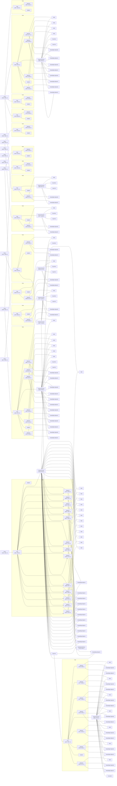

```mermaid
flowchart LR
  subgraph path7 [Path]
    7["Path<br>[4357, 4454, 0]"]
    8["Segment<br>[4357, 4454, 0]"]
    9[Solid2d]
  end
  subgraph path10 [Path]
    10["Path<br>[4652, 4699, 0]"]
    11["Segment<br>[4705, 4724, 0]"]
    12["Segment<br>[4730, 4773, 0]"]
    13["Segment<br>[4779, 4798, 0]"]
    14["Segment<br>[4804, 4837, 0]"]
    15["Segment<br>[4843, 4861, 0]"]
    16["Segment<br>[4867, 4911, 0]"]
    17["Segment<br>[4917, 4935, 0]"]
    18["Segment<br>[4941, 4983, 0]"]
    19["Segment<br>[4989, 5007, 0]"]
    20["Segment<br>[5013, 5045, 0]"]
    21["Segment<br>[5051, 5070, 0]"]
    22["Segment<br>[5076, 5119, 0]"]
    23["Segment<br>[5125, 5132, 0]"]
    24[Solid2d]
  end
  subgraph path51 [Path]
    51["Path<br>[5264, 5291, 0]"]
    52["Segment<br>[5297, 5315, 0]"]
    53["Segment<br>[5321, 5339, 0]"]
    54["Segment<br>[5345, 5364, 0]"]
    55["Segment<br>[5370, 5377, 0]"]
    56[Solid2d]
  end
  subgraph path57 [Path]
    57["Path<br>[5422, 5494, 0]"]
    58["Segment<br>[5422, 5494, 0]"]
    59[Solid2d]
  end
  subgraph path75 [Path]
    75["Path<br>[5643, 5711, 0]"]
    76["Segment<br>[5643, 5711, 0]"]
    77[Solid2d]
  end
  subgraph path78 [Path]
    78["Path<br>[5756, 5828, 0]"]
    79["Segment<br>[5756, 5828, 0]"]
    80[Solid2d]
  end
  subgraph path88 [Path]
    88["Path<br>[2978, 3065, 0]"]
    89["Segment<br>[2978, 3065, 0]"]
    90[Solid2d]
  end
  subgraph path91 [Path]
    91["Path<br>[3078, 3165, 0]"]
    92["Segment<br>[3078, 3165, 0]"]
    93[Solid2d]
  end
  subgraph path101 [Path]
    101["Path<br>[1554, 1626, 0]"]
    102["Segment<br>[1554, 1626, 0]"]
    103[Solid2d]
  end
  subgraph path110 [Path]
    110["Path<br>[1837, 1927, 0]"]
    111["Segment<br>[1935, 1969, 0]"]
    112["Segment<br>[1977, 2069, 0]"]
    113["Segment<br>[2077, 2186, 0]"]
    114["Segment<br>[2194, 2309, 0]"]
    115["Segment<br>[2317, 2432, 0]"]
    116["Segment<br>[2440, 2555, 0]"]
    117["Segment<br>[2563, 2570, 0]"]
    118[Solid2d]
  end
  subgraph path143 [Path]
    143["Path<br>[6648, 6715, 0]"]
    144["Segment<br>[6648, 6715, 0]"]
    145[Solid2d]
  end
  subgraph path153 [Path]
    153["Path<br>[2978, 3065, 0]"]
    154["Segment<br>[2978, 3065, 0]"]
    155[Solid2d]
  end
  subgraph path156 [Path]
    156["Path<br>[3078, 3165, 0]"]
    157["Segment<br>[3078, 3165, 0]"]
    158[Solid2d]
  end
  subgraph path166 [Path]
    166["Path<br>[3629, 3679, 0]"]
    167["Segment<br>[3687, 3775, 0]"]
    168["Segment<br>[3783, 3871, 0]"]
    169["Segment<br>[3879, 3967, 0]"]
    170["Segment<br>[3975, 4062, 0]"]
    171["Segment<br>[4070, 4123, 0]"]
    172["Segment<br>[4131, 4138, 0]"]
    173[Solid2d]
  end
  subgraph path174 [Path]
    174["Path<br>[4151, 4224, 0]"]
    175["Segment<br>[4151, 4224, 0]"]
    176[Solid2d]
  end
  1["Plane<br>[4332, 4351, 0]"]
  2["Plane<br>[4332, 4351, 0]"]
  3["Plane<br>[4332, 4351, 0]"]
  4["Plane<br>[4332, 4351, 0]"]
  5["Plane<br>[4332, 4351, 0]"]
  6["Plane<br>[4332, 4351, 0]"]
  25["Sweep Revolve<br>[5138, 5164, 0]"]
  26[Wall]
  27[Wall]
  28[Wall]
  29[Wall]
  30[Wall]
  31[Wall]
  32[Wall]
  33[Wall]
  34[Wall]
  35[Wall]
  36[Wall]
  37[Wall]
  38[Wall]
  39["SweepEdge Adjacent"]
  40["SweepEdge Adjacent"]
  41["SweepEdge Adjacent"]
  42["SweepEdge Adjacent"]
  43["SweepEdge Adjacent"]
  44["SweepEdge Adjacent"]
  45["SweepEdge Adjacent"]
  46["SweepEdge Adjacent"]
  47["SweepEdge Adjacent"]
  48["SweepEdge Adjacent"]
  49["SweepEdge Adjacent"]
  50["SweepEdge Adjacent"]
  60["Sweep Extrusion<br>[5504, 5535, 0]"]
  61[Wall]
  62[Wall]
  63[Wall]
  64[Wall]
  65["Cap Start"]
  66["Cap End"]
  67["SweepEdge Opposite"]
  68["SweepEdge Adjacent"]
  69["SweepEdge Opposite"]
  70["SweepEdge Adjacent"]
  71["SweepEdge Opposite"]
  72["SweepEdge Adjacent"]
  73["SweepEdge Opposite"]
  74["SweepEdge Adjacent"]
  81["Sweep Extrusion<br>[5838, 5872, 0]"]
  82[Wall]
  83["Cap Start"]
  84["Cap End"]
  85["SweepEdge Opposite"]
  86["SweepEdge Adjacent"]
  87["Plane<br>[2950, 2970, 0]"]
  94["Sweep Extrusion<br>[3177, 3198, 0]"]
  95[Wall]
  96["Cap Start"]
  97["Cap End"]
  98["SweepEdge Opposite"]
  99["SweepEdge Adjacent"]
  100["Plane<br>[1521, 1546, 0]"]
  104["Sweep Extrusion<br>[1677, 1715, 0]"]
  105[Wall]
  106["Cap Start"]
  107["Cap End"]
  108["SweepEdge Opposite"]
  109["SweepEdge Adjacent"]
  119["Sweep Extrusion<br>[2586, 2640, 0]"]
  120[Wall]
  121[Wall]
  122[Wall]
  123[Wall]
  124[Wall]
  125[Wall]
  126[Wall]
  127["Cap Start"]
  128["SweepEdge Opposite"]
  129["SweepEdge Adjacent"]
  130["SweepEdge Opposite"]
  131["SweepEdge Adjacent"]
  132["SweepEdge Opposite"]
  133["SweepEdge Adjacent"]
  134["SweepEdge Opposite"]
  135["SweepEdge Adjacent"]
  136["SweepEdge Opposite"]
  137["SweepEdge Adjacent"]
  138["SweepEdge Opposite"]
  139["SweepEdge Adjacent"]
  140["SweepEdge Opposite"]
  141["SweepEdge Adjacent"]
  142["Plane<br>[6617, 6642, 0]"]
  146["Sweep Extrusion<br>[6728, 6775, 0]"]
  147[Wall]
  148["Cap Start"]
  149["Cap End"]
  150["SweepEdge Opposite"]
  151["SweepEdge Adjacent"]
  152["Plane<br>[2950, 2970, 0]"]
  159["Sweep Extrusion<br>[3177, 3198, 0]"]
  160[Wall]
  161["Cap Start"]
  162["Cap End"]
  163["SweepEdge Opposite"]
  164["SweepEdge Adjacent"]
  165["Plane<br>[3295, 3621, 0]"]
  177["Sweep Extrusion<br>[4236, 4258, 0]"]
  178[Wall]
  179[Wall]
  180[Wall]
  181[Wall]
  182[Wall]
  183[Wall]
  184["Cap Start"]
  185["Cap End"]
  186["SweepEdge Opposite"]
  187["SweepEdge Adjacent"]
  188["SweepEdge Opposite"]
  189["SweepEdge Adjacent"]
  190["SweepEdge Opposite"]
  191["SweepEdge Adjacent"]
  192["SweepEdge Opposite"]
  193["SweepEdge Adjacent"]
  194["SweepEdge Opposite"]
  195["SweepEdge Adjacent"]
  196["SweepEdge Opposite"]
  197["SweepEdge Adjacent"]
  198["StartSketchOnFace<br>[1798, 1829, 0]"]
  1 --- 10
  3 --- 7
  3 --- 51
  3 --- 57
  3 --- 75
  3 --- 78
  7 --- 8
  7 --- 9
  10 --- 11
  10 --- 12
  10 --- 13
  10 --- 14
  10 --- 15
  10 --- 16
  10 --- 17
  10 --- 18
  10 --- 19
  10 --- 20
  10 --- 21
  10 --- 22
  10 --- 23
  10 ---- 25
  10 --- 24
  11 --- 26
  11 x--> 39
  12 --- 27
  12 --- 39
  13 --- 28
  13 --- 40
  14 --- 29
  14 --- 41
  15 --- 30
  15 --- 42
  16 --- 31
  16 --- 43
  17 --- 32
  17 --- 44
  18 --- 33
  18 --- 45
  19 --- 34
  19 --- 46
  20 --- 35
  20 --- 47
  21 --- 36
  21 --- 48
  22 --- 37
  22 --- 49
  23 --- 38
  23 --- 50
  25 --- 26
  25 --- 27
  25 --- 28
  25 --- 29
  25 --- 30
  25 --- 31
  25 --- 32
  25 --- 33
  25 --- 34
  25 --- 35
  25 --- 36
  25 --- 37
  25 --- 38
  25 <--x 11
  25 --- 39
  25 <--x 12
  25 <--x 13
  25 --- 40
  25 <--x 14
  25 --- 41
  25 <--x 15
  25 --- 42
  25 <--x 16
  25 --- 43
  25 <--x 17
  25 --- 44
  25 <--x 18
  25 --- 45
  25 <--x 19
  25 --- 46
  25 <--x 20
  25 --- 47
  25 <--x 21
  25 --- 48
  25 <--x 22
  25 --- 49
  25 <--x 23
  25 --- 50
  51 --- 52
  51 --- 53
  51 --- 54
  51 --- 55
  51 ---- 60
  51 --- 56
  52 --- 64
  52 --- 73
  52 --- 74
  53 --- 63
  53 --- 71
  53 --- 72
  54 --- 62
  54 --- 69
  54 --- 70
  55 --- 61
  55 --- 67
  55 --- 68
  57 --- 58
  57 --- 59
  60 --- 61
  60 --- 62
  60 --- 63
  60 --- 64
  60 --- 65
  60 --- 66
  60 --- 67
  60 --- 68
  60 --- 69
  60 --- 70
  60 --- 71
  60 --- 72
  60 --- 73
  60 --- 74
  75 --- 76
  75 ---- 81
  75 --- 77
  76 --- 82
  76 --- 85
  76 --- 86
  78 --- 79
  78 --- 80
  81 --- 82
  81 --- 83
  81 --- 84
  81 --- 85
  81 --- 86
  87 --- 88
  87 --- 91
  88 --- 89
  88 ---- 94
  88 --- 90
  89 --- 95
  89 --- 98
  89 --- 99
  91 --- 92
  91 --- 93
  94 --- 95
  94 --- 96
  94 --- 97
  94 --- 98
  94 --- 99
  100 --- 101
  101 --- 102
  101 ---- 104
  101 --- 103
  102 --- 105
  102 --- 108
  102 --- 109
  104 --- 105
  104 --- 106
  104 --- 107
  104 --- 108
  104 --- 109
  107 --- 110
  110 --- 111
  110 --- 112
  110 --- 113
  110 --- 114
  110 --- 115
  110 --- 116
  110 --- 117
  110 ---- 119
  110 --- 118
  111 --- 126
  111 --- 140
  111 --- 141
  112 --- 125
  112 --- 138
  112 --- 139
  113 --- 124
  113 --- 136
  113 --- 137
  114 --- 123
  114 --- 134
  114 --- 135
  115 --- 122
  115 --- 132
  115 --- 133
  116 --- 121
  116 --- 130
  116 --- 131
  117 --- 120
  117 --- 128
  117 --- 129
  119 --- 120
  119 --- 121
  119 --- 122
  119 --- 123
  119 --- 124
  119 --- 125
  119 --- 126
  119 --- 127
  119 --- 128
  119 --- 129
  119 --- 130
  119 --- 131
  119 --- 132
  119 --- 133
  119 --- 134
  119 --- 135
  119 --- 136
  119 --- 137
  119 --- 138
  119 --- 139
  119 --- 140
  119 --- 141
  142 --- 143
  143 --- 144
  143 ---- 146
  143 --- 145
  144 --- 147
  144 --- 150
  144 --- 151
  146 --- 147
  146 --- 148
  146 --- 149
  146 --- 150
  146 --- 151
  152 --- 153
  152 --- 156
  153 --- 154
  153 ---- 159
  153 --- 155
  154 --- 160
  154 --- 163
  154 --- 164
  156 --- 157
  156 --- 158
  159 --- 160
  159 --- 161
  159 --- 162
  159 --- 163
  159 --- 164
  165 --- 166
  165 --- 174
  166 --- 167
  166 --- 168
  166 --- 169
  166 --- 170
  166 --- 171
  166 --- 172
  166 ---- 177
  166 --- 173
  167 --- 178
  167 --- 186
  167 --- 187
  168 --- 179
  168 --- 188
  168 --- 189
  169 --- 180
  169 --- 190
  169 --- 191
  170 --- 181
  170 --- 192
  170 --- 193
  171 --- 182
  171 --- 194
  171 --- 195
  172 --- 183
  172 --- 196
  172 --- 197
  174 --- 175
  174 --- 176
  177 --- 178
  177 --- 179
  177 --- 180
  177 --- 181
  177 --- 182
  177 --- 183
  177 --- 184
  177 --- 185
  177 --- 186
  177 --- 187
  177 --- 188
  177 --- 189
  177 --- 190
  177 --- 191
  177 --- 192
  177 --- 193
  177 --- 194
  177 --- 195
  177 --- 196
  177 --- 197
  107 <--x 198
```
