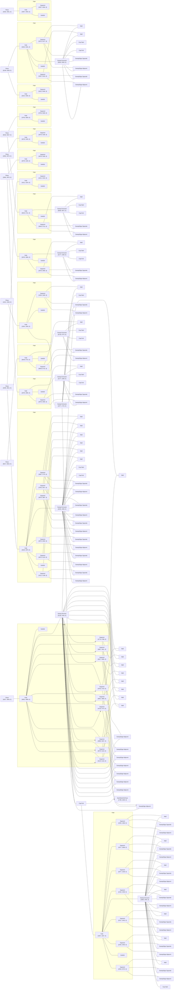

```mermaid
flowchart LR
  subgraph path2 [Path]
    2["Path<br>[4357, 4454, 0]"]
    3["Segment<br>[4357, 4454, 0]"]
    4[Solid2d]
  end
  subgraph path6 [Path]
    6["Path<br>[4652, 4699, 0]"]
    7["Segment<br>[4705, 4724, 0]"]
    8["Segment<br>[4730, 4773, 0]"]
    9["Segment<br>[4779, 4798, 0]"]
    10["Segment<br>[4867, 4911, 0]"]
    11["Segment<br>[4917, 4935, 0]"]
    12["Segment<br>[4941, 4983, 0]"]
    13["Segment<br>[4989, 5007, 0]"]
    14["Segment<br>[5076, 5119, 0]"]
    15["Segment<br>[5125, 5132, 0]"]
    16[Solid2d]
  end
  subgraph path36 [Path]
    36["Path<br>[5264, 5291, 0]"]
    37["Segment<br>[5297, 5315, 0]"]
    38["Segment<br>[5370, 5377, 0]"]
    39[Solid2d]
  end
  subgraph path40 [Path]
    40["Path<br>[5422, 5494, 0]"]
    41["Segment<br>[5422, 5494, 0]"]
    42[Solid2d]
  end
  subgraph path53 [Path]
    53["Path<br>[5643, 5711, 0]"]
    54["Segment<br>[5643, 5711, 0]"]
    55[Solid2d]
  end
  subgraph path56 [Path]
    56["Path<br>[5756, 5828, 0]"]
    57["Segment<br>[5756, 5828, 0]"]
    58[Solid2d]
  end
  subgraph path66 [Path]
    66["Path<br>[2978, 3065, 0]"]
    67["Segment<br>[2978, 3065, 0]"]
    68[Solid2d]
  end
  subgraph path69 [Path]
    69["Path<br>[3078, 3165, 0]"]
    70["Segment<br>[3078, 3165, 0]"]
    71[Solid2d]
  end
  subgraph path79 [Path]
    79["Path<br>[1554, 1626, 0]"]
    80["Segment<br>[1554, 1626, 0]"]
    81[Solid2d]
  end
  subgraph path88 [Path]
    88["Path<br>[1837, 1927, 0]"]
    89["Segment<br>[1935, 1969, 0]"]
    90["Segment<br>[1977, 2069, 0]"]
    91["Segment<br>[2077, 2186, 0]"]
    92["Segment<br>[2194, 2309, 0]"]
    93["Segment<br>[2317, 2432, 0]"]
    94["Segment<br>[2440, 2555, 0]"]
    95["Segment<br>[2563, 2570, 0]"]
    96[Solid2d]
  end
  subgraph path121 [Path]
    121["Path<br>[6648, 6715, 0]"]
    122["Segment<br>[6648, 6715, 0]"]
    123[Solid2d]
  end
  subgraph path131 [Path]
    131["Path<br>[2978, 3065, 0]"]
    132["Segment<br>[2978, 3065, 0]"]
    133[Solid2d]
  end
  subgraph path134 [Path]
    134["Path<br>[3078, 3165, 0]"]
    135["Segment<br>[3078, 3165, 0]"]
    136[Solid2d]
  end
  subgraph path144 [Path]
    144["Path<br>[3629, 3679, 0]"]
    145["Segment<br>[3687, 3775, 0]"]
    146["Segment<br>[3783, 3871, 0]"]
    147["Segment<br>[3879, 3967, 0]"]
    148["Segment<br>[3975, 4062, 0]"]
    149["Segment<br>[4070, 4123, 0]"]
    150["Segment<br>[4131, 4138, 0]"]
    151[Solid2d]
  end
  subgraph path152 [Path]
    152["Path<br>[4151, 4224, 0]"]
    153["Segment<br>[4151, 4224, 0]"]
    154[Solid2d]
  end
  1["Plane<br>[4332, 4351, 0]"]
  5["Plane<br>[4627, 4646, 0]"]
  17["Sweep Revolve<br>[5138, 5164, 0]"]
  18[Wall]
  19[Wall]
  20[Wall]
  21[Wall]
  22[Wall]
  23[Wall]
  24[Wall]
  25[Wall]
  26[Wall]
  27["SweepEdge Adjacent"]
  28["SweepEdge Adjacent"]
  29["SweepEdge Adjacent"]
  30["SweepEdge Adjacent"]
  31["SweepEdge Adjacent"]
  32["SweepEdge Adjacent"]
  33["SweepEdge Adjacent"]
  34["SweepEdge Adjacent"]
  35["Plane<br>[5239, 5258, 0]"]
  43["Sweep Extrusion<br>[5504, 5535, 0]"]
  44[Wall]
  45[Wall]
  46["Cap Start"]
  47["Cap End"]
  48["SweepEdge Opposite"]
  49["SweepEdge Adjacent"]
  50["SweepEdge Opposite"]
  51["SweepEdge Adjacent"]
  52["Plane<br>[5618, 5637, 0]"]
  59["Sweep Extrusion<br>[5838, 5872, 0]"]
  60[Wall]
  61["Cap Start"]
  62["Cap End"]
  63["SweepEdge Opposite"]
  64["SweepEdge Adjacent"]
  65["Plane<br>[2950, 2970, 0]"]
  72["Sweep Extrusion<br>[3177, 3198, 0]"]
  73[Wall]
  74["Cap Start"]
  75["Cap End"]
  76["SweepEdge Opposite"]
  77["SweepEdge Adjacent"]
  78["Plane<br>[1521, 1546, 0]"]
  82["Sweep Extrusion<br>[1677, 1715, 0]"]
  83[Wall]
  84["Cap Start"]
  85["Cap End"]
  86["SweepEdge Opposite"]
  87["SweepEdge Adjacent"]
  97["Sweep Extrusion<br>[2586, 2640, 0]"]
  98[Wall]
  99[Wall]
  100[Wall]
  101[Wall]
  102[Wall]
  103[Wall]
  104[Wall]
  105["Cap Start"]
  106["SweepEdge Opposite"]
  107["SweepEdge Adjacent"]
  108["SweepEdge Opposite"]
  109["SweepEdge Adjacent"]
  110["SweepEdge Opposite"]
  111["SweepEdge Adjacent"]
  112["SweepEdge Opposite"]
  113["SweepEdge Adjacent"]
  114["SweepEdge Opposite"]
  115["SweepEdge Adjacent"]
  116["SweepEdge Opposite"]
  117["SweepEdge Adjacent"]
  118["SweepEdge Opposite"]
  119["SweepEdge Adjacent"]
  120["Plane<br>[6617, 6642, 0]"]
  124["Sweep Extrusion<br>[6728, 6775, 0]"]
  125[Wall]
  126["Cap Start"]
  127["Cap End"]
  128["SweepEdge Opposite"]
  129["SweepEdge Adjacent"]
  130["Plane<br>[2950, 2970, 0]"]
  137["Sweep Extrusion<br>[3177, 3198, 0]"]
  138[Wall]
  139["Cap Start"]
  140["Cap End"]
  141["SweepEdge Opposite"]
  142["SweepEdge Adjacent"]
  143["Plane<br>[3295, 3621, 0]"]
  155["Sweep Extrusion<br>[4236, 4258, 0]"]
  156[Wall]
  157[Wall]
  158[Wall]
  159[Wall]
  160[Wall]
  161[Wall]
  162["Cap Start"]
  163["Cap End"]
  164["SweepEdge Opposite"]
  165["SweepEdge Adjacent"]
  166["SweepEdge Opposite"]
  167["SweepEdge Adjacent"]
  168["SweepEdge Opposite"]
  169["SweepEdge Adjacent"]
  170["SweepEdge Opposite"]
  171["SweepEdge Adjacent"]
  172["SweepEdge Opposite"]
  173["SweepEdge Adjacent"]
  174["SweepEdge Opposite"]
  175["SweepEdge Adjacent"]
  176["StartSketchOnFace<br>[1798, 1829, 0]"]
  1 --- 2
  2 --- 3
  2 --- 4
  5 --- 6
  6 --- 7
  6 --- 8
  6 --- 9
  6 --- 10
  6 --- 11
  6 --- 12
  6 --- 13
  6 --- 14
  6 --- 15
  6 ---- 17
  6 --- 16
  7 --- 18
  7 x--> 27
  8 --- 19
  8 --- 27
  9 --- 20
  9 --- 28
  10 --- 21
  10 --- 29
  11 --- 22
  11 --- 30
  12 --- 23
  12 --- 31
  13 --- 24
  13 --- 32
  14 --- 25
  14 --- 33
  15 --- 26
  15 --- 34
  17 --- 18
  17 --- 19
  17 --- 20
  17 --- 21
  17 --- 22
  17 --- 23
  17 --- 24
  17 --- 25
  17 --- 26
  17 <--x 7
  17 --- 27
  17 <--x 8
  17 <--x 9
  17 --- 28
  17 <--x 10
  17 --- 29
  17 <--x 11
  17 --- 30
  17 <--x 12
  17 --- 31
  17 <--x 13
  17 --- 32
  17 <--x 14
  17 --- 33
  17 <--x 15
  17 --- 34
  35 --- 36
  35 --- 40
  36 --- 37
  36 --- 38
  36 ---- 43
  36 --- 39
  37 --- 45
  37 --- 50
  37 --- 51
  38 --- 44
  38 --- 48
  38 --- 49
  40 --- 41
  40 --- 42
  43 --- 44
  43 --- 45
  43 --- 46
  43 --- 47
  43 --- 48
  43 --- 49
  43 --- 50
  43 --- 51
  52 --- 53
  52 --- 56
  53 --- 54
  53 ---- 59
  53 --- 55
  54 --- 60
  54 --- 63
  54 --- 64
  56 --- 57
  56 --- 58
  59 --- 60
  59 --- 61
  59 --- 62
  59 --- 63
  59 --- 64
  65 --- 66
  65 --- 69
  66 --- 67
  66 ---- 72
  66 --- 68
  67 --- 73
  67 --- 76
  67 --- 77
  69 --- 70
  69 --- 71
  72 --- 73
  72 --- 74
  72 --- 75
  72 --- 76
  72 --- 77
  78 --- 79
  79 --- 80
  79 ---- 82
  79 --- 81
  80 --- 83
  80 --- 86
  80 --- 87
  82 --- 83
  82 --- 84
  82 --- 85
  82 --- 86
  82 --- 87
  85 --- 88
  88 --- 89
  88 --- 90
  88 --- 91
  88 --- 92
  88 --- 93
  88 --- 94
  88 --- 95
  88 ---- 97
  88 --- 96
  89 --- 104
  89 --- 118
  89 --- 119
  90 --- 103
  90 --- 116
  90 --- 117
  91 --- 102
  91 --- 114
  91 --- 115
  92 --- 101
  92 --- 112
  92 --- 113
  93 --- 100
  93 --- 110
  93 --- 111
  94 --- 99
  94 --- 108
  94 --- 109
  95 --- 98
  95 --- 106
  95 --- 107
  97 --- 98
  97 --- 99
  97 --- 100
  97 --- 101
  97 --- 102
  97 --- 103
  97 --- 104
  97 --- 105
  97 --- 106
  97 --- 107
  97 --- 108
  97 --- 109
  97 --- 110
  97 --- 111
  97 --- 112
  97 --- 113
  97 --- 114
  97 --- 115
  97 --- 116
  97 --- 117
  97 --- 118
  97 --- 119
  120 --- 121
  121 --- 122
  121 ---- 124
  121 --- 123
  122 --- 125
  122 --- 128
  122 --- 129
  124 --- 125
  124 --- 126
  124 --- 127
  124 --- 128
  124 --- 129
  130 --- 131
  130 --- 134
  131 --- 132
  131 ---- 137
  131 --- 133
  132 --- 138
  132 --- 141
  132 --- 142
  134 --- 135
  134 --- 136
  137 --- 138
  137 --- 139
  137 --- 140
  137 --- 141
  137 --- 142
  143 --- 144
  143 --- 152
  144 --- 145
  144 --- 146
  144 --- 147
  144 --- 148
  144 --- 149
  144 --- 150
  144 ---- 155
  144 --- 151
  145 --- 156
  145 --- 164
  145 --- 165
  146 --- 157
  146 --- 166
  146 --- 167
  147 --- 158
  147 --- 168
  147 --- 169
  148 --- 159
  148 --- 170
  148 --- 171
  149 --- 160
  149 --- 172
  149 --- 173
  150 --- 161
  150 --- 174
  150 --- 175
  152 --- 153
  152 --- 154
  155 --- 156
  155 --- 157
  155 --- 158
  155 --- 159
  155 --- 160
  155 --- 161
  155 --- 162
  155 --- 163
  155 --- 164
  155 --- 165
  155 --- 166
  155 --- 167
  155 --- 168
  155 --- 169
  155 --- 170
  155 --- 171
  155 --- 172
  155 --- 173
  155 --- 174
  155 --- 175
  85 <--x 176
```
