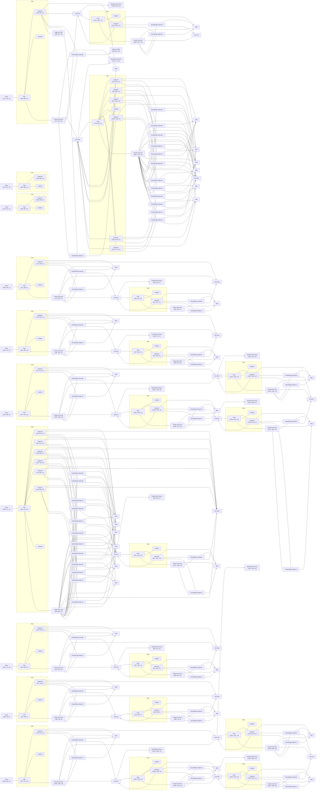

```mermaid
flowchart LR
  subgraph path23 [Path]
    23["Path<br>[422, 484, 9]"]
    46["Segment<br>[422, 484, 9]"]
    93[Solid2d]
  end
  subgraph path24 [Path]
    24["Path<br>[622, 682, 9]"]
    47["Segment<br>[622, 682, 9]"]
    84[Solid2d]
  end
  subgraph path25 [Path]
    25["Path<br>[595, 688, 10]"]
    48["Segment<br>[595, 688, 10]"]
    88[Solid2d]
  end
  subgraph path26 [Path]
    26["Path<br>[595, 688, 10]"]
    49["Segment<br>[595, 688, 10]"]
    90[Solid2d]
  end
  subgraph path27 [Path]
    27["Path<br>[917, 972, 10]"]
    51["Segment<br>[917, 972, 10]"]
    85[Solid2d]
  end
  subgraph path28 [Path]
    28["Path<br>[917, 972, 10]"]
    50["Segment<br>[917, 972, 10]"]
    100[Solid2d]
  end
  subgraph path29 [Path]
    29["Path<br>[1202, 1261, 10]"]
    53["Segment<br>[1202, 1261, 10]"]
    86[Solid2d]
  end
  subgraph path30 [Path]
    30["Path<br>[1202, 1261, 10]"]
    52["Segment<br>[1202, 1261, 10]"]
    99[Solid2d]
  end
  subgraph path31 [Path]
    31["Path<br>[1368, 1428, 10]"]
    54["Segment<br>[1368, 1428, 10]"]
    82[Solid2d]
  end
  subgraph path32 [Path]
    32["Path<br>[1368, 1428, 10]"]
    55["Segment<br>[1368, 1428, 10]"]
    95[Solid2d]
  end
  subgraph path33 [Path]
    33["Path<br>[1590, 1643, 10]"]
    56["Segment<br>[1590, 1643, 10]"]
    81[Solid2d]
  end
  subgraph path34 [Path]
    34["Path<br>[1590, 1643, 10]"]
    57["Segment<br>[1590, 1643, 10]"]
    98[Solid2d]
  end
  subgraph path35 [Path]
    35["Path<br>[411, 463, 11]"]
    58["Segment<br>[411, 463, 11]"]
    94[Solid2d]
  end
  subgraph path36 [Path]
    36["Path<br>[601, 653, 11]"]
    59["Segment<br>[601, 653, 11]"]
    101[Solid2d]
  end
  subgraph path37 [Path]
    37["Path<br>[439, 509, 12]"]
    60["Segment<br>[439, 509, 12]"]
    92[Solid2d]
  end
  subgraph path38 [Path]
    38["Path<br>[778, 865, 12]"]
    61["Segment<br>[873, 924, 12]"]
    62["Segment<br>[932, 983, 12]"]
    63["Segment<br>[991, 1042, 12]"]
    64["Segment<br>[1050, 1100, 12]"]
    65["Segment<br>[1108, 1158, 12]"]
    66["Segment<br>[1166, 1173, 12]"]
    83[Solid2d]
  end
  subgraph path39 [Path]
    39["Path<br>[1312, 1381, 12]"]
    67["Segment<br>[1312, 1381, 12]"]
    96[Solid2d]
  end
  subgraph path40 [Path]
    40["Path<br>[425, 515, 13]"]
    68["Segment<br>[523, 573, 13]"]
    69["Segment<br>[581, 631, 13]"]
    70["Segment<br>[639, 689, 13]"]
    71["Segment<br>[697, 746, 13]"]
    72["Segment<br>[754, 803, 13]"]
    73["Segment<br>[811, 818, 13]"]
    87[Solid2d]
  end
  subgraph path41 [Path]
    41["Path<br>[967, 1019, 13]"]
    74["Segment<br>[967, 1019, 13]"]
    97[Solid2d]
  end
  subgraph path42 [Path]
    42["Path<br>[325, 383, 14]"]
    75["Segment<br>[325, 383, 14]"]
    80[Solid2d]
  end
  subgraph path43 [Path]
    43["Path<br>[325, 383, 14]"]
    76["Segment<br>[325, 383, 14]"]
    91[Solid2d]
  end
  subgraph path44 [Path]
    44["Path<br>[527, 582, 14]"]
    78["Segment<br>[527, 582, 14]"]
    79[Solid2d]
  end
  subgraph path45 [Path]
    45["Path<br>[527, 582, 14]"]
    77["Segment<br>[527, 582, 14]"]
    89[Solid2d]
  end
  1["Plane<br>[399, 416, 9]"]
  2["Plane<br>[570, 587, 10]"]
  3["Plane<br>[570, 587, 10]"]
  4["Plane<br>[892, 909, 10]"]
  5["Plane<br>[892, 909, 10]"]
  6["Plane<br>[386, 403, 11]"]
  7["Plane<br>[414, 431, 12]"]
  8["Plane<br>[400, 417, 13]"]
  9["Plane<br>[300, 317, 14]"]
  10["Plane<br>[300, 317, 14]"]
  11["StartSketchOnFace<br>[1323, 1360, 10]"]
  12["StartSketchOnFace<br>[1544, 1582, 10]"]
  13["StartSketchOnFace<br>[922, 959, 13]"]
  14["StartSketchOnFace<br>[484, 519, 14]"]
  15["StartSketchOnFace<br>[1544, 1582, 10]"]
  16["StartSketchOnFace<br>[1155, 1194, 10]"]
  17["StartSketchOnFace<br>[733, 770, 12]"]
  18["StartSketchOnFace<br>[1269, 1304, 12]"]
  19["StartSketchOnFace<br>[556, 593, 11]"]
  20["StartSketchOnFace<br>[1155, 1194, 10]"]
  21["StartSketchOnFace<br>[1323, 1360, 10]"]
  22["StartSketchOnFace<br>[484, 519, 14]"]
  102["Sweep Extrusion<br>[490, 526, 9]"]
  103["Sweep Extrusion<br>[688, 725, 9]"]
  104["Sweep Extrusion<br>[1020, 1060, 10]"]
  105["Sweep Extrusion<br>[1020, 1060, 10]"]
  106["Sweep Extrusion<br>[1269, 1306, 10]"]
  107["Sweep Extrusion<br>[1269, 1306, 10]"]
  108["Sweep Extrusion<br>[1436, 1474, 10]"]
  109["Sweep Extrusion<br>[1436, 1474, 10]"]
  110["Sweep Extrusion<br>[1651, 1693, 10]"]
  111["Sweep Extrusion<br>[1651, 1693, 10]"]
  112["Sweep Extrusion<br>[471, 504, 11]"]
  113["Sweep Extrusion<br>[661, 698, 11]"]
  114["Sweep Extrusion<br>[517, 550, 12]"]
  115["Sweep Extrusion<br>[1181, 1221, 12]"]
  116["Sweep Extrusion<br>[1389, 1417, 12]"]
  117["Sweep Extrusion<br>[826, 859, 13]"]
  118["Sweep Extrusion<br>[1027, 1064, 13]"]
  119["Sweep Extrusion<br>[391, 422, 14]"]
  120["Sweep Extrusion<br>[391, 422, 14]"]
  121["Sweep Extrusion<br>[590, 622, 14]"]
  122["Sweep Extrusion<br>[590, 622, 14]"]
  123[Wall]
  124[Wall]
  125[Wall]
  126[Wall]
  127[Wall]
  128[Wall]
  129[Wall]
  130[Wall]
  131[Wall]
  132[Wall]
  133[Wall]
  134[Wall]
  135[Wall]
  136[Wall]
  137[Wall]
  138[Wall]
  139[Wall]
  140[Wall]
  141[Wall]
  142[Wall]
  143[Wall]
  144[Wall]
  145[Wall]
  146[Wall]
  147[Wall]
  148[Wall]
  149[Wall]
  150[Wall]
  151[Wall]
  152[Wall]
  153[Wall]
  154["Cap Start"]
  155["Cap Start"]
  156["Cap Start"]
  157["Cap Start"]
  158["Cap Start"]
  159["Cap Start"]
  160["Cap Start"]
  161["Cap Start"]
  162["Cap Start"]
  163["Cap End"]
  164["Cap End"]
  165["Cap End"]
  166["Cap End"]
  167["Cap End"]
  168["Cap End"]
  169["Cap End"]
  170["Cap End"]
  171["Cap End"]
  172["Cap End"]
  173["Cap End"]
  174["Cap End"]
  175["Cap End"]
  176["SweepEdge Opposite"]
  177["SweepEdge Opposite"]
  178["SweepEdge Opposite"]
  179["SweepEdge Opposite"]
  180["SweepEdge Opposite"]
  181["SweepEdge Opposite"]
  182["SweepEdge Opposite"]
  183["SweepEdge Opposite"]
  184["SweepEdge Opposite"]
  185["SweepEdge Opposite"]
  186["SweepEdge Opposite"]
  187["SweepEdge Opposite"]
  188["SweepEdge Opposite"]
  189["SweepEdge Opposite"]
  190["SweepEdge Opposite"]
  191["SweepEdge Opposite"]
  192["SweepEdge Opposite"]
  193["SweepEdge Opposite"]
  194["SweepEdge Opposite"]
  195["SweepEdge Opposite"]
  196["SweepEdge Opposite"]
  197["SweepEdge Opposite"]
  198["SweepEdge Opposite"]
  199["SweepEdge Opposite"]
  200["SweepEdge Opposite"]
  201["SweepEdge Opposite"]
  202["SweepEdge Opposite"]
  203["SweepEdge Opposite"]
  204["SweepEdge Opposite"]
  205["SweepEdge Opposite"]
  206["SweepEdge Opposite"]
  207["SweepEdge Adjacent"]
  208["SweepEdge Adjacent"]
  209["SweepEdge Adjacent"]
  210["SweepEdge Adjacent"]
  211["SweepEdge Adjacent"]
  212["SweepEdge Adjacent"]
  213["SweepEdge Adjacent"]
  214["SweepEdge Adjacent"]
  215["SweepEdge Adjacent"]
  216["SweepEdge Adjacent"]
  217["SweepEdge Adjacent"]
  218["SweepEdge Adjacent"]
  219["SweepEdge Adjacent"]
  220["SweepEdge Adjacent"]
  221["SweepEdge Adjacent"]
  222["SweepEdge Adjacent"]
  223["SweepEdge Adjacent"]
  224["SweepEdge Adjacent"]
  225["SweepEdge Adjacent"]
  226["SweepEdge Adjacent"]
  227["SweepEdge Adjacent"]
  228["SweepEdge Adjacent"]
  229["SweepEdge Adjacent"]
  230["SweepEdge Adjacent"]
  231["SweepEdge Adjacent"]
  232["SweepEdge Adjacent"]
  233["SweepEdge Adjacent"]
  234["SweepEdge Adjacent"]
  235["SweepEdge Adjacent"]
  236["SweepEdge Adjacent"]
  237["SweepEdge Adjacent"]
  238["EdgeCut Fillet<br>[558, 624, 12]"]
  239["EdgeCut Fillet<br>[558, 624, 12]"]
  1 --- 23
  2 --- 25
  3 --- 26
  4 --- 28
  5 --- 27
  6 --- 35
  7 --- 37
  8 --- 40
  9 --- 42
  10 --- 43
  166 x--> 11
  169 x--> 12
  168 x--> 13
  165 x--> 14
  174 x--> 15
  156 x--> 16
  161 x--> 17
  172 x--> 18
  173 x--> 19
  159 x--> 20
  170 x--> 21
  171 x--> 22
  23 --- 46
  23 --- 93
  23 ---- 102
  24 --- 47
  24 --- 84
  24 ---- 103
  164 --- 24
  25 --- 48
  25 --- 88
  26 --- 49
  26 --- 90
  27 --- 51
  27 --- 85
  27 ---- 104
  28 --- 50
  28 --- 100
  28 ---- 105
  29 --- 53
  29 --- 86
  29 ---- 107
  159 --- 29
  30 --- 52
  30 --- 99
  30 ---- 106
  156 --- 30
  31 --- 54
  31 --- 82
  31 ---- 109
  170 --- 31
  32 --- 55
  32 --- 95
  32 ---- 108
  166 --- 32
  33 --- 56
  33 --- 81
  33 ---- 110
  174 --- 33
  34 --- 57
  34 --- 98
  34 ---- 111
  169 --- 34
  35 --- 58
  35 --- 94
  35 ---- 112
  36 --- 59
  36 --- 101
  36 ---- 113
  173 --- 36
  37 --- 60
  37 --- 92
  37 ---- 114
  38 --- 61
  38 --- 62
  38 --- 63
  38 --- 64
  38 --- 65
  38 --- 66
  38 --- 83
  38 ---- 115
  161 --- 38
  39 --- 67
  39 --- 96
  39 ---- 116
  172 --- 39
  40 --- 68
  40 --- 69
  40 --- 70
  40 --- 71
  40 --- 72
  40 --- 73
  40 --- 87
  40 ---- 117
  41 --- 74
  41 --- 97
  41 ---- 118
  168 --- 41
  42 --- 75
  42 --- 80
  42 ---- 120
  43 --- 76
  43 --- 91
  43 ---- 119
  44 --- 78
  44 --- 79
  44 ---- 121
  165 --- 44
  45 --- 77
  45 --- 89
  45 ---- 122
  171 --- 45
  46 --- 152
  46 x--> 154
  46 --- 205
  46 --- 236
  47 --- 145
  47 x--> 164
  47 --- 198
  47 --- 229
  50 --- 153
  50 x--> 156
  50 --- 206
  50 --- 237
  51 --- 127
  51 x--> 159
  51 --- 180
  51 --- 211
  52 --- 143
  52 x--> 156
  52 --- 196
  52 --- 227
  53 --- 144
  53 x--> 159
  53 --- 197
  53 --- 228
  54 --- 134
  54 x--> 170
  54 --- 187
  54 --- 218
  55 --- 125
  55 x--> 166
  55 --- 178
  55 --- 209
  56 --- 126
  56 x--> 174
  56 --- 179
  56 --- 210
  57 --- 142
  57 x--> 169
  57 --- 195
  57 --- 226
  58 --- 124
  58 x--> 162
  58 --- 177
  58 --- 208
  59 --- 129
  59 x--> 173
  59 --- 182
  59 --- 213
  60 --- 128
  60 x--> 172
  60 --- 181
  60 --- 212
  60 --- 239
  61 --- 147
  61 x--> 161
  61 --- 201
  61 --- 235
  62 --- 151
  62 x--> 161
  62 --- 202
  62 --- 232
  63 --- 150
  63 x--> 161
  63 --- 200
  63 --- 234
  64 --- 149
  64 x--> 161
  64 --- 204
  64 --- 233
  65 --- 146
  65 x--> 161
  65 --- 199
  65 --- 231
  66 --- 148
  66 x--> 161
  66 --- 203
  66 --- 230
  67 --- 123
  67 x--> 172
  67 --- 176
  67 --- 207
  68 --- 135
  68 x--> 157
  68 --- 189
  68 --- 223
  69 --- 138
  69 x--> 157
  69 --- 188
  69 --- 221
  70 --- 139
  70 x--> 157
  70 --- 193
  70 --- 222
  71 --- 137
  71 x--> 157
  71 --- 190
  71 --- 224
  72 --- 136
  72 x--> 157
  72 --- 192
  72 --- 220
  73 --- 140
  73 x--> 157
  73 --- 191
  73 --- 219
  74 --- 132
  74 x--> 168
  74 --- 185
  74 --- 216
  75 --- 141
  75 x--> 160
  75 --- 194
  75 --- 225
  76 --- 131
  76 x--> 155
  76 --- 184
  76 --- 215
  77 --- 133
  77 x--> 171
  77 --- 186
  77 --- 217
  78 --- 130
  78 x--> 165
  78 --- 183
  78 --- 214
  102 --- 152
  102 --- 154
  102 --- 164
  102 --- 205
  102 --- 236
  103 --- 145
  103 --- 198
  103 --- 229
  104 --- 127
  104 --- 159
  104 --- 170
  104 --- 180
  104 --- 211
  105 --- 153
  105 --- 156
  105 --- 166
  105 --- 206
  105 --- 237
  106 --- 143
  106 --- 163
  106 --- 196
  106 --- 227
  107 --- 144
  107 --- 167
  107 --- 197
  107 --- 228
  108 --- 125
  108 --- 169
  108 --- 178
  108 --- 209
  109 --- 134
  109 --- 174
  109 --- 187
  109 --- 218
  110 --- 126
  110 --- 179
  110 --- 210
  111 --- 142
  111 --- 195
  111 --- 226
  112 --- 124
  112 --- 162
  112 --- 173
  112 --- 177
  112 --- 208
  113 --- 129
  113 --- 182
  113 --- 213
  114 --- 128
  114 --- 161
  114 --- 172
  114 --- 181
  114 --- 212
  115 --- 146
  115 --- 147
  115 --- 148
  115 --- 149
  115 --- 150
  115 --- 151
  115 --- 158
  115 --- 199
  115 --- 200
  115 --- 201
  115 --- 202
  115 --- 203
  115 --- 204
  115 --- 230
  115 --- 231
  115 --- 232
  115 --- 233
  115 --- 234
  115 --- 235
  116 --- 123
  116 --- 175
  116 --- 176
  116 --- 207
  117 --- 135
  117 --- 136
  117 --- 137
  117 --- 138
  117 --- 139
  117 --- 140
  117 --- 157
  117 --- 168
  117 --- 188
  117 --- 189
  117 --- 190
  117 --- 191
  117 --- 192
  117 --- 193
  117 --- 219
  117 --- 220
  117 --- 221
  117 --- 222
  117 --- 223
  117 --- 224
  118 --- 132
  118 --- 185
  118 --- 216
  119 --- 131
  119 --- 155
  119 --- 165
  119 --- 184
  119 --- 215
  120 --- 141
  120 --- 160
  120 --- 171
  120 --- 194
  120 --- 225
  121 --- 130
  121 --- 183
  121 --- 214
  122 --- 133
  122 --- 186
  122 --- 217
  176 <--x 123
  207 <--x 123
  177 <--x 124
  208 <--x 124
  178 <--x 125
  209 <--x 125
  179 <--x 126
  210 <--x 126
  180 <--x 127
  211 <--x 127
  212 <--x 128
  182 <--x 129
  213 <--x 129
  183 <--x 130
  214 <--x 130
  184 <--x 131
  215 <--x 131
  185 <--x 132
  216 <--x 132
  186 <--x 133
  217 <--x 133
  187 <--x 134
  218 <--x 134
  189 <--x 135
  219 <--x 135
  223 <--x 135
  192 <--x 136
  220 <--x 136
  224 <--x 136
  190 <--x 137
  222 <--x 137
  224 <--x 137
  188 <--x 138
  221 <--x 138
  223 <--x 138
  193 <--x 139
  221 <--x 139
  222 <--x 139
  191 <--x 140
  219 <--x 140
  220 <--x 140
  194 <--x 141
  225 <--x 141
  195 <--x 142
  226 <--x 142
  196 <--x 143
  227 <--x 143
  197 <--x 144
  228 <--x 144
  198 <--x 145
  229 <--x 145
  199 <--x 146
  231 <--x 146
  233 <--x 146
  201 <--x 147
  230 <--x 147
  235 <--x 147
  203 <--x 148
  230 <--x 148
  231 <--x 148
  204 <--x 149
  233 <--x 149
  234 <--x 149
  200 <--x 150
  232 <--x 150
  234 <--x 150
  202 <--x 151
  232 <--x 151
  235 <--x 151
  205 <--x 152
  236 <--x 152
  206 <--x 153
  237 <--x 153
  198 <--x 154
  183 <--x 155
  185 <--x 157
  199 <--x 158
  200 <--x 158
  201 <--x 158
  202 <--x 158
  203 <--x 158
  204 <--x 158
  186 <--x 160
  182 <--x 162
  195 <--x 163
  196 <--x 163
  205 <--x 164
  184 <--x 165
  206 <--x 166
  179 <--x 167
  197 <--x 167
  188 <--x 168
  189 <--x 168
  190 <--x 168
  191 <--x 168
  192 <--x 168
  193 <--x 168
  178 <--x 169
  180 <--x 170
  194 <--x 171
  177 <--x 173
  187 <--x 174
  176 <--x 175
  181 <--x 238
```
