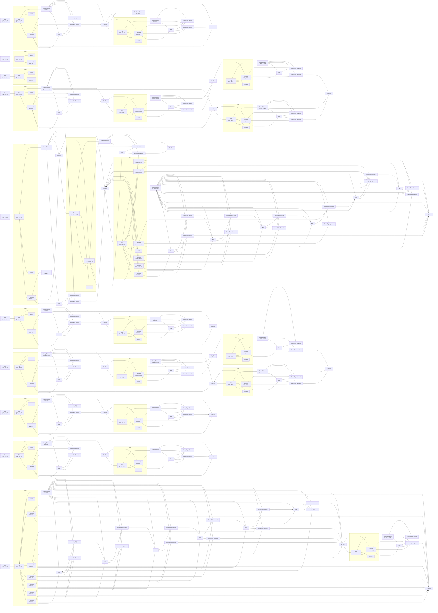

```mermaid
flowchart LR
  subgraph path2 [Path]
    2["Path<br>[440, 502, 2]"]
    3["Segment<br>[440, 502, 2]"]
    4[Solid2d]
  end
  subgraph path11 [Path]
    11["Path<br>[640, 700, 2]"]
    12["Segment<br>[640, 700, 2]"]
    13[Solid2d]
  end
  subgraph path19 [Path]
    19["Path<br>[613, 706, 3]"]
    20["Segment<br>[613, 706, 3]"]
    21[Solid2d]
  end
  subgraph path23 [Path]
    23["Path<br>[935, 990, 3]"]
    24["Segment<br>[935, 990, 3]"]
    25[Solid2d]
  end
  subgraph path32 [Path]
    32["Path<br>[1220, 1279, 3]"]
    33["Segment<br>[1220, 1279, 3]"]
    34[Solid2d]
  end
  subgraph path40 [Path]
    40["Path<br>[1386, 1446, 3]"]
    41["Segment<br>[1386, 1446, 3]"]
    42[Solid2d]
  end
  subgraph path48 [Path]
    48["Path<br>[1608, 1661, 3]"]
    49["Segment<br>[1608, 1661, 3]"]
    50[Solid2d]
  end
  subgraph path56 [Path]
    56["Path<br>[613, 706, 3]"]
    57["Segment<br>[613, 706, 3]"]
    58[Solid2d]
  end
  subgraph path60 [Path]
    60["Path<br>[935, 990, 3]"]
    61["Segment<br>[935, 990, 3]"]
    62[Solid2d]
  end
  subgraph path69 [Path]
    69["Path<br>[1220, 1279, 3]"]
    70["Segment<br>[1220, 1279, 3]"]
    71[Solid2d]
  end
  subgraph path77 [Path]
    77["Path<br>[1386, 1446, 3]"]
    78["Segment<br>[1386, 1446, 3]"]
    79[Solid2d]
  end
  subgraph path85 [Path]
    85["Path<br>[1608, 1661, 3]"]
    86["Segment<br>[1608, 1661, 3]"]
    87[Solid2d]
  end
  subgraph path93 [Path]
    93["Path<br>[429, 481, 4]"]
    94["Segment<br>[429, 481, 4]"]
    95[Solid2d]
  end
  subgraph path102 [Path]
    102["Path<br>[619, 671, 4]"]
    103["Segment<br>[619, 671, 4]"]
    104[Solid2d]
  end
  subgraph path110 [Path]
    110["Path<br>[457, 527, 5]"]
    111["Segment<br>[457, 527, 5]"]
    112[Solid2d]
  end
  subgraph path120 [Path]
    120["Path<br>[796, 883, 5]"]
    121["Segment<br>[891, 942, 5]"]
    122["Segment<br>[950, 1001, 5]"]
    123["Segment<br>[1009, 1060, 5]"]
    124["Segment<br>[1068, 1118, 5]"]
    125["Segment<br>[1126, 1176, 5]"]
    126["Segment<br>[1184, 1191, 5]"]
    127[Solid2d]
  end
  subgraph path148 [Path]
    148["Path<br>[1330, 1399, 5]"]
    149["Segment<br>[1330, 1399, 5]"]
    150[Solid2d]
  end
  subgraph path157 [Path]
    157["Path<br>[443, 533, 6]"]
    158["Segment<br>[541, 591, 6]"]
    159["Segment<br>[599, 649, 6]"]
    160["Segment<br>[657, 707, 6]"]
    161["Segment<br>[715, 764, 6]"]
    162["Segment<br>[772, 821, 6]"]
    163["Segment<br>[829, 836, 6]"]
    164[Solid2d]
  end
  subgraph path186 [Path]
    186["Path<br>[985, 1037, 6]"]
    187["Segment<br>[985, 1037, 6]"]
    188[Solid2d]
  end
  subgraph path194 [Path]
    194["Path<br>[343, 401, 7]"]
    195["Segment<br>[343, 401, 7]"]
    196[Solid2d]
  end
  subgraph path203 [Path]
    203["Path<br>[545, 600, 7]"]
    204["Segment<br>[545, 600, 7]"]
    205[Solid2d]
  end
  subgraph path211 [Path]
    211["Path<br>[343, 401, 7]"]
    212["Segment<br>[343, 401, 7]"]
    213[Solid2d]
  end
  subgraph path220 [Path]
    220["Path<br>[545, 600, 7]"]
    221["Segment<br>[545, 600, 7]"]
    222[Solid2d]
  end
  1["Plane<br>[417, 434, 2]"]
  5["Sweep Extrusion<br>[508, 544, 2]"]
  6[Wall]
    %% face_code_ref=Missing NodePath
  7["Cap Start"]
    %% face_code_ref=Missing NodePath
  8["Cap End"]
  9["SweepEdge Opposite"]
  10["SweepEdge Adjacent"]
  14["Sweep Extrusion<br>[706, 743, 2]"]
  15[Wall]
    %% face_code_ref=Missing NodePath
  16["SweepEdge Opposite"]
  17["SweepEdge Adjacent"]
  18["Plane<br>[588, 605, 3]"]
  22["Plane<br>[910, 927, 3]"]
  26["Sweep Extrusion<br>[1038, 1078, 3]"]
  27[Wall]
    %% face_code_ref=Missing NodePath
  28["Cap Start"]
    %% face_code_ref=Missing NodePath
  29["Cap End"]
    %% face_code_ref=Missing NodePath
  30["SweepEdge Opposite"]
  31["SweepEdge Adjacent"]
  35["Sweep Extrusion<br>[1287, 1324, 3]"]
  36[Wall]
    %% face_code_ref=Missing NodePath
  37["Cap End"]
    %% face_code_ref=Missing NodePath
  38["SweepEdge Opposite"]
  39["SweepEdge Adjacent"]
  43["Sweep Extrusion<br>[1454, 1492, 3]"]
  44[Wall]
    %% face_code_ref=Missing NodePath
  45["Cap End"]
    %% face_code_ref=Missing NodePath
  46["SweepEdge Opposite"]
  47["SweepEdge Adjacent"]
  51["Sweep Extrusion<br>[1669, 1711, 3]"]
  52[Wall]
    %% face_code_ref=Missing NodePath
  53["SweepEdge Opposite"]
  54["SweepEdge Adjacent"]
  55["Plane<br>[588, 605, 3]"]
  59["Plane<br>[910, 927, 3]"]
  63["Sweep Extrusion<br>[1038, 1078, 3]"]
  64[Wall]
    %% face_code_ref=Missing NodePath
  65["Cap Start"]
    %% face_code_ref=Missing NodePath
  66["Cap End"]
    %% face_code_ref=Missing NodePath
  67["SweepEdge Opposite"]
  68["SweepEdge Adjacent"]
  72["Sweep Extrusion<br>[1287, 1324, 3]"]
  73[Wall]
    %% face_code_ref=Missing NodePath
  74["Cap End"]
    %% face_code_ref=Missing NodePath
  75["SweepEdge Opposite"]
  76["SweepEdge Adjacent"]
  80["Sweep Extrusion<br>[1454, 1492, 3]"]
  81[Wall]
    %% face_code_ref=Missing NodePath
  82["Cap End"]
    %% face_code_ref=Missing NodePath
  83["SweepEdge Opposite"]
  84["SweepEdge Adjacent"]
  88["Sweep Extrusion<br>[1669, 1711, 3]"]
  89[Wall]
    %% face_code_ref=Missing NodePath
  90["SweepEdge Opposite"]
  91["SweepEdge Adjacent"]
  92["Plane<br>[404, 421, 4]"]
  96["Sweep Extrusion<br>[489, 522, 4]"]
  97[Wall]
    %% face_code_ref=Missing NodePath
  98["Cap Start"]
    %% face_code_ref=Missing NodePath
  99["Cap End"]
    %% face_code_ref=Missing NodePath
  100["SweepEdge Opposite"]
  101["SweepEdge Adjacent"]
  105["Sweep Extrusion<br>[679, 716, 4]"]
  106[Wall]
    %% face_code_ref=Missing NodePath
  107["SweepEdge Opposite"]
  108["SweepEdge Adjacent"]
  109["Plane<br>[432, 449, 5]"]
  113["Sweep Extrusion<br>[535, 568, 5]"]
  114[Wall]
    %% face_code_ref=Missing NodePath
  115["Cap Start"]
    %% face_code_ref=Missing NodePath
  116["Cap End"]
    %% face_code_ref=Missing NodePath
  117["SweepEdge Opposite"]
  118["SweepEdge Adjacent"]
  119["EdgeCut Fillet<br>[576, 642, 5]"]
  128["Sweep Extrusion<br>[1199, 1239, 5]"]
  129[Wall]
    %% face_code_ref=Missing NodePath
  130[Wall]
    %% face_code_ref=Missing NodePath
  131[Wall]
    %% face_code_ref=Missing NodePath
  132[Wall]
    %% face_code_ref=Missing NodePath
  133[Wall]
    %% face_code_ref=Missing NodePath
  134[Wall]
    %% face_code_ref=Missing NodePath
  135["Cap Start"]
    %% face_code_ref=Missing NodePath
  136["SweepEdge Opposite"]
  137["SweepEdge Adjacent"]
  138["SweepEdge Opposite"]
  139["SweepEdge Adjacent"]
  140["SweepEdge Opposite"]
  141["SweepEdge Adjacent"]
  142["SweepEdge Opposite"]
  143["SweepEdge Adjacent"]
  144["SweepEdge Opposite"]
  145["SweepEdge Adjacent"]
  146["SweepEdge Opposite"]
  147["SweepEdge Adjacent"]
  151["Sweep Extrusion<br>[1407, 1435, 5]"]
  152[Wall]
    %% face_code_ref=Missing NodePath
  153["Cap End"]
    %% face_code_ref=Missing NodePath
  154["SweepEdge Opposite"]
  155["SweepEdge Adjacent"]
  156["Plane<br>[418, 435, 6]"]
  165["Sweep Extrusion<br>[844, 877, 6]"]
  166[Wall]
    %% face_code_ref=Missing NodePath
  167[Wall]
    %% face_code_ref=Missing NodePath
  168[Wall]
    %% face_code_ref=Missing NodePath
  169[Wall]
    %% face_code_ref=Missing NodePath
  170[Wall]
    %% face_code_ref=Missing NodePath
  171[Wall]
    %% face_code_ref=Missing NodePath
  172["Cap Start"]
    %% face_code_ref=Missing NodePath
  173["Cap End"]
    %% face_code_ref=Missing NodePath
  174["SweepEdge Opposite"]
  175["SweepEdge Adjacent"]
  176["SweepEdge Opposite"]
  177["SweepEdge Adjacent"]
  178["SweepEdge Opposite"]
  179["SweepEdge Adjacent"]
  180["SweepEdge Opposite"]
  181["SweepEdge Adjacent"]
  182["SweepEdge Opposite"]
  183["SweepEdge Adjacent"]
  184["SweepEdge Opposite"]
  185["SweepEdge Adjacent"]
  189["Sweep Extrusion<br>[1045, 1082, 6]"]
  190[Wall]
    %% face_code_ref=Missing NodePath
  191["SweepEdge Opposite"]
  192["SweepEdge Adjacent"]
  193["Plane<br>[318, 335, 7]"]
  197["Sweep Extrusion<br>[409, 440, 7]"]
  198[Wall]
    %% face_code_ref=Missing NodePath
  199["Cap Start"]
    %% face_code_ref=Missing NodePath
  200["Cap End"]
    %% face_code_ref=Missing NodePath
  201["SweepEdge Opposite"]
  202["SweepEdge Adjacent"]
  206["Sweep Extrusion<br>[608, 640, 7]"]
  207[Wall]
    %% face_code_ref=Missing NodePath
  208["SweepEdge Opposite"]
  209["SweepEdge Adjacent"]
  210["Plane<br>[318, 335, 7]"]
  214["Sweep Extrusion<br>[409, 440, 7]"]
  215[Wall]
    %% face_code_ref=Missing NodePath
  216["Cap Start"]
    %% face_code_ref=Missing NodePath
  217["Cap End"]
    %% face_code_ref=Missing NodePath
  218["SweepEdge Opposite"]
  219["SweepEdge Adjacent"]
  223["Sweep Extrusion<br>[608, 640, 7]"]
  224[Wall]
    %% face_code_ref=Missing NodePath
  225["SweepEdge Opposite"]
  226["SweepEdge Adjacent"]
  227["StartSketchOnFace<br>[597, 634, 2]"]
  1 --- 2
  2 --- 3
  2 --- 4
  2 ---- 5
  3 --- 6
  3 x--> 7
  3 --- 9
  3 --- 10
  5 --- 6
  5 --- 7
  5 --- 8
  5 --- 9
  5 --- 10
  6 --- 9
  6 --- 10
  16 <--x 7
  9 <--x 8
  8 --- 11
  12 <--x 8
  8 <--x 227
  11 --- 12
  11 --- 13
  11 ---- 14
  12 --- 15
  12 --- 16
  12 --- 17
  14 --- 15
  14 --- 16
  14 --- 17
  15 --- 16
  15 --- 17
  18 --- 19
  19 --- 20
  19 --- 21
  22 --- 23
  23 --- 24
  23 --- 25
  23 ---- 26
  24 --- 27
  24 x--> 28
  24 --- 30
  24 --- 31
  26 --- 27
  26 --- 28
  26 --- 29
  26 --- 30
  26 --- 31
  27 --- 30
  27 --- 31
  28 --- 32
  33 <--x 28
  30 <--x 29
  29 --- 40
  41 <--x 29
  32 --- 33
  32 --- 34
  32 ---- 35
  33 --- 36
  33 --- 38
  33 --- 39
  35 --- 36
  35 --- 37
  35 --- 38
  35 --- 39
  36 --- 38
  36 --- 39
  38 <--x 37
  53 <--x 37
  40 --- 41
  40 --- 42
  40 ---- 43
  41 --- 44
  41 --- 46
  41 --- 47
  43 --- 44
  43 --- 45
  43 --- 46
  43 --- 47
  44 --- 46
  44 --- 47
  46 <--x 45
  45 --- 48
  49 <--x 45
  48 --- 49
  48 --- 50
  48 ---- 51
  49 --- 52
  49 --- 53
  49 --- 54
  51 --- 52
  51 --- 53
  51 --- 54
  52 --- 53
  52 --- 54
  55 --- 56
  56 --- 57
  56 --- 58
  59 --- 60
  60 --- 61
  60 --- 62
  60 ---- 63
  61 --- 64
  61 x--> 65
  61 --- 67
  61 --- 68
  63 --- 64
  63 --- 65
  63 --- 66
  63 --- 67
  63 --- 68
  64 --- 67
  64 --- 68
  65 --- 69
  70 <--x 65
  67 <--x 66
  66 --- 77
  78 <--x 66
  69 --- 70
  69 --- 71
  69 ---- 72
  70 --- 73
  70 --- 75
  70 --- 76
  72 --- 73
  72 --- 74
  72 --- 75
  72 --- 76
  73 --- 75
  73 --- 76
  75 <--x 74
  90 <--x 74
  77 --- 78
  77 --- 79
  77 ---- 80
  78 --- 81
  78 --- 83
  78 --- 84
  80 --- 81
  80 --- 82
  80 --- 83
  80 --- 84
  81 --- 83
  81 --- 84
  83 <--x 82
  82 --- 85
  86 <--x 82
  85 --- 86
  85 --- 87
  85 ---- 88
  86 --- 89
  86 --- 90
  86 --- 91
  88 --- 89
  88 --- 90
  88 --- 91
  89 --- 90
  89 --- 91
  92 --- 93
  93 --- 94
  93 --- 95
  93 ---- 96
  94 --- 97
  94 x--> 98
  94 --- 100
  94 --- 101
  96 --- 97
  96 --- 98
  96 --- 99
  96 --- 100
  96 --- 101
  97 --- 100
  97 --- 101
  107 <--x 98
  100 <--x 99
  99 --- 102
  103 <--x 99
  102 --- 103
  102 --- 104
  102 ---- 105
  103 --- 106
  103 --- 107
  103 --- 108
  105 --- 106
  105 --- 107
  105 --- 108
  106 --- 107
  106 --- 108
  109 --- 110
  110 --- 111
  110 --- 112
  110 ---- 113
  111 --- 114
  111 x--> 116
  111 --- 117
  111 --- 118
  111 --- 119
  113 --- 114
  113 --- 115
  113 --- 116
  113 --- 117
  113 --- 118
  114 --- 117
  114 --- 118
  117 <--x 115
  115 --- 120
  121 <--x 115
  122 <--x 115
  123 <--x 115
  124 <--x 115
  125 <--x 115
  126 <--x 115
  116 --- 148
  149 <--x 116
  120 --- 121
  120 --- 122
  120 --- 123
  120 --- 124
  120 --- 125
  120 --- 126
  120 --- 127
  120 ---- 128
  121 --- 134
  121 --- 146
  121 --- 147
  122 --- 133
  122 --- 144
  122 --- 145
  123 --- 132
  123 --- 142
  123 --- 143
  124 --- 131
  124 --- 140
  124 --- 141
  125 --- 130
  125 --- 138
  125 --- 139
  126 --- 129
  126 --- 136
  126 --- 137
  128 --- 129
  128 --- 130
  128 --- 131
  128 --- 132
  128 --- 133
  128 --- 134
  128 --- 135
  128 --- 136
  128 --- 137
  128 --- 138
  128 --- 139
  128 --- 140
  128 --- 141
  128 --- 142
  128 --- 143
  128 --- 144
  128 --- 145
  128 --- 146
  128 --- 147
  129 --- 136
  129 --- 137
  139 <--x 129
  130 --- 138
  130 --- 139
  141 <--x 130
  131 --- 140
  131 --- 141
  143 <--x 131
  132 --- 142
  132 --- 143
  145 <--x 132
  133 --- 144
  133 --- 145
  147 <--x 133
  137 <--x 134
  134 --- 146
  134 --- 147
  136 <--x 135
  138 <--x 135
  140 <--x 135
  142 <--x 135
  144 <--x 135
  146 <--x 135
  148 --- 149
  148 --- 150
  148 ---- 151
  149 --- 152
  149 --- 154
  149 --- 155
  151 --- 152
  151 --- 153
  151 --- 154
  151 --- 155
  152 --- 154
  152 --- 155
  154 <--x 153
  156 --- 157
  157 --- 158
  157 --- 159
  157 --- 160
  157 --- 161
  157 --- 162
  157 --- 163
  157 --- 164
  157 ---- 165
  158 --- 171
  158 x--> 172
  158 --- 184
  158 --- 185
  159 --- 170
  159 x--> 172
  159 --- 182
  159 --- 183
  160 --- 169
  160 x--> 172
  160 --- 180
  160 --- 181
  161 --- 168
  161 x--> 172
  161 --- 178
  161 --- 179
  162 --- 167
  162 x--> 172
  162 --- 176
  162 --- 177
  163 --- 166
  163 x--> 172
  163 --- 174
  163 --- 175
  165 --- 166
  165 --- 167
  165 --- 168
  165 --- 169
  165 --- 170
  165 --- 171
  165 --- 172
  165 --- 173
  165 --- 174
  165 --- 175
  165 --- 176
  165 --- 177
  165 --- 178
  165 --- 179
  165 --- 180
  165 --- 181
  165 --- 182
  165 --- 183
  165 --- 184
  165 --- 185
  166 --- 174
  166 --- 175
  177 <--x 166
  167 --- 176
  167 --- 177
  179 <--x 167
  168 --- 178
  168 --- 179
  181 <--x 168
  169 --- 180
  169 --- 181
  183 <--x 169
  170 --- 182
  170 --- 183
  185 <--x 170
  175 <--x 171
  171 --- 184
  171 --- 185
  191 <--x 172
  174 <--x 173
  176 <--x 173
  178 <--x 173
  180 <--x 173
  182 <--x 173
  184 <--x 173
  173 --- 186
  187 <--x 173
  186 --- 187
  186 --- 188
  186 ---- 189
  187 --- 190
  187 --- 191
  187 --- 192
  189 --- 190
  189 --- 191
  189 --- 192
  190 --- 191
  190 --- 192
  193 --- 194
  194 --- 195
  194 --- 196
  194 ---- 197
  195 --- 198
  195 x--> 199
  195 --- 201
  195 --- 202
  197 --- 198
  197 --- 199
  197 --- 200
  197 --- 201
  197 --- 202
  198 --- 201
  198 --- 202
  208 <--x 199
  201 <--x 200
  200 --- 203
  204 <--x 200
  203 --- 204
  203 --- 205
  203 ---- 206
  204 --- 207
  204 --- 208
  204 --- 209
  206 --- 207
  206 --- 208
  206 --- 209
  207 --- 208
  207 --- 209
  210 --- 211
  211 --- 212
  211 --- 213
  211 ---- 214
  212 --- 215
  212 x--> 216
  212 --- 218
  212 --- 219
  214 --- 215
  214 --- 216
  214 --- 217
  214 --- 218
  214 --- 219
  215 --- 218
  215 --- 219
  225 <--x 216
  218 <--x 217
  217 --- 220
  221 <--x 217
  220 --- 221
  220 --- 222
  220 ---- 223
  221 --- 224
  221 --- 225
  221 --- 226
  223 --- 224
  223 --- 225
  223 --- 226
  224 --- 225
  224 --- 226
```
