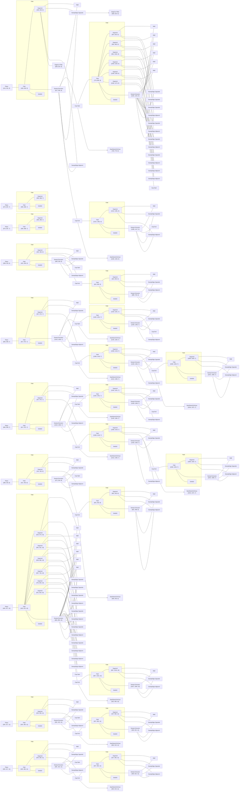

```mermaid
flowchart LR
  subgraph path43 [Path]
    43["Path<br>[422, 484, 6]"]
    44["Segment<br>[422, 484, 6]"]
    45[Solid2d]
  end
  subgraph path49 [Path]
    49["Path<br>[622, 682, 6]"]
    50["Segment<br>[622, 682, 6]"]
    51[Solid2d]
  end
  subgraph path56 [Path]
    56["Path<br>[595, 688, 7]"]
    57["Segment<br>[595, 688, 7]"]
    58[Solid2d]
  end
  subgraph path60 [Path]
    60["Path<br>[917, 972, 7]"]
    61["Segment<br>[917, 972, 7]"]
    62[Solid2d]
  end
  subgraph path68 [Path]
    68["Path<br>[1192, 1251, 7]"]
    69["Segment<br>[1192, 1251, 7]"]
    70[Solid2d]
  end
  subgraph path74 [Path]
    74["Path<br>[1358, 1418, 7]"]
    75["Segment<br>[1358, 1418, 7]"]
    76[Solid2d]
  end
  subgraph path81 [Path]
    81["Path<br>[1580, 1633, 7]"]
    82["Segment<br>[1580, 1633, 7]"]
    83[Solid2d]
  end
  subgraph path88 [Path]
    88["Path<br>[595, 688, 7]"]
    89["Segment<br>[595, 688, 7]"]
    90[Solid2d]
  end
  subgraph path92 [Path]
    92["Path<br>[917, 972, 7]"]
    93["Segment<br>[917, 972, 7]"]
    94[Solid2d]
  end
  subgraph path100 [Path]
    100["Path<br>[1192, 1251, 7]"]
    101["Segment<br>[1192, 1251, 7]"]
    102[Solid2d]
  end
  subgraph path106 [Path]
    106["Path<br>[1358, 1418, 7]"]
    107["Segment<br>[1358, 1418, 7]"]
    108[Solid2d]
  end
  subgraph path113 [Path]
    113["Path<br>[1580, 1633, 7]"]
    114["Segment<br>[1580, 1633, 7]"]
    115[Solid2d]
  end
  subgraph path126 [Path]
    126["Path<br>[411, 463, 8]"]
    127["Segment<br>[411, 463, 8]"]
    128[Solid2d]
  end
  subgraph path133 [Path]
    133["Path<br>[601, 653, 8]"]
    134["Segment<br>[601, 653, 8]"]
    135[Solid2d]
  end
  subgraph path141 [Path]
    141["Path<br>[439, 509, 9]"]
    142["Segment<br>[439, 509, 9]"]
    143[Solid2d]
  end
  subgraph path151 [Path]
    151["Path<br>[778, 865, 9]"]
    152["Segment<br>[873, 924, 9]"]
    153["Segment<br>[932, 983, 9]"]
    154["Segment<br>[991, 1042, 9]"]
    155["Segment<br>[1050, 1100, 9]"]
    156["Segment<br>[1108, 1158, 9]"]
    157["Segment<br>[1166, 1173, 9]"]
    158[Solid2d]
  end
  subgraph path172 [Path]
    172["Path<br>[1312, 1381, 9]"]
    173["Segment<br>[1312, 1381, 9]"]
    174[Solid2d]
  end
  subgraph path181 [Path]
    181["Path<br>[425, 515, 10]"]
    182["Segment<br>[523, 573, 10]"]
    183["Segment<br>[581, 631, 10]"]
    184["Segment<br>[639, 689, 10]"]
    185["Segment<br>[697, 746, 10]"]
    186["Segment<br>[754, 803, 10]"]
    187["Segment<br>[811, 818, 10]"]
    188[Solid2d]
  end
  subgraph path203 [Path]
    203["Path<br>[967, 1019, 10]"]
    204["Segment<br>[967, 1019, 10]"]
    205[Solid2d]
  end
  subgraph path211 [Path]
    211["Path<br>[325, 383, 11]"]
    212["Segment<br>[325, 383, 11]"]
    213[Solid2d]
  end
  subgraph path218 [Path]
    218["Path<br>[527, 582, 11]"]
    219["Segment<br>[527, 582, 11]"]
    220[Solid2d]
  end
  subgraph path225 [Path]
    225["Path<br>[325, 383, 11]"]
    226["Segment<br>[325, 383, 11]"]
    227[Solid2d]
  end
  subgraph path232 [Path]
    232["Path<br>[527, 582, 11]"]
    233["Segment<br>[527, 582, 11]"]
    234[Solid2d]
  end
  1[Wall]
  2["Cap Start"]
  3["Cap End"]
  4[Wall]
  5[Wall]
  6[Wall]
  7["Cap End"]
  8[Wall]
  9[Wall]
  10[Wall]
  11[Wall]
  12["Cap End"]
  13[Wall]
  14[Wall]
  15[Wall]
  16["Cap Start"]
  17[Wall]
  18[Wall]
  19[Wall]
  20[Wall]
  21[Wall]
  22[Wall]
  23[Wall]
  24[Wall]
  25["Cap Start"]
  26[Wall]
  27["Cap End"]
  28[Wall]
  29[Wall]
  30[Wall]
  31[Wall]
  32[Wall]
  33[Wall]
  34["Cap Start"]
  35[Wall]
  36[Wall]
  37["Cap Start"]
  38[Wall]
  39[Wall]
  40["Cap Start"]
  41[Wall]
  42["Plane<br>[399, 416, 6]"]
  46["Sweep Extrusion<br>[490, 526, 6]"]
  47["SweepEdge Opposite"]
  48["SweepEdge Adjacent"]
  52["Sweep Extrusion<br>[688, 725, 6]"]
  53["SweepEdge Opposite"]
  54["SweepEdge Adjacent"]
  55["Plane<br>[570, 587, 7]"]
  59["Plane<br>[892, 909, 7]"]
  63["Sweep Extrusion<br>[1010, 1050, 7]"]
  64["Cap Start"]
  65["Cap End"]
  66["SweepEdge Opposite"]
  67["SweepEdge Adjacent"]
  71["Sweep Extrusion<br>[1259, 1296, 7]"]
  72["SweepEdge Opposite"]
  73["SweepEdge Adjacent"]
  77["Sweep Extrusion<br>[1426, 1464, 7]"]
  78["Cap End"]
  79["SweepEdge Opposite"]
  80["SweepEdge Adjacent"]
  84["Sweep Extrusion<br>[1641, 1683, 7]"]
  85["SweepEdge Opposite"]
  86["SweepEdge Adjacent"]
  87["Plane<br>[570, 587, 7]"]
  91["Plane<br>[892, 909, 7]"]
  95["Sweep Extrusion<br>[1010, 1050, 7]"]
  96["Cap Start"]
  97["Cap End"]
  98["SweepEdge Opposite"]
  99["SweepEdge Adjacent"]
  103["Sweep Extrusion<br>[1259, 1296, 7]"]
  104["SweepEdge Opposite"]
  105["SweepEdge Adjacent"]
  109["Sweep Extrusion<br>[1426, 1464, 7]"]
  110["Cap End"]
  111["SweepEdge Opposite"]
  112["SweepEdge Adjacent"]
  116["Sweep Extrusion<br>[1641, 1683, 7]"]
  117["SweepEdge Opposite"]
  118["SweepEdge Adjacent"]
  119["StartSketchOnFace<br>[1145, 1184, 7]"]
  120["StartSketchOnFace<br>[1313, 1350, 7]"]
  121["StartSketchOnFace<br>[1534, 1572, 7]"]
  122["StartSketchOnFace<br>[1145, 1184, 7]"]
  123["StartSketchOnFace<br>[1313, 1350, 7]"]
  124["StartSketchOnFace<br>[1534, 1572, 7]"]
  125["Plane<br>[386, 403, 8]"]
  129["Sweep Extrusion<br>[471, 504, 8]"]
  130["Cap End"]
  131["SweepEdge Opposite"]
  132["SweepEdge Adjacent"]
  136["Sweep Extrusion<br>[661, 698, 8]"]
  137["SweepEdge Opposite"]
  138["SweepEdge Adjacent"]
  139["StartSketchOnFace<br>[556, 593, 8]"]
  140["Plane<br>[414, 431, 9]"]
  144["Sweep Extrusion<br>[517, 550, 9]"]
  145["Cap Start"]
  146["Cap End"]
  147["SweepEdge Opposite"]
  148["SweepEdge Adjacent"]
  149["EdgeCut Fillet<br>[558, 624, 9]"]
  150["EdgeCut Fillet<br>[558, 624, 9]"]
  159["Sweep Extrusion<br>[1181, 1221, 9]"]
  160["SweepEdge Opposite"]
  161["SweepEdge Adjacent"]
  162["SweepEdge Opposite"]
  163["SweepEdge Adjacent"]
  164["SweepEdge Opposite"]
  165["SweepEdge Adjacent"]
  166["SweepEdge Opposite"]
  167["SweepEdge Adjacent"]
  168["SweepEdge Opposite"]
  169["SweepEdge Adjacent"]
  170["SweepEdge Opposite"]
  171["SweepEdge Adjacent"]
  175["Sweep Extrusion<br>[1389, 1417, 9]"]
  176["SweepEdge Opposite"]
  177["SweepEdge Adjacent"]
  178["StartSketchOnFace<br>[733, 770, 9]"]
  179["StartSketchOnFace<br>[1269, 1304, 9]"]
  180["Plane<br>[400, 417, 10]"]
  189["Sweep Extrusion<br>[826, 859, 10]"]
  190["Cap End"]
  191["SweepEdge Opposite"]
  192["SweepEdge Adjacent"]
  193["SweepEdge Opposite"]
  194["SweepEdge Adjacent"]
  195["SweepEdge Opposite"]
  196["SweepEdge Adjacent"]
  197["SweepEdge Opposite"]
  198["SweepEdge Adjacent"]
  199["SweepEdge Opposite"]
  200["SweepEdge Adjacent"]
  201["SweepEdge Opposite"]
  202["SweepEdge Adjacent"]
  206["Sweep Extrusion<br>[1027, 1064, 10]"]
  207["SweepEdge Opposite"]
  208["SweepEdge Adjacent"]
  209["StartSketchOnFace<br>[922, 959, 10]"]
  210["Plane<br>[300, 317, 11]"]
  214["Sweep Extrusion<br>[391, 422, 11]"]
  215["Cap End"]
  216["SweepEdge Opposite"]
  217["SweepEdge Adjacent"]
  221["Sweep Extrusion<br>[590, 622, 11]"]
  222["SweepEdge Opposite"]
  223["SweepEdge Adjacent"]
  224["Plane<br>[300, 317, 11]"]
  228["Sweep Extrusion<br>[391, 422, 11]"]
  229["Cap End"]
  230["SweepEdge Opposite"]
  231["SweepEdge Adjacent"]
  235["Sweep Extrusion<br>[590, 622, 11]"]
  236["SweepEdge Opposite"]
  237["SweepEdge Adjacent"]
  238["StartSketchOnFace<br>[484, 519, 11]"]
  239["StartSketchOnFace<br>[484, 519, 11]"]
  44 --- 1
  46 --- 1
  46 --- 2
  46 --- 3
  3 --- 49
  50 --- 4
  52 --- 4
  61 --- 5
  63 --- 5
  69 --- 6
  71 --- 6
  71 --- 7
  75 --- 8
  77 --- 8
  82 --- 9
  84 --- 9
  93 --- 10
  95 --- 10
  101 --- 11
  103 --- 11
  103 --- 12
  107 --- 13
  109 --- 13
  114 --- 14
  116 --- 14
  127 --- 15
  129 --- 15
  129 --- 16
  134 --- 17
  136 --- 17
  142 --- 18
  144 --- 18
  157 --- 19
  159 --- 19
  156 --- 20
  159 --- 20
  155 --- 21
  159 --- 21
  154 --- 22
  159 --- 22
  153 --- 23
  159 --- 23
  152 --- 24
  159 --- 24
  159 --- 25
  173 --- 26
  175 --- 26
  175 --- 27
  187 --- 28
  189 --- 28
  186 --- 29
  189 --- 29
  185 --- 30
  189 --- 30
  184 --- 31
  189 --- 31
  183 --- 32
  189 --- 32
  182 --- 33
  189 --- 33
  189 --- 34
  204 --- 35
  206 --- 35
  212 --- 36
  214 --- 36
  214 --- 37
  219 --- 38
  221 --- 38
  226 --- 39
  228 --- 39
  228 --- 40
  233 --- 41
  235 --- 41
  42 --- 43
  43 --- 44
  43 ---- 46
  43 --- 45
  44 --- 47
  44 --- 48
  46 --- 47
  46 --- 48
  49 --- 50
  49 ---- 52
  49 --- 51
  50 --- 53
  50 --- 54
  52 --- 53
  52 --- 54
  55 --- 56
  56 --- 57
  56 --- 58
  59 --- 60
  60 --- 61
  60 ---- 63
  60 --- 62
  61 --- 66
  61 --- 67
  63 --- 64
  63 --- 65
  63 --- 66
  63 --- 67
  64 --- 68
  65 --- 74
  68 --- 69
  68 ---- 71
  68 --- 70
  69 --- 72
  69 --- 73
  71 --- 72
  71 --- 73
  74 --- 75
  74 ---- 77
  74 --- 76
  75 --- 79
  75 --- 80
  77 --- 78
  77 --- 79
  77 --- 80
  78 --- 81
  81 --- 82
  81 ---- 84
  81 --- 83
  82 --- 85
  82 --- 86
  84 --- 85
  84 --- 86
  87 --- 88
  88 --- 89
  88 --- 90
  91 --- 92
  92 --- 93
  92 ---- 95
  92 --- 94
  93 --- 98
  93 --- 99
  95 --- 96
  95 --- 97
  95 --- 98
  95 --- 99
  96 --- 100
  97 --- 106
  100 --- 101
  100 ---- 103
  100 --- 102
  101 --- 104
  101 --- 105
  103 --- 104
  103 --- 105
  106 --- 107
  106 ---- 109
  106 --- 108
  107 --- 111
  107 --- 112
  109 --- 110
  109 --- 111
  109 --- 112
  110 --- 113
  113 --- 114
  113 ---- 116
  113 --- 115
  114 --- 117
  114 --- 118
  116 --- 117
  116 --- 118
  64 <--x 119
  65 <--x 120
  78 <--x 121
  96 <--x 122
  97 <--x 123
  110 <--x 124
  125 --- 126
  126 --- 127
  126 ---- 129
  126 --- 128
  127 --- 131
  127 --- 132
  129 --- 130
  129 --- 131
  129 --- 132
  130 --- 133
  133 --- 134
  133 ---- 136
  133 --- 135
  134 --- 137
  134 --- 138
  136 --- 137
  136 --- 138
  130 <--x 139
  140 --- 141
  141 --- 142
  141 ---- 144
  141 --- 143
  142 --- 147
  142 --- 148
  142 --- 149
  144 --- 145
  144 --- 146
  144 --- 147
  144 --- 148
  145 --- 151
  146 --- 172
  147 <--x 150
  151 --- 152
  151 --- 153
  151 --- 154
  151 --- 155
  151 --- 156
  151 --- 157
  151 ---- 159
  151 --- 158
  152 --- 170
  152 --- 171
  153 --- 168
  153 --- 169
  154 --- 166
  154 --- 167
  155 --- 164
  155 --- 165
  156 --- 162
  156 --- 163
  157 --- 160
  157 --- 161
  159 --- 160
  159 --- 161
  159 --- 162
  159 --- 163
  159 --- 164
  159 --- 165
  159 --- 166
  159 --- 167
  159 --- 168
  159 --- 169
  159 --- 170
  159 --- 171
  172 --- 173
  172 ---- 175
  172 --- 174
  173 --- 176
  173 --- 177
  175 --- 176
  175 --- 177
  145 <--x 178
  146 <--x 179
  180 --- 181
  181 --- 182
  181 --- 183
  181 --- 184
  181 --- 185
  181 --- 186
  181 --- 187
  181 ---- 189
  181 --- 188
  182 --- 201
  182 --- 202
  183 --- 199
  183 --- 200
  184 --- 197
  184 --- 198
  185 --- 195
  185 --- 196
  186 --- 193
  186 --- 194
  187 --- 191
  187 --- 192
  189 --- 190
  189 --- 191
  189 --- 192
  189 --- 193
  189 --- 194
  189 --- 195
  189 --- 196
  189 --- 197
  189 --- 198
  189 --- 199
  189 --- 200
  189 --- 201
  189 --- 202
  190 --- 203
  203 --- 204
  203 ---- 206
  203 --- 205
  204 --- 207
  204 --- 208
  206 --- 207
  206 --- 208
  190 <--x 209
  210 --- 211
  211 --- 212
  211 ---- 214
  211 --- 213
  212 --- 216
  212 --- 217
  214 --- 215
  214 --- 216
  214 --- 217
  215 --- 218
  218 --- 219
  218 ---- 221
  218 --- 220
  219 --- 222
  219 --- 223
  221 --- 222
  221 --- 223
  224 --- 225
  225 --- 226
  225 ---- 228
  225 --- 227
  226 --- 230
  226 --- 231
  228 --- 229
  228 --- 230
  228 --- 231
  229 --- 232
  232 --- 233
  232 ---- 235
  232 --- 234
  233 --- 236
  233 --- 237
  235 --- 236
  235 --- 237
  215 <--x 238
  229 <--x 239
```
