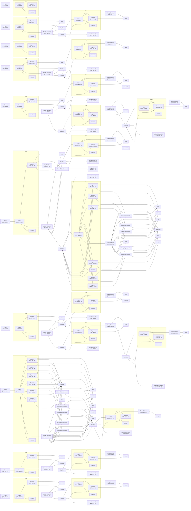

```mermaid
flowchart LR
  subgraph path2 [Path]
    2["Path<br>[595, 688, 8]"]
    3["Segment<br>[595, 688, 8]"]
    4[Solid2d]
  end
  subgraph path6 [Path]
    6["Path<br>[917, 972, 8]"]
    7["Segment<br>[917, 972, 8]"]
    8[Solid2d]
  end
  subgraph path13 [Path]
    13["Path<br>[1192, 1251, 8]"]
    14["Segment<br>[1192, 1251, 8]"]
    15[Solid2d]
  end
  subgraph path19 [Path]
    19["Path<br>[1358, 1418, 8]"]
    20["Segment<br>[1358, 1418, 8]"]
    21[Solid2d]
  end
  subgraph path25 [Path]
    25["Path<br>[1580, 1633, 8]"]
    26["Segment<br>[1580, 1633, 8]"]
    27[Solid2d]
  end
  subgraph path31 [Path]
    31["Path<br>[595, 688, 8]"]
    32["Segment<br>[595, 688, 8]"]
    33[Solid2d]
  end
  subgraph path35 [Path]
    35["Path<br>[917, 972, 8]"]
    36["Segment<br>[917, 972, 8]"]
    37[Solid2d]
  end
  subgraph path42 [Path]
    42["Path<br>[1192, 1251, 8]"]
    43["Segment<br>[1192, 1251, 8]"]
    44[Solid2d]
  end
  subgraph path48 [Path]
    48["Path<br>[1358, 1418, 8]"]
    49["Segment<br>[1358, 1418, 8]"]
    50[Solid2d]
  end
  subgraph path54 [Path]
    54["Path<br>[1580, 1633, 8]"]
    55["Segment<br>[1580, 1633, 8]"]
    56[Solid2d]
  end
  subgraph path60 [Path]
    60["Path<br>[422, 484, 7]"]
    61["Segment<br>[422, 484, 7]"]
    62[Solid2d]
  end
  subgraph path67 [Path]
    67["Path<br>[622, 682, 7]"]
    68["Segment<br>[622, 682, 7]"]
    69[Solid2d]
  end
  subgraph path73 [Path]
    73["Path<br>[411, 463, 9]"]
    74["Segment<br>[411, 463, 9]"]
    75[Solid2d]
  end
  subgraph path80 [Path]
    80["Path<br>[601, 653, 9]"]
    81["Segment<br>[601, 653, 9]"]
    82[Solid2d]
  end
  subgraph path86 [Path]
    86["Path<br>[439, 509, 10]"]
    87["Segment<br>[439, 509, 10]"]
    88[Solid2d]
  end
  subgraph path96 [Path]
    96["Path<br>[778, 865, 10]"]
    97["Segment<br>[873, 924, 10]"]
    98["Segment<br>[932, 983, 10]"]
    99["Segment<br>[991, 1042, 10]"]
    100["Segment<br>[1050, 1100, 10]"]
    101["Segment<br>[1108, 1158, 10]"]
    102["Segment<br>[1166, 1173, 10]"]
    103[Solid2d]
  end
  subgraph path117 [Path]
    117["Path<br>[1312, 1381, 10]"]
    118["Segment<br>[1312, 1381, 10]"]
    119[Solid2d]
  end
  subgraph path124 [Path]
    124["Path<br>[425, 515, 11]"]
    125["Segment<br>[523, 573, 11]"]
    126["Segment<br>[581, 631, 11]"]
    127["Segment<br>[639, 689, 11]"]
    128["Segment<br>[697, 746, 11]"]
    129["Segment<br>[754, 803, 11]"]
    130["Segment<br>[811, 818, 11]"]
    131[Solid2d]
  end
  subgraph path146 [Path]
    146["Path<br>[967, 1019, 11]"]
    147["Segment<br>[967, 1019, 11]"]
    148[Solid2d]
  end
  subgraph path152 [Path]
    152["Path<br>[325, 383, 12]"]
    153["Segment<br>[325, 383, 12]"]
    154[Solid2d]
  end
  subgraph path159 [Path]
    159["Path<br>[527, 582, 12]"]
    160["Segment<br>[527, 582, 12]"]
    161[Solid2d]
  end
  subgraph path165 [Path]
    165["Path<br>[325, 383, 12]"]
    166["Segment<br>[325, 383, 12]"]
    167[Solid2d]
  end
  subgraph path172 [Path]
    172["Path<br>[527, 582, 12]"]
    173["Segment<br>[527, 582, 12]"]
    174[Solid2d]
  end
  1["Plane<br>[570, 587, 8]"]
  5["Plane<br>[892, 909, 8]"]
  9["Sweep Extrusion<br>[1010, 1050, 8]"]
  10[Wall]
  11["Cap Start"]
  12["Cap End"]
  16["Sweep Extrusion<br>[1259, 1296, 8]"]
  17[Wall]
  18["Cap End"]
  22["Sweep Extrusion<br>[1426, 1464, 8]"]
  23[Wall]
  24["Cap End"]
  28["Sweep Extrusion<br>[1641, 1683, 8]"]
  29[Wall]
  30["Plane<br>[570, 587, 8]"]
  34["Plane<br>[892, 909, 8]"]
  38["Sweep Extrusion<br>[1010, 1050, 8]"]
  39[Wall]
  40["Cap Start"]
  41["Cap End"]
  45["Sweep Extrusion<br>[1259, 1296, 8]"]
  46[Wall]
  47["Cap End"]
  51["Sweep Extrusion<br>[1426, 1464, 8]"]
  52[Wall]
  53["Cap End"]
  57["Sweep Extrusion<br>[1641, 1683, 8]"]
  58[Wall]
  59["Plane<br>[399, 416, 7]"]
  63["Sweep Extrusion<br>[490, 526, 7]"]
  64[Wall]
  65["Cap Start"]
  66["Cap End"]
  70["Sweep Extrusion<br>[688, 725, 7]"]
  71[Wall]
  72["Plane<br>[386, 403, 9]"]
  76["Sweep Extrusion<br>[471, 504, 9]"]
  77[Wall]
  78["Cap Start"]
  79["Cap End"]
  83["Sweep Extrusion<br>[661, 698, 9]"]
  84[Wall]
  85["Plane<br>[414, 431, 10]"]
  89["Sweep Extrusion<br>[517, 550, 10]"]
  90[Wall]
  91["Cap Start"]
  92["Cap End"]
  93["SweepEdge Opposite"]
  94["EdgeCut Fillet<br>[558, 624, 10]"]
  95["EdgeCut Fillet<br>[558, 624, 10]"]
  104["Sweep Extrusion<br>[1181, 1221, 10]"]
  105[Wall]
  106[Wall]
  107[Wall]
  108[Wall]
  109[Wall]
  110[Wall]
  111["Cap Start"]
  112["SweepEdge Opposite"]
  113["SweepEdge Opposite"]
  114["SweepEdge Opposite"]
  115["SweepEdge Opposite"]
  116["SweepEdge Opposite"]
  120["Sweep Extrusion<br>[1389, 1417, 10]"]
  121[Wall]
  122["Cap End"]
  123["Plane<br>[400, 417, 11]"]
  132["Sweep Extrusion<br>[826, 859, 11]"]
  133[Wall]
  134[Wall]
  135[Wall]
  136[Wall]
  137[Wall]
  138[Wall]
  139["Cap Start"]
  140["Cap End"]
  141["SweepEdge Opposite"]
  142["SweepEdge Opposite"]
  143["SweepEdge Opposite"]
  144["SweepEdge Opposite"]
  145["SweepEdge Opposite"]
  149["Sweep Extrusion<br>[1027, 1064, 11]"]
  150[Wall]
  151["Plane<br>[300, 317, 12]"]
  155["Sweep Extrusion<br>[391, 422, 12]"]
  156[Wall]
  157["Cap Start"]
  158["Cap End"]
  162["Sweep Extrusion<br>[590, 622, 12]"]
  163[Wall]
  164["Plane<br>[300, 317, 12]"]
  168["Sweep Extrusion<br>[391, 422, 12]"]
  169[Wall]
  170["Cap Start"]
  171["Cap End"]
  175["Sweep Extrusion<br>[590, 622, 12]"]
  176[Wall]
  177["StartSketchOnFace<br>[1145, 1184, 8]"]
  178["StartSketchOnFace<br>[1313, 1350, 8]"]
  179["StartSketchOnFace<br>[1534, 1572, 8]"]
  180["StartSketchOnFace<br>[1145, 1184, 8]"]
  181["StartSketchOnFace<br>[1313, 1350, 8]"]
  182["StartSketchOnFace<br>[1534, 1572, 8]"]
  183["StartSketchOnFace<br>[579, 616, 7]"]
  184["StartSketchOnFace<br>[556, 593, 9]"]
  185["StartSketchOnFace<br>[733, 770, 10]"]
  186["StartSketchOnFace<br>[1269, 1304, 10]"]
  187["StartSketchOnFace<br>[922, 959, 11]"]
  188["StartSketchOnFace<br>[484, 519, 12]"]
  189["StartSketchOnFace<br>[484, 519, 12]"]
  1 --- 2
  2 --- 3
  2 --- 4
  5 --- 6
  6 --- 7
  6 ---- 9
  6 --- 8
  7 --- 10
  7 x--> 11
  9 --- 10
  9 --- 11
  9 --- 12
  11 --- 13
  12 --- 19
  13 --- 14
  13 ---- 16
  13 --- 15
  14 --- 17
  14 <--x 11
  16 --- 17
  16 --- 18
  19 --- 20
  19 ---- 22
  19 --- 21
  20 --- 23
  20 <--x 12
  22 --- 23
  22 --- 24
  24 --- 25
  25 --- 26
  25 ---- 28
  25 --- 27
  26 --- 29
  26 <--x 24
  28 --- 29
  30 --- 31
  31 --- 32
  31 --- 33
  34 --- 35
  35 --- 36
  35 ---- 38
  35 --- 37
  36 --- 39
  36 x--> 40
  38 --- 39
  38 --- 40
  38 --- 41
  40 --- 42
  41 --- 48
  42 --- 43
  42 ---- 45
  42 --- 44
  43 --- 46
  43 <--x 40
  45 --- 46
  45 --- 47
  48 --- 49
  48 ---- 51
  48 --- 50
  49 --- 52
  49 <--x 41
  51 --- 52
  51 --- 53
  53 --- 54
  54 --- 55
  54 ---- 57
  54 --- 56
  55 --- 58
  55 <--x 53
  57 --- 58
  59 --- 60
  60 --- 61
  60 ---- 63
  60 --- 62
  61 --- 64
  61 x--> 65
  63 --- 64
  63 --- 65
  63 --- 66
  66 --- 67
  67 --- 68
  67 ---- 70
  67 --- 69
  68 --- 71
  68 <--x 66
  70 --- 71
  72 --- 73
  73 --- 74
  73 ---- 76
  73 --- 75
  74 --- 77
  74 x--> 78
  76 --- 77
  76 --- 78
  76 --- 79
  79 --- 80
  80 --- 81
  80 ---- 83
  80 --- 82
  81 --- 84
  81 <--x 79
  83 --- 84
  85 --- 86
  86 --- 87
  86 ---- 89
  86 --- 88
  87 --- 90
  87 --- 93
  87 --- 94
  87 x--> 92
  89 --- 90
  89 --- 91
  89 --- 92
  89 --- 93
  91 --- 96
  92 --- 117
  93 <--x 95
  96 --- 97
  96 --- 98
  96 --- 99
  96 --- 100
  96 --- 101
  96 --- 102
  96 ---- 104
  96 --- 103
  97 --- 110
  97 --- 116
  97 <--x 91
  98 --- 109
  98 --- 115
  98 <--x 91
  99 --- 108
  99 --- 114
  99 <--x 91
  100 --- 107
  100 --- 113
  100 <--x 91
  101 --- 106
  101 --- 112
  101 <--x 91
  102 --- 105
  102 <--x 91
  104 --- 105
  104 --- 106
  104 --- 107
  104 --- 108
  104 --- 109
  104 --- 110
  104 --- 111
  104 --- 112
  104 --- 113
  104 --- 114
  104 --- 115
  104 --- 116
  112 <--x 106
  112 <--x 111
  113 <--x 107
  113 <--x 111
  114 <--x 108
  114 <--x 111
  115 <--x 109
  115 <--x 111
  116 <--x 110
  116 <--x 111
  117 --- 118
  117 ---- 120
  117 --- 119
  118 --- 121
  118 <--x 92
  120 --- 121
  120 --- 122
  123 --- 124
  124 --- 125
  124 --- 126
  124 --- 127
  124 --- 128
  124 --- 129
  124 --- 130
  124 ---- 132
  124 --- 131
  125 --- 138
  125 --- 145
  125 x--> 139
  126 --- 137
  126 --- 144
  126 x--> 139
  127 --- 136
  127 --- 143
  127 x--> 139
  128 --- 135
  128 --- 142
  128 x--> 139
  129 --- 134
  129 --- 141
  129 x--> 139
  130 --- 133
  130 x--> 139
  132 --- 133
  132 --- 134
  132 --- 135
  132 --- 136
  132 --- 137
  132 --- 138
  132 --- 139
  132 --- 140
  132 --- 141
  132 --- 142
  132 --- 143
  132 --- 144
  132 --- 145
  140 --- 146
  141 <--x 134
  141 <--x 140
  142 <--x 135
  142 <--x 140
  143 <--x 136
  143 <--x 140
  144 <--x 137
  144 <--x 140
  145 <--x 138
  145 <--x 140
  146 --- 147
  146 ---- 149
  146 --- 148
  147 --- 150
  147 <--x 140
  149 --- 150
  151 --- 152
  152 --- 153
  152 ---- 155
  152 --- 154
  153 --- 156
  153 x--> 157
  155 --- 156
  155 --- 157
  155 --- 158
  158 --- 159
  159 --- 160
  159 ---- 162
  159 --- 161
  160 --- 163
  160 <--x 158
  162 --- 163
  164 --- 165
  165 --- 166
  165 ---- 168
  165 --- 167
  166 --- 169
  166 x--> 170
  168 --- 169
  168 --- 170
  168 --- 171
  171 --- 172
  172 --- 173
  172 ---- 175
  172 --- 174
  173 --- 176
  173 <--x 171
  175 --- 176
  11 <--x 177
  12 <--x 178
  24 <--x 179
  40 <--x 180
  41 <--x 181
  53 <--x 182
  66 <--x 183
  79 <--x 184
  91 <--x 185
  92 <--x 186
  140 <--x 187
  158 <--x 188
  171 <--x 189
```
