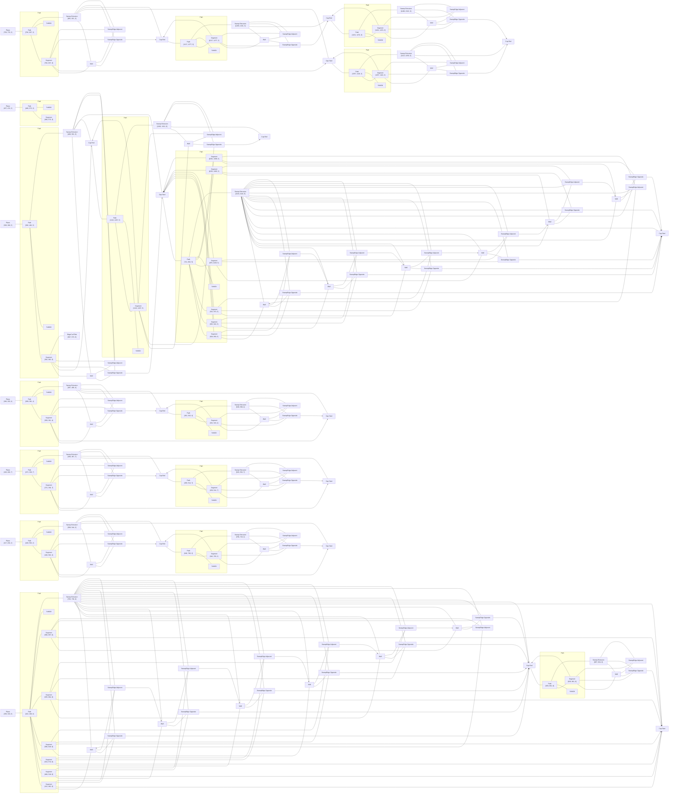

```mermaid
flowchart LR
  subgraph path8 [Path]
    8["Path<br>[440, 502, 2]"]
    24["Segment<br>[440, 502, 2]"]
    60[Solid2d]
  end
  subgraph path9 [Path]
    9["Path<br>[640, 700, 2]"]
    25["Segment<br>[640, 700, 2]"]
    52[Solid2d]
  end
  subgraph path10 [Path]
    10["Path<br>[480, 573, 3]"]
    26["Segment<br>[480, 573, 3]"]
    53[Solid2d]
  end
  subgraph path11 [Path]
    11["Path<br>[782, 837, 3]"]
    27["Segment<br>[782, 837, 3]"]
    62[Solid2d]
  end
  subgraph path12 [Path]
    12["Path<br>[1057, 1116, 3]"]
    28["Segment<br>[1057, 1116, 3]"]
    59[Solid2d]
  end
  subgraph path13 [Path]
    13["Path<br>[1217, 1277, 3]"]
    29["Segment<br>[1217, 1277, 3]"]
    50[Solid2d]
  end
  subgraph path14 [Path]
    14["Path<br>[1421, 1474, 3]"]
    30["Segment<br>[1421, 1474, 3]"]
    65[Solid2d]
  end
  subgraph path15 [Path]
    15["Path<br>[309, 361, 4]"]
    31["Segment<br>[309, 361, 4]"]
    58[Solid2d]
  end
  subgraph path16 [Path]
    16["Path<br>[491, 543, 4]"]
    32["Segment<br>[491, 543, 4]"]
    56[Solid2d]
  end
  subgraph path17 [Path]
    17["Path<br>[392, 462, 5]"]
    33["Segment<br>[392, 462, 5]"]
    51[Solid2d]
  end
  subgraph path18 [Path]
    18["Path<br>[721, 802, 5]"]
    34["Segment<br>[808, 859, 5]"]
    35["Segment<br>[865, 916, 5]"]
    36["Segment<br>[922, 973, 5]"]
    37["Segment<br>[979, 1029, 5]"]
    38["Segment<br>[1035, 1085, 5]"]
    39["Segment<br>[1091, 1098, 5]"]
    61[Solid2d]
  end
  subgraph path19 [Path]
    19["Path<br>[1218, 1287, 5]"]
    40["Segment<br>[1218, 1287, 5]"]
    63[Solid2d]
  end
  subgraph path20 [Path]
    20["Path<br>[322, 406, 6]"]
    41["Segment<br>[412, 462, 6]"]
    42["Segment<br>[468, 518, 6]"]
    43["Segment<br>[524, 574, 6]"]
    44["Segment<br>[580, 629, 6]"]
    45["Segment<br>[635, 684, 6]"]
    46["Segment<br>[690, 697, 6]"]
    64[Solid2d]
  end
  subgraph path21 [Path]
    21["Path<br>[829, 881, 6]"]
    47["Segment<br>[829, 881, 6]"]
    55[Solid2d]
  end
  subgraph path22 [Path]
    22["Path<br>[272, 330, 7]"]
    48["Segment<br>[272, 330, 7]"]
    57[Solid2d]
  end
  subgraph path23 [Path]
    23["Path<br>[459, 514, 7]"]
    49["Segment<br>[459, 514, 7]"]
    54[Solid2d]
  end
  1["Plane<br>[417, 434, 2]"]
  2["Plane<br>[457, 474, 3]"]
  3["Plane<br>[759, 776, 3]"]
  4["Plane<br>[286, 303, 4]"]
  5["Plane<br>[369, 386, 5]"]
  6["Plane<br>[299, 316, 6]"]
  7["Plane<br>[249, 266, 7]"]
  66["Sweep Extrusion<br>[508, 544, 2]"]
  67["Sweep Extrusion<br>[706, 743, 2]"]
  68["Sweep Extrusion<br>[881, 921, 3]"]
  69["Sweep Extrusion<br>[1122, 1159, 3]"]
  70["Sweep Extrusion<br>[1283, 1321, 3]"]
  71["Sweep Extrusion<br>[1480, 1522, 3]"]
  72["Sweep Extrusion<br>[367, 400, 4]"]
  73["Sweep Extrusion<br>[549, 586, 4]"]
  74["Sweep Extrusion<br>[468, 501, 5]"]
  75["Sweep Extrusion<br>[1104, 1144, 5]"]
  76["Sweep Extrusion<br>[1293, 1321, 5]"]
  77["Sweep Extrusion<br>[703, 736, 6]"]
  78["Sweep Extrusion<br>[887, 924, 6]"]
  79["Sweep Extrusion<br>[336, 367, 7]"]
  80["Sweep Extrusion<br>[520, 552, 7]"]
  81[Wall]
    %% face_code_ref=Missing NodePath
  82[Wall]
    %% face_code_ref=Missing NodePath
  83[Wall]
    %% face_code_ref=Missing NodePath
  84[Wall]
    %% face_code_ref=Missing NodePath
  85[Wall]
    %% face_code_ref=Missing NodePath
  86[Wall]
    %% face_code_ref=Missing NodePath
  87[Wall]
    %% face_code_ref=Missing NodePath
  88[Wall]
    %% face_code_ref=Missing NodePath
  89[Wall]
    %% face_code_ref=Missing NodePath
  90[Wall]
    %% face_code_ref=Missing NodePath
  91[Wall]
    %% face_code_ref=Missing NodePath
  92[Wall]
    %% face_code_ref=Missing NodePath
  93[Wall]
    %% face_code_ref=Missing NodePath
  94[Wall]
    %% face_code_ref=Missing NodePath
  95[Wall]
    %% face_code_ref=Missing NodePath
  96[Wall]
    %% face_code_ref=Missing NodePath
  97[Wall]
    %% face_code_ref=Missing NodePath
  98[Wall]
    %% face_code_ref=Missing NodePath
  99[Wall]
    %% face_code_ref=Missing NodePath
  100[Wall]
    %% face_code_ref=Missing NodePath
  101[Wall]
    %% face_code_ref=Missing NodePath
  102[Wall]
    %% face_code_ref=Missing NodePath
  103[Wall]
    %% face_code_ref=Missing NodePath
  104[Wall]
    %% face_code_ref=Missing NodePath
  105[Wall]
    %% face_code_ref=Missing NodePath
  106["Cap Start"]
    %% face_code_ref=Missing NodePath
  107["Cap Start"]
    %% face_code_ref=Missing NodePath
  108["Cap Start"]
    %% face_code_ref=Missing NodePath
  109["Cap Start"]
    %% face_code_ref=Missing NodePath
  110["Cap Start"]
    %% face_code_ref=Missing NodePath
  111["Cap Start"]
    %% face_code_ref=Missing NodePath
  112["Cap Start"]
    %% face_code_ref=Missing NodePath
  113["Cap End"]
    %% face_code_ref=Missing NodePath
  114["Cap End"]
    %% face_code_ref=Missing NodePath
  115["Cap End"]
    %% face_code_ref=Missing NodePath
  116["Cap End"]
    %% face_code_ref=Missing NodePath
  117["Cap End"]
    %% face_code_ref=Missing NodePath
  118["Cap End"]
    %% face_code_ref=Missing NodePath
  119["Cap End"]
    %% face_code_ref=Missing NodePath
  120["Cap End"]
    %% face_code_ref=Missing NodePath
  121["Cap End"]
    %% face_code_ref=Missing NodePath
  122["SweepEdge Opposite"]
  123["SweepEdge Opposite"]
  124["SweepEdge Opposite"]
  125["SweepEdge Opposite"]
  126["SweepEdge Opposite"]
  127["SweepEdge Opposite"]
  128["SweepEdge Opposite"]
  129["SweepEdge Opposite"]
  130["SweepEdge Opposite"]
  131["SweepEdge Opposite"]
  132["SweepEdge Opposite"]
  133["SweepEdge Opposite"]
  134["SweepEdge Opposite"]
  135["SweepEdge Opposite"]
  136["SweepEdge Opposite"]
  137["SweepEdge Opposite"]
  138["SweepEdge Opposite"]
  139["SweepEdge Opposite"]
  140["SweepEdge Opposite"]
  141["SweepEdge Opposite"]
  142["SweepEdge Opposite"]
  143["SweepEdge Opposite"]
  144["SweepEdge Opposite"]
  145["SweepEdge Opposite"]
  146["SweepEdge Opposite"]
  147["SweepEdge Adjacent"]
  148["SweepEdge Adjacent"]
  149["SweepEdge Adjacent"]
  150["SweepEdge Adjacent"]
  151["SweepEdge Adjacent"]
  152["SweepEdge Adjacent"]
  153["SweepEdge Adjacent"]
  154["SweepEdge Adjacent"]
  155["SweepEdge Adjacent"]
  156["SweepEdge Adjacent"]
  157["SweepEdge Adjacent"]
  158["SweepEdge Adjacent"]
  159["SweepEdge Adjacent"]
  160["SweepEdge Adjacent"]
  161["SweepEdge Adjacent"]
  162["SweepEdge Adjacent"]
  163["SweepEdge Adjacent"]
  164["SweepEdge Adjacent"]
  165["SweepEdge Adjacent"]
  166["SweepEdge Adjacent"]
  167["SweepEdge Adjacent"]
  168["SweepEdge Adjacent"]
  169["SweepEdge Adjacent"]
  170["SweepEdge Adjacent"]
  171["SweepEdge Adjacent"]
  172["EdgeCut Fillet<br>[507, 573, 5]"]
  1 --- 8
  2 --- 10
  3 --- 11
  4 --- 15
  5 --- 17
  6 --- 20
  7 --- 22
  8 --- 24
  8 --- 60
  8 ---- 66
  9 --- 25
  9 --- 52
  9 ---- 67
  116 --- 9
  10 --- 26
  10 --- 53
  11 --- 27
  11 --- 62
  11 ---- 68
  12 --- 28
  12 --- 59
  12 ---- 69
  106 --- 12
  13 --- 29
  13 --- 50
  13 ---- 70
  113 --- 13
  14 --- 30
  14 --- 65
  14 ---- 71
  121 --- 14
  15 --- 31
  15 --- 58
  15 ---- 72
  16 --- 32
  16 --- 56
  16 ---- 73
  117 --- 16
  17 --- 33
  17 --- 51
  17 ---- 74
  18 --- 34
  18 --- 35
  18 --- 36
  18 --- 37
  18 --- 38
  18 --- 39
  18 --- 61
  18 ---- 75
  107 --- 18
  19 --- 40
  19 --- 63
  19 ---- 76
  114 --- 19
  20 --- 41
  20 --- 42
  20 --- 43
  20 --- 44
  20 --- 45
  20 --- 46
  20 --- 64
  20 ---- 77
  21 --- 47
  21 --- 55
  21 ---- 78
  118 --- 21
  22 --- 48
  22 --- 57
  22 ---- 79
  23 --- 49
  23 --- 54
  23 ---- 80
  115 --- 23
  24 --- 101
  24 x--> 109
  24 --- 142
  24 --- 167
  25 --- 100
  25 x--> 116
  25 --- 141
  25 --- 166
  27 --- 82
  27 x--> 106
  27 --- 123
  27 --- 148
  28 --- 92
  28 x--> 106
  28 --- 133
  28 --- 158
  29 --- 93
  29 x--> 113
  29 --- 134
  29 --- 159
  30 --- 102
  30 x--> 121
  30 --- 143
  30 --- 168
  31 --- 84
  31 x--> 110
  31 --- 125
  31 --- 150
  32 --- 81
  32 x--> 117
  32 --- 122
  32 --- 147
  33 --- 105
  33 x--> 114
  33 --- 146
  33 --- 171
  33 --- 172
  34 --- 89
  34 x--> 107
  34 --- 132
  34 --- 157
  35 --- 86
  35 x--> 107
  35 --- 131
  35 --- 156
  36 --- 88
  36 x--> 107
  36 --- 130
  36 --- 155
  37 --- 91
  37 x--> 107
  37 --- 129
  37 --- 154
  38 --- 87
  38 x--> 107
  38 --- 128
  38 --- 153
  39 --- 90
  39 x--> 107
  39 --- 127
  39 --- 152
  40 --- 85
  40 x--> 114
  40 --- 126
  40 --- 151
  41 --- 96
  41 x--> 111
  41 --- 140
  41 --- 165
  42 --- 98
  42 x--> 111
  42 --- 139
  42 --- 164
  43 --- 95
  43 x--> 111
  43 --- 138
  43 --- 163
  44 --- 97
  44 x--> 111
  44 --- 137
  44 --- 162
  45 --- 94
  45 x--> 111
  45 --- 136
  45 --- 161
  46 --- 99
  46 x--> 111
  46 --- 135
  46 --- 160
  47 --- 83
  47 x--> 118
  47 --- 124
  47 --- 149
  48 --- 103
  48 x--> 108
  48 --- 144
  48 --- 169
  49 --- 104
  49 x--> 115
  49 --- 145
  49 --- 170
  66 --- 101
  66 --- 109
  66 --- 116
  66 --- 142
  66 --- 167
  67 --- 100
  67 --- 141
  67 --- 166
  68 --- 82
  68 --- 106
  68 --- 113
  68 --- 123
  68 --- 148
  69 --- 92
  69 --- 119
  69 --- 133
  69 --- 158
  70 --- 93
  70 --- 121
  70 --- 134
  70 --- 159
  71 --- 102
  71 --- 143
  71 --- 168
  72 --- 84
  72 --- 110
  72 --- 117
  72 --- 125
  72 --- 150
  73 --- 81
  73 --- 122
  73 --- 147
  74 --- 105
  74 --- 107
  74 --- 114
  74 --- 146
  74 --- 171
  75 --- 86
  75 --- 87
  75 --- 88
  75 --- 89
  75 --- 90
  75 --- 91
  75 --- 112
  75 --- 127
  75 --- 128
  75 --- 129
  75 --- 130
  75 --- 131
  75 --- 132
  75 --- 152
  75 --- 153
  75 --- 154
  75 --- 155
  75 --- 156
  75 --- 157
  76 --- 85
  76 --- 120
  76 --- 126
  76 --- 151
  77 --- 94
  77 --- 95
  77 --- 96
  77 --- 97
  77 --- 98
  77 --- 99
  77 --- 111
  77 --- 118
  77 --- 135
  77 --- 136
  77 --- 137
  77 --- 138
  77 --- 139
  77 --- 140
  77 --- 160
  77 --- 161
  77 --- 162
  77 --- 163
  77 --- 164
  77 --- 165
  78 --- 83
  78 --- 124
  78 --- 149
  79 --- 103
  79 --- 108
  79 --- 115
  79 --- 144
  79 --- 169
  80 --- 104
  80 --- 145
  80 --- 170
  81 --- 122
  81 --- 147
  82 --- 123
  82 --- 148
  83 --- 124
  83 --- 149
  84 --- 125
  84 --- 150
  85 --- 126
  85 --- 151
  86 --- 131
  86 --- 156
  157 <--x 86
  87 --- 128
  87 --- 153
  154 <--x 87
  88 --- 130
  88 --- 155
  156 <--x 88
  89 --- 132
  152 <--x 89
  89 --- 157
  90 --- 127
  90 --- 152
  153 <--x 90
  91 --- 129
  91 --- 154
  155 <--x 91
  92 --- 133
  92 --- 158
  93 --- 134
  93 --- 159
  94 --- 136
  94 --- 161
  162 <--x 94
  95 --- 138
  95 --- 163
  164 <--x 95
  96 --- 140
  160 <--x 96
  96 --- 165
  97 --- 137
  97 --- 162
  163 <--x 97
  98 --- 139
  98 --- 164
  165 <--x 98
  99 --- 135
  99 --- 160
  161 <--x 99
  100 --- 141
  100 --- 166
  101 --- 142
  101 --- 167
  102 --- 143
  102 --- 168
  103 --- 144
  103 --- 169
  104 --- 145
  104 --- 170
  105 --- 146
  105 --- 171
  146 <--x 107
  145 <--x 108
  141 <--x 109
  122 <--x 110
  124 <--x 111
  127 <--x 112
  128 <--x 112
  129 <--x 112
  130 <--x 112
  131 <--x 112
  132 <--x 112
  123 <--x 113
  144 <--x 115
  142 <--x 116
  125 <--x 117
  135 <--x 118
  136 <--x 118
  137 <--x 118
  138 <--x 118
  139 <--x 118
  140 <--x 118
  133 <--x 119
  143 <--x 119
  126 <--x 120
  134 <--x 121
```
