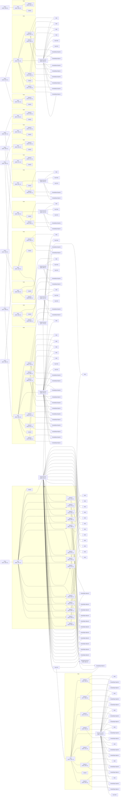

```mermaid
flowchart LR
  subgraph path2 [Path]
    2["Path<br>[4305, 4402, 0]"]
    3["Segment<br>[4305, 4402, 0]"]
    4[Solid2d]
  end
  subgraph path6 [Path]
    6["Path<br>[4600, 4647, 0]"]
    7["Segment<br>[4653, 4672, 0]"]
    8["Segment<br>[4678, 4714, 0]"]
    9["Segment<br>[4720, 4739, 0]"]
    10["Segment<br>[4745, 4778, 0]"]
    11["Segment<br>[4784, 4802, 0]"]
    12["Segment<br>[4808, 4845, 0]"]
    13["Segment<br>[4851, 4869, 0]"]
    14["Segment<br>[4875, 4910, 0]"]
    15["Segment<br>[4916, 4934, 0]"]
    16["Segment<br>[4940, 4972, 0]"]
    17["Segment<br>[4978, 4997, 0]"]
    18["Segment<br>[5003, 5039, 0]"]
    19["Segment<br>[5045, 5052, 0]"]
    20[Solid2d]
  end
  subgraph path48 [Path]
    48["Path<br>[5184, 5211, 0]"]
    49["Segment<br>[5217, 5235, 0]"]
    50["Segment<br>[5241, 5259, 0]"]
    51["Segment<br>[5265, 5284, 0]"]
    52["Segment<br>[5290, 5297, 0]"]
    53[Solid2d]
  end
  subgraph path54 [Path]
    54["Path<br>[5342, 5414, 0]"]
    55["Segment<br>[5342, 5414, 0]"]
    56[Solid2d]
  end
  subgraph path73 [Path]
    73["Path<br>[5563, 5631, 0]"]
    74["Segment<br>[5563, 5631, 0]"]
    75[Solid2d]
  end
  subgraph path76 [Path]
    76["Path<br>[5676, 5748, 0]"]
    77["Segment<br>[5676, 5748, 0]"]
    78[Solid2d]
  end
  subgraph path86 [Path]
    86["Path<br>[2953, 3040, 0]"]
    87["Segment<br>[2953, 3040, 0]"]
    88[Solid2d]
  end
  subgraph path89 [Path]
    89["Path<br>[3053, 3140, 0]"]
    90["Segment<br>[3053, 3140, 0]"]
    91[Solid2d]
  end
  subgraph path99 [Path]
    99["Path<br>[1554, 1626, 0]"]
    100["Segment<br>[1554, 1626, 0]"]
    101[Solid2d]
  end
  subgraph path108 [Path]
    108["Path<br>[1837, 1927, 0]"]
    109["Segment<br>[1935, 1969, 0]"]
    110["Segment<br>[1977, 2064, 0]"]
    111["Segment<br>[2072, 2176, 0]"]
    112["Segment<br>[2184, 2294, 0]"]
    113["Segment<br>[2302, 2412, 0]"]
    114["Segment<br>[2420, 2530, 0]"]
    115["Segment<br>[2538, 2545, 0]"]
    116[Solid2d]
  end
  subgraph path141 [Path]
    141["Path<br>[6568, 6635, 0]"]
    142["Segment<br>[6568, 6635, 0]"]
    143[Solid2d]
  end
  subgraph path151 [Path]
    151["Path<br>[2953, 3040, 0]"]
    152["Segment<br>[2953, 3040, 0]"]
    153[Solid2d]
  end
  subgraph path154 [Path]
    154["Path<br>[3053, 3140, 0]"]
    155["Segment<br>[3053, 3140, 0]"]
    156[Solid2d]
  end
  subgraph path164 [Path]
    164["Path<br>[3604, 3654, 0]"]
    165["Segment<br>[3662, 3745, 0]"]
    166["Segment<br>[3753, 3836, 0]"]
    167["Segment<br>[3844, 3927, 0]"]
    168["Segment<br>[3935, 4017, 0]"]
    169["Segment<br>[4025, 4071, 0]"]
    170["Segment<br>[4079, 4086, 0]"]
    171[Solid2d]
  end
  subgraph path172 [Path]
    172["Path<br>[4099, 4172, 0]"]
    173["Segment<br>[4099, 4172, 0]"]
    174[Solid2d]
  end
  1["Plane<br>[4280, 4299, 0]"]
  5["Plane<br>[4575, 4594, 0]"]
  21["Sweep Revolve<br>[5058, 5084, 0]"]
  22[Wall]
  23[Wall]
  24[Wall]
  25[Wall]
  26[Wall]
  27[Wall]
  28[Wall]
  29[Wall]
  30[Wall]
  31[Wall]
  32[Wall]
  33[Wall]
  34[Wall]
  35["SweepEdge Adjacent"]
  36["SweepEdge Adjacent"]
  37["SweepEdge Adjacent"]
  38["SweepEdge Adjacent"]
  39["SweepEdge Adjacent"]
  40["SweepEdge Adjacent"]
  41["SweepEdge Adjacent"]
  42["SweepEdge Adjacent"]
  43["SweepEdge Adjacent"]
  44["SweepEdge Adjacent"]
  45["SweepEdge Adjacent"]
  46["SweepEdge Adjacent"]
  47["Plane<br>[5159, 5178, 0]"]
  57["Sweep Extrusion<br>[5424, 5455, 0]"]
  58[Wall]
  59[Wall]
  60[Wall]
  61[Wall]
  62["Cap Start"]
  63["Cap End"]
  64["SweepEdge Opposite"]
  65["SweepEdge Adjacent"]
  66["SweepEdge Opposite"]
  67["SweepEdge Adjacent"]
  68["SweepEdge Opposite"]
  69["SweepEdge Adjacent"]
  70["SweepEdge Opposite"]
  71["SweepEdge Adjacent"]
  72["Plane<br>[5538, 5557, 0]"]
  79["Sweep Extrusion<br>[5758, 5792, 0]"]
  80[Wall]
  81["Cap Start"]
  82["Cap End"]
  83["SweepEdge Opposite"]
  84["SweepEdge Adjacent"]
  85["Plane<br>[2925, 2945, 0]"]
  92["Sweep Extrusion<br>[3152, 3173, 0]"]
  93[Wall]
  94["Cap Start"]
  95["Cap End"]
  96["SweepEdge Opposite"]
  97["SweepEdge Adjacent"]
  98["Plane<br>[1521, 1546, 0]"]
  102["Sweep Extrusion<br>[1677, 1715, 0]"]
  103[Wall]
  104["Cap Start"]
  105["Cap End"]
  106["SweepEdge Opposite"]
  107["SweepEdge Adjacent"]
  117["Sweep Extrusion<br>[2561, 2615, 0]"]
  118[Wall]
  119[Wall]
  120[Wall]
  121[Wall]
  122[Wall]
  123[Wall]
  124[Wall]
  125["Cap Start"]
  126["SweepEdge Opposite"]
  127["SweepEdge Adjacent"]
  128["SweepEdge Opposite"]
  129["SweepEdge Adjacent"]
  130["SweepEdge Opposite"]
  131["SweepEdge Adjacent"]
  132["SweepEdge Opposite"]
  133["SweepEdge Adjacent"]
  134["SweepEdge Opposite"]
  135["SweepEdge Adjacent"]
  136["SweepEdge Opposite"]
  137["SweepEdge Adjacent"]
  138["SweepEdge Opposite"]
  139["SweepEdge Adjacent"]
  140["Plane<br>[6537, 6562, 0]"]
  144["Sweep Extrusion<br>[6648, 6695, 0]"]
  145[Wall]
  146["Cap Start"]
  147["Cap End"]
  148["SweepEdge Opposite"]
  149["SweepEdge Adjacent"]
  150["Plane<br>[2925, 2945, 0]"]
  157["Sweep Extrusion<br>[3152, 3173, 0]"]
  158[Wall]
  159["Cap Start"]
  160["Cap End"]
  161["SweepEdge Opposite"]
  162["SweepEdge Adjacent"]
  163["Plane<br>[3270, 3596, 0]"]
  175["Sweep Extrusion<br>[4184, 4206, 0]"]
  176[Wall]
  177[Wall]
  178[Wall]
  179[Wall]
  180[Wall]
  181[Wall]
  182["Cap Start"]
  183["Cap End"]
  184["SweepEdge Opposite"]
  185["SweepEdge Adjacent"]
  186["SweepEdge Opposite"]
  187["SweepEdge Adjacent"]
  188["SweepEdge Opposite"]
  189["SweepEdge Adjacent"]
  190["SweepEdge Opposite"]
  191["SweepEdge Adjacent"]
  192["SweepEdge Opposite"]
  193["SweepEdge Adjacent"]
  194["SweepEdge Opposite"]
  195["SweepEdge Adjacent"]
  196["StartSketchOnFace<br>[1798, 1829, 0]"]
  1 --- 2
  2 --- 3
  2 --- 4
  5 --- 6
  6 --- 7
  6 --- 8
  6 --- 9
  6 --- 10
  6 --- 11
  6 --- 12
  6 --- 13
  6 --- 14
  6 --- 15
  6 --- 16
  6 --- 17
  6 --- 18
  6 --- 19
  6 ---- 21
  6 --- 20
  7 --- 22
  7 x--> 35
  8 --- 23
  8 --- 35
  9 --- 24
  9 --- 36
  10 --- 25
  10 --- 37
  11 --- 26
  11 --- 38
  12 --- 27
  12 --- 39
  13 --- 28
  13 --- 40
  14 --- 29
  14 --- 41
  15 --- 30
  15 --- 42
  16 --- 31
  16 --- 43
  17 --- 32
  17 --- 44
  18 --- 33
  18 --- 45
  19 --- 34
  19 --- 46
  21 --- 22
  21 --- 23
  21 --- 24
  21 --- 25
  21 --- 26
  21 --- 27
  21 --- 28
  21 --- 29
  21 --- 30
  21 --- 31
  21 --- 32
  21 --- 33
  21 --- 34
  21 <--x 7
  21 --- 35
  21 <--x 8
  21 <--x 9
  21 --- 36
  21 <--x 10
  21 --- 37
  21 <--x 11
  21 --- 38
  21 <--x 12
  21 --- 39
  21 <--x 13
  21 --- 40
  21 <--x 14
  21 --- 41
  21 <--x 15
  21 --- 42
  21 <--x 16
  21 --- 43
  21 <--x 17
  21 --- 44
  21 <--x 18
  21 --- 45
  21 <--x 19
  21 --- 46
  47 --- 48
  47 --- 54
  48 --- 49
  48 --- 50
  48 --- 51
  48 --- 52
  48 ---- 57
  48 --- 53
  49 --- 61
  49 --- 70
  49 --- 71
  50 --- 60
  50 --- 68
  50 --- 69
  51 --- 59
  51 --- 66
  51 --- 67
  52 --- 58
  52 --- 64
  52 --- 65
  54 --- 55
  54 --- 56
  57 --- 58
  57 --- 59
  57 --- 60
  57 --- 61
  57 --- 62
  57 --- 63
  57 --- 64
  57 --- 65
  57 --- 66
  57 --- 67
  57 --- 68
  57 --- 69
  57 --- 70
  57 --- 71
  72 --- 73
  72 --- 76
  73 --- 74
  73 ---- 79
  73 --- 75
  74 --- 80
  74 --- 83
  74 --- 84
  76 --- 77
  76 --- 78
  79 --- 80
  79 --- 81
  79 --- 82
  79 --- 83
  79 --- 84
  85 --- 86
  85 --- 89
  86 --- 87
  86 ---- 92
  86 --- 88
  87 --- 93
  87 --- 96
  87 --- 97
  89 --- 90
  89 --- 91
  92 --- 93
  92 --- 94
  92 --- 95
  92 --- 96
  92 --- 97
  98 --- 99
  99 --- 100
  99 ---- 102
  99 --- 101
  100 --- 103
  100 --- 106
  100 --- 107
  102 --- 103
  102 --- 104
  102 --- 105
  102 --- 106
  102 --- 107
  105 --- 108
  108 --- 109
  108 --- 110
  108 --- 111
  108 --- 112
  108 --- 113
  108 --- 114
  108 --- 115
  108 ---- 117
  108 --- 116
  109 --- 124
  109 --- 138
  109 --- 139
  110 --- 123
  110 --- 136
  110 --- 137
  111 --- 122
  111 --- 134
  111 --- 135
  112 --- 121
  112 --- 132
  112 --- 133
  113 --- 120
  113 --- 130
  113 --- 131
  114 --- 119
  114 --- 128
  114 --- 129
  115 --- 118
  115 --- 126
  115 --- 127
  117 --- 118
  117 --- 119
  117 --- 120
  117 --- 121
  117 --- 122
  117 --- 123
  117 --- 124
  117 --- 125
  117 --- 126
  117 --- 127
  117 --- 128
  117 --- 129
  117 --- 130
  117 --- 131
  117 --- 132
  117 --- 133
  117 --- 134
  117 --- 135
  117 --- 136
  117 --- 137
  117 --- 138
  117 --- 139
  140 --- 141
  141 --- 142
  141 ---- 144
  141 --- 143
  142 --- 145
  142 --- 148
  142 --- 149
  144 --- 145
  144 --- 146
  144 --- 147
  144 --- 148
  144 --- 149
  150 --- 151
  150 --- 154
  151 --- 152
  151 ---- 157
  151 --- 153
  152 --- 158
  152 --- 161
  152 --- 162
  154 --- 155
  154 --- 156
  157 --- 158
  157 --- 159
  157 --- 160
  157 --- 161
  157 --- 162
  163 --- 164
  163 --- 172
  164 --- 165
  164 --- 166
  164 --- 167
  164 --- 168
  164 --- 169
  164 --- 170
  164 ---- 175
  164 --- 171
  165 --- 176
  165 --- 184
  165 --- 185
  166 --- 177
  166 --- 186
  166 --- 187
  167 --- 178
  167 --- 188
  167 --- 189
  168 --- 179
  168 --- 190
  168 --- 191
  169 --- 180
  169 --- 192
  169 --- 193
  170 --- 181
  170 --- 194
  170 --- 195
  172 --- 173
  172 --- 174
  175 --- 176
  175 --- 177
  175 --- 178
  175 --- 179
  175 --- 180
  175 --- 181
  175 --- 182
  175 --- 183
  175 --- 184
  175 --- 185
  175 --- 186
  175 --- 187
  175 --- 188
  175 --- 189
  175 --- 190
  175 --- 191
  175 --- 192
  175 --- 193
  175 --- 194
  175 --- 195
  105 <--x 196
```
