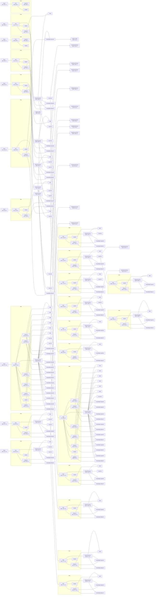

```mermaid
flowchart LR
  subgraph path2 [Path]
    2["Path<br>[595, 688, 7]"]
    3["Segment<br>[595, 688, 7]"]
    4[Solid2d]
  end
  subgraph path6 [Path]
    6["Path<br>[917, 972, 7]"]
    7["Segment<br>[917, 972, 7]"]
    8[Solid2d]
  end
  subgraph path15 [Path]
    15["Path<br>[1187, 1246, 7]"]
    16["Segment<br>[1187, 1246, 7]"]
    17[Solid2d]
  end
  subgraph path23 [Path]
    23["Path<br>[1348, 1408, 7]"]
    24["Segment<br>[1348, 1408, 7]"]
    25[Solid2d]
  end
  subgraph path31 [Path]
    31["Path<br>[1565, 1618, 7]"]
    32["Segment<br>[1565, 1618, 7]"]
    33[Solid2d]
  end
  subgraph path39 [Path]
    39["Path<br>[595, 688, 7]"]
    40["Segment<br>[595, 688, 7]"]
    41[Solid2d]
  end
  subgraph path43 [Path]
    43["Path<br>[917, 972, 7]"]
    44["Segment<br>[917, 972, 7]"]
    45[Solid2d]
  end
  subgraph path52 [Path]
    52["Path<br>[1187, 1246, 7]"]
    53["Segment<br>[1187, 1246, 7]"]
    54[Solid2d]
  end
  subgraph path60 [Path]
    60["Path<br>[1348, 1408, 7]"]
    61["Segment<br>[1348, 1408, 7]"]
    62[Solid2d]
  end
  subgraph path68 [Path]
    68["Path<br>[1565, 1618, 7]"]
    69["Segment<br>[1565, 1618, 7]"]
    70[Solid2d]
  end
  subgraph path76 [Path]
    76["Path<br>[422, 484, 6]"]
    77["Segment<br>[422, 484, 6]"]
    78[Solid2d]
  end
  subgraph path85 [Path]
    85["Path<br>[617, 677, 6]"]
    86["Segment<br>[617, 677, 6]"]
    87[Solid2d]
  end
  subgraph path93 [Path]
    93["Path<br>[411, 463, 8]"]
    94["Segment<br>[411, 463, 8]"]
    95[Solid2d]
  end
  subgraph path102 [Path]
    102["Path<br>[596, 648, 8]"]
    103["Segment<br>[596, 648, 8]"]
    104[Solid2d]
  end
  subgraph path110 [Path]
    110["Path<br>[439, 509, 9]"]
    111["Segment<br>[439, 509, 9]"]
    112[Solid2d]
  end
  subgraph path121 [Path]
    121["Path<br>[773, 860, 9]"]
    122["Segment<br>[868, 919, 9]"]
    123["Segment<br>[927, 978, 9]"]
    124["Segment<br>[986, 1037, 9]"]
    125["Segment<br>[1045, 1095, 9]"]
    126["Segment<br>[1103, 1153, 9]"]
    127["Segment<br>[1161, 1168, 9]"]
    128[Solid2d]
  end
  subgraph path149 [Path]
    149["Path<br>[1302, 1371, 9]"]
    150["Segment<br>[1302, 1371, 9]"]
    151[Solid2d]
  end
  subgraph path158 [Path]
    158["Path<br>[425, 515, 10]"]
    159["Segment<br>[523, 573, 10]"]
    160["Segment<br>[581, 631, 10]"]
    161["Segment<br>[639, 689, 10]"]
    162["Segment<br>[697, 746, 10]"]
    163["Segment<br>[754, 803, 10]"]
    164["Segment<br>[811, 818, 10]"]
    165[Solid2d]
  end
  subgraph path187 [Path]
    187["Path<br>[962, 1014, 10]"]
    188["Segment<br>[962, 1014, 10]"]
    189[Solid2d]
  end
  subgraph path195 [Path]
    195["Path<br>[325, 383, 11]"]
    196["Segment<br>[325, 383, 11]"]
    197[Solid2d]
  end
  subgraph path204 [Path]
    204["Path<br>[522, 577, 11]"]
    205["Segment<br>[522, 577, 11]"]
    206[Solid2d]
  end
  subgraph path212 [Path]
    212["Path<br>[325, 383, 11]"]
    213["Segment<br>[325, 383, 11]"]
    214[Solid2d]
  end
  subgraph path221 [Path]
    221["Path<br>[522, 577, 11]"]
    222["Segment<br>[522, 577, 11]"]
    223[Solid2d]
  end
  1["Plane<br>[570, 587, 7]"]
  5["Plane<br>[892, 909, 7]"]
  9["Sweep Extrusion<br>[1010, 1050, 7]"]
  10[Wall]
  11["Cap Start"]
  12["Cap End"]
  13["SweepEdge Opposite"]
  14["SweepEdge Adjacent"]
  18["Sweep Extrusion<br>[1254, 1291, 7]"]
  19[Wall]
  20["Cap End"]
  21["SweepEdge Opposite"]
  22["SweepEdge Adjacent"]
  26["Sweep Extrusion<br>[1416, 1454, 7]"]
  27[Wall]
  28["Cap End"]
  29["SweepEdge Opposite"]
  30["SweepEdge Adjacent"]
  34["Sweep Extrusion<br>[1626, 1668, 7]"]
  35[Wall]
  36["SweepEdge Opposite"]
  37["SweepEdge Adjacent"]
  38["Plane<br>[570, 587, 7]"]
  42["Plane<br>[892, 909, 7]"]
  46["Sweep Extrusion<br>[1010, 1050, 7]"]
  47[Wall]
  48["Cap Start"]
  49["Cap End"]
  50["SweepEdge Opposite"]
  51["SweepEdge Adjacent"]
  55["Sweep Extrusion<br>[1254, 1291, 7]"]
  56[Wall]
  57["Cap End"]
  58["SweepEdge Opposite"]
  59["SweepEdge Adjacent"]
  63["Sweep Extrusion<br>[1416, 1454, 7]"]
  64[Wall]
  65["Cap End"]
  66["SweepEdge Opposite"]
  67["SweepEdge Adjacent"]
  71["Sweep Extrusion<br>[1626, 1668, 7]"]
  72[Wall]
  73["SweepEdge Opposite"]
  74["SweepEdge Adjacent"]
  75["Plane<br>[399, 416, 6]"]
  79["Sweep Extrusion<br>[490, 526, 6]"]
  80[Wall]
  81["Cap Start"]
  82["Cap End"]
  83["SweepEdge Opposite"]
  84["SweepEdge Adjacent"]
  88["Sweep Extrusion<br>[683, 720, 6]"]
  89[Wall]
  90["SweepEdge Opposite"]
  91["SweepEdge Adjacent"]
  92["Plane<br>[386, 403, 8]"]
  96["Sweep Extrusion<br>[471, 504, 8]"]
  97[Wall]
  98["Cap Start"]
  99["Cap End"]
  100["SweepEdge Opposite"]
  101["SweepEdge Adjacent"]
  105["Sweep Extrusion<br>[656, 693, 8]"]
  106[Wall]
  107["SweepEdge Opposite"]
  108["SweepEdge Adjacent"]
  109["Plane<br>[414, 431, 9]"]
  113["Sweep Extrusion<br>[517, 550, 9]"]
  114[Wall]
  115["Cap Start"]
  116["Cap End"]
  117["SweepEdge Opposite"]
  118["SweepEdge Adjacent"]
  119["EdgeCut Fillet<br>[558, 624, 9]"]
  120["EdgeCut Fillet<br>[558, 624, 9]"]
  129["Sweep Extrusion<br>[1176, 1216, 9]"]
  130[Wall]
  131[Wall]
  132[Wall]
  133[Wall]
  134[Wall]
  135[Wall]
  136["Cap Start"]
  137["SweepEdge Opposite"]
  138["SweepEdge Adjacent"]
  139["SweepEdge Opposite"]
  140["SweepEdge Adjacent"]
  141["SweepEdge Opposite"]
  142["SweepEdge Adjacent"]
  143["SweepEdge Opposite"]
  144["SweepEdge Adjacent"]
  145["SweepEdge Opposite"]
  146["SweepEdge Adjacent"]
  147["SweepEdge Opposite"]
  148["SweepEdge Adjacent"]
  152["Sweep Extrusion<br>[1379, 1407, 9]"]
  153[Wall]
  154["Cap End"]
  155["SweepEdge Opposite"]
  156["SweepEdge Adjacent"]
  157["Plane<br>[400, 417, 10]"]
  166["Sweep Extrusion<br>[826, 859, 10]"]
  167[Wall]
  168[Wall]
  169[Wall]
  170[Wall]
  171[Wall]
  172[Wall]
  173["Cap Start"]
  174["Cap End"]
  175["SweepEdge Opposite"]
  176["SweepEdge Adjacent"]
  177["SweepEdge Opposite"]
  178["SweepEdge Adjacent"]
  179["SweepEdge Opposite"]
  180["SweepEdge Adjacent"]
  181["SweepEdge Opposite"]
  182["SweepEdge Adjacent"]
  183["SweepEdge Opposite"]
  184["SweepEdge Adjacent"]
  185["SweepEdge Opposite"]
  186["SweepEdge Adjacent"]
  190["Sweep Extrusion<br>[1022, 1059, 10]"]
  191[Wall]
  192["SweepEdge Opposite"]
  193["SweepEdge Adjacent"]
  194["Plane<br>[300, 317, 11]"]
  198["Sweep Extrusion<br>[391, 422, 11]"]
  199[Wall]
  200["Cap Start"]
  201["Cap End"]
  202["SweepEdge Opposite"]
  203["SweepEdge Adjacent"]
  207["Sweep Extrusion<br>[585, 617, 11]"]
  208[Wall]
  209["SweepEdge Opposite"]
  210["SweepEdge Adjacent"]
  211["Plane<br>[300, 317, 11]"]
  215["Sweep Extrusion<br>[391, 422, 11]"]
  216[Wall]
  217["Cap Start"]
  218["Cap End"]
  219["SweepEdge Opposite"]
  220["SweepEdge Adjacent"]
  224["Sweep Extrusion<br>[585, 617, 11]"]
  225[Wall]
  226["SweepEdge Opposite"]
  227["SweepEdge Adjacent"]
  228["StartSketchOnFace<br>[1145, 1179, 7]"]
  229["StartSketchOnFace<br>[1308, 1340, 7]"]
  230["StartSketchOnFace<br>[1524, 1557, 7]"]
  231["StartSketchOnFace<br>[1145, 1179, 7]"]
  232["StartSketchOnFace<br>[1308, 1340, 7]"]
  233["StartSketchOnFace<br>[1524, 1557, 7]"]
  234["StartSketchOnFace<br>[579, 611, 6]"]
  235["StartSketchOnFace<br>[556, 588, 8]"]
  236["StartSketchOnFace<br>[733, 765, 9]"]
  237["StartSketchOnFace<br>[1264, 1294, 9]"]
  238["StartSketchOnFace<br>[922, 954, 10]"]
  239["StartSketchOnFace<br>[484, 514, 11]"]
  240["StartSketchOnFace<br>[484, 514, 11]"]
  1 --- 2
  2 --- 3
  2 --- 4
  5 --- 6
  6 --- 7
  6 ---- 9
  6 --- 8
  7 --- 10
  7 --- 13
  7 --- 14
  9 --- 10
  9 --- 11
  9 --- 12
  9 --- 13
  9 --- 14
  11 --- 15
  12 --- 23
  15 --- 16
  15 ---- 18
  15 --- 17
  16 --- 19
  16 --- 21
  16 --- 22
  18 --- 19
  18 --- 20
  18 --- 21
  18 --- 22
  23 --- 24
  23 ---- 26
  23 --- 25
  24 --- 27
  24 --- 29
  24 --- 30
  26 --- 27
  26 --- 28
  26 --- 29
  26 --- 30
  28 --- 31
  31 --- 32
  31 ---- 34
  31 --- 33
  32 --- 35
  32 --- 36
  32 --- 37
  34 --- 35
  34 --- 36
  34 --- 37
  38 --- 39
  39 --- 40
  39 --- 41
  42 --- 43
  43 --- 44
  43 ---- 46
  43 --- 45
  44 --- 47
  44 --- 50
  44 --- 51
  46 --- 47
  46 --- 48
  46 --- 49
  46 --- 50
  46 --- 51
  48 --- 52
  49 --- 60
  52 --- 53
  52 ---- 55
  52 --- 54
  53 --- 56
  53 --- 58
  53 --- 59
  55 --- 56
  55 --- 57
  55 --- 58
  55 --- 59
  60 --- 61
  60 ---- 63
  60 --- 62
  61 --- 64
  61 --- 66
  61 --- 67
  63 --- 64
  63 --- 65
  63 --- 66
  63 --- 67
  65 --- 68
  68 --- 69
  68 ---- 71
  68 --- 70
  69 --- 72
  69 --- 73
  69 --- 74
  71 --- 72
  71 --- 73
  71 --- 74
  75 --- 76
  76 --- 77
  76 ---- 79
  76 --- 78
  77 --- 80
  77 --- 83
  77 --- 84
  79 --- 80
  79 --- 81
  79 --- 82
  79 --- 83
  79 --- 84
  82 --- 85
  85 --- 86
  85 ---- 88
  85 --- 87
  86 --- 89
  86 --- 90
  86 --- 91
  88 --- 89
  88 --- 90
  88 --- 91
  92 --- 93
  93 --- 94
  93 ---- 96
  93 --- 95
  94 --- 97
  94 --- 100
  94 --- 101
  96 --- 97
  96 --- 98
  96 --- 99
  96 --- 100
  96 --- 101
  99 --- 102
  102 --- 103
  102 ---- 105
  102 --- 104
  103 --- 106
  103 --- 107
  103 --- 108
  105 --- 106
  105 --- 107
  105 --- 108
  109 --- 110
  110 --- 111
  110 ---- 113
  110 --- 112
  111 --- 114
  111 --- 117
  111 --- 118
  111 --- 119
  113 --- 114
  113 --- 115
  113 --- 116
  113 --- 117
  113 --- 118
  115 --- 121
  116 --- 149
  117 <--x 120
  121 --- 122
  121 --- 123
  121 --- 124
  121 --- 125
  121 --- 126
  121 --- 127
  121 ---- 129
  121 --- 128
  122 --- 135
  122 --- 147
  122 --- 148
  123 --- 134
  123 --- 145
  123 --- 146
  124 --- 133
  124 --- 143
  124 --- 144
  125 --- 132
  125 --- 141
  125 --- 142
  126 --- 131
  126 --- 139
  126 --- 140
  127 --- 130
  127 --- 137
  127 --- 138
  129 --- 130
  129 --- 131
  129 --- 132
  129 --- 133
  129 --- 134
  129 --- 135
  129 --- 136
  129 --- 137
  129 --- 138
  129 --- 139
  129 --- 140
  129 --- 141
  129 --- 142
  129 --- 143
  129 --- 144
  129 --- 145
  129 --- 146
  129 --- 147
  129 --- 148
  149 --- 150
  149 ---- 152
  149 --- 151
  150 --- 153
  150 --- 155
  150 --- 156
  152 --- 153
  152 --- 154
  152 --- 155
  152 --- 156
  157 --- 158
  158 --- 159
  158 --- 160
  158 --- 161
  158 --- 162
  158 --- 163
  158 --- 164
  158 ---- 166
  158 --- 165
  159 --- 172
  159 --- 185
  159 --- 186
  160 --- 171
  160 --- 183
  160 --- 184
  161 --- 170
  161 --- 181
  161 --- 182
  162 --- 169
  162 --- 179
  162 --- 180
  163 --- 168
  163 --- 177
  163 --- 178
  164 --- 167
  164 --- 175
  164 --- 176
  166 --- 167
  166 --- 168
  166 --- 169
  166 --- 170
  166 --- 171
  166 --- 172
  166 --- 173
  166 --- 174
  166 --- 175
  166 --- 176
  166 --- 177
  166 --- 178
  166 --- 179
  166 --- 180
  166 --- 181
  166 --- 182
  166 --- 183
  166 --- 184
  166 --- 185
  166 --- 186
  174 --- 187
  187 --- 188
  187 ---- 190
  187 --- 189
  188 --- 191
  188 --- 192
  188 --- 193
  190 --- 191
  190 --- 192
  190 --- 193
  194 --- 195
  195 --- 196
  195 ---- 198
  195 --- 197
  196 --- 199
  196 --- 202
  196 --- 203
  198 --- 199
  198 --- 200
  198 --- 201
  198 --- 202
  198 --- 203
  201 --- 204
  204 --- 205
  204 ---- 207
  204 --- 206
  205 --- 208
  205 --- 209
  205 --- 210
  207 --- 208
  207 --- 209
  207 --- 210
  211 --- 212
  212 --- 213
  212 ---- 215
  212 --- 214
  213 --- 216
  213 --- 219
  213 --- 220
  215 --- 216
  215 --- 217
  215 --- 218
  215 --- 219
  215 --- 220
  218 --- 221
  221 --- 222
  221 ---- 224
  221 --- 223
  222 --- 225
  222 --- 226
  222 --- 227
  224 --- 225
  224 --- 226
  224 --- 227
  11 <--x 228
  12 <--x 229
  28 <--x 230
  48 <--x 231
  49 <--x 232
  65 <--x 233
  82 <--x 234
  99 <--x 235
  115 <--x 236
  116 <--x 237
  174 <--x 238
  201 <--x 239
  218 <--x 240
```
