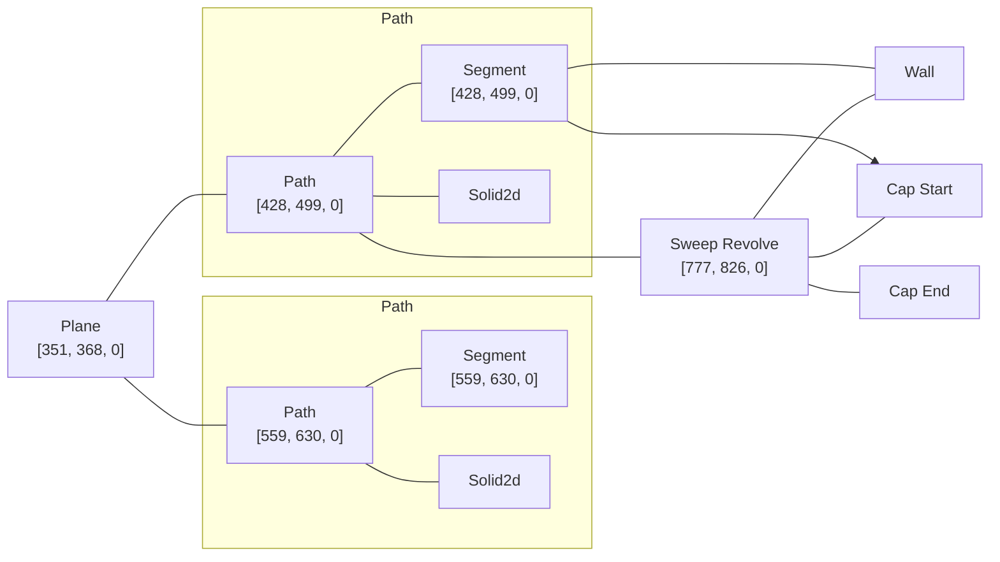

```mermaid
flowchart LR
  subgraph path2 [Path]
    2["Path<br>[428, 499, 0]"]
    3["Segment<br>[428, 499, 0]"]
    4[Solid2d]
  end
  subgraph path5 [Path]
    5["Path<br>[559, 630, 0]"]
    6["Segment<br>[559, 630, 0]"]
    7[Solid2d]
  end
  1["Plane<br>[351, 368, 0]"]
  8["Sweep Revolve<br>[777, 826, 0]"]
  9[Wall]
  10["Cap Start"]
  11["Cap End"]
  1 --- 2
  1 --- 5
  2 --- 3
  2 ---- 8
  2 --- 4
  3 --- 9
  3 x--> 10
  5 --- 6
  5 --- 7
  8 --- 9
  8 --- 10
  8 --- 11
```
