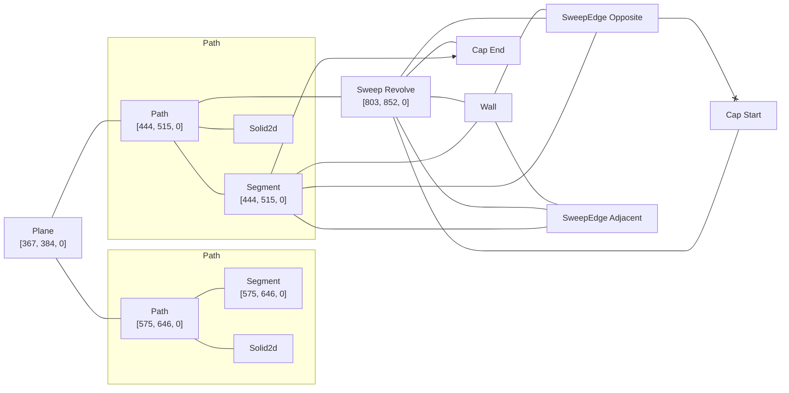

```mermaid
flowchart LR
  subgraph path2 [Path]
    2["Path<br>[444, 515, 0]"]
      %% [ProgramBodyItem { index: 5 }, VariableDeclarationDeclaration, VariableDeclarationInit]
    4["Segment<br>[444, 515, 0]"]
      %% [ProgramBodyItem { index: 5 }, VariableDeclarationDeclaration, VariableDeclarationInit]
    6[Solid2d]
  end
  subgraph path3 [Path]
    3["Path<br>[575, 646, 0]"]
      %% [ProgramBodyItem { index: 6 }, VariableDeclarationDeclaration, VariableDeclarationInit]
    5["Segment<br>[575, 646, 0]"]
      %% [ProgramBodyItem { index: 6 }, VariableDeclarationDeclaration, VariableDeclarationInit]
    7[Solid2d]
  end
  1["Plane<br>[367, 384, 0]"]
    %% [ProgramBodyItem { index: 4 }, VariableDeclarationDeclaration, VariableDeclarationInit]
  8["Sweep Revolve<br>[803, 852, 0]"]
    %% [ProgramBodyItem { index: 8 }, VariableDeclarationDeclaration, VariableDeclarationInit]
  9[Wall]
    %% face_code_ref=Missing NodePath
  10["Cap Start"]
    %% face_code_ref=Missing NodePath
  11["Cap End"]
    %% face_code_ref=Missing NodePath
  12["SweepEdge Opposite"]
  13["SweepEdge Adjacent"]
  1 --- 2
  1 --- 3
  2 --- 4
  2 --- 6
  2 ---- 8
  3 --- 5
  3 --- 7
  4 --- 9
  4 x--> 11
  4 --- 12
  4 --- 13
  8 --- 9
  8 --- 10
  8 --- 11
  8 --- 12
  8 --- 13
  9 --- 12
  9 --- 13
  12 <--x 10
```
