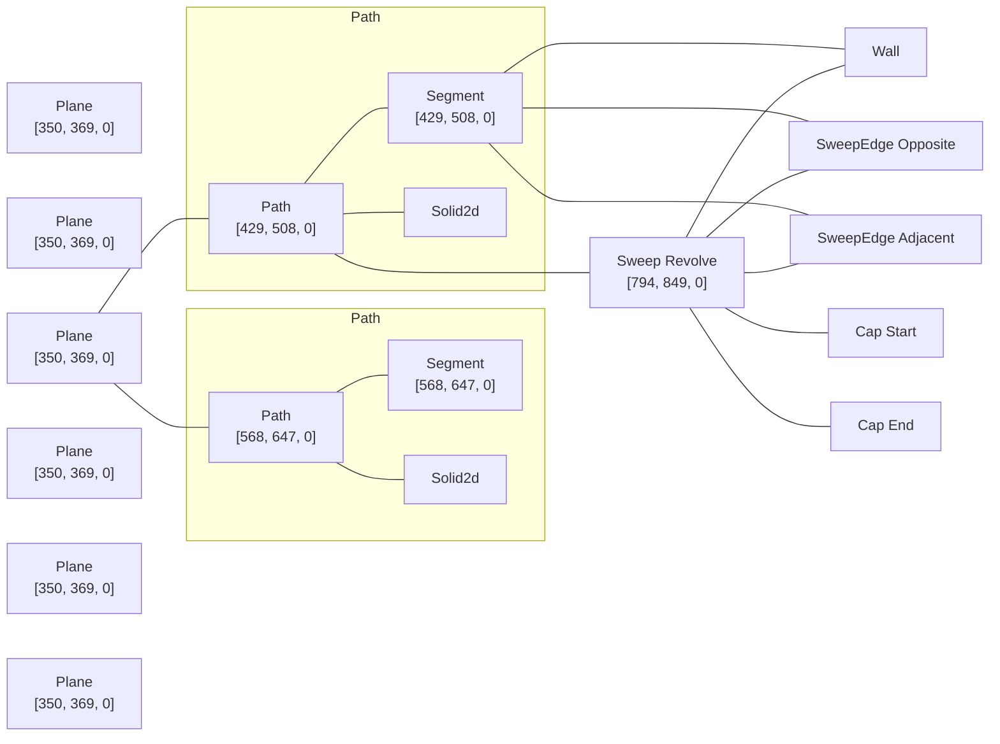

```mermaid
flowchart LR
  subgraph path7 [Path]
    7["Path<br>[429, 508, 0]"]
    8["Segment<br>[429, 508, 0]"]
    9[Solid2d]
  end
  subgraph path10 [Path]
    10["Path<br>[568, 647, 0]"]
    11["Segment<br>[568, 647, 0]"]
    12[Solid2d]
  end
  1["Plane<br>[350, 369, 0]"]
  2["Plane<br>[350, 369, 0]"]
  3["Plane<br>[350, 369, 0]"]
  4["Plane<br>[350, 369, 0]"]
  5["Plane<br>[350, 369, 0]"]
  6["Plane<br>[350, 369, 0]"]
  13["Sweep Revolve<br>[794, 849, 0]"]
  14[Wall]
  15["Cap Start"]
  16["Cap End"]
  17["SweepEdge Opposite"]
  18["SweepEdge Adjacent"]
  3 --- 7
  3 --- 10
  7 --- 8
  7 ---- 13
  7 --- 9
  8 --- 14
  8 --- 17
  8 --- 18
  10 --- 11
  10 --- 12
  13 --- 14
  13 --- 15
  13 --- 16
  13 --- 17
  13 --- 18
```
