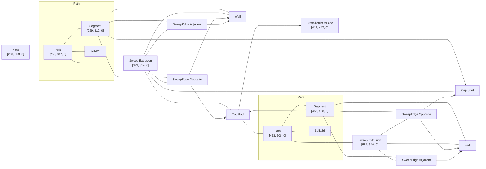

```mermaid
flowchart LR
  subgraph path3 [Path]
    3["Path<br>[259, 317, 0]"]
    5["Segment<br>[259, 317, 0]"]
    8[Solid2d]
  end
  subgraph path4 [Path]
    4["Path<br>[453, 508, 0]"]
    6["Segment<br>[453, 508, 0]"]
    7[Solid2d]
  end
  1["Plane<br>[236, 253, 0]"]
  2["StartSketchOnFace<br>[412, 447, 0]"]
  9["Sweep Extrusion<br>[323, 354, 0]"]
  10["Sweep Extrusion<br>[514, 546, 0]"]
  11[Wall]
  12[Wall]
  13["Cap Start"]
  14["Cap End"]
  15["SweepEdge Opposite"]
  16["SweepEdge Opposite"]
  17["SweepEdge Adjacent"]
  18["SweepEdge Adjacent"]
  1 --- 3
  14 x--> 2
  3 --- 5
  3 --- 8
  3 ---- 9
  4 --- 6
  4 --- 7
  4 ---- 10
  14 --- 4
  5 --- 11
  5 x--> 13
  5 --- 15
  5 --- 17
  6 --- 12
  6 x--> 14
  6 --- 16
  6 --- 18
  9 --- 11
  9 --- 13
  9 --- 14
  9 --- 15
  9 --- 17
  10 --- 12
  10 --- 16
  10 --- 18
  15 <--x 11
  17 <--x 11
  16 <--x 12
  18 <--x 12
  16 <--x 13
  15 <--x 14
```
