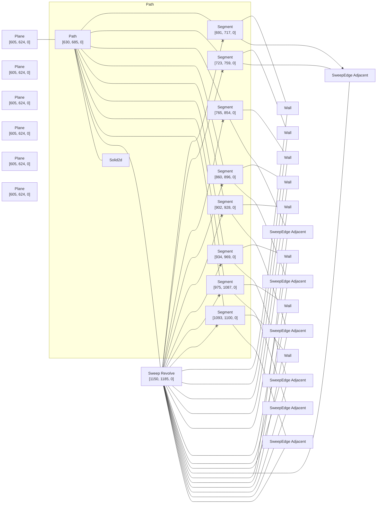

```mermaid
flowchart LR
  subgraph path7 [Path]
    7["Path<br>[630, 685, 0]"]
    8["Segment<br>[691, 717, 0]"]
    9["Segment<br>[723, 759, 0]"]
    10["Segment<br>[765, 854, 0]"]
    11["Segment<br>[860, 896, 0]"]
    12["Segment<br>[902, 928, 0]"]
    13["Segment<br>[934, 969, 0]"]
    14["Segment<br>[975, 1087, 0]"]
    15["Segment<br>[1093, 1100, 0]"]
    16[Solid2d]
  end
  1["Plane<br>[605, 624, 0]"]
  2["Plane<br>[605, 624, 0]"]
  3["Plane<br>[605, 624, 0]"]
  4["Plane<br>[605, 624, 0]"]
  5["Plane<br>[605, 624, 0]"]
  6["Plane<br>[605, 624, 0]"]
  17["Sweep Revolve<br>[1150, 1185, 0]"]
  18[Wall]
  19[Wall]
  20[Wall]
  21[Wall]
  22[Wall]
  23[Wall]
  24[Wall]
  25[Wall]
  26["SweepEdge Adjacent"]
  27["SweepEdge Adjacent"]
  28["SweepEdge Adjacent"]
  29["SweepEdge Adjacent"]
  30["SweepEdge Adjacent"]
  31["SweepEdge Adjacent"]
  32["SweepEdge Adjacent"]
  1 --- 7
  7 --- 8
  7 --- 9
  7 --- 10
  7 --- 11
  7 --- 12
  7 --- 13
  7 --- 14
  7 --- 15
  7 ---- 17
  7 --- 16
  8 --- 18
  8 x--> 26
  9 --- 19
  9 --- 26
  10 --- 20
  10 --- 27
  11 --- 21
  11 --- 28
  12 --- 22
  12 --- 29
  13 --- 23
  13 --- 30
  14 --- 24
  14 --- 31
  15 --- 25
  15 --- 32
  17 --- 18
  17 --- 19
  17 --- 20
  17 --- 21
  17 --- 22
  17 --- 23
  17 --- 24
  17 --- 25
  17 <--x 8
  17 --- 26
  17 <--x 9
  17 <--x 10
  17 --- 27
  17 <--x 11
  17 --- 28
  17 <--x 12
  17 --- 29
  17 <--x 13
  17 --- 30
  17 <--x 14
  17 --- 31
  17 <--x 15
  17 --- 32
```
